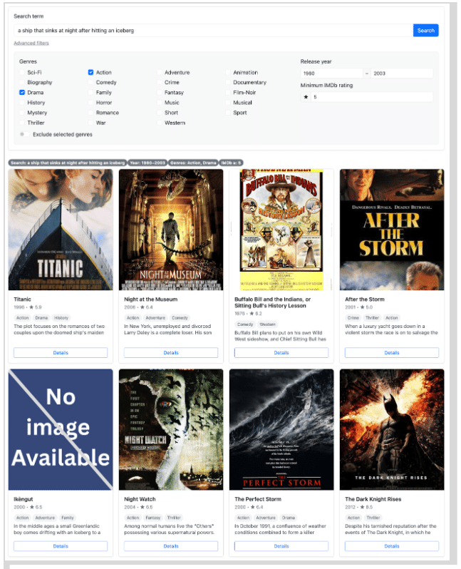
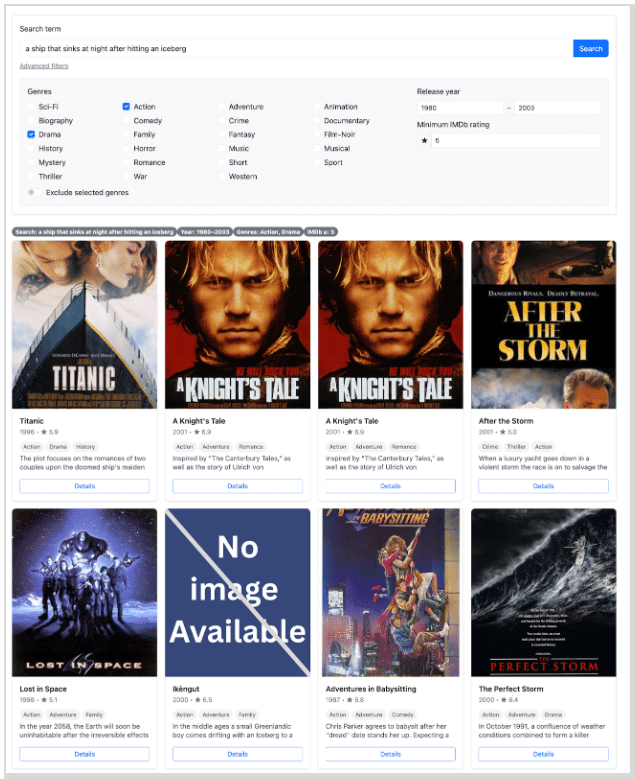
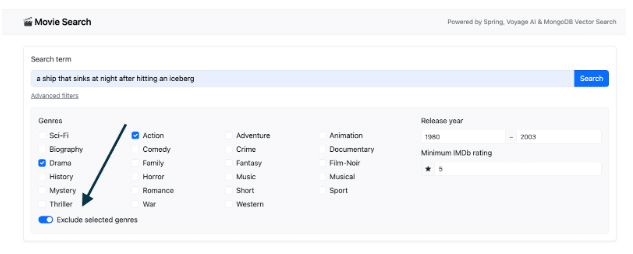
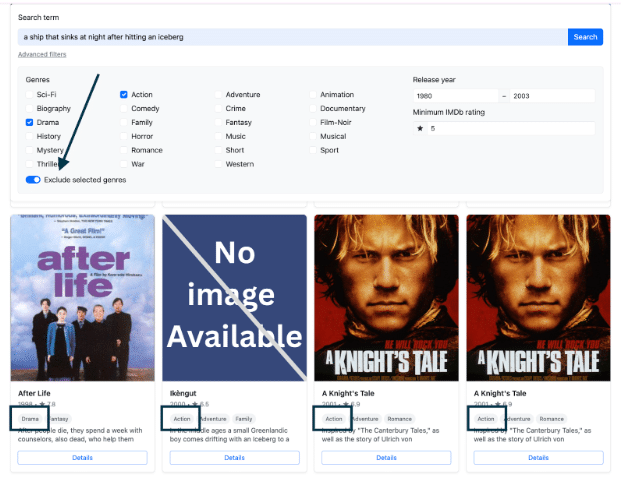
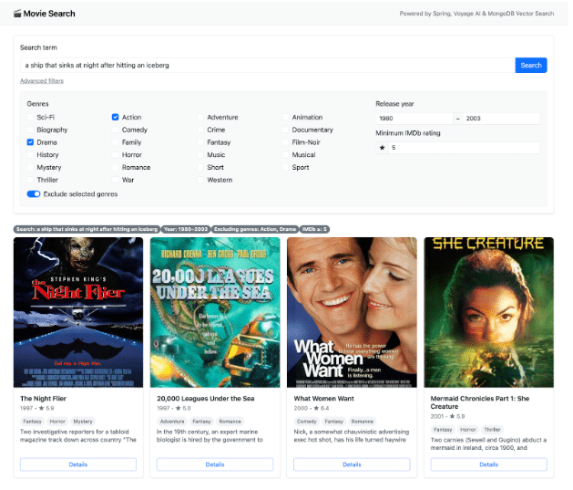
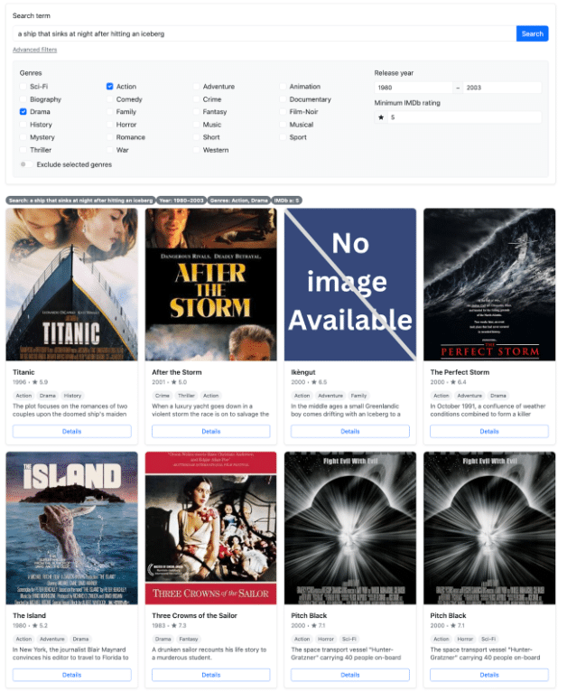

Bringing together semantic vectors and exact keyword matching with $rankFusion

If you've been following along this series, you already know we started by giving our movie search app the ability to understand meaning—not just keywords—using semantic search, as discussed in [*Part 1: Implementing Semantic Search in Java With Spring Data*](https://foojay.io/today/beyond-keywords-implementing-semantic-search-in-java-with-spring-data-part-1/). Then, we made it even smarter by adding filters and optimizing performance with embedding strategies in [*Part 2: Optimizing Vector Search With Filters and Caching*](https://foojay.io/today/beyond-keywords-optimizing-vector-search-with-filters-and-caching-part-2/).

Now, in this final installment, we're taking our search capability to its ultimate form: combining the precision of full-text search with the semantic understanding of vector search.

Welcome to hybrid search.

## One search might not be enough

Think about how people actually search for movies. Sometimes, they only remember fragments—such as, "a ship that sinks at night after hitting an iceberg"—and hope the app can figure it out. Other times, they know exactly what they want—like "Titanic"—and expect to see it right away.

These two very different situations expose a critical gap: **No single search technique works perfectly for every type of query**.

This is because full-text search and vector search work on fundamentally different principles:

1. Full-text search works by matching exact keywords or their variants within specific fields, like *title* or *description*.
2. Vector search compares the overall meaning of the query to the meaning of documents using semantic embeddings.

Let's see how this plays out in our examples:

**Case 1**: When the user types, "a ship that sinks at night after hitting an iceberg":

* Vector search shines here and correctly surfaces *Titanic.*
* Full-text search will likely return null or irrelevant results because it relies on matching specific keywords.

**Case 2**: When someone searches for "Titanic":

* A vector search, focused on semantic similarity, might return *Poseidon* (another sinking-ship movie).
* A full-text search, however, nails it instantly because it finds the exact title.

Clearly, both methods have their strengths. Full-text is unbeatable for exact matches and well-known titles, while vector search excels when the query is descriptive or fuzzy. The challenge is that if we rely on only one, we risk leaving users frustrated.

## Merging the best of both worlds

That's where **hybrid search** comes in. By combining the precision of full-text search with the intelligence of semantic search, we can deliver results that understand both what the user wrote and what they meant. MongoDB Atlas makes this possible with the new $rankFusion operator, which merges and re-ranks results from multiple pipelines.

For more details, take a look at the [Hybrid Search Explained](https://www.mongodb.com/resources/products/capabilities/hybrid-search/?utm_campaign=devrel&utm_source=third-party-content&utm_medium=cta&utm_content=hybrid-search-atlas-foojay-part3&utm_term=tony.kim).

## Prerequisites

If you've been following from Part 1, you should already have everything set up: a MongoDB Atlas cluster, Java 17+, a Voyage AI API token, and the embedded_movies collection.

For this final part, there's one more requirement:

* **MongoDB Atlas 8.1 or higher**, since hybrid search relies on the $rankFusion operator introduced in this version.

## The vector search

So far, our application uses **vector search with pre-filters**. That means we can run semantic queries while narrowing the search space by year, genres, and IMDb rating. Under the hood, the query looks something like this:

```
[
 {
   $vectorSearch: {
     filter: {
       $and: [
         { genres: { $in: ["Action", "Drama"] } },
         { year: { $gte: 1980, $lte: 2003 } },
         { "imdb.rating": { $gte: 9.0 } }
       ]
     },
     index: "vector_index",
     limit: 8,
     numCandidates: 160,
     path: "plot_embedding_voyage_3_large",
     queryVector: [
       -0.027284348, ....
     ]
   }
 }
]
```

This works well for descriptive searches, because the embeddings capture meaning beyond exact words.

## The full-text search

But there's a catch. In the *Titanic* example, vector search is perfect when the user types a descriptive query like, "a ship that sinks at night after hitting an iceberg", since it understands intent. However, if the user knows the exact title and types simply "Titanic", vector search may return other sinking-ship movies like *Poseidon*.

On top of that, vector search requires generating embeddings for every query. In this case, that means calling an external API just to embed the word "Titanic", an unnecessary round trip when we could just match the text directly.

That's where [**full-text search**](https://www.mongodb.com/resources/basics/full-text-search/?utm_campaign=devrel&utm_source=third-party-content&utm_medium=cta&utm_content=hybrid-search-atlas-foojay-part3&utm_term=tony.kim) comes in. Unlike vector search, it looks for exact keyword matches in fields such as title. If the title is in the database, full-text search will find it right away, faster and without embedding overhead.

### Implementing the full-text index

Run this command in your MongoDB shell to create a dynamic search index on the embedded_movies collection:

```
db.embedded_movies.createSearchIndex(
  "fulltextsearch",
  { mappings: { dynamic: true } }
)
```

Note on indexing: The **dynamic: true** parameter is ideal for prototyping as it automatically indexes every field in your documents. For production, consider a custom mapping to optimize performance and cost by indexing only necessary fields. Review the [documentation on mapping](https://www.mongodb.com/docs/atlas/atlas-search/define-field-mappings/?utm_campaign=devrel&utm_source=third-party-content&utm_medium=cta&utm_content=hybrid-search-atlas-foojay-part3&utm_term=tony.kim) for guidance.

### Executing a basic text query

With the index created, we can now execute a simple query to find "Titanic" by its title:

```
db.embedded_movies.aggregate([
 {
   $search: {
     index:  "fulltextsearch",
     text: {
       query: "Titanic",
       path: "title"
     }
   }
 },
])
```

You should see something like this:

```
{
 "title": "Titanic",
 "year": "1996",
 "plot":  "The story of the 1912 sinking ..",
 "genres": [
     "Action",
     "Drama",
     "History"
  ],
 ...
}
```

### Improving the experience with fuzzy search

A common user experience problem is typos. What if our user wants to find *Titanic* but types **titani** (missing the final "c")? Try running the exact-match query yourself and you'll see it will return no results.

This is where the [fuzzy](https://www.mongodb.com/docs/atlas/atlas-search/text/?utm_campaign=devrel&utm_source=third-party-content&utm_medium=cta&utm_content=hybrid-search-atlas-foojay-part3&utm_term=tony.kim) option comes to the rescue. Let's modify our query:

```
db.embedded_movies.aggregate([ 
 {
   $search: {
     index: "fulltextsearch",
     text: {
       query: "titani",
       path: "title",
       fuzzy: {
         maxEdits: 1
       }
     }
   }
 }
])
```

In short: With **maxEdits: 1**, our search for "titani" becomes more flexible. It will now match not only the intended "Titanic" (adding one character, "c") but also other titles like "Titans" (replacing "i" with "s") or "Titan" (removing one character, "i"). Possible results would be:

```
title="Titanic"

title="Titan A.E."

title="Raise the Titanic"

title="Clash of the Titans"
```

### Refining results with score boosting

Not all fields are equally important when searching for movies. If a user types *"Titanic"* , a match in the **title** field should clearly outweigh a match in the **plot** or **fullplot**. Without boosting, MongoDB Atlas Search would treat all matches the same, which could push less relevant results higher in the ranking.

This is where **score boosting** becomes essential. Boosting lets us tell the search engine which fields matter more by increasing their influence on the final relevance score.

In our case:

* **title** gets the highest boost: direct matches on titles are prioritized.  
* **plot** receives a medium boost: useful when titles don't match but descriptions do.  
* **fullplot** has a lower boost: still relevant, but less critical than the main plot or title.  

We can apply this logic using a **compound operator**, which searches across multiple fields while applying different boost values:

```
db.embedded_movies.aggregate(
[
 {
   $search: {
     index: "fulltextsearch",
     compound: {
       should: [
         {
           text: {
             query: "titanic",
             path: "title",
             fuzzy: {
               maxEdits: 1
             },
             score: {
               boost: { value: 4.0 }
             }
           }
         },
         {
           text: {
             query: "titanic",
             path: "plot",
             fuzzy: {
               maxEdits: 1
             },
             score: {
               boost: { value: 3.0 }
             }
           }
         },
         {
           text: {
             query: "titanic",
             path: "fullplot",
             fuzzy: {
               maxEdits: 1
             },
             score: {
               boost: { value: 2.0 }
             }
           }
         }
       ]
     }
   }
 }
]
)
```

With this setup, the search engine understands our priorities: A movie with a matching title like **Titanic** will always rank higher than another movie where the query only appears in a long description.

**Note:** You can also project the computed relevance score in your results by adding to your $project stage.

```
{ "score": { "$meta": "searchScore" } }
```

This will include the boosted score.

## Combining forces with hybrid search

We now have both components in place:

* Vector search for semantic understanding  
* Full-text search for exact with fuzzy and boost

The question is: Why choose one when we can use both? That's exactly what MongoDB's **$rankFusion** operator enables.

### The $rankFusion

[$rankFusion](https://www.mongodb.com/ja-jp/docs/rapid/reference/operator/aggregation/rankFusion/?utm_campaign=devrel&utm_source=third-party-content&utm_medium=cta&utm_content=hybrid-search-atlas-foojay-part3&utm_term=tony.kim) lets us run multiple search pipelines in the same aggregation, then combine their results into a single ranked output. In our case, we'll use two pipelines:

* A searchPipeline: the full-text search  
* A vectorPipeline: the semantic search

Here's the basic structure of a hybrid query using $rankFusion:

```
[
 {
   $rankFusion: {
     input: {
       pipelines: {
         searchPipeline: [],
         vectorPipeline: []
       }
     },
     combination: {
       weights: {
         searchPipeline: 0.5,
         vectorPipeline: 0.5
       }
     },
     scoreDetails: false
   }
 }
]
```

Let's break it down:

1. The **pipelines** section defines the individual search strategies you want to combine (full-text and vector, in our case).  
2. The **weights** section then decides how much influence each pipeline has on the final ranking—a higher number means greater importance, so 0.8 will outweigh 0.5.

### How to decide the right weights

Once you set up the aggregate, the big question is: *How much weight should each pipeline get?*

There's no universal rule for picking these values—it depends entirely on your application and how users interact with it.

In some cases, giving more weight to full-text search makes sense (when exact titles matter most). In others, boosting the vector pipeline produces better results (when queries are more descriptive).

The key is to**experiment with your own data and queries**, adjusting the weights until you find the balance that delivers the best user experience.

## Refactoring the application

### The full-text search pipeline

Let's go back to our application to refactor the MovieService class and apply the new $rankFusion, combining full-text search with vector search. Create the following method:

```
private BsonDocument buildFullTextSearchPipeline(String query) {
   return Aggregates.search(
         compound().should(
               List.of(
                     text(SearchPath.fieldPath("title"), query)
                           .fuzzy(fuzzySearchOptions().maxEdits(1))
                           .score(boost(4.0F)),
                     text(SearchPath.fieldPath("plot"), query)
                           .fuzzy(fuzzySearchOptions().maxEdits(1))
                           .score(boost(3.0F)),
                     text(SearchPath.fieldPath("fullplot"), query)
                           .fuzzy(fuzzySearchOptions().maxEdits(1))
                           .score(boost(2.0F))
               )
         ),
         SearchOptions.searchOptions().index("fulltextsearch")
   ).toBsonDocument();
}
```

This method does exactly what we saw previously: It builds the full-text search pipeline. Notice how we're using **compound** , **should,** **fuzzy** , **text** , and **boost**, just like before.

## The vector search pipeline

Now, let's create the method for the vector search pipeline inside MovieService:

```
private Bson buildVectorSearchPipeline(MovieSearchRequest req) {
   return VectorSearchOperation.search(config.vectorIndexName())
         .path(config.vectorField())
         .vector(embeddingService.embedQuery(req.query()))
         .limit(config.topK())
         .filter(req.toCriteria())
         .numCandidates(config.numCandidates())        
         .withSearchScore("score")
         .toDocument(Aggregation.DEFAULT_CONTEXT);
}
```

What we did here was simply move the vector search code out of the searchMovies method and place it into its own dedicated method, making the code cleaner and easier to reuse.

### The RankFusion in searchMovies

The last step is to put everything together inside the searchMovies method using **$rankFusion**.

```
public List<Movie> searchMovies(MovieSearchRequest req) {
  AggregationOperation rankFusion = context -> new Document("$rankFusion",
          new Document("input",
                  new Document("pipelines",
                          new Document("searchPipeline", List.of(buildFullTextSearchPipeline(req.query()), new Document("$limit", config.topK())))
                                  .append("vectorPipeline", List.of(buildVectorSearchPipeline(req)))))
                  .append("combination",
                          new Document("weights",
                                  new Document("searchPipeline", 0.5)
                                          .append("vectorPipeline", 0.5)))
                  .append("scoreDetails", false));

Aggregation aggregation = Aggregation.newAggregation(rankFusion);

  return mongoTemplate.aggregate(
          aggregation,
          config.vectorCollectionName(),
          Movie.class
  ).getMappedResults();
}
```

Here, we combine the two pipelines we created before:

1. The **full-text search** pipeline
2. The **vector search** pipeline  

And we tell MongoDB to merge their results with equal weights (0.5 each). This way, the final ranking takes into account both text relevance and vector similarity.

**Note** : To use Document class, make sure to import it from *org.bson.Document*;.

### Inspecting the generated pipeline

Now, let's run the application again and check the pipeline that is being generated. First, update your application.yml to enable debug logging for MongoDB:

```
logging:
 level:
   org.springframework.data:
     mongodb: DEBUG
```

With logging enabled, the application will print out the exact aggregation pipeline being sent to MongoDB. Next, run the following request:

```
### POST
POST http://localhost:8080/movies/search
Content-Type: application/json

{
 "query": "a ship that sinks at night after hitting an iceberg",
 "minIMDbRating": 5,
 "yearFrom": 1980,
 "yearTo": 2003,
 "genres": [
   "Drama", "Action"
 ],
 "excludeGenres": false
}
```

You'll see both the **full-text search** pipeline (with fuzzy, should, and boost as we defined earlier) and the **vector search** pipeline (with filters on genres, year, and IMDb rating).

```
[
 {
   $rankFusion: {
     input: {
       pipelines: {
         searchPipeline: [
           {
             $search: {
               compound: {
                 should: [
                   {
                     text: {
                       query:
                         "a ship that sinks at night after hitting an iceberg",
                       path: "title",
                       fuzzy: { maxEdits: 1 },
                       score: {
                         boost: { value: 4.0 }
                       }
                     }
                   },
                   {
                     text: {
                       query:
                         "a ship that sinks at night after hitting an iceberg",
                       path: "plot",
                       fuzzy: { maxEdits: 1 },
                       score: {
                         boost: { value: 3.0 }
                       }
                     }
                   },
                   {
                     text: {
                       query:
                         "a ship that sinks at night after hitting an iceberg",
                       path: "fullplot",
                       fuzzy: { maxEdits: 1 },
                       score: {
                         boost: { value: 2.0 }
                       }
                     }
                   }
                 ]
               },
               index: "fulltextsearch"
             }
           },
           { $limit: 8 }
         ],
         vectorPipeline: [
           {
             $vectorSearch: {
               filter: {
                 $and: [
                   {
                     genres: {
                       $in: ["Action", "Drama"]
                     }
                   },
                   {
                     year: {
                       $gte: 1980,
                       $lte: 2003
                     }
                   },
                   {
                     "imdb.rating": { $gte: 5.0 }
                   }
                 ]
               },
               index: "vector_index",
               limit: 8,
               numCandidates: 160,
               path: "plot_embedding_voyage_3_large",
               queryVector: [
                 0.03693888, 0.026406106
                 ...
               ]
             }
           }
         ]
       }
     },
     combination: {
       weights: {
         searchPipeline: 0.5,
         vectorPipeline: 0.5
       }
     },
     scoreDetails: false
   }
 }
]
```

## Imprecise results without proper filtering

So far, we've been testing step by step by running the aggregation pipeline directly (via curl). Now, let's move to the application itself and run the same query through the web interface.

Open your browser at[**http://localhost:8080**](http://localhost:8080), and apply the same filters we used in the previous curl request:

* **Search term** = *a ship that sinks at night after hitting an iceberg*
* **Released year**= 1980–2003
* **Minimum IMDb rating** = 5
* **Genres** = (Drama, Action)

Just like in the screenshot below:  


If we look closely at the results, we notice that some movies don't satisfy the pre-filters—for example, ***Night at the Museum*** is being returned even though it's from 2006, outside the requested year range of 1980–2003.

This happens because the filters were applied only inside the **vector search pipeline** . The **full-text pipeline** doesn't have those restrictions, so when $rankFusion merges the results, movies that score highly in full-text (like *Night at the Museum*) can still appear, even if they don't match the vector filters.

## Making results accurate again

To make sure filters are applied consistently, we need to add them not only in the **vector pipeline** , but also in the **full-text pipeline**.

In practice, this means mirroring the same constraints (genres, year, IMDb rating) inside the compound.filter of the full-text query.

That way, both pipelines enforce the same rules before ranking results. Here's how the full-text pipeline looks once we align it with the vector filters:

```
{
 $search: {
   index: 'fulltextsearch',
   compound: {
     filter: [
       {
         in: {
           path: 'genres',
           value: ['Action', 'Drama']
         }
       },
       {
         range: { path: 'year', gte: 1980 }
       },
       {
         range: { path: 'year', lte: 2003 }
       },
       {
         range: { path: 'imdb.rating', gte: 5}
       }
     ],     
should: [ { ... } ]
   }
 }
}
```

### Adjusting the index for filters

If we look closely at the previous pipeline, we notice the use of the **"in"** operator on the genres field. For this to work correctly, we need to update our MongoDB Atlas Search index. String fields must be indexed as token type for operators like **"equals"** or **"in"** to function properly.

Here's the update to the full-text search index:

```
{
 "mappings": {
   "dynamic": true,
   "fields": {
     "genres": {
       "normalizer": "lowercase",
       "type": "token"
     }
   }
 }
}
```

## Refactoring the pipeline in code

Now that we've seen how the aggregation works in the shell, let's bring it into our Java code. To make things cleaner, we'll refactor the logic into small helper methods.

### 1. Creating the filters

Open the MovieService and include the following code:

```
private List<SearchOperator> buildFilters(MovieSearchRequest req) {
   var filters = new ArrayList<SearchOperator>();

      if (req.genres() != null && !req.genres().isEmpty()) {
      filters.add(in(SearchPath.fieldPath("genres"), req.genres()));
   }

   if (req.yearFrom() != null) {
      filters.add(numberRange(SearchPath.fieldPath("year")).gte(req.yearFrom()));
   }

   if (req.yearTo() != null) {
      filters.add(numberRange(SearchPath.fieldPath("year")).lte(req.yearTo()));
   }

   if (req.minIMDbRating() != null) {
      filters.add(numberRange(SearchPath.fieldPath("imdb.rating")).gte(req.minIMDbRating()));
   }
   return filters;
}
```

The buildFilters() method collects all the filtering rules based on the MovieSearchRequest. It optionally adds filters for genres, year range, and IMDb rating, if they're provided.

### 2. Including search boost

The buildSearchClauses() method defines the fields where we'll search for text, the title, plot, and fullplot. Each field gets a different **boost** value to indicate how much it should influence the score.

```
private List<SearchOperator> buildSearchClauses(MovieSearchRequest req) {
   Map<String, Float> fieldConfigs = Map.of(
         "title", 4.0F,
         "plot", 3.0F,
         "fullplot", 2.0F
   );

   return fieldConfigs.entrySet().stream()
         .map(entry -> text(SearchPath.fieldPath(entry.getKey()), req.query())
               .fuzzy(fuzzySearchOptions().maxEdits(1))
               .score(boost(entry.getValue())))
         .collect(Collectors.toList());
}
```

### 3. The final pipeline

Still in the MovieService, replace the buildFullTextSearchPipeline() with the following code:

```
private BsonDocument buildFullTextSearchPipeline(MovieSearchRequest req) {
   var filters = buildFilters(req);
   var searchClauses = buildSearchClauses(req);
   var compound = compound();
   compound = !filters.isEmpty() ? compound.filter(filters) : compound;

   return Aggregates.search(
         compound.should(searchClauses),
            SearchOptions.searchOptions().index("fulltextsearch")
   ).toBsonDocument();
}
```

**In short** : This method builds a compound query where the **filters** go into the filter() clause and the **text matches** go into the should() clause.

At this point, you'll notice that the searchMovies method will cause a compilation error, because the buildFullTextSearchPipeline method now takes a MovieSearchRequest object. To fix this, just pass it instead of sending only the query:

```
public List<Movie> searchMovies(MovieSearchRequest req) {

  AggregationOperation rankFusion = context -> new Document("$rankFusion",
          new Document("input",
                  new Document("pipelines",
                          new Document("searchPipeline", List.of(buildFullTextSearchPipeline(req), new Document("$limit", config.topK())))
                                  .append("vectorPipeline", List.of(buildVectorSearchPipeline(req)))))
                  .append("combination",
                          new Document("weights",
                                  new Document("searchPipeline", 0.5)
                                          .append("vectorPipeline", 0.5)))
                  .append("scoreDetails", false));

  Aggregation aggregation = Aggregation.newAggregation(rankFusion);

  return mongoTemplate.aggregate(
          aggregation,
          config.vectorCollectionName(),
          Movie.class
  ).getMappedResults();
}
```

### 4. Testing the refactored pipeline

#### Case 1: Including genres

Let's run the same query again with our new pipeline.  


As you can see in the results, the filters look correct.

#### Case 2: Excluding genres

Now, suppose the user clicks **Exclude selected genres** while keeping the same filter.  


In this case, instead of asking for movies that include *Drama* or *Action* , we want the opposite: Only return movies **that do not belong** to these genres.

If we run the application right now, you'll notice that movies with *Action/Drama* still appear in the results:  


This happens because our query doesn't yet apply any exclusion logic. What we really want to tell MongoDB Atlas Search is:

*"Return all documents that satisfy the other filters, but exclude anything with these genres."*

To fix this, we'll make two small adjustments:

1. Remove the **"in"** clause from the filter section.
2. Add the **"in"** clause inside a [mustNot](https://www.mongodb.com/docs/atlas/atlas-search/compound/?utm_campaign=devrel&%20utm_source=third-part-content&utm_medium=cta&utm_content=spring-data-mongodb-hybrid-search-vectors&utm_term=ricardo.mello) option.

The updated pipeline will look something like this:

```
{
 $search: {
   index: 'fulltextsearch',
   compound: {
     filter: [
       { range: { path: 'year', gte: 1980 } },
       { range: { path: 'year', lte: 2003 } },
       { range: { path: 'imdb.rating', gte: 5 } }
     ],
     mustNot: [  { in: { path: 'genres', value: ['Action', 'Drama'] }} ],
     should: [ { … }  ]
   }
 }
}
```

## Adding exclusion logic to the application

The final step is to update our application code so that it builds the mustNot clause. First, create the buildMustNot() method:

```
private List<SearchOperator> buildMustNot(MovieSearchRequest req) {
  var mustNot = new ArrayList<SearchOperator>();

  if (req.genres() != null && !req.genres().isEmpty() && req.excludeGenres()) {
     mustNot.add(in(SearchPath.fieldPath("genres"), req.genres()));
  }
  return mustNot;
}
```

Next, update the buildFilters() method so it only adds genres when the **exclude selected genres** option is **not** selected. Open the method and replace the current block…

```
if (req.genres() != null && !req.genres().isEmpty()) {
  filters.add(in(SearchPath.fieldPath("genres"), req.genres()));
}
```

…with this version:

```
if (req.genres() != null && !req.genres().isEmpty() && !req.excludeGenres()) {
  filters.add(in(SearchPath.fieldPath("genres"), req.genres()));
}
```

And finally, replace the buildFullTextSearchPipeline() with this:

```
private BsonDocument buildFullTextSearchPipeline(MovieSearchRequest req) {
  var filters = buildFilters(req);
  var searchClauses = buildSearchClauses(req);
  var mustNot = buildMustNot(req);
  var compound = compound();

  if (!filters.isEmpty()) {
     compound = compound.filter(filters);
  }

  if (!mustNot.isEmpty()) {
     compound = compound.mustNot(mustNot);
  }

  return Aggregates.search(
          compound.should(searchClauses),
          SearchOptions.searchOptions().index("fulltextsearch")
  ).toBsonDocument();
}
```

Once that adjustment is made, we can restart the app and run the same query again. This time, you'll see that movies tagged with **Drama** or **Action** are no longer returned, ensuring the results respect the exclusion filter.  


## Prioritizing the vector pipeline

When we first run the hybrid query with equal weights (0.5 for vector and 0.5 for full-text), the results look interesting: **Titanic** shows up first, followed by **A Knight's Tale**.

Why does this happen?

* **Titanic** is ranked highly by the **vector search** . The embedding of our query, "a ship that sinks at night after hitting an iceberg", is semantically very close to the plot of *Titanic* , so the vector similarity score pushes it to the top.  
* **A Knight's Tale** , on the other hand, comes from the **full-text search** . The query contains the word "night", and since we enabled fuzzy matching (maxEdits: 1), MongoDB Atlas Search interprets "knight" as close enough to "night". Because the match happens in the **title field** (which we boosted with a higher score), the movie gets a strong ranking, even though it's unrelated to our intended meaning.

Let's tweak our pipeline to give more weight to semantic similarity: Set the vector pipeline to **0.8** and the full-text pipeline to **0.2**:

```
public List<Movie> searchMovies(MovieSearchRequest req) {

  AggregationOperation rankFusion = context -> new Document("$rankFusion",
          new Document("input",
                  new Document("pipelines",
                          new Document("searchPipeline", List.of(buildFullTextSearchPipeline(req), new Document("$limit", config.topK())))
                                  .append("vectorPipeline", List.of(buildVectorSearchPipeline(req)))))
                  .append("combination",
                          new Document("weights",
                                  new Document("searchPipeline", 0.2)
                                          .append("vectorPipeline", 0.8)))
                  .append("scoreDetails", false));

  Aggregation aggregation = Aggregation.newAggregation(rankFusion);

  return mongoTemplate.aggregate(
          aggregation,
          config.vectorCollectionName(),
          Movie.class
  ).getMappedResults();
}
```

Then, run the search again with the same inputs:  


Now, we can see that the top results make more sense for this descriptive query. Try yourself by changing the weights and boost, and see the results.

## Conclusion

We've reached the end of the Beyond Keywords series, where we explored how to go beyond traditional search approaches and build smarter applications with MongoDB.

* In Part 1:[*Implementing Semantic Search in Java with Spring Data*](https://foojay.io/today/beyond-keywords-implementing-semantic-search-in-java-with-spring-data-part-1/), we focused on vector search with Spring Data, learning how to generate embeddings with Voyage AI and run semantic queries.  
* In Part 2:[*Beyond Keywords: Optimizing Vector Search with Filters and Caching*](https://foojay.io/today/beyond-keywords-optimizing-vector-search-with-filters-and-caching-part-2/), we enhanced our application with pre-filters for more precise results and explored strategies like caching embeddings to save cost and improve performance.  
* In this final chapter, we dug into Atlas Search, added filters, and combined it with vector search through hybrid search, unlocking the best of both worlds: exact keyword matching and semantic understanding.

It's important to remember: there's no universal rule for the "right" weights, boosts, or filters. The best setup is always query-dependent, some queries benefit more from vector similarity, others from exact keyword matching. The real goal is to establish a solid baseline that works well for most use cases, then adapt and fine-tune based on how your users actually search.

This is just the beginning, real-world applications will always require experimentation, fine-tuning, and iteration to balance precision and recall.

If you want to learn more join the[MongoDB Community](https://www.mongodb.com/community/forums/?utm_campaign=devrel&utm_source=third-party-content&utm_medium=cta&utm_content=hybrid-search-atlas-foojay-part3&utm_term=tony.kim) to ask questions and share your experience. And if you'd like to check the full source code from this series, you can find it [here](https://github.com/mongodb-developer/spring-data-mongodb-vector-search).
