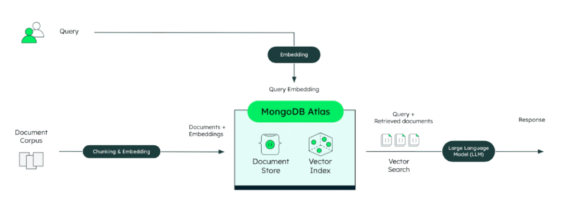
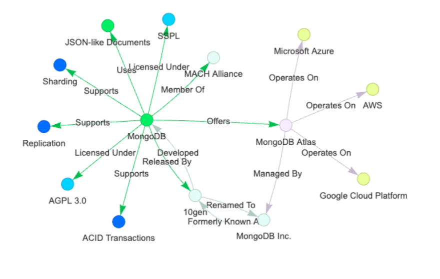
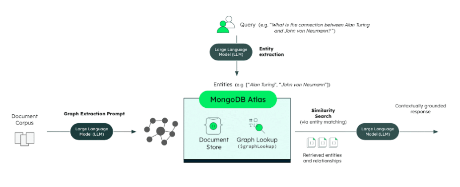

While large language models (LLMs) hold immense promise for building AI applications and agentic systems, ensuring they generate reliable and trustworthy outputs remains a persistent challenge. Effective data management---particularly how data is stored, retrieved, and accessed---is crucial to overcoming this issue. Retrieval-augmented generation (RAG) has emerged as a widely adopted strategy, grounding LLMs in external knowledge beyond their original training data.

The standard, or baseline, implementation of RAG typically relies on a vector-based approach. While effective for retrieving contextually relevant documents and references, vector-based RAG faces limitations in other situations, particularly when applications require robust reasoning capabilities and the ability to understand complex relationships between diverse concepts spread across large knowledge bases. This can lead to outputs that disappoint or even mislead end-users.

To address these limitations, a variation of the RAG architecture known as GraphRAG---[first introduced by Microsoft Research](https://www.microsoft.com/en-us/research/blog/graphrag-unlocking-llm-discovery-on-narrative-private-data/)---has gained traction. GraphRAG integrates knowledge graphs with LLMs, offering distinct advantages over traditional vector-based RAG for certain use cases. Understanding the relative strengths and weaknesses of vector-based RAG and GraphRAG is crucial for developers seeking to build more reliable AI applications.

RAG: The Baseline Approach Based on Embeddings
----------------------------------------------

In a standard vector-based RAG system, the underlying data used to augment the knowledge of LLMs is processed by first splitting it into chunks. Using embedding models, these chunks are then transformed into numerical vectors known as embeddings. Retrieval is then performed by searching for chunks whose vector embeddings are similar to the user's query embedding. This process efficiently identifies pieces of text that are semantically or contextually related to the input.

**Figure 1.** Architecture of a standard vector-based RAG implementation.

This embedding-based approach is powerful for many tasks, such as finding relevant documents or passages about a specific topic. It treats each document or chunk as an isolated piece of information and primarily relies on the semantic similarity captured by the vector representations.

However, this reliance solely on semantic similarity can become a limitation. Information that involves intricate logical connections between different entities, such as people, organizations, and concepts, may not have strong semantic overlap.

Furthermore, by breaking large documents or knowledge bases into smaller chunks, the vector-based approach can inadvertently lose the "big picture," such as the overarching structure, hierarchy, and the links between different pieces of information. This makes it difficult for vector-based RAG to handle queries that require understanding the relationships between different pieces of retrieved information.

For example, answering a question like, "What are the themes covered in the 2026 plan?" can be challenging for vector-based RAG. Even if the document contains sections discussing various themes, the query's keyword "themes" might not have strong semantic similarity to the specific terminology used for those themes within the document, especially if they are scattered across a large knowledge base.

Similarly, a query like, "What is Jane Smith's role in ACME's renewable energy projects?" becomes problematic if the relationships between "Jane Smith," "ACME," and "renewable energy projects" are mentioned in disparate parts of the knowledge base. Vector-based RAG, treating these mentions as isolated chunks, struggles to connect the dots necessary to provide an accurate, synthesized answer.

Making these logical connections across different entities, often referred to as multi-hop retrieval or reasoning, is where vector-based RAG often falls short.

GraphRAG: Connecting the Dots with Knowledge Graphs
---------------------------------------------------

GraphRAG builds upon the foundation established by RAG but introduces a critical enhancement: the integration of a knowledge graph. A knowledge graph is a structured way of representing information. It consists of entities---which are key items like people, places, organizations, or concepts---and relationships, which define how these entities are connected. Think of a knowledge graph as a map that explicitly shows how different pieces of information relate to each other.

**Figure 1.** Knowledge graph visualization based on [MongoDB](https://www.mongodb.com/lp/cloud/atlas/try4-reg/?utm_campaign=devrel&utm_source=third-party-content&utm_medium=cta&utm_content=mcp-foojay&utm_term=tony.kim)'s Wikipedia page.

By incorporating a knowledge graph into the retrieval process, GraphRAG moves beyond treating data chunks as isolated units. Instead, it considers how different pieces of knowledge are connected and related through the graph structure. This structure enables LLM-based systems using GraphRAG to retrieve related entities and reason over their interconnections, resulting in more comprehensive answers to complex questions and improved information relevance.

GraphRAG enhances RAG architectures in several key ways:

1. **Response accuracy** : Integrating knowledge graphs into the retrieval component can significantly boost accuracy. Recent benchmarks---including those by [Lettra, an AWS partner](https://aws.amazon.com/blogs/machine-learning/improving-retrieval-augmented-generation-accuracy-with-graphrag/)---show that GraphRAG consistently improves accuracy, with Lettra reporting gains of up to 35%, particularly for queries requiring multi-step reasoning and relationship-based logic. This enhanced accuracy stems from the ability to traverse relationships and synthesize information that is relationally, rather than just semantically, connected.
2. **Explainability and transparency**: Unlike embedding-based methods that rely on abstract numerical vectors, making it difficult to understand why certain chunks are retrieved or considered related, a graph-based approach provides a more intuitive and auditable representation of how documents and entities are connected. This offers greater explainability and transparency into the retrieved information. Developers and users can gain insight into the path taken through the knowledge graph to retrieve relevant data. This transparency can also aid in optimizing data retrieval patterns to further improve accuracy.
3. **Hierarchical and relationship-based querying**: GraphRAG excels in scenarios where understanding the structure, hierarchy, and links within a knowledge base is essential. As discussed, vector-based RAG struggles here because chunking loses this structural context. GraphRAG's ability to traverse relationships makes it well-suited for queries involving multi-hop reasoning. This directly addresses the limitations of vector-based RAG in understanding relationships between entities mentioned in separate locations. GraphRAG enables answering those complex "how is X related to Y through Z?" type questions that elude semantic similarity search alone.

While GraphRAG offers significant advantages, it also comes with its own set of challenges. Achieving better accuracy than vector-based RAG with GraphRAG is often dependent on the use case.

A primary challenge with GraphRAG is creating the knowledge graph itself. This often involves an additional step in which large language models are used to extract entities and relationships from the source data and then structure them into a graph format. The quality of the knowledge graph heavily depends on the model used. It is recommended to rely on frontier LLMs. Reasoning models, while more expensive, tend to provide even better results. Moreover, maintaining and updating the graph as new data arrives is an ongoing operational burden.

Unlike the relatively lightweight and fast process of embedding and indexing data for vector-based RAG, building and updating a knowledge graph often depends on the LLMs accurately understanding, mapping complex relationships, and integrating them into the existing graph structure. Each time new data needs to be added to the knowledge graph, the data extracted by the LLM must be checked against the existing graph data and updated accordingly, which can be computationally intensive.

**Figure 2.**Architecture of a GraphRAG implementation.

The inherent added complexity of graph traversal can also introduce challenges regarding response latency and scalability as the knowledge base grows. In contrast to vector-based RAG, retrieving information now involves navigating the connections within the graph, which can be computationally more intensive than a simple similarity search, especially for multi-hop queries. Latency is closely tied to factors like the depth of traversal required to answer a query and the specific retrieval strategy employed. These aspects must be carefully considered and optimized based on the application's requirements.

### Towards Hybrid Approaches and Unified Platforms

GraphRAG complements traditional RAG methods by enabling a deeper understanding of complex, hierarchical relationships. It also allows for more effective information aggregation across disparate data points connected via relationships.

Many advanced RAG and agentic systems are introducing hybrid approaches that combine the strengths of both GraphRAG and embedding-based vector search. For instance, a system might use vector search for initial high-level semantic retrieval of relevant semantic nodes, and then use a knowledge graph to understand the relationships within or between the retrieved documents or entities, in order to synthesize a final answer.

Implementing these sophisticated RAG variations, including GraphRAG and various hybrid approaches, often benefits from a database that can handle different data models in a unified way. This includes supporting different data types, graph-like structures, and vector capabilities for similarity search. A unified approach can simplify the overall architecture, reduce operational overhead, and streamline the development experience by eliminating the need to synchronize data across disparate systems optimized only for one data type.

This is why MongoDB Atlas is a great fit for addressing these different use cases: it offers robust retrieval capabilities, ranging from full-text and semantic search to graph traversal, providing a comprehensive and flexible database for building advanced AI applications.

Check out [MongoDB's documentation](https://www.mongodb.com/docs/atlas/atlas-vector-search/ai-integrations/langchain/?utm_campaign=devrel&utm_source=third-party-content&utm_medium=cta&utm_content=mcp-foojay&utm_term=tony.kim) to discover how to implement vector-based RAG and GraphRAG with MongoDB.

### Building Reliable AI Apps

Vector-based RAG provides a solid baseline for enhancing LLM performance by grounding responses in contextual data through semantic similarity, but struggles with complex relationships and multi-hop reasoning. GraphRAG addresses these shortcomings by explicitly modeling relationships using knowledge graphs, leading to improved accuracy and better explainability, while introducing additional operational considerations.

Ultimately, the choice between vector-based RAG and GraphRAG or the adoption of a hybrid approach depends on the specific requirements of the AI application and the nature of the knowledge base. As AI systems become more sophisticated and require a deeper, more nuanced understanding of complex information, approaches like GraphRAG and hybrid patterns will become increasingly important in building truly reliable LLM-powered applications and agents.
