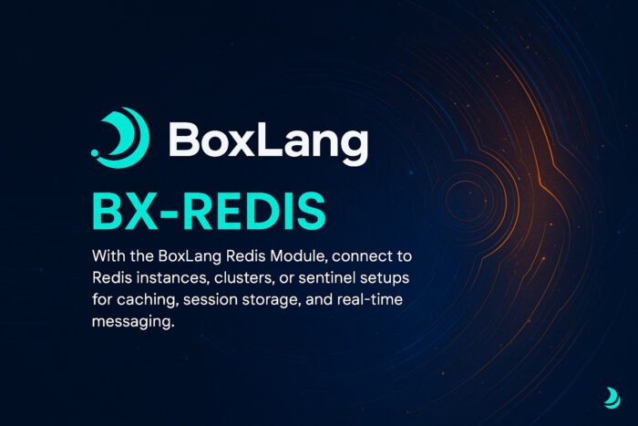

We're thrilled to announce the release of the **BoxLang Redis Module** (`bx-redis`) - a powerful addition to BoxLang that brings enterprise-grade Redis functionality directly into your applications. Whether you're building distributed systems, implementing real-time messaging, or need high-performance caching, this module has you covered.

## 🎯 What is the Redis Module?

The BoxLang Redis Module provides native Redis functionality, enabling you to connect to Redis instances, clusters, or Sentinel setups with ease. It seamlessly integrates with BoxLang's caching infrastructure while adding powerful new capabilities like publish/subscribe messaging and distributed locking.

## ⚡ Key Features

* **Native Redis Integration** - Connect to standalone Redis, Redis Cluster, or Redis Sentinel
* **Built-in Cache Provider** - Drop-in replacement for any BoxLang cache
* **Publish/Subscribe Messaging** - Real-time event-driven architecture support
* **Distributed Locking** - Coordinate actions across multiple servers
* **Session Management** - Distributed session storage with automatic failover
* **High Performance** - Connection pooling and optimized operations
* **Flexible Configuration** - Environment-based settings and multiple cache instances

## 📦 Getting Started

Installing the Redis module is straightforward. It's available to [BoxLang +/++ subscribers](https://www.boxlang.io/plans "BoxLang +/++ subscribers") and includes a 60-day trial so you can explore all features risk-free!

```java
# For Operating Systems using our Quick Installer
install-bx-module bx-redis

# Using CommandBox for web servers
box install bx-redis
```

## 🔧 Quick Configuration

Configure your Redis cache in `Application.bx`:

```java
component {
    this.name = "MyApp";

    // Configure Redis cache
    this.caches[ "redis" ] = {
        provider: "Redis",
        properties: {
            host: "127.0.0.1",
            port: 6379,
            database: 0,
            password: getSystemSetting( "REDIS_PASSWORD", "" ),
            keyprefix: "myapp",
            timeout: 2000,
            maxConnections: 50
        }
    };

    // Use Redis for sessions (optional)
    this.sessionStorage = "redis";
}
```

That's it! Your BoxLang application is now Redis-enabled and all sessions will be distributed to Redis.

## 💾 Powerful Caching Made Simple

The Redis module works seamlessly with BoxLang's standard caching approaches:

```java
// Cache user data for 30 minutes
userData = {
    userID: 123,
    name: "John Doe",
    email: "<a href="/cdn-cgi/l/email-protection" class="__cf_email__" data-cfemail="711b1e191f311409101c011d145f121e1c">[email protected]</a>",
    preferences: { theme: "dark", language: "en" }
};

cache( "redis" ).set( "user:123", userData, 1800 );

// Retrieve with elegant Attempt handling
userAttempt = cache( "redis" ).get( "user:123" );

if ( userAttempt.isPresent() ) {
    user = userAttempt.get();
    writeOutput( "Welcome back, #user.name#!" );
}

// Or use getOrSet for automatic fallback
user = cache( "redis" ).getOrSet(
    "user:123",
    () => loadUserFromDatabase( 123 ),
    1800
);
```

#### Query Caching

Speed up your database operations with transparent query caching:

```java
// Automatic query caching
qry = queryExecute(
    "SELECT * FROM products WHERE category = :category",
    { category: "electronics" },
    {
        cache: true,
        cacheTimeout: createTimespan( 0, 0, 30, 0 ),
        cacheProvider: "redis"
    }
);

// Or use manual caching for more control
function getCachedQuery( sql, params = {}, timeout = 1800 ) {
    var cacheKey = "query:" & hash( sql & serializeJSON( params ) );

    return cache( "redis" ).getOrSet(
        cacheKey,
        () => queryExecute( sql, params ),
        timeout
    );
}
```

## 📢 Publish/Subscribe: Real-Time Messaging

One of the most exciting features is Redis Pub/Sub support, enabling real-time event-driven architectures:

#### Publishing Messages

```java
// Publish a notification
redisPublish( 
    "notifications", 
    {
        type: "alert",
        message: "System maintenance starting in 5 minutes",
        timestamp: now()
    }
);

// Broadcast user events
redisPublish(
    "user-events",
    {
        event: "login",
        userId: 12345,
        timestamp: now()
    }
);
```

#### Subscribing to Channels

Create a subscriber using a closure:

```java
// Subscribe with a lambda function
redisSubscribe(
    ( channel, message ) => {
        var data = deserializeJSON( message );
        println( "Received on [#channel#]: #data.message#" );

        // Handle different message types
        if ( data.type == "alert" ) {
            emailService.sendAlert( data );
        }
    },
    [ "notifications", "alerts", "user-events" ]
);
```

Or use a listener class for complex scenarios:

```java
// NotificationListener.bx
class {

    public void function onMessage( string channel, string message ) {
        var data = deserializeJSON( arguments.message );

        println( "Processing notification: #data.type#" );

        // Route based on channel
        switch( arguments.channel ) {
            case "user-events":
                handleUserEvent( data );
                break;
            case "notifications":
                emailService.sendNotification( data );
                break;
            case "system-alerts":
                logService.logAlert( data );
                break;
        }
    }

    public void function onSubscribe( string channel, numeric subscribedChannels ) {
        println( "✓ Subscribed to #arguments.channel#" );
    }

    private void function handleUserEvent( struct data ) {
        // Custom event handling logic
        if ( data.event == "login" ) {
            analyticsService.trackLogin( data.userId );
        }
    }

}

// Start the subscriber
var listener = new NotificationListener();
var subscription = redisSubscribe(
    listener,
    [ "user-events", "notifications", "system-alerts" ],
    "redis"
);
```

Real-World Pub/Sub Example: Cache Invalidation

```java
// When data changes, notify all servers
function updateUser( required numeric userId, required struct data ) {
    // Update database
    userDAO.update( userId, data );

    // Invalidate local cache
    cacheRemove( "user:#userId#" );

    // Tell other servers to invalidate
    redisPublish( "cache:invalidate:  user", userId );
}

// All servers listen and invalidate their caches
redisSubscribe(
    ( channel, message ) => {
        cacheRemove( "user:#message#" );
        println( "Cache invalidated for user: #message#" );
    },
    "cache:invalidate:  user"
);
```

## 🔒 Distributed Locking: Coordinate Across Servers

In clustered environments, you need to prevent multiple servers from executing the same code simultaneously. The `bx:RedisLock` component makes this trivial:

```java
// Ensure only one server processes orders at a time
redisLock name="processOrders" cache="redis" timeout=5 expires=30 {
    // Only one server executes this block
    var orders = orderService.getPendingOrders();
    for ( var order in orders ) {
        orderService.processOrder( order );
    }
}
```

#### Scheduled Task Coordination

```java
// Prevent duplicate scheduled task execution
component {

    function runDailyCleanup() {
        redisLock 
            name="dailyCleanup" 
            cache="redis" 
            timeout=0 
            throwOnTimeout=false 
        {
            // Only runs on one server
            cleanupService.performDailyMaintenance();
            println( "Daily cleanup completed on this server" );
        }
    }

}
```

#### Cache Warming Without Race Conditions

```java
// Prevent multiple servers from warming cache simultaneously
redisLock 
    name="warmProductCache" 
    cache="redis" 
    timeout=2 
    expires=120 
    throwOnTimeout=false 
{
    if ( !cacheService.isWarmed() ) {
        println( "Warming cache on this server..." );

        // Expensive operation
        var products = productService.getAllProducts();

        // Cache for 1 hour
        cache( "redis" ).set( "products:all", products, 3600 );

        println( "Cache warmed successfully" );
    }
}
```

#### Database Migration Coordination

```java
// Ensure migrations run only once across the cluster
redisLock name="dbMigration" cache="redis" timeout=30 expires=600 {
    var pendingMigrations = migrationService.getPendingMigrations();

    for ( var migration in pendingMigrations ) {
        println( "Running migration: #migration.name#" );
        migrationService.runMigration( migration );
    }

    println( "All migrations completed" );
}
```

#### Templating Syntax Support

```java
<bx:RedisLock
    name="processQueue"
    cache="redis"
    timeout="10"
    expires="60"
>
    <bx:set var="item" value="#queue.getNextItem()#" />
    <bx:if condition="#!isNull( item )#">
        <bx:set var="result" value="#processItem( item )#" />
        <bx:set var="marked" value="#queue.markComplete( item )#" />
    </bx:if>
</bx:RedisLock>
```

## 🎯 Deployment Modes

The Redis module supports three deployment modes to match your infrastructure:

#### Standalone Redis

Perfect for development and single-server applications:

```java
this.caches[ "redis" ] = {
    provider: "Redis",
    properties: {
        host: "127.0.0.1",
        port: 6379,
        database: 0
    }
};
```

#### Redis Cluster

For high-availability production environments with automatic sharding:

```java
this.caches[ "redis" ] = {
    provider: "RedisCluster",
    properties: {
        hosts: "node1.redis.local,node2.redis.local,node3.redis.local",
        port: 6379,
        username: getSystemSetting( "REDIS_USERNAME" ),
        password: getSystemSetting( "REDIS_PASSWORD" ),
        useSSL: true,
        maxConnections: 1000
    }
};
```

#### Redis Sentinel

For automatic failover with master-slave replication:

```java
this.caches[ "redis" ] = {
    provider: "RedisSentinel",
    properties: {
        sentinels: "sentinel1.myhost.com:26379,sentinel2.myhost.com:26379",
        port: 6379,
        password: getSystemSetting( "REDIS_PASSWORD" ),
        useSSL: true
    }
};
```

## 📚 Comprehensive Documentation

The Redis module is fully documented with detailed guides covering:

* **Installation \& Configuration** - All deployment modes and settings
* **Code Usage** - Practical examples for caching objects, queries, and content
* **Scope Storage** - Using Redis for session and client storage
* **Publish/Subscribe** - Building event-driven architectures
* **API Usage** - Advanced features and direct Redis access
* **Distributed Locking** - Coordinating actions across clusters
* **Troubleshooting** - Debugging tools and common solutions

Access the complete documentation at:  
[https://boxlang.ortusbooks.com/boxlang-framework/boxlang-plus/modules/bx-redis](https://boxlang.ortusbooks.com/boxlang-framework/boxlang-plus/modules/bx-redis "https://boxlang.ortusbooks.com/boxlang-framework/boxlang-plus/modules/bx-redis")

#### MCP Server Support

You can even connect to our documentation via the Model Context Protocol (MCP):  
[https://boxlang.ortusbooks.com/\~gitbook/mcp](https://boxlang.ortusbooks.com/readme/release-history/1.6.0?q=Model+Context+Protocol#boxlang-documentation-mcp-server "https://boxlang.ortusbooks.com/~gitbook/mcp")

## 💡 Use Cases

The Redis module excels in these scenarios:

* **Distributed Applications** - Share state across multiple servers
* **Real-Time Systems** - Push notifications and live updates
* **High-Performance Caching** - Reduce database load dramatically
* **Session Clustering** - Eliminate sticky sessions
* **Microservices** - Coordinate between services
* **Event-Driven Architecture** - Decouple system components
* **Rate Limiting** - Implement distributed rate limits
* **Job Queues** - Coordinate background processing

## 🎁 Get Access

bx-ldap is available exclusively to **BoxLang +/++ subscribers**. Join our subscription program to access this and other premium modules that extend BoxLang's capabilities:

* **Priority Support** - Get help when you need it
* **Premium Modules** - Access subscriber-only modules
* **Early Access** - Be first to try new features
* **Exclusive Benefits** - CFCasts account, FORGEBOX Pro, and more

#### 🛒 Purchase Options

Ready to unlock bx-ldap and other premium modules? Choose your plan:

[🌟 **View BoxLang Plans \& Pricing**](https://www.boxlang.io/plans "🌟 **View BoxLang Plans &amp; Pricing**")

Need help choosing the right plan or have questions? **Contact us directly:**

[📧 **\[email protected\]**](/cdn-cgi/l/email-protection#20494e464f60424f584c414e470e494f "📧 **info@boxlang.io**")
