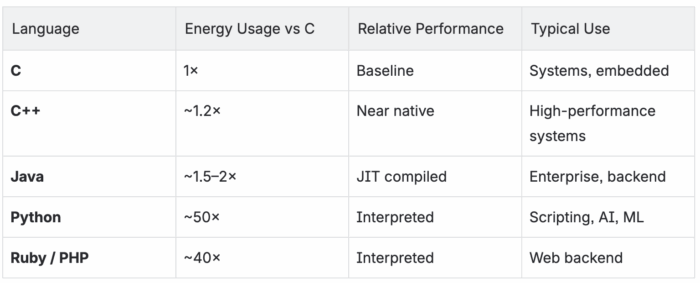
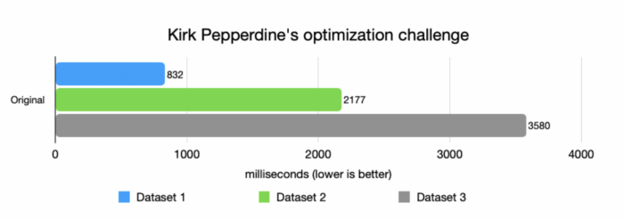
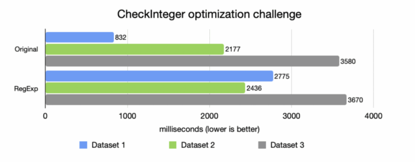
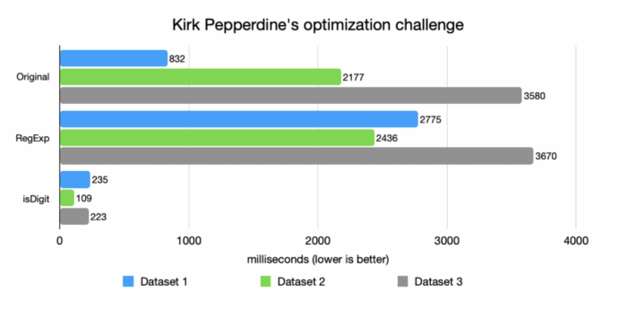
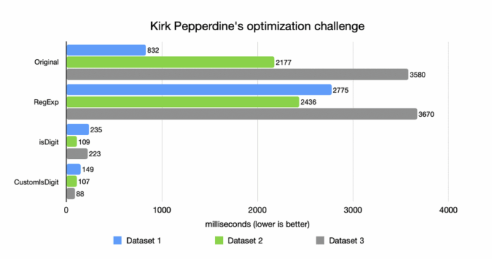
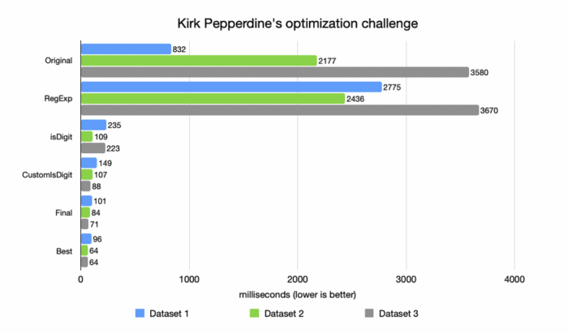

The Hidden Cost of "Good Enough" Code
-------------------------------------

A few weeks ago, Kirk Pepperdine published a fascinating performance challenge --- a small Java code snippet that appeared trivial but produced puzzling runtime behavior.

He invited readers to take a shot at solving it. If you haven't seen it yet, stop here for a moment and try it yourself --- and when you're done, check his Kirk's official solution

When I saw it, I thought it would be a fun exercise to revisit some fundamentals --- but the deeper I went, the more I realized it wasn't just about performance. It was about how we think.

It made me reflect on how often we, as developers, unconsciously trade efficiency for convenience --- and how much of our infrastructure, compute, and even energy waste comes not from bad architecture, but from small, innocent coding decisions.

We all love to talk about cloud cost optimization --- how to save 30%, 40%, maybe even 50% by tweaking AWS configurations or moving workloads to spot instances (or not). But rarely do we ask a simpler question:

*What if our software is already wasting 1000× more resources than it should?*

That's the real art of performance tuning --- not chasing milliseconds, but seeing where we're blind to inefficiency.

A Quick Reality Check -- Programming Languages and Energy
---------------------------------------------------------

A remarkable study comparing the [energy efficiency of 27 programming languages](https://appdevelopermagazine.com/how-27-programming-languages-differ-in-energy-consumption/ "energy efficiency of 27 programming languages") quantified what many of us intuitively know: language choice matters --- not just for speed, but for environmental impact.



That's not a typo --- for the exact same algorithm, Python can consume 50× more energy than C. Java sits somewhere in between --- but that's only when we write efficient code. Badly written Java can easily behave like a scripting language on a caffeine overdose.

And scale multiplies everything.

Even Google, with all its hardware sophistication, [found enormous savings when it optimized instead of expanding](https://blog.google/outreach-initiatives/environment/deepmind-ai-reduces-energy-used-for/ "found enormous savings when it optimized instead of expanding"). Using DeepMind AI to cut data-centre cooling energy by up to 40% and total energy by \~15%.

Not by buying more servers, but by thinking smarter about how existing systems use resources. Yet many of us do the opposite. We build microservices in dynamic, interpreted languages and then spend months fine-tuning autoscaling rules to keep costs tolerable. We scale horizontally instead of optimizing vertically, adding nodes rather than improving logic.

That's what this article is about --- how thinking differently about code can do more for performance (and cost) than all the hardware tuning in the world.

Let's see how good am I with performance analysis
-------------------------------------------------

### Step One -- Exceptions as Logic

The naive baseline looked like this:

```
public static boolean checkIntegerOrg(String testInteger) {
    try {
        Integer theInteger = new Integer(testInteger);
        return (theInteger.toString() != "") &&
               (theInteger.intValue() > 10) &&
               ((theInteger.intValue() >= 2) && (theInteger.intValue() <= 100000)) &&
               (theInteger.toString().charAt(0) == '3');
    } catch (NumberFormatException err) {
        return false;
    }
}
```


Looks reasonable, right? If the string isn't a number, we catch the exception and move on. Simple.

Except it's not.

In a dataset where many inputs aren't numbers, this code performs terribly. Every invalid input triggers a NumberFormatException, and each exception in Java carries a heavy price. Throwing an exception isn't like returning a value. It creates a full-blown object, captures a stack trace, and synchronizes with the JVM internals. The CPU spends more time bookkeeping than doing useful work.

A colleague once told me, "Our validation layer runs slower than our database queries." When I looked, every single bad record was throwing --- and logging --- an exception. The application wasn't I/O-bound; it was exception-bound. And this is how many real-world systems behave --- invisible inefficiency disguised as clean-looking code.

*Using exceptions for logic is like calling an ambulance to check if you have a pulse --- technically correct, but grossly inefficient.*

This is where the journey begins --- three datasets, each one messier than the last, with more incorrect or malformed entries.


<br />

### Step Two -- The RegExp Trap

Determined to fix this, I thought: Let's just validate inputs before parsing them. Naturally, I reached for regular expressions:

```
public static boolean checkIntegerRegExp(String testInteger) {
    try {
        if (testInteger.length() > 6) return false;
        if (!testInteger.matches("^\\d{1,6}$")) return false;
        Integer theInteger = Integer.valueOf(testInteger);
        int val = theInteger.intValue();
        return (val > 10) && (val <= 100000) && (testInteger.charAt(0) == '3');
    } catch (NumberFormatException err) {
        return false;
    }
}
```


It looked elegant and safe. And it was slower. Much slower.


<br />

**Why RegExp Can Be a Trojan Horse**

Why? Because every time matches() runs, it spins up a tiny state machine under the hood --- parsing the pattern, compiling it, creating a matcher, walking character by character through the input. If you're doing this in a hot path --- like validation, parsing, or request filtering --- your CPU spends more time decoding regex syntax than checking actual characters.

Jeff Atwood warned about this long ago in [Regex Performance](https://blog.codinghorror.com/regex-performance/ "Regex Performance"). He described how regex engines can easily create massive slowdowns --- and sometimes even cause "catastrophic backtracking" that locks entire threads.

In one of my own projects, a regex intended to filter invalid IDs became a CPU furnace under load. Replacing it with a simple char loop cut CPU time by 90%. Regexes are convenient.

*Regexes are like wildcards in SQL --- fine for a few records, dangerous at scale. --- showing orders-of-magnitude slowdowns in real production code.*

### Step Three -- Let the CPU Breathe

Next, I tried something simpler. What if we just used what Java already offers --- without regex magic or exception traps?

```
public static boolean checkIntegerIsDigit(String testInteger) {
    if (testInteger.length() > 6)
        return false;
    if (testInteger.charAt(0) != '3')
        return false;
    for (int i = 1; i < testInteger.length(); i++) {
        if (!Character.isDigit(testInteger.charAt(i))) 
            return false;
    }
    int val = Integer.parseInt(testInteger);
    return (val > 10) && (val <= 100000);
}
```


Performance immediately improved --- **by an order of magnitude.**


<br />

Why? Because the CPU loves predictability.

The logic is simple and predictable. Branches are easily speculated, memory access is sequential, and there are no hidden allocations. No exceptions, no regex engines, no object creation. Just clean, deterministic work.

*It's worth knowing what your language already offers.*

Another lesson: know your standard library. Methods like Character.isDigit() or Integer.parseInt() exist for a reason --- they're often written by people who've spent years squeezing every nanosecond out of the JVM. You don't always have to reinvent the wheel. Sometimes, using what's already there is both faster and safer.

While not perfect, they're good enough for most cases and let you create performant, maintainable code quickly.

As a senior engineer once told me:
> *"Good code isn't the shortest path to an answer --- it's the path with the fewest surprises for the CPU, and for a developer."*

### Step Four -- Handcrafted Precision

But I wanted to know how far I could go. So I stripped away even the built-ins and wrote my own version:

```
public static boolean checkIntegerCustomIsDigit(String testInteger) {
    if (testInteger.length() > 6)
        return false;
    if (testInteger.charAt(0) != '3')
        return false;
    for (int i = 1; i < testInteger.length(); i++) {
        char c = testInteger.charAt(i);
        if (c < '0' || c > '9') 
            return false;
    }
    int val = fastParseInt(testInteger);
    return (val > 10) && (val <= 100000);
}

public static int fastParseInt(String s) {
    int num = 0;
    for (int i = 0; i < s.length(); i++)
        num = num * 10 + (s.charAt(i) - '0');
    return num;
}
```


This handcrafted version was roughly 2× faster than Character.isDigit(). Why? No method calls, no Unicode overhead, no irrelevant checks.


<br />

But that improvement came with a trade-off. The code was less general, less future-proof, and slightly harder to read. I've seen similar patterns in production. In one low-latency financial system, we replaced Integer.parseInt() in a critical path that processed millions of messages per second. The gain was 300 ms per million messages. Trivial in isolation, transformative at global scale.

Still, there's a fine line between precision and obsession. Sometimes the most optimized code is also the least maintainable. Optimization should serve the system, not the ego.

When Does This Level of Optimization Make Sense?

* Hot paths: parsing millions of records, network validation, or data ingestion.
* Known constraints: ASCII digits, fixed lengths.
* Massive scale: small inefficiencies multiply.

*Still, such optimizations come with cost: more complexity, less universality. Use them deliberately, not habitually.*

### Step Five -- Fail Faster, Think Smarter

Finally, I built a version that failed fast, checked the simplest conditions first, and skipped unnecessary work.

```
public static boolean checkIntegerFinal(String testInteger) {
    if (testInteger.length() > 5 || testInteger.length() < 2)
        return false;
    if (testInteger.charAt(0) != '3')
        return false;
    for (int i = 1; i < testInteger.length(); i++) {
        char c = testInteger.charAt(i);
        if (c < '0' || c > '9') 
            return false;
    }
    return true;
}
```


This version delivered 10× to 50× better performance than the original --- nearly matching Kirk's own unrolled switch-case variant (labeled as Best on a chart below).


<br />

At that point, I realized something: The process of optimization itself teaches more than the final result. Each step --- exception removal, regex replacement, loop simplification --- peeled away layers of waste. The outcome wasn't just faster code. It was clearer thinking.

The Economics of Efficiency
---------------------------

Cloud computing gives us infinite scalability --- and infinite temptation to ignore waste.

* We throw hardware at problems.
* We autoscale instead of analyze.
* We "monitor" inefficiency instead of eliminating it.

But inefficiency doesn't disappear in the cloud --- it multiplies. Every extra CPU cycle runs on thousands of machines across dozens of regions.

We scale out instead of optimizing. We "auto-heal" instead of understanding. We rely on bigger machines instead of better code.

One of the simplest real-world ways to cut cloud costs isn't rewriting code --- it's running it on a better runtime. Take large Kafka deployments as an example. In Azul's own benchmark, Apache Kafka on [Azul Platform Prime delivered around 45 % higher maximum throughput](https://www.azul.com/blog/apache-kafka-performance-on-azul-platform-prime-vs-vanilla-openjdk/ "Azul Platform Prime delivered around 45 % higher maximum throughput") and roughly 30 % higher usable capacity at the same P99 latency SLA compared with vanilla OpenJDK. If you keep the same workload and SLA, that performance headroom translates into about 30--40 % fewer brokers needed to do the same work --- and therefore 30--40 % lower Kafka infrastructure cost (compute, storage, network, and operational overhead). In other words, just switching the JVM can yield the kind of savings that most teams chase for months with instance tuning and reserved-capacity negotiations.

Or take WhatsApp: when acquired by Facebook, it served over 450 million users with just 35 engineers. That's not magic --- that's engineering discipline, an obsession with efficiency, and a runtime optimized for concurrency.

Efficiency scales people, not just servers.

*The cheapest optimization is the one done before deployment.*

**The Hidden Energy Bill**

Compute equals energy. Wasteful software silently increases carbon footprint. Optimized code isn't just cheaper --- it's greener. Cloud efficiency and sustainability start at the keyboard, not in the billing dashboard.

The Art, Not the Algorithm
--------------------------

Performance tuning is less about syntax and more about craftsmanship. It's about curiosity, attention to detail, and respect for the machine. It's about seeing beauty in precision and economy of motion.

A well-tuned function is like a haiku: concise, balanced, intentional.

*True performance work isn't about saving milliseconds --- it's about mindfulness in code.*

Knuth wrote The Art of Computer Programming, not The Science, for a reason: science defines what's possible; art decides what's worthwhile.

Every optimization has a cost. The trick is knowing which costs are worth paying.

Closing Thoughts -- Code as Craft
---------------------------------

My final implementation wasn't perfect. Kirk's was still a little faster. But that's not the point. The point is that software waste is invisible until you measure it. We've normalized inefficiency because the cloud hides it behind elasticity. We call it resilience, but it's often just overprovisioning.

A mentor once told me,
> *"If you can solve a performance problem with money, it's not solved --- it's postponed."*

And he was right. Saving 30% on your cloud bill doesn't mean much if your code wastes 1000× more. Optimization is not premature --- it's intentional.

It's not about perfection; it's about awareness. So next time you deploy a service, ask yourself:

* How much of this code truly needs to run?
* How often?
* At what cost --- CPU, memory, or energy?

Because at the end of the day, performance tuning isn't just technical --- it's ethical. It's about using resources with respect --- for your users, your company, and the planet.

***The art of performance tuning is realizing that efficiency is elegance.***
