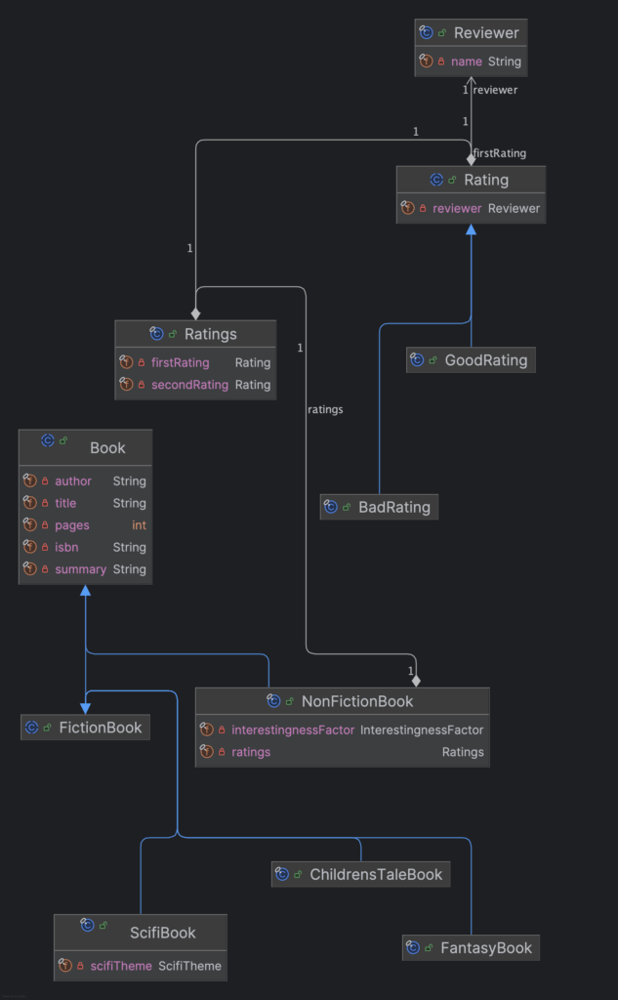
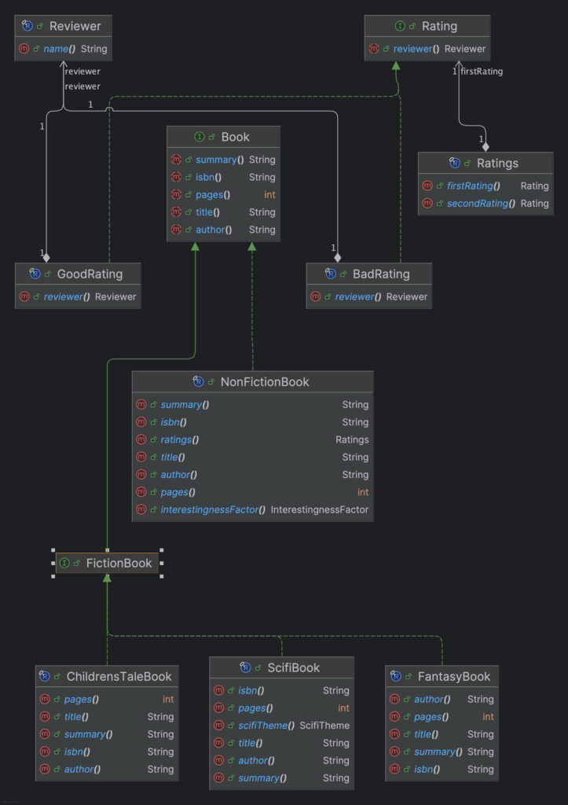

## Introduction

Design patterns are great, they standardize solutions for common programming problems so you don't shoot yourself in the foot or reinvent the wheel.

**However, some might argue that some design patterns only exist in a programming language because that language lacks a way to elegantly and efficiently express it in its syntax.**

For example, the [Strategy pattern](https://en.wikipedia.org/wiki/Strategy_pattern) is a design pattern that enables selecting algorithms at runtime. Taking the example of different *strategies* of tax calculation, let's see what an implementation looked like *before* java 8:

```java
// Product Category Enum
enum ProductCategory {
    STANDARD, PREMIUM, LUXURY
}

// 1. Strategy Interface
interface TaxCalculationStrategy {
    double calculateTax(double amount);
}

// 2. Concrete Strategy Implementations
class StandardTaxCalculation implements TaxCalculationStrategy {
    @Override
    public double calculateTax(double amount) {
        return amount * 0.10; // 10% tax
    }
}

class PremiumTaxCalculation implements TaxCalculationStrategy {
    @Override
    public double calculateTax(double amount) {
        return amount * 0.20; // 20% tax
    }
}

class LuxuryTaxCalculation implements TaxCalculationStrategy {
    @Override
    public double calculateTax(double amount) {
        return amount * 0.30; // 30% tax
    }
}

// 3. Usage with switch statement
class TraditionalStrategyDemo {
    public static void main(String[] args) {
        //...
        double base = 100.0;

        // Using switch statement to select strategy
        TaxCalculationStrategy strategy;
        switch (category) {
            case STANDARD:
                strategy = new StandardTaxCalculation();
                break;
            case PREMIUM:
                strategy = new PremiumTaxCalculation();
                break;
            case LUXURY:
                strategy = new LuxuryTaxCalculation();
                break;
            default:
                System.out.println("Unsupported product category");
                return;
        }

        double taxAmount = strategy.calculateTax(base);
        System.out.println("Tax for $" + base + " (" + category + "): $" + taxAmount);
    }
}
```

A rather verbose way of doing things...

The introduction of *lambda expressions* in java 8 removed the need to create seperate classes for each strategy (or the use of an anonymous class).

The following example is more concise and readable than the first one:

```java
// Product Category Enum
enum ProductCategory {
    STANDARD, PREMIUM, LUXURY
}

// 1. Functional Interface (Strategy)
@FunctionalInterface
interface TaxCalculator {
    double calculate(double amount);
}

// 2. Usage with Lambda Expressions and switch statement
class Java8StrategyDemo {
    public static void main(String[] args) {
        // ...
        double base = 100.0;

        // Using switch statement with lambda expressions
        TaxCalculator calculator;
        switch (category) {
            case STANDARD:
                calculator = amount1 -> amount1 * 0.10; // 10% tax
                break;
            case PREMIUM:
                calculator = amount1 -> amount1 * 0.20; // 20% tax
                break;
            case LUXURY:
                calculator = amount1 -> amount1 * 0.30; // 30% tax
                break;
            default:
                System.out.println("Unsupported product category");
                return;
        }

        double taxAmount = calculator.calculate(base);
        System.out.println("Tax for $" + base + " (" + category + "): $" + taxAmount);
    }
}
```

But java 14 improved on that even more when it introduced the *switch expression*:

```java
// Product Category Enum
enum ProductCategory {
    STANDARD, PREMIUM, LUXURY
}

// 1. Functional Interface (Strategy)
@FunctionalInterface
interface TaxCalculator {
    double calculate(double amount);
}

// 2. Usage with Switch Expressions
class ModernJavaStrategyDemo {
    public static void main(String[] args) {
        double amount = 100.0;

        // Direct lambda assignment with switch expression
        TaxCalculator calculator = switch (category) {
            case STANDARD -> amount1 -> amount1 * 0.10; // 10% tax
            case PREMIUM -> amount1 -> amount1 * 0.20;  // 20% tax
            case LUXURY -> amount1 -> amount1 * 0.30;   // 30% tax
        };

        double taxAmount = calculator.calculate(amount);
        System.out.println("Tax for $" + amount + " (" + category + "): $" + taxAmount);
    }
}
```

At this point, I'd hardly call the code sample a *design pattern* anymore, but rather a smart use of **built-in functionality** of the language.

**I'm here to tell you that improvements culminating in java 21 did the same for the visitor pattern!**

A **book curating system** will be used as an example for the visitor pattern.

First we'll start with an implementation using **vanilla OOP concepts**.

Then, we'll reimplement this example using Data Oriented Programming techniques and showcase all the new relevant language features java 21 has to offer.

## What is the visitor pattern?

The [Visitor pattern](https://en.wikipedia.org/wiki/Visitor_pattern) is a design pattern that at its base allows an algorithm to be implemented *without* changing the classes upon which it acts.

Implementing this in java used to be **rather verbose** , however. This was mostly due to Java's limited language support for *sum types* and *pattern matching*.

This got improved upon with the introduction of [records](https://openjdk.org/jeps/395), and [sealed classes](https://openjdk.org/jeps/409) allowing to concisely present product types \& sum types, and lastly [enhanced pattern matching for the switch statement](https://openjdk.org/jeps/441#:~:text=Enhance%20the%20Java%20programming%20language,be%20expressed%20concisely%20and%20safely).

## Example: A book curation system

*Note: If you prefer just taking a look at the code, the repository can be found [here](https://github.com/wimdetroyer/visitor-pattern-with-dop).*

You've been tasked by a curator to ingest a collection of books and collect interesting facts about them.

The java class hierarchy for these books is already in place, and you're not supposed to modify these classes when implementing the algorithm.

This makes it an ideal candidate for the visitor pattern!

### The Book Domain

Books always have the following properties:

* ISBN
* title
* author
* summary
* pages

However, the library also consists of fiction books and non-fiction books.

#### Fiction books

These are further subdivided in:

* Children's tale books
* Fantasy books
* Scifi books
  * with a ScifiTheme property

#### Non-fiction books

Non-fiction books are rated:

* They can optionally have 0, 1 or 2 ratings.
* A rating can be anonymous or be by a named reviewer.

### The task: Collect interesting information about a book

Following rules determine when which type of book is interesting:

#### Non-Fiction books

* A NonFictionBook always needs to have an InterestingNessFactor of at least interesting in order to be deemed interesting.
* A NonFictionBook also always needs to have two ratings:
  * OR: both the first and second rating are good and by named reviewers
    * Collect the information: "A non-fiction book with two good ratings by "first reviewer name" and "second reviewer name""
  * OR: the first rating is good and by a named reviewer and the second rating is BAD.
    * Collect the information: "A non-fiction book with a first good rating by "first reviewer name" and a bad second rating"
  * OR: there are two bad ratings
    * Collect the information: "A non-fiction book with two bad ratings"

#### Fiction books

##### Fantasy book

A fantasy book is **always** found interesting.

Collect the information: "A Fantasybook with summary: "summary" "

##### Sci-fi book

If a sci-fi book is about **space exploration**:

Collect the information: "A Scifibook about space exploration by "author" "

If a sci-fi book is about **time travel**:

Collect the information: "A Scifibook about time travel. Here's a short summary "summary" "

##### Childrens' tale book

Children's tale books can be interesting under specific conditions:

* Books with 0 pages are considered interesting as they leave everything to imagination
* Books with exactly 100 pages have a certain appeal
* Books with 1000 or more pages are noteworthy due to their unusual length for children's literature
* All other children's tale books are not considered interesting

#### What if a book is uninteresting?

The curator asks you to notify the user of the application that the book wasn't interesting.

### An implementation using OOP concepts

#### The java representation of the domain

If you're used to modelling data using the *vanilla* OOP structures Java offers, you'll probably come up with something like this diagram for the domain:



where the *intermediate nodes* of the domain hierarchy would be *abstract* classes:

```java
public abstract class Book {

     private final String isbn;
     private final String title;
     private final String author;
     private final String summary;
     private final int pages;

     public Book(String isbn, String title, String author, String summary, int pages) {
          this.isbn = isbn;
          this.title = title;
          this.author = author;
          this.summary = summary;
         this.pages = pages;
     }

     // getters omitted for brevity
}
```

and the *leaf nodes* (non-fiction, children's tale, ...) are *concrete* (final) classes:

```java
public final class ChildrensTaleBook extends FictionBook  {

    public ChildrensTaleBook(String isbn, String title, String author, String summary, int pages) {
        super(isbn, title, author, summary, pages);
    }

}
```

#### Adding the Visitor pattern

We won't go in to too much depth trying to re-explain how the visitor pattern works here, but three components are necessary to implement the visitor pattern correctly in Java.

##### (1) BookVisitor interface

First, we define a BookVisitor interface. this interface will define methods which *visit* each *leaf node* book in the domain hierarchy. Our algorithm will implement that interface.

```java
public interface BookVisitor {

    void visit(NonFictionBook nonFictionBook);

    void visit(ChildrensTaleBook childrensTaleBook);

    void visit(FantasyBook fantasyBook);

    void visit(ScifiBook scifiBook);
}
```

##### (2) Visitable interface

Next, a Visitable interface is defined to implement double dispatch. More on why that is necessary [here.](https://refactoring.guru/design-patterns/visitor-double-dispatch)

```java
public interface Visitable {

    void accept(BookVisitor visitor);
}
```

a contract to which all Books adhere

```
public abstract class Book implements Visitable { //... }
```

and which is implemented by each *leaf node*

```java
public final class ChildrensTaleBook extends FictionBook  {

    public ChildrensTaleBook(String isbn, String title, String author, String summary, int pages) {
        super(isbn, title, author, summary, pages);
    }

    // Each leaf node implements the interface like this:
    @Override
    public void accept(BookVisitor visitor) {
        visitor.visit(this);
    }
}
```

##### (3) Glue code

Finally, some glue code to actually run the algorithm:

```java
public class OOPSolution {
    public static void main(String[] args) {
        var mockLibrary = BookProvider.createMockLibrary();
        BookInterestingInfoVisitor booksInterestingInfoVisitor = new BookInterestingInfoVisitor();
        System.out.println("-- Begin collecting interesting information ---");
        for (Book book : mockLibrary) {
            book.accept(booksInterestingInfoVisitor);
        }
        System.out.println("-- End collecting interesting information ---");
        System.out.println(booksInterestingInfoVisitor.retrieveInformationCollection());

    }
}
```

#### The implementation of the algorithm

We've already discussed the [rules](#collecting-interesting-information-about-a-book) the curator laid out to determine if a book is interesting.

Now let's look at the actual implementation. Take a few minutes to read through this implementation and study it. Do you find it readable?

```java
public class BookInterestingInfoVisitor implements BookVisitor {

    private final List<String> interestingInformationCollection = new ArrayList<>();

    // Vanilla OOP implementation.
    @Override
    public void visit(NonFictionBook nonFictionBook) {
        if (!nonFictionBook.interestingnessFactor().isAtleastInteresting()) {
            notifyUninteresting();
            return;
        }

        var ratings = nonFictionBook.ratings();
        var firstRating = ratings.getFirstRating();
        var secondRating = ratings.getSecondRating();
        if (firstRating instanceof GoodRating && secondRating instanceof GoodRating) {
            var firstRatingReviewer = firstRating.getReviewer();
            var secondRatingReviewer = secondRating.getReviewer();
            if (firstRatingReviewer != null && secondRatingReviewer != null) {
                interestingInformationCollection.add("A non-fiction book with two good ratings by " + firstRatingReviewer.getName() + " and " + secondRatingReviewer.getName());
            } else {
                notifyUninteresting();
            }
        } else if (firstRating instanceof BadRating && secondRating instanceof BadRating) {
            interestingInformationCollection.add("A non-fiction book with two bad ratings");
        } else if (firstRating instanceof GoodRating && secondRating instanceof BadRating) {
            var firstRatingReviewer = firstRating.getReviewer();
            if (firstRatingReviewer != null) {
                interestingInformationCollection.add("A non-fiction book with one good first rating by " + firstRatingReviewer.getName() + " and one bad second rating");
            }

        } else {
            notifyUninteresting();
        }

    }

    @Override
    public void visit(ChildrensTaleBook childrensTaleBook) {
        int pages = childrensTaleBook.getPages();
        if (pages == 0) {
            interestingInformationCollection.add("This children's book has 0 pages. Use your imagination I suppose.");
        } else if (pages == 100) {
            interestingInformationCollection.add("This children's book has exactly 100 pages. interesting somehow!");
        } else if (pages >= 1000) {
            interestingInformationCollection.add("This children's book has more than 1000 pages. That's quite long for children!");
        } else {
            notifyUninteresting();
        }
    }

    @Override
    public void visit(FantasyBook fantasyBook) {
        interestingInformationCollection.add("A Fantasybook with summary: " + fantasyBook.getSummary());
    }

    @Override
    public void visit(ScifiBook scifiBook) {
        if (scifiBook.getScifiTheme() == ScifiBook.ScifiTheme.SPACE_EXPLORATION) {
            interestingInformationCollection.add("A Scifibook about space exploration by " + scifiBook.getAuthor());

        } else if (scifiBook.getScifiTheme() == ScifiBook.ScifiTheme.TIME_TRAVEL) {
            interestingInformationCollection.add("A Scifibook about time travel. Here's a summary " + scifiBook.getSummary());
        } else {
            notifyUninteresting();
        }
    }

    public String retrieveInformationCollection() {
        var interestingInformationSummary = interestingInformationCollection.stream().collect(Collectors.joining(System.lineSeparator()));
        var interestingInfoCount = interestingInformationCollection.size();

        return "Found " +
               interestingInfoCount +
               " pieces of interesting information in this book library." +
               System.lineSeparator() +
               System.lineSeparator() +
               "--- Begin Interesting Information ---" +
               System.lineSeparator() +
               System.lineSeparator() +
               interestingInformationSummary +
               System.lineSeparator() +
               System.lineSeparator() +
               "--- End Interesting Information ---";
    }

    private void notifyUninteresting() {
        System.out.println("Found something uninteresting, skipping.");
    }
}
```

If you're like me, two things stuck out:

* The code is verbose and that makes it harder to read.
* There is lots of nesting, type casting, and null checking going on when treating the NonFiction books.

Now let me try to sell you on a data-oriented programming implementation!

### Re-implementation using Data Oriented Programming (DOP) techniques

#### Remodelling the class domain: Use sealed interfaces and records!

Let's take a look at the domain model again:



What immediately stands out is that the *intermediate nodes* of the hierarchy are modelled as sealed interfaces:

```java:Book.java

```

```java
public sealed interface Book permits FictionBook, NonFictionBook {
     String isbn();
     String title();
     String author();
     String summary();
     int pages();
}
public sealed interface FictionBook extends Book permits ChildrensTaleBook, FantasyBook, ScifiBook { }
```

```java:Book.java

```

```java:Book.java

```

and the *leaf nodes* of the hierarchy are modelled as records:

```java
public record FantasyBook(
        String isbn,
        String title,
        String author,
        String summary,int pages) implements FictionBook{}
```

Why is it useful to model our data this way?

##### Sealing our hierarchy with interfaces

*Sealing* the interface in conjunction with a *permits* clause is an important concept: we're telling the compiler that a Book limits the subclasses it can have to FictionBook and NonFictionBook.

That restrictiveness continues with the FictionBook: as it is in the *permits* clause of the Book it is allowed to extend from it, but it also *permits* ChildrensTaleBook, FantasyBook, ScifiBook.

Because we have told the compiler enough information about which form a book can take, a switch statement can *exhaustively* iterate over all these finite states, not compiling if we have not treated all possible cases (provided we dont supply a *default* branch which you shouldn't do)

The attentive reader might think the use of interfaces looks a bit unnatural, but remember that records cannot extend from a class (they already implicitly extend from java.lang.record and multiple inheritance isn't allowed).

##### Modelling leaf nodes as records

Finally, the fantasy book is where we draw the line, we've reached the end of the hierarchy so we model this class as a *record*.

It might not be immediately apparent *why* you would use records here, but in the reimplemented algorithm, we'll leverage several features that can only work with records.

#### The 'revisited' visitor pattern: aka 'just use the language'

Let's study the reimplemented solution:

```java
public class BookInterestingInfoCollector {

    private final List<String> interestingInformationCollection = new ArrayList<>();

    public void collectInterestingInfo(Book book) {
        switch (book) {
            // (1) Guard pattern with a when clause
            case NonFictionBook nonFictionBook when nonFictionBook.interestingnessFactor().isAtleastInteresting() ->
                    collectInterestingInfo(nonFictionBook);
            // (2) record deconstruction, unnamed pattern (_)
            case ScifiBook(_, _, var author, _, _, var scifiTheme) when scifiTheme == ScifiTheme.SPACE_EXPLORATION ->
                    interestingInformationCollection.add("A Scifibook about space exploration by " + author);
            case ScifiBook(_, _, String summary, _,_, var scifiTheme) when scifiTheme == ScifiTheme.TIME_TRAVEL ->
                    interestingInformationCollection.add("A Scifibook about time travel. Here's a short summary " + summary);
            case FantasyBook(_, _, _, String summary,_) ->
                    interestingInformationCollection.add("A Fantasybook with summary: " + summary);
            case ChildrensTaleBook childrensTaleBook -> collectInterestingInfo(childrensTaleBook);
            // (3) multiple scenarios, avoiding default branch to have compile time safety if adding a new book
            case ScifiBook _, NonFictionBook _ -> notifyUninteresting();
        }
    }

    private void collectInterestingInfo(NonFictionBook nonFictionBook) {
        // (4) Nested record deconstruction
        switch (nonFictionBook.ratings()) {
            case Ratings(
                    GoodRating(Reviewer(String firstRatingReviewerName)),
                    GoodRating(Reviewer(String secondRatingReviewerName))
            ) ->
                    interestingInformationCollection.add("A non-fiction book with two good ratings by " + firstRatingReviewerName + " and " + secondRatingReviewerName);
            case Ratings(
                    GoodRating(Reviewer(String firstRatingReviewerName)),
                    BadRating _
            ) ->
                    interestingInformationCollection.add("A non-fiction book with a first good rating by " + firstRatingReviewerName + " and a bad second rating");
            case Ratings(BadRating(_), BadRating(_)) ->
                    interestingInformationCollection.add("A non-fiction book with two bad ratings");
            case Ratings(_, _) -> notifyUninteresting();
        }
    }

    private void collectInterestingInfo(ChildrensTaleBook childrensTaleBook) {

        // (5) https://openjdk.org/jeps/488 - Primitive Types in Patterns (PREVIEW FEATURE!)
        switch (childrensTaleBook.pages()) {
            case 0 -> interestingInformationCollection.add("This children's book has 0 pages. Use your imagination I suppose.");
            case 100 -> interestingInformationCollection.add("This children's book has exactly 100 pages. interesting somehow!");
            case int i when i >= 1000 -> interestingInformationCollection.add("This children's book has more than 1000 pages. That's quite long for children!");
            case int _ -> notifyUninteresting();
        }
    }

    public String retrieveInformationCollection() {
        var interestingInformationSummary = interestingInformationCollection.stream().collect(Collectors.joining(System.lineSeparator()));
        var interestingInfoCount = interestingInformationCollection.size();

        return "Found " +
               interestingInfoCount +
               " pieces of interesting information in this book library." +
               System.lineSeparator() +
               System.lineSeparator() +
               "--- Begin Interesting Information ---" +
               System.lineSeparator() +
               System.lineSeparator() +
               interestingInformationSummary +
               System.lineSeparator() +
               System.lineSeparator() +
               "--- End Interesting Information ---";
    }

    private void notifyUninteresting() {
        System.out.println("Found something uninteresting, skipping.");
    }
}
```

##### Where did the visitor pattern go?

First, we should note that the visitor pattern as we know it is gone. As with the strategy pattern, we're now just leveraging new java language features.

##### Exhaustive, readable pattern matching with the enhanced switch statement

```java
public void collectInterestingInfo(Book book) {
      switch (book) {
          // (1) Guarded pattern with a when clause
          case NonFictionBook nonFictionBook when nonFictionBook.interestingnessFactor().isAtleastInteresting() ->
                  collectInterestingInfo(nonFictionBook);
          // (2) record deconstruction, unnamed pattern (_)
          case ScifiBook(_, _, var author, _, _, var scifiTheme) when scifiTheme == ScifiTheme.SPACE_EXPLORATION ->
                  interestingInformationCollection.add("A Scifibook about space exploration by " + author);
          case ScifiBook(_, _, String summary, _,_, var scifiTheme) when scifiTheme == ScifiTheme.TIME_TRAVEL ->
                  interestingInformationCollection.add("A Scifibook about time travel. Here's a short summary " + summary);
          case FantasyBook(_, _, _, String summary,_) ->
                  interestingInformationCollection.add("A Fantasybook with summary: " + summary);
          case ChildrensTaleBook childrensTaleBook -> collectInterestingInfo(childrensTaleBook);
          // (3) multiple scenarios, avoiding default branch to have compile time safety if adding a new book
          case ScifiBook _, NonFictionBook _ -> notifyUninteresting();
      }
  }
```

While our initial implementation had *visitor methods* defined for each *leaf node* book in our hierarchy, what remains here is an **exhaustive switch case covering all scenarios at once**.

###### (1) Guarded pattern with when clause: type matching and if statement in one!

While the OOP solution did this with an if statement;

```java
if (!nonFictionBook.interestingnessFactor().isAtleastInteresting()) {
      notifyUninteresting();
      return;
  }
```

we now use a **guarded pattern with a when clause** , defining for what *type* we do the matching and under which *condition* in **one go**.

###### (2) Grabbing only what we need: record deconstruction and the unnamed pattern

When processing Scifi books, we're only interested in the author when the theme is space exploration, and a summary when the scifi theme is time travel.

*Deconstructing* the record into its *components* allows us to grab the *component* we need and use it immediately. We can mask the other record components by using the unnamed pattern _.

###### (3) The default branch is the devil: use fall through cases

Using the default branch in a switch case would defeat the purpose of our exhaustive class hierarchy. Therefore, for the remaining scenarios, we **combine them** in a single case, and use the unnamed pattern again for **brevity**.

##### Type safe, concise, and 'flattened' code for the NonFiction Books by using nested record deconstruction

```java
private void collectInterestingInfo(NonFictionBook nonFictionBook) {
    // (4) Nested record deconstruction
    switch (nonFictionBook.ratings()) {
        case Ratings(
                GoodRating(Reviewer(String firstRatingReviewerName)),
                GoodRating(Reviewer(String secondRatingReviewerName))
        ) ->
                interestingInformationCollection.add("A non-fiction book with two good ratings by " + firstRatingReviewerName + " and " + secondRatingReviewerName);
        case Ratings(
                GoodRating(Reviewer(String firstRatingReviewerName)),
                BadRating _
        ) ->
                interestingInformationCollection.add("A non-fiction book with a first good rating by " + firstRatingReviewerName + " and a bad second rating");
        case Ratings(BadRating(_), BadRating(_)) ->
                interestingInformationCollection.add("A non-fiction book with two bad ratings");
        case Ratings(_, _) -> notifyUninteresting();
    }
}
```

Recall that the code sample for the non fiction books was particularly ugly. it contained numerous null checks, nested conditional logic and type checking using instanceof which rendered it quite unreadable.  

The refined example uses *nested* record deconstruction to represent each case in a cohesive way which can be understood at a glance.

For instance, this code block translates easily to: 'the case of a non fiction book with two good ratings by two named reviewers':

```java
case Ratings(
        GoodRating(Reviewer(String firstRatingReviewerName)),
        GoodRating(Reviewer(String secondRatingReviewerName))
) ->
        interestingInformationCollection.add("A non-fiction book with two good ratings by " + firstRatingReviewerName + " and " + secondRatingReviewerName);
```

While the following block handles any bad ratings, regardless if the reviewer was named or not (hence the unnamed pattern):

```java
case Ratings(
        GoodRating(Reviewer(String firstRatingReviewerName)),
        GoodRating(Reviewer(String secondRatingReviewerName))
) ->
        interestingInformationCollection.add("A non-fiction book with two good ratings by " + firstRatingReviewerName + " and " + secondRatingReviewerName);
```

The last *fall through case* can be even more brief: 'if any of the ratings were not handled by the previous cases, it must be uninteresting':

```
            case Ratings(_, _) -> notifyUninteresting();
```

##### Bonus: primitives in a switch case (a java 24 preview feature)

```java
private void collectInterestingInfo(ChildrensTaleBook childrensTaleBook) {

    // (5) https://openjdk.org/jeps/488 - Primitive Types in Patterns (PREVIEW FEATURE!)
    switch (childrensTaleBook.pages()) {
        case 0 -> interestingInformationCollection.add("This children's book has 0 pages. Use your imagination I suppose.");
        case 100 -> interestingInformationCollection.add("This children's book has exactly 100 pages. interesting somehow!");
        case int i when i >= 1000 -> interestingInformationCollection.add("This children's book has more than 1000 pages. That's quite long for children!");
        case int _ -> notifyUninteresting();
    }
}
```

While technically still a preview feature in java 24, we can use the support for primitives in the switch statement to make handling children's tales books more easy.

{#more-116139}

## Recommended further reading and watching

* [An excellent Devoxx talk by Nicolai Parlog which inspired me to learn more about this subject](https://www.youtube.com/watch?v=8FRU_aGY4mY)
* [Brian Goetz' seminal article on InfoQ about Data Oriented Programming in java](https://www.infoq.com/articles/data-oriented-programming-java/)
* [An entire book (wip) by Chris Kiehl exploring Data Oriented Programming in java](https://www.manning.com/books/data-oriented-programming-in-java)
* [A presentation by Angelos Bimpoudis discussing future java language improvements upcoming for Pattern matching](https://www.youtube.com/watch?v=GurtoM8i2TE)

This blog was originally published on [my personal blog](https://wimdetroyer.com/blog/visitor-pattern-in-dop) on April 23, 2025.
