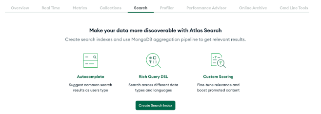
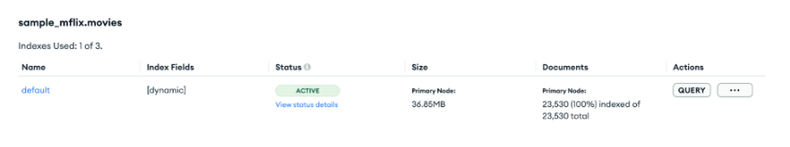
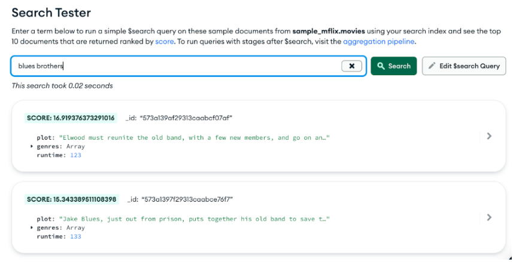
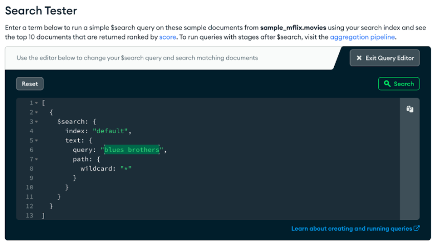
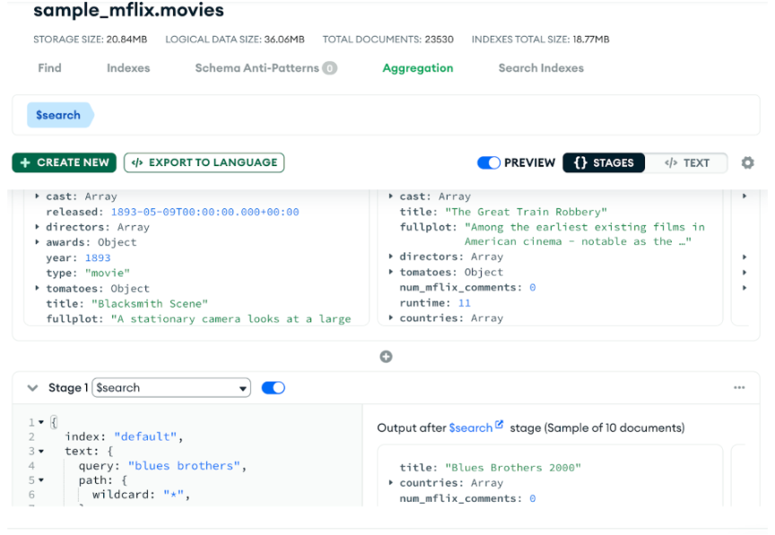
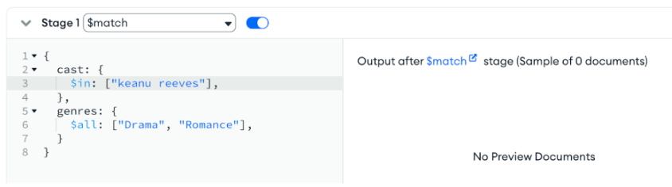
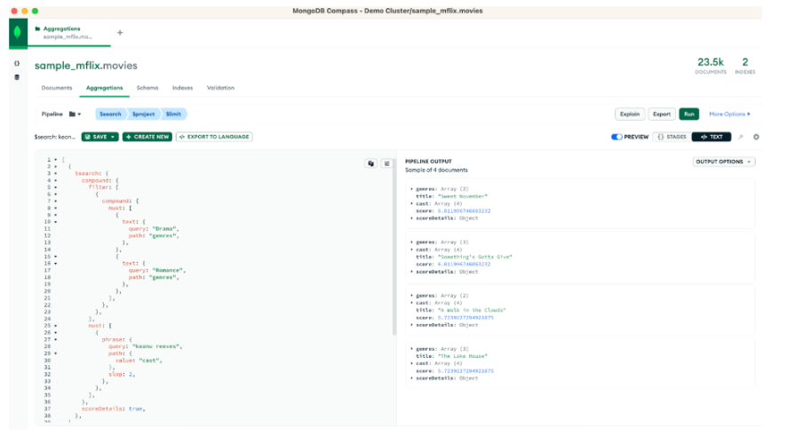

Dear fellow developer, welcome!

[Atlas Search](https://www.mongodb.com/atlas/search/?utm_campaign=devrel&utm_source=third-party-content&utm_medium=cta&utm_content=atlas-search-foojay&utm_term=tony.kim) is a full-text search engine embedded in MongoDB Atlas that gives you a seamless, scalable experience for building relevance-based app features. Built on Apache Lucene, Atlas Search eliminates the need to run a separate search system alongside your database. The gateway to Atlas Search is the $search aggregation pipeline stage.

The [$search](https://www.mongodb.com/docs/atlas/atlas-search/query-syntax/?utm_campaign=devrel&utm_source=third-party-content&utm_medium=cta&utm_content=atlas-search-foojay&utm_term=tony.kim#std-label-search-agg-pipeline) stage, as one of the newest members of the [MongoDB aggregation pipeline](https://www.mongodb.com/docs/manual/core/aggregation-pipeline/?utm_campaign=devrel&utm_source=third-party-content&utm_medium=cta&utm_content=atlas-search-foojay&utm_term=tony.kim) family, has gotten native, convenient support added to various language drivers. Driver support helps developers build concise and readable code. This article delves into using the Atlas Search support built into the MongoDB Java driver, where we'll see how to use the driver, how to handle \`$search\` features that don't yet have native driver convenience methods or have been released after the driver was released, and a glimpse into Atlas Search relevancy scoring. Let's get started!

## New to search?

Full-text search is a deceptively sophisticated set of concepts and technologies. From the user perspective, it's simple: good ol' \`?q=query\` on your web applications URL and relevant documents are returned, magically. There's a lot behind the classic magnifying glass search box, from analyzers, synonyms, fuzzy operators, and facets to autocomplete, relevancy tuning, and beyond. We know it's a lot to digest. Atlas Search works hard to make things easier and easier for developers, so rest assured you're in the most comfortable place to begin your journey into the joys and power of full-text search. We admittedly gloss over details here in this article, so that you get up and running with something immediately graspable and useful to you, fellow Java developers. By following along with the basic example provided here, you'll have the framework to experiment and learn more about details elided.

## Setting up our Atlas environment

We need two things to get started, a database and data. We've got you covered with both. First, we'll start with logging into your Atlas account. If you don't already have an Atlas account, follow the steps for the Atlas UI in the ["Get Started with Atlas"](https://www.mongodb.com/docs/atlas/getting-started/?utm_campaign=devrel&utm_source=third-party-content&utm_medium=cta&utm_content=atlas-search-foojay&utm_term=tony.kim) tutorial.

### Opening network access

If you already had an Atlas account or perhaps like me, you skimmed the tutorial too quickly and skipped the step to [add your IP address to the list of trusted IP addresses](https://www.mongodb.com/docs/atlas/security/add-ip-address-to-list/?utm_campaign=devrel&utm_source=third-party-content&utm_medium=cta&utm_content=atlas-search-foojay&utm_term=tony.kim), take care of that now. Atlas only allows access to the IP addresses and users that you have configured but is otherwise restricted.

### Indexing sample data

Now that you're logged into your Atlas account, add [the sample datasets to your environment](https://www.mongodb.com/docs/atlas/sample-data/?utm_campaign=devrel&utm_source=third-party-content&utm_medium=cta&utm_content=atlas-search-foojay&utm_term=tony.kim). Specifically, we are using the [sample_mflix collection](https://www.mongodb.com/docs/atlas/sample-data/sample-mflix/?utm_campaign=devrel&utm_source=third-party-content&utm_medium=cta&utm_content=atlas-search-foojay&utm_term=tony.kim#std-label-mflix-movies) here. Once you've added the sample data, turn Atlas Search on for that collection by navigating to the Search section in the Databases view, and clicking "Create Search Index."  

Once in the "Create Index" wizard, use the Visual Editor, pick the sample_mflix.movies collection, leave the index name as "default", and finally, click "Create Search Index."

It'll take a few minutes for the search index to be built, after which an e-mail notification will be sent. The indexing processing status can be tracked in the UI, as well.

Here's what the Search section should now look like for you:  

Voila, now you've got the movie data indexed into Atlas Search and can perform sophisticated full text queries against it. Go ahead and give it a try using the handy Search Tester, by clicking the "Query" button. Try typing in some of your favorite movie titles or actor names, or even words that would appear in the plot or genre.

Behind the scenes of the Search Tester lurks the $search pipeline stage. Clicking "Edit $search Query" exposes the full $search stage in all its JSON glory, allowing you to experiment with the syntax and behavior.

This is our first glimpse into the $search syntax. The handy "copy" (the top right of the code editor side panel) button copies the code to your clipboard so you can paste it into your favorite MongoDB aggregation pipeline tools like Compass, [MongoDB shell](https://www.mongodb.com/products/shell/?utm_campaign=devrel&utm_source=third-party-content&utm_medium=cta&utm_content=atlas-search-foojay&utm_term=tony.kim), or the Atlas UI aggregation tool (shown below). There's an "aggregation pipeline" link there that will link you directly to the aggregation tool on the current collection.

At this point, your environment is set up and your collection is Atlas search-able. Now it's time to do some coding!

## Click, click, click, ... code!

Let's first take a moment to reflect on and appreciate what's happened behind the scenes of our wizard clicks up to this point:

* A managed, scalable, reliable MongoDB cluster has spun up.
* Many sample data collections were ingested, including the movies database used here.
* A triple-replicated, flexible, full-text index has been configured and built from existing content and stays in sync with database changes.

Through the Atlas UI and other tools like [MongoDB Compass](https://www.mongodb.com/products/compass/?utm_campaign=devrel&utm_source=third-party-content&utm_medium=cta&utm_content=atlas-search-foojay&utm_term=tony.kim), we are now able to query our movies collection in, of course, all the usual MongoDB ways, and also through a proven and performant full-text index with relevancy-ranked results. It's now up to us, fellow developers, to take it across the finish line and build the applications that allow and facilitate the most useful or interesting documents to percolate to the top. And in this case, we're on a mission to build Java code to search our Atlas Search index.

## Our coding project challenge

Let's answer this question from our movies data:

***What romantic, drama movies have featured Keanu Reeves?***

Yes, we could answer this particular question knowing the **precise** case and spelling of each field value in a direct lookup fashion, using this aggregation pipeline:

|-------------------------------------------------------------------------------------------------------|
| \[ { $match: { cast: { $in: \["Keanu Reeves"\], }, genres: { $all: \["Drama", "Romance"\], }, }, } \] |

Let's suppose we have a UI that allows the user to select one or more genres to filter, and a text box to type in a free form query. If the user had typed "keanu reeves", all lowercase, the above $match would not find any movies. Doing known, exact value matching is an important and necessary capability, to be sure, yet when presenting free form query interfaces to humans, we need to allow for typos, case insensitivity, voice transcription mistakes, and other inexact, fuzzy queries.

Using the Atlas Search index we've already set up, we can now easily handle a variety of full text queries. We'll stick with this example throughout so you can compare and contrast doing standard [$match](https://www.mongodb.com/docs/manual/reference/operator/aggregation/match/?utm_campaign=devrel&utm_source=third-party-content&utm_medium=cta&utm_content=atlas-search-foojay&utm_term=tony.kim) queries to doing sophisticated [$search](https://www.mongodb.com/docs/atlas/atlas-search/query-syntax/?utm_campaign=devrel&utm_source=third-party-content&utm_medium=cta&utm_content=atlas-search-foojay&utm_term=tony.kim#mongodb-pipeline-pipe.-search) queries.

## Know the $search structure

Ultimately, regardless of the coding language, environment, or driver that we use, a [BSON](https://www.mongodb.com/json-and-bson/?utm_campaign=devrel&utm_source=third-party-content&utm_medium=cta&utm_content=atlas-search-foojay&utm_term=tony.kim) representation of our aggregation pipeline request is handled by the server. The Aggregation view in Atlas UI and very similarly in Compass, our useful MongoDB client-side UI for querying and analyzing MongoDB data, can help guide you through the syntax, with links directly to the pertinent [Atlas Search aggregation pipeline](https://www.mongodb.com/docs/atlas/atlas-search/query-syntax/?utm_campaign=devrel&utm_source=third-party-content&utm_medium=cta&utm_content=atlas-search-foojay&utm_term=tony.kim) documentation.

Rather than incrementally building up to our final example, here's the complete aggregation pipeline so you have it available as we adapt this to Java code. This aggregation pipeline performs a search query, filtering results to movies that are categorized as both Drama and Romance genres, that have "keanu reeves" in the cast field, returning only a few fields of the highest ranked first 10 documents.

|---------------------------------------------------------------------------------------------------------------------------------------------------------------------------------------------------------------------------------------------------------------------------------------------------------------------------------------------------------------------------------------------------------------------------------------------------------------------------------------------|
| \[ { "$search": { "compound": { "filter": \[ { "compound": { "must": \[ { "text": { "query": "Drama", "path": "genres" } }, { "text": { "query": "Romance", "path": "genres" } } \] } } \], "must": \[ { "phrase": { "query": "keanu reeves", "path": { "value": "cast" } } } \] }, "scoreDetails": true } }, { "$project": { "_id": 0, "title": 1, "cast": 1, "genres": 1, "score": { "$meta": "searchScore" }, "scoreDetails": { "$meta": "searchScoreDetails" } } }, { "$limit": 10 } \] |

At this point, go ahead and copy the above JSON aggregation pipeline and paste it into Atlas UI or Compass. There's a nifty feature (the mode button - see button image below) where you can paste in the entire JSON just copied.  



Here's what the results should look like for you:

As we adapt the three-stage aggregation pipeline to Java, we'll explain things in more detail.

We spend the time here emphasizing this JSON-like structure because it will help us in our Java coding. It'll serve us well to also be able to work with this syntax in ad hoc tools like Compass in order to experiment with various combinations of options and stages to arrive at what serves our applications best, and be able to translate that aggregation pipeline to Java code. It's also the most commonly documented query language/syntax for MongoDB and Atlas Search; it's valuable to be savvy with it.

## Now back to your regularly scheduled Java

[Version 4.7 of the MongoDB Java driver](https://www.mongodb.com/community/forums/t/mongodb-java-driver-4-7-0-released/175796/?utm_campaign=devrel&utm_source=third-party-content&utm_medium=cta&utm_content=atlas-search-foojay&utm_term=tony.kim) was released in July of 2022, adding convenience methods for the Atlas $search stage, while Atlas Search was made generally available [two years prior](https://www.mongodb.com/community/forums/t/atlas-search-is-now-ga/5161/?utm_campaign=devrel&utm_source=third-party-content&utm_medium=cta&utm_content=atlas-search-foojay&utm_term=tony.kim). In that time, Java developers weren't out of luck, as direct BSON Document API calls to construct a $search stage work fine. Code examples in that time frame used \`new Document("$search",...)\`. This article showcases a more comfortable way for us Java developers to use the $search stage, allowing clearly named and strongly typed parameters to guide you. Your IDE's method and parameter autocompletion will be a time-saver to more readable and reliable code.

There's a great tutorial on [using the MongoDB Java driver](https://www.mongodb.com/developer/languages/java/aggregation-expression-builders/?utm_campaign=devrel&utm_source=third-party-content&utm_medium=cta&utm_content=atlas-search-foojay&utm_term=tony.kim) in general.

The full code for this tutorial is available on [GitHub](https://github.com/mongodb-developer/getting-started-search-java).

You'll need a modern version of Java, something like:

|--------------------------------------------------------------------------------------------------------------------------------------------------------------------------|
| $ java --version openjdk 17.0.7 2023-04-18 OpenJDK Runtime Environment Homebrew (build 17.0.7+0) OpenJDK 64-Bit Server VM Homebrew (build 17.0.7+0, mixed mode, sharing) |

Now grab the code from our repository using \`git clone\` and go to the working directory:

|-----------------------------------------------------------------------------------------------------------|
| git clone https://github.com/mongodb-developer/getting-started-search-java cd getting-started-search-java |

Once you clone that code, copy the connection string from the Atlas UI (the "Connect" button on the Database page). You'll use this connection string in a moment to run the code connecting to your cluster.

Now open a command-line prompt to the directory where you placed the code, and run:

|----------------------------------------------------------------------|
| ATLAS_URI="\<\<insert your connection string here\>\>" ./gradlew run |

Be sure to fill in the appropriate username and password in the connection string. If you don't already have Gradle installed, the \`gradlew\` command should install it the first time it is executed. At this point, you should get a few pages of output to your console. If the process hangs for a few seconds and then times out with an error message, check your Atlas network permissions, the connection string you have specified the \`ATLAS_URI\` setting, including the username and password.

Using the \`run\` command from Gradle is a convenient way to run the Java \`main()\` of our \`FirstSearchExample\`. It can be run in other ways as well, such as through an IDE. Just be sure to set the \`ATLAS_URI\` environment variable for the environment running the code.

Ideally, at this point, the code ran successfully, performing the search query that we have been describing, printing out these results:

|----------------------------------------------------------------------------------------------------------------------------------------------------------------------------------------------------------------------------------------------------------------------------------------------------------------------------------------------------------------------------------------------------------------------------------------------------------------------------------------------------------------------------------------------------------------------------------------------------------------------|
| Sweet November Cast: \[Keanu Reeves, Charlize Theron, Jason Isaacs, Greg Germann\] Genres: \[Drama, Romance\] Score:6.011996746063232 Something's Gotta Give Cast: \[Jack Nicholson, Diane Keaton, Keanu Reeves, Frances McDormand\] Genres: \[Comedy, Drama, Romance\] Score:6.011996746063232 A Walk in the Clouds Cast: \[Keanu Reeves, Aitana Sènchez-Gijèn, Anthony Quinn, Giancarlo Giannini\] Genres: \[Drama, Romance\] Score:5.7239227294921875 The Lake House Cast: \[Keanu Reeves, Sandra Bullock, Christopher Plummer, Ebon Moss-Bachrach\] Genres: \[Drama, Fantasy, Romance\] Score:5.7239227294921875 |

So there are four movies that match our criteria — our initial mission has been accomplished.

## Java $search building

Let's now go through our project and code, pointing out the important pieces you will be using in your own project. First, our build.gradle file specifies that our project depends on the MongoDB Java driver, down to the specific version of the driver. There's also a convenient \`application\` plugin so that we can use the \`run\` target as we just did.

|---------------------------------------------------------------------------------------------------------------------------------------------------------------------------------------------------------------------------------------------------------------------------------------------------------------------------------------|
| plugins { id 'java' id 'application' } group 'com.mongodb.atlas' version '1.0-SNAPSHOT' repositories { mavenCentral() } dependencies { implementation 'org.mongodb:mongodb-driver-sync:4.10.1' implementation 'org.apache.logging.log4j:log4j-slf4j-impl:2.17.1' } application { mainClass = 'com.mongodb.atlas.FirstSearchExample' } |

See [our docs](https://www.mongodb.com/docs/drivers/java/sync/current/quick-start/?utm_campaign=devrel&utm_source=third-party-content&utm_medium=cta&utm_content=atlas-search-foojay&utm_term=tony.kim#add-mongodb-as-a-dependency) for further details on how to add the MongoDB Java driver to your project.

In typical Gradle project structure, our Java code resides under \`src/main/java/com/mongodb/atlas/\` in [FirstSearchExample.java](https://github.com/mongodb-developer/getting-started-search-java/blob/main/src/main/java/com/mongodb/atlas/FirstSearchExample.java).

Let's walk through this code, section by section, in a little bit backward order. First, we open a connection to our collection, pulling the connection string from the \`ATLAS_URI\` environment variable:

|---------------------------------------------------------------------------------------------------------------------------------------------------------------------------------------------------------------------------------------------------------------------------------------------------------------------------------------------------------|
| // Set ATLAS_URI in your environment String uri = System.getenv("ATLAS_URI"); if (uri == null) { throw new Exception("ATLAS_URI must be specified"); } MongoClient mongoClient = MongoClients.create(uri); MongoDatabase database = mongoClient.getDatabase("sample_mflix"); MongoCollection\<Document\> collection = database.getCollection("movies"); |

Our ultimate goal is to call \`collection.aggregate()\` with our list of pipeline stages: search, project, and limit. There are driver convenience methods in \`com.mongodb.client.model.Aggregates\` for each of these.

|----------------------------------------------------------------------------------------------------------------------------------------------------------------------------------------------------------------------------------------------------------|
| AggregateIterable\<Document\> aggregationResults = collection.aggregate(Arrays.asList( searchStage, project(fields(excludeId(), include("title", "cast", "genres"), metaSearchScore("score"), meta("scoreDetails", "searchScoreDetails"))), limit(10))); |

The [\`$project\`](https://www.mongodb.com/docs/upcoming/reference/operator/aggregation/project/?utm_campaign=devrel&utm_source=third-party-content&utm_medium=cta&utm_content=atlas-search-foojay&utm_term=tony.kim#mongodb-pipeline-pipe.-project) and [\`$limit\`](https://www.mongodb.com/docs/v6.0/reference/operator/aggregation/limit/?utm_campaign=devrel&utm_source=third-party-content&utm_medium=cta&utm_content=atlas-search-foojay&utm_term=tony.kim) stages are both specified fully inline above. We'll define \`searchStage\` in a moment. The \`project\` stage uses \`metaSearchScore\`, a Java driver convenience method, to map the Atlas Search computed score (more on this below) to a pseudo-field named \`score\`. Additionally, Atlas Search can provide the score explanations, which itself is a performance hit to generate so only use for debugging and experimentation. Score explanation details must be requested as an option on the \`search\` stage for them to be available for projection here. There is not a convenience method for projecting scoring explanations, so we use the generic \`meta()\` method to provide the pseudo-field name and the key of the meta value Atlas Search returns for each document. The Java code above generates the following aggregation pipeline, which we had previously done manually above, showing it here to show the Java code and the corresponding generated aggregation pipeline pieces.

|----------------------------------------------------------------------------------------------------------------------------------------------------------------------------------------------------------|
| \[ { "$search": { ... } }, { "$project": { "_id": 0, "title": 1, "cast": 1, "genres": 1, "score": { "$meta": "searchScore" }, "scoreDetails": { "$meta": "searchScoreDetails" } } }, { "$limit": 10 } \] |

The \`searchStage\` consists of a search operator and an additional option. We want the relevancy scoring explanation details of each document generated and returned, which is enabled by the \`scoreDetails\` setting that was developed and released after the Java driver version was released. Thankfully, the Java driver team built in pass-through capabilities to be able to set arbitrary options beyond the built-in ones to future-proof it. \`SearchOptions.searchOptions().option()\` allows us to set the \`scoreDetails\` option on the $search stage to true. Reiterating the note from above, generating score details is a performance hit on Lucene, so only enable this setting for debugging or experimentation while inspecting but do not enable it in performance sensitive environments.

|----------------------------------------------------------------------------------------------------------------------------------------------------------------------|
| Bson searchStage = search( compound() .filter(List.of(genresClause)) .must(List.of(SearchOperator.of(searchQuery))), searchOptions().option("scoreDetails", true) ); |

|-------------------------------------------------------------------------------------------------|
| "$search": { "compound": { "filter": \[ . . . \], "must": \[ . . . \] }, "scoreDetails": true } |

We've left a couple of variables to fill in: \`filters\` and \`searchQuery\`.

*\>\>\> Callout section: what are filters versus other compound operator clauses?*

* *filter: clauses to narrow the query scope, not affecting the resultant relevancy score*
* *must: required query clauses, affecting relevancy scores*
* *should: optional query clauses, affecting relevancy scores*
* *mustNot: prohibited*

Our (non-scoring) filter is a single search operator clause that combines required criteria for genres Drama and Romance:

|----------------------------------------------------------------------------------------------------------------------------------------------------------------------------------------|
| SearchOperator genresClause = SearchOperator.compound() .must(Arrays.asList( SearchOperator.text(fieldPath("genres"),"Drama"), SearchOperator.text(fieldPath("genres"), "Romance") )); |

|----------------------------------------------------------------------------------------------------------------------------------------|
| "compound": { "must": \[ { "text": { "query": "Drama", "path": "genres" } }, { "text": { "query": "Romance", "path": "genres" } } \] } |

Notice how we nested the \`genresClause\` within our \`filter\` array, which takes a list of \`SearchOperator\`s. \`SearchOperator\` is a Java driver class with convenience builder methods for some, but not all, of the available Atlas Search search operators. You can see we used \`SearchOperator.text()\` to build up the genres clauses.

Last but not least is the primary (scoring!) \`phrase\` search operator clause to search for "keanu reeves" within the \`cast\` field. Alas, this is one search operator that currently does not have built-in SearchOperator support. Again, kudos to the Java driver development team for building in a pass-through for arbitrary BSON objects, provided we know the correct JSON syntax. Using \`SearchOperator.of()\`, we create an arbitrary operator out of a BSON document. Note: This is why it was emphasized early on to become savvy with the JSON structure of the aggregation pipeline syntax.

|---------------------------------------------------------------------------------------------------------------|
| Document searchQuery = new Document("phrase", new Document("query", "keanu reeves") .append("path", "cast")); |

## And the results are...

So now we've built the aggregation pipeline. To show the results, we simply iterate through \`aggregationResults\`:

|-------------------------------------------------------------------------------------------------------------------------------------------------------------------------------------------------------------------------------------------------------------------------------------------------------------------------------------------|
| aggregationResults.forEach(doc -\> { System.out.println(doc.get("title")); System.out.println(" Cast: " + doc.get("cast")); System.out.println(" Genres: " + doc.get("genres")); System.out.println(" Score:" + doc.get("score")); // printScoreDetails(2, doc.toBsonDocument().getDocument("scoreDetails")); System.out.println(""); }); |

The results are ordered in descending score order. Score is a numeric factor based on the relationship between the query and each document. In this case, the only scoring component to our query was a phrase query of "keanu reeves". Curiously, our results have documents with different scores! Why is that? If we covered everything, this article would never end, so addressing the scoring differences is beyond this scope, but we'll explain a bit below for bonus and future material.

You're now an Atlas Search-savvy Java developer — well done! You're well on your way to enhancing your applications with the power of full-text search. With just the steps and code presented here, even without additional configuration and deeper search understanding, the power of search is available to you.

This is only the beginning. And it is important, as we refine our application to meet our users' demanding relevancy needs, to continue the Atlas Search learning journey.

## For further information

We finish our code with some insightful diagnostic output. An aggregation pipeline execution can be [\*explain\*ed](https://www.mongodb.com/docs/atlas/atlas-search/explain/?utm_campaign=devrel&utm_source=third-party-content&utm_medium=cta&utm_content=atlas-search-foojay&utm_term=tony.kim), dumping details of execution plans and performance timings. In addition, the Atlas Search process, \`mongot\`, provides details of \`$search\` stage interpretation and statistics.

|------------------------------------------------------------------------------------------------------------|
| System.out.println("Explain:"); System.out.println(format(aggregationResults.explain().toBsonDocument())); |

We'll leave delving into those details as an exercise to the reader, noting that you can learn a lot about how queries are interpreted/analyzed by studying the explain() output.

## Bonus section: relevancy scoring

Search relevancy is a scientific art. Without getting into mathematical equations and detailed descriptions of information retrieval research, let's focus on the concrete scoring situation presented in our application here. The scoring component of our query is a phrase query of "keanu reeves" on the cast field. We do a \`phrase\` query rather than a \`text\` query so that we search for those two words contiguously, rather than "keanu OR reeves" ("keanu" is a rare term, of course, but there are many "reeves").

Scoring takes into account the field length (the number of terms/words in the content), among other factors. Underneath, during indexing, each value of the cast field is run through an analysis process that tokenizes the text. Tokenization is a process splitting the content into searchable units, called terms. A "term" could be a word or fragment of a word, or the exact text, depending on the analyzer settings. Take a look at the \`cast\` field values in the returned movies. Using the default, \`lucene.standard\`, analyzer, the tokens emitted split at whitespace and other word boundaries, such as the dash character.

Now do you see how the field length (number of terms) varies between the documents? If you're curious of the even gnarlier details of how Lucene performs the scoring for our query, uncomment the \`printScoreDetails\` code in our results output loop.

Don't worry if this section is a bit too much to take in right now. Stay tuned — we've got some scoring explanation content coming shortly.

We could quick fix the ordering to at least not bias based on the absence of hyphenated actor names. Moving the queryClause into the \`filters\` section, rather than the \`must\` section, such that there would be no scoring clauses, only filtering ones, will leave all documents of equal ranking.

## Searching for more?

There are many useful Atlas Search resources available, several linked inline above; we encourage you to click through those to delve deeper. These quick three steps will have you up and searching quickly:

1. [Atlas account](https://www.mongodb.com/docs/atlas/getting-started/?utm_campaign=devrel&utm_source=third-party-content&utm_medium=cta&utm_content=atlas-search-foojay&utm_term=tony.kim)
2. [Add some content](https://www.mongodb.com/docs/atlas/sample-data/?utm_campaign=devrel&utm_source=third-party-content&utm_medium=cta&utm_content=atlas-search-foojay&utm_term=tony.kim)
3. [Create an Atlas Search index](https://www.mongodb.com/docs/atlas/atlas-search/tutorial/create-index/?utm_campaign=devrel&utm_source=third-party-content&utm_medium=cta&utm_content=atlas-search-foojay&utm_term=tony.kim)

Please also consider taking the free [MongoDB University Atlas Search course](https://learn.mongodb.com/courses/mongodb-atlas-search?utm_campaign=devrel&utm_source=third-party-content&utm_medium=cta&utm_content=atlas-search-foojay&utm_term=erik.hatcher).
