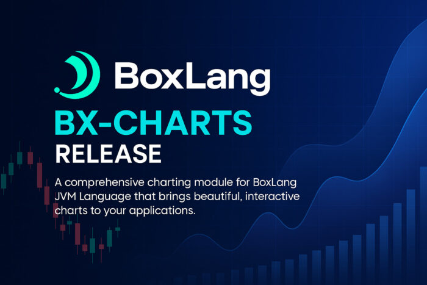
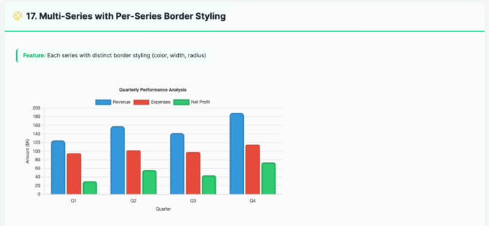
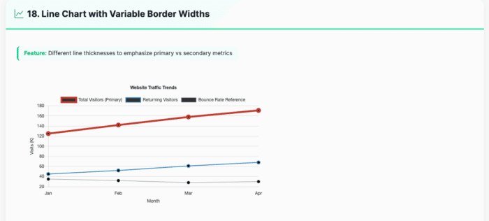
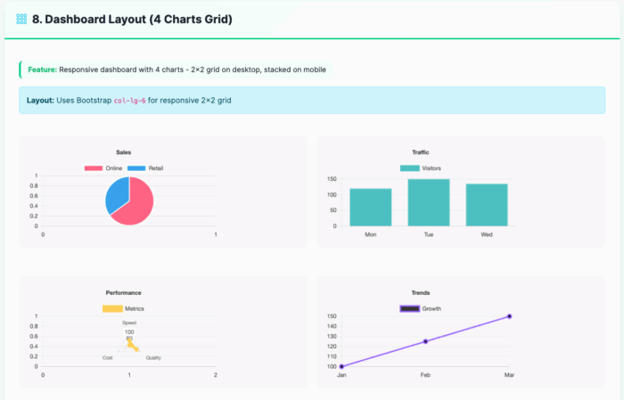
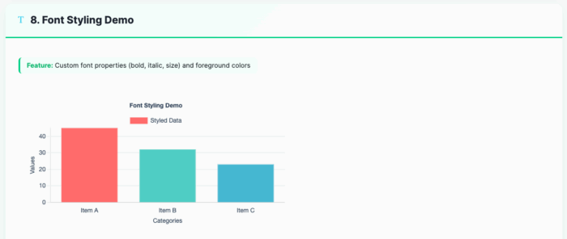
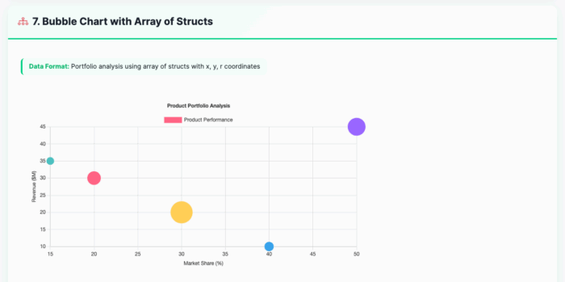
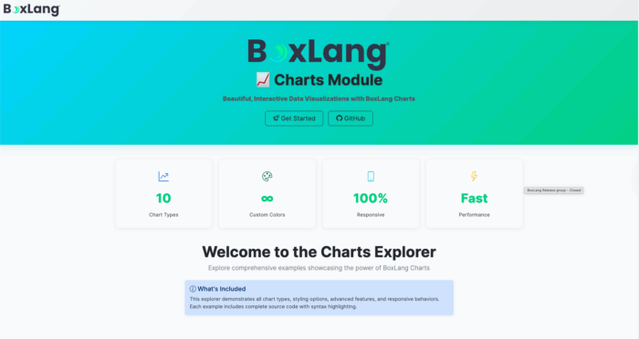

In the world of modern web applications, data is king---but raw numbers rarely tell the full story. 📈 That's where visualization becomes crucial, transforming complex datasets into intuitive, compelling narratives. Today, we're thrilled to introduce BX-Charts, a game-changing charting module that brings professional-grade data visualization directly into the BoxLang ecosystem. 🌟

## The Visualization Challenge 🧩

Developers have long struggled with creating meaningful charts:

* 🔧 Complex JavaScript libraries
* 🏗️ Extensive configuration
* 📚 Steep learning curves
* 🚧 Limited flexibility

**BX-Charts** demolishes these barriers, offering a seamless, powerful charting solution that's both developer-friendly and enterprise-ready. 💪

## Fully Documented

We love ❤️ docs! We have fully documented our module: [https://boxlang.ortusbooks.com/boxlang-framework/modularity/charts](https://boxlang.ortusbooks.com/boxlang-framework/modularity/charts "https://boxlang.ortusbooks.com/boxlang-framework/modularity/charts")

## Fully Supported

If you have one of our +/++ licenses, you will get personalized support and implementation advice: [https://www.boxlang.io/plans](https://www.boxlang.io/plans "https://www.boxlang.io/plans")

## Code Samples: Bringing Data to Life

1. Multi-Series Performance Analysis with Per-Series Border Styling  
   

```java
<bx:chart title="Quarterly Performance Analysis"
          chartwidth="700" chartheight="400"
          xaxistitle="Quarter" yaxistitle="Amount ($K)"
          showlegend="true"
          showygridlines="true"
          backgroundcolor="##ffffff">
    <bx:chartseries type="bar"
                    colorlist="3498db"
                    serieslabel="Revenue"
                    bordercolor="##2980b9"
                    borderwidth="3"
                    borderradius="8">
        <bx:chartdata item="Q1" value="125" />
        <bx:chartdata item="Q2" value="158" />
        <bx:chartdata item="Q3" value="142" />
        <bx:chartdata item="Q4" value="189" />
    </bx:chartseries>
    <bx:chartseries type="bar"
                    colorlist="e74c3c"
                    serieslabel="Expenses"
                    bordercolor="##c0392b"
                    borderwidth="2"
                    borderradius="4">
        <bx:chartdata item="Q1" value="95" />
        <bx:chartdata item="Q2" value="102" />
        <bx:chartdata item="Q3" value="98" />
        <bx:chartdata item="Q4" value="115" />
    </bx:chartseries>
</bx:chart>
```

2. Line Chart with Variable Border Widths  
   

```java
<bx:chart title="Website Traffic Trends"
          chartwidth="700" chartheight="400"
          xaxistitle="Month" yaxistitle="Visits (K)"
          showlegend="true"
          showygridlines="true"
          showmarkers="true"
          backgroundcolor="##ffffff">
    <bx:chartseries type="line"
                    colorlist="e74c3c"
                    serieslabel="Total Visitors (Primary)"
                    bordercolor="##c0392b"
                    borderwidth="5">
        <bx:chartdata item="Jan" value="125" />
        <bx:chartdata item="Feb" value="142" />
        <bx:chartdata item="Mar" value="158" />
        <bx:chartdata item="Apr" value="171" />
    </bx:chartseries>
    <bx:chartseries type="line"
                    colorlist="3498db"
                    serieslabel="Returning Visitors"
                    bordercolor="##2980b9"
                    borderwidth="2">
        <bx:chartdata item="Jan" value="45" />
        <bx:chartdata item="Feb" value="52" />
        <bx:chartdata item="Mar" value="61" />
        <bx:chartdata item="Apr" value="68" />
    </bx:chartseries>
</bx:chart>
```

3. Responsive Dashboard Layout  
   

```java
<div class="row g-3">
    <div class="col-lg-6">
        <bx:chart title="Sales"
                  chartwidth="400" chartheight="250"
                  responsive="true"
                  maintainAspectRatio="true">
            <bx:chartseries type="pie" colorlist="FF6384,36A2EB" serieslabel="Sales">
                <bx:chartdata item="Online" value="65" />
                <bx:chartdata item="Retail" value="35" />
            </bx:chartseries>
        </bx:chart>
    </div>
    <div class="col-lg-6">
        <bx:chart title="Traffic"
                  chartwidth="400" chartheight="250"
                  responsive="true"
                  maintainAspectRatio="true"
                  showygridlines="true">
            <bx:chartseries type="bar" colorlist="4BC0C0" serieslabel="Visitors">
                <bx:chartdata item="Mon" value="120" />
                <bx:chartdata item="Tue" value="150" />
                <bx:chartdata item="Wed" value="135" />
            </bx:chartseries>
        </bx:chart>
    </div>
</div>
```

4. Background and Font Styling  
   

```java
<bx:chart format="canvas" title="Font Styling Demo" 
          backgroundcolor="##ffffff"
          chartheight="300" chartwidth="600" 
          showlegend="true"
          fontbold="true" 
          fontitalic="true" 
          fontsize="14"
          foregroundcolor="##2E4057" 
          xaxistitle="Categories" 
          yaxistitle="Values">
    <bx:chartseries type="bar" 
                    colorlist="FF6B6B,4ECDC4,45B7D1" 
                    serieslabel="Styled Data">
        <bx:chartdata item="Item A" value="45" />
        <bx:chartdata item="Item B" value="32" />
        <bx:chartdata item="Item C" value="23" />
    </bx:chartseries>
</bx:chart>
```

5. Bubble Chart for Multi-Dimensional Analysis  
   

```java
<bx:chart title="Product Portfolio Analysis"
          chartwidth="600" chartheight="350"
          xaxistitle="Market Share (%)" 
          yaxistitle="Revenue (millions)"
          showxgridlines="true" 
          showygridlines="true">
    <bx:chartseries type="bubble" 
                    colorlist="9966FF,36A2EB,FF6384,FFCE56"
                    serieslabel="Products">
        <bx:chartdata item="Product A" x="20" y="85" r="15" />
        <bx:chartdata item="Product B" x="35" y="120" r="20" />
        <bx:chartdata item="Product C" x="15" y="65" r="10" />
        <bx:chartdata item="Product D" x="25" y="95" r="12" />
    </bx:chartseries>
</bx:chart>
```

## Exploring the Possibilities 🔍

  

We've built an interactive Chart Explorer at **[charts.boxlang.io](https://charts.boxlang.io "charts.boxlang.io")**, where you can:

* Browse live chart examples
* View source code
* Experiment with different chart configurations
* Learn best practices for data visualization

### Installation 🔧

Get started with BX-Charts

```java
# CommandBox Web Apps
box install bx-charts

# Core OS or Other Runtimes
install-bx-module bx-charts
```

### Key Features

* 📊 10 Chart Types
* 📱 Fully Responsive
* 🎨 Customizable Styling
* 🔗 Easy Data Integration
* 🚀 Performance Optimized

### Developers, Unleash Your Data! 🌍

Whether you're building business intelligence dashboards, scientific visualizations, or performance reports, BX-Charts provides the flexibility and power you need. 🔍

**Ready to transform your data into insights? BX-Charts is here. 🌟**

[Explore Full Documentation](https://boxlang.ortusbooks.com/modules/bx-charts "Explore Full Documentation")
