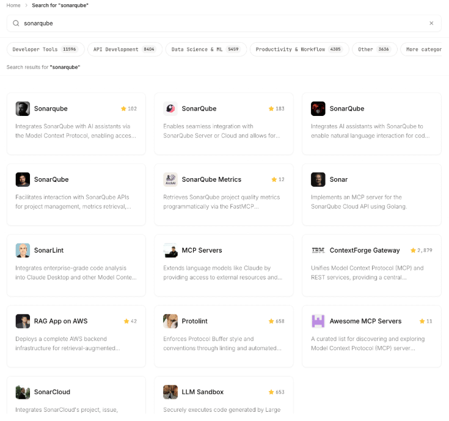
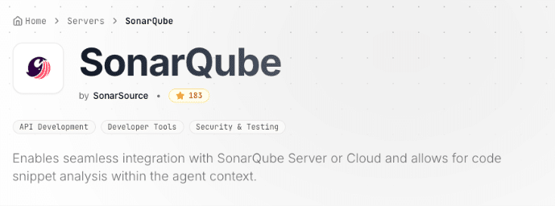
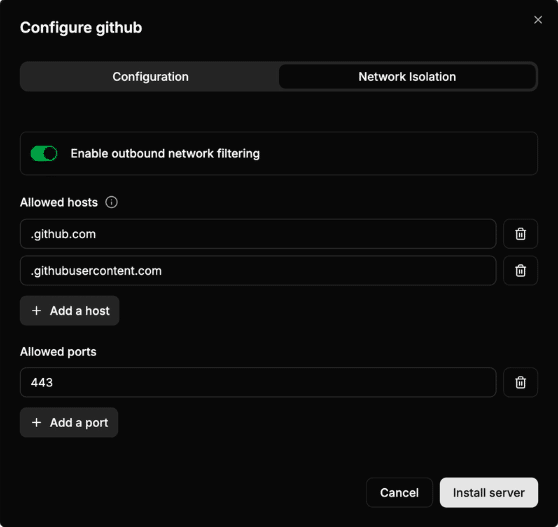
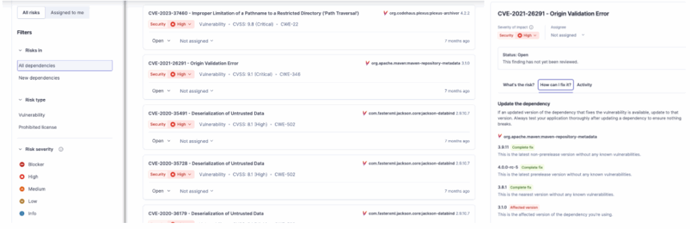

Let's talk about that new **MCP (Model Context Protocol) Server** your team is using to connect to your real data services. It's awesome, right? It's the "magic box" that gives your AI Agent access to the **real world**---live databases, internal APIs, and all your tools.

But here's the catch: **you don't own the code.** 🚫

It's a vendor product, an open-source project, or another team's platform. You can't just change its code when you find a security hole, unless you have the code and recompile it and deploy it.

This "black box" is now a central hub with the keys to your entire kingdom (or part of it). So, how do you protect your app's data when you can't trust the box itself? You have to become an auditor.

Let's look at the five big risks and how to *analyze* and mitigate them.

### **1. The "My Prompt is Leaking Secrets" Problem 🔑**

**The Threat:** A developer on your team is debugging. They paste this into their Agent-powered chat:

`"Why won't this connect? jdbc:mysql://prod-db... User: admin, Pass: SuperS3cretP@ssw0rd!"`

This prompt goes *straight* to the Agent, and it could be associated with an MCP server, it's in the Agent's world to decide if and which tools to use. Since you can't *add* a filter to block it, your real fear is: **Is the MCP server logging this?** If it is, you've just hardcoded a production secret into a log file, where it will live forever.

**What to do:**

* Prevent pasting sensitive information in the assistant chat
* Work with local (on-premise) LLMs or have enterprise deals about confidentiality
* Analyze the MCP server code to check if they are logging all information sent
* Create a proxy for your Agent-MCP calls using PII/PHI redaction libraries like [Philleas from Philterd](https://www.philterd.ai/)
* Use guardrails tools like [Lakera Guard](https://www.lakera.ai/lakera-guard) that can help prevent (reducting) data leakage.

### **2. The "Is My Server a Double Agent?" Problem 🕵️**

**The Threat:** The MCP server's job is to use your keys (e.g., a Jira API token, a database password) to access tools. But what if the server's *own code* is malicious or buggy? What if it's siphoning your data or keys to an unknown server?

**What to do:**

* **Check ownership:** Are you really installing the MCP server you wanted to install? They look like it, but they may be non official copies, that in the best cases they perform poorly or don't have enough tools, but in the worst case they are leaking information, modifying the response with bad purpose, or even destroying your data if they have write access.  



*List of SonarQube MCP Servers in an MCP marketplace*


*Only this one is the official* [*SonarQube MCP Server*](https://github.com/SonarSource/sonarqube-mcp-server)

* **Static Analysis (SAST):** If you have the server's source code, you can analyze it. Tools like SonarQube can scan the code for suspicious patterns, like hardcoded URLs, weak encryption, or known vulnerabilities.
* **Network Isolation (This is critical!):** Put the MCP server in a "sandbox" environment.
  * Use network monitoring tools (like Wireshark or a proxy) to watch *all* its outbound traffic.
    * Does it *only* talk to the APIs you configured?
    * Is it making unexpected calls to a strange IP in another country?
    * This is how you catch a server that's "phoning home" with your data.
  * Use the container approach
  * Isolate or airgap the MCP server using different approaches :
    * [Docker](https://docs.docker.com/engine/network/firewall-iptables/?utm_source=chatgpt.com#restrict-external-connections-to-containers) : private network , and IP tables filters  

```bash
$ docker network create restricted_net
$ docker run -d --network restricted_net --name mycontainer myimage
container_ip=$(docker inspect -f '{{range.NetworkSettings.Networks}}{{.IPAddress}}{{end}}' mycontainer)
$ iptables -A DOCKER-USER -s <container_ip> -d <allowed_ip> -j ACCEPT
$ iptables -A DOCKER-USER -s <container_ip> -j DROP
```

* Kubernetes: deploy the MCP server container with network policies on the Egress side  

```yaml
apiVersion: networking.k8s.io/v1
kind: NetworkPolicy
metadata:
  name: allow-only-google-ip
  namespace: default
spec:
  podSelector:
    matchLabels:
      app: myapp
  policyTypes:
    - Egress
  egress:
    - to:
        - ipBlock:
            cidr: 142.250.0.0/15   # example Google IP block
      ports:
        - protocol: TCP
          port: 443
```

* Use tools like [ToolHive](https://toolhive.dev/): they add proxies and egress containers routing the network and allowing us to configure the allowed network destinations for each container (MCP server)  



### **3. The "Black Box of Vulnerabilities" Problem 🐛**

**The Threat:** The MCP server is just software. What if it's built using a vulnerable version of Log4j, Spring, or jackson-databind? An attacker won't attack your AI; they'll attack your *server* with a simple, malicious API call.

**What to do:**

* **SCA Analysis(Software Composition Analysis):** This is non-negotiable. You *must* run an SCA scan (like SonarQube Advanced Security) against the server's code. This will generate a **report** and tell you every known CVE it's vulnerable to and the fix (version change) suggested.



* **DAST Analysis (Dynamic Analysis):** Run automated security scanners against the server's live API endpoints. This will find "outside-in" vulnerabilities like improper auth, open-management endpoints, etc.
* **Isolation.** Assume the server *is* vulnerable. Run it in a minimal, locked-down container, on a separate network segment (VLAN), with a strict firewall policy that only allows it to talk to *exactly* what it needs. *See details in previous point.*   

### 4. The "Context Pollution and Poisoning" Problem 🧪

**The Threat:** The AI Agent relies on a context window (the recent history of the conversation and data) to provide accurate, relevant answers. An MCP server's function is to connect the Agent to real live data (e.g. database , documentation API, a Kubernetes cluster) and when it is reading it will inject the info into this context.

* **Pollution:** If the MCP server retrieves *too much* irrelevant data (e.g., pulling 100 pages of documentation when only one paragraph is needed), it "pollutes" the context. This forces the LLM to waste resources sifting through noise, leading to slower, more expensive, and less accurate responses. The LLM might even latch onto the wrong piece of information.
* **Poisoning:** A more insidious threat is intentional "poisoning." An attacker (or a compromised/malicious MCP server) could inject subtly false, biased, or contradictory information directly into the context window under the guise of legitimate data. The LLM will then treat this poisoned data as fact, leading to dangerously incorrect or manipulated output.  

**What to do:**

* **Use subagent context MCP servers** : With Claude Code you can configure certain agents for specific tasks, and associate the MCP servers list only to certain agents and not to the entire conversation Agent. This will reduce the pollution.  

```yaml
{
  "team": {
    "agents": [
      {
        "name": "researcher",
        "model": "claude-3.7-sonnet",
        "mcpServers": [
          {
            "id": "arxiv",
            "type": "http",
            "url": "http://localhost:3000"
          }
        ],
        "systemPrompt": "You are a research assistant..."
      },
      {
        "name": "coder",
        "model": "claude-3.7-sonnet",
        "mcpServers": [
          {
            "id": "filesystem",
            "type": "node",
            "command": "npx",
            "args": ["@mcp/fs", "--root", "."]
          }
        ],
        "systemPrompt": "You write code only..."
      }
    ]
  }
}
```

* **Explicit mention of the tool:** If we rely on the assistant to decide the tool, sometimes it can decide to use the one that retrieves a long list and then filter the right row, instead of using the tool that retrieves only the row we are interested in. We can explicitly mention the tool to be used to reduce pollution.  

#Vague

create a method that iterates an Integer array and analyze the code  

#Explicit

create a method that iterates an Integer array and analyze the code  

with the sonarqube mcp server using analyze_code_snippet tool

* **Implement the Code Execution in MCP concept** : [Code execution with MCP](https://www.anthropic.com/engineering/code-execution-with-mcp) lets an AI write and run code inside a secure sandbox, using that code to call MCP servers through a normal programming API rather than many direct tool calls. This keeps large data and complex operations outside the model, reducing tokens and improving accuracy and scalability. Instead of a dynamic loading of the MCP tools schemas into the context, the execution environment filters/aggregates results from static code calling those MCPs and returns only what the model needs, while enforcing strong isolation and safety. This will mitigate the context pollution and reduce the number of tokens used.
* **Use only 'certified' or official MCP servers :** Trust is crucial, and it should not be given easily. When using MCP servers it's important to trust only those that are official, with a real company with big credibility behind. This will reduce the chances of context poisoning. *See the previous point about ownership*.

### 5. The "Too Many Cooks" Problem (MCP Sprawl) 🌐

**The Threat:** As AI adoption grows, individual teams often deploy their own dedicated MCP servers, leading to **MCP Sprawl**. You end up with ten different servers, each with redundant tool configurations (e.g., three different Jira MCPs, two database-connecting MCPs). This sprawl creates a massive attack surface: more servers to patch, more secrets to manage (often poorly), and inconsistent security policies across the board. The presence of multiple servers with similar configurations also increases the risk that an AI Assistant will call the wrong MCP server, leading to incorrect or failed operations.

**What to do:**

* **Centralized Tool Registry/Gateway:** Implement a single, organization-wide **AI Gateway** or **Tool Orchestrator** (like ToolHive, as mentioned before). This central service acts as the *only* official point of connection between Agents and tools. All individual MCPs are consolidated or replaced by a single, hardened gateway that manages all credentials and applies uniform security policies (e.g., rate limiting, logging, egress control).
* **Service Catalog and Governance:** Create a mandatory internal **Service Catalog** for all AI-enabled tools. Before a team can deploy a new MCP, they must check the catalog to see if an existing, approved, and audited MCP/Gateway already provides the necessary function.

### **Final Check: You're an Auditor**

When you can't *fix* the code, your job is to *analyze* the risk. By scanning, monitoring, and correctly configuring this "black box," you can (hopefully) prevent it from becoming your company's biggest data leak. 🛡️

It's very easy these days to install MCPs, and as any browser plugin, they can bring a lot of great features, but it's important to consider the security and the performance. The financial and reputation problems that a leak of sensitive information can bring to your company is a crucial point that you need to evaluate.
