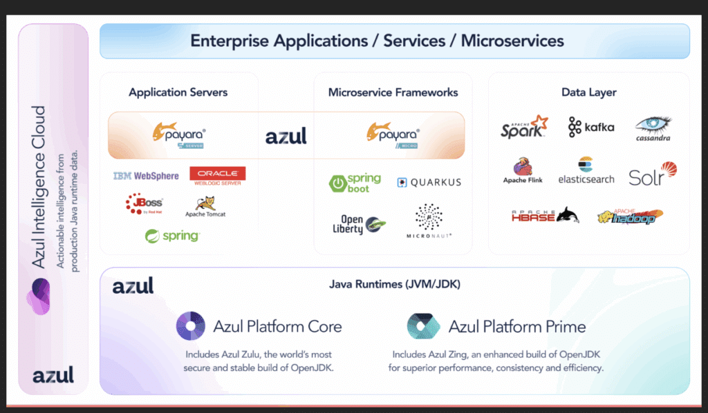

**Azul is a company focused purely on Java through builds of OpenJDK, in the form of Platform Core, and our high-performance Java platform (including JVM), Platform Prime. We build on these with Intelligence Cloud to deliver precise information about security vulnerabilities in running code, unused code and an inventory of all JVMs in use.**

When looking at expanding the company through acquisition, we obviously wanted to maintain that dedication to all things Java, so what better company than Payara?

Before we get into the details of what's happening, let's look at a little Java history.

A Little Java History
---------------------

In 1999, Sun Microsystems announced the creation of three Java Editions: Micro, Standard and Enterprise. Micro Edition was intended for devices, Standard Edition (SE) was the core platform, and Enterprise Edition was for server-side applications. Java Enterprise Edition (EE) consisted of a set of specifications providing a simplified way to develop business logic and web page components. This initially consisted of Servlets and Java Server Pages, for rendering client HTML and Enterprise Java Beans (EJBs). EJBs came in two flavours: Session Beans for business logic and Entity Beans for persistent data (typically for mapping to a database).

Since then, Java EE has gone through multiple revisions, adding a plethora of functionality through a wide range of APIs. Since 2019, it has also been known as Jakarta EE; this was the result of Oracle moving Java EE specification development to the Eclipse Foundation. Oracle did not want to allow the use of the Java trademark, so the name was changed.

A key part of Java EE is the use of an application server that provides a managed runtime for the servlets and EJBs. The application server offers great flexibility in how Java application components can be both developed and deployed (really, this was the forerunner to the idea of microservices).

Another important aspect of Enterprise Java history was Sun's decision, in 2005, to open-source its application server. Now known as GlassFish, it also became the reference implementation for the Java EE and, subsequently, Jakarta EE specifications. This is much the same as the way the OpenJDK project is the reference implementation for the Java SE specification.

Since acquiring Sun Microsystems, Oracle has made several strategic decisions regarding different parts of the Java platform. One of those was moving the standard to the Eclipse Foundation, as already mentioned. Prior to that, in 2014, Oracle announced it would no longer offer commercial support for GlassFish, concentrating on its own application server, WebLogic, for customers.

Which brings us to Payara.

**Payara and Azul**
-------------------

To quote from the Payara website:

***"Enterprises often face the challenge of running mission-critical Java applications with reliability and support. Payara started as an open source, production-ready, fully supported application server to meet that need."***

This is the same model as Azul uses for our Platform Core product: *an* *open-source* *, production-ready, fully supported* build of OpenJDK.

We see many synergies between how Payara supports Jakarta EE applications and how Azul supports the JDK. We see that we work in the Java ecosystem in the same ways, with the same collaborative culture, via open ecosystems and active participation in developer conferences, Java User Groups, and community platforms, such as Foojay.io, the place for friends of OpenJDK, where both Azul and Payara have been actively collaborating for several years.

We also see opportunities to help customers optimise the performance of their Jakarta EE applications through Azul's Platform Prime. As such, Azul has announced that it is acquiring Payara to extend our Java support offerings.

The diagram below shows how the various components fit together in a broader enterprise Java market.

These are exciting times, so stay tuned for more updates as we move forward!

Full press release is here: <https://www.azul.com/newsroom/azul-acquires-payara-strengthening-leadership-in-enterprise-java-solutions/>
