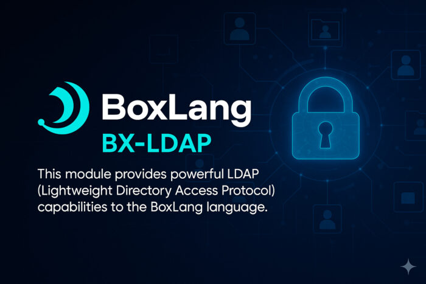

We're excited to announce the release of **bx-ldap**, a comprehensive LDAP module that brings enterprise-grade directory access to BoxLang! This module goes above and beyond traditional CFML LDAP implementations, offering modern features like connection pooling, event-driven programming, multiple return formats, and a clean, intuitive API.
> **Note:** bx-ldap is a premium module available exclusively to BoxLang +/++ **subscribers**.

## 🎯 Why?

Whether you're integrating with Active Directory, OpenLDAP, or any LDAP-compliant directory service, **bx-ldap** makes it simple and powerful. From basic queries to complex directory operations, this module handles it all with grace and performance.

## ✨ Amazing Features

### 🔍 Seven Powerful Actions

The module supports seven core LDAP operations:

* **Query** - Search directories with advanced filters and scopes
* **Add** - Create new directory entries
* **Modify** - Update existing entries (replace/add/delete attributes)
* **Delete** - Remove directory entries
* **ModifyDN** - Rename or move entries within the directory tree
* **Open** - Create named connections for reuse
* **Close** - Explicitly close and release connections

### 📊 Flexible Return Formats

Choose the data format that works best for your application, either native Queries or Arrays.

```java
// Traditional Query format
bx:ldap
    action="query"
    server="ldap.example.com"
    start="dc=example,dc=org"
    filter="(objectClass=person)"
    returnFormat="query"
    result="users";

println( "Found #users.recordCount# users" );

// Modern Array of Structs format (perfect for JSON APIs)
bx:ldap
    action="query"
    server="ldap.example.com"
    start="dc=example,dc=org"
    filter="(department=IT)"
    returnFormat="array"
    result="itUsers";

// Transform to JSON for REST APIs
apiResponse = {
    "success" : true,
    "users" : itUsers,
    "count" : itUsers.len()
};

return jsonSerialize( apiResponse );
```

### 🔌 Smart Connection Pooling

Forget about managing connections manually! bx-ldap includes automatic connection pooling and tracking, ensuring optimal performance and resource management:

```java
// Define a named connection once
bx:ldap
    action="open"
    connection="myLdap"
    server="ldap.example.com"
    port="389"
    username="cn=admin,dc=example,dc=org"
    password="adminpass"
    timeout="30000";

// Reuse the connection across multiple operations
// No need to pass credentials again!
bx:ldap
    action="query"
    connection="myLdap"
    start="ou=users,dc=example,dc=org"
    filter="(uid=jdoe)"
    result="user";

bx:ldap
    action="modify"
    connection="myLdap"
    dn="uid=jdoe,ou=users,dc=example,dc=org"
    attributes={ "mail" : "newemail@example.com" }
    modifyType="replace";

// Explicitly close when done
bx:ldap
    action="close"
    connection="myLdap";
```

### 📢 Event-Driven Programming

Monitor and react to LDAP operations with built-in event announcements! bx-ldap integrates seamlessly with BoxLang's interception system:

```java
// Create an interceptor to monitor connections
class {

    function onLDAPConnectionOpen( struct eventData ) {
        var conn = eventData.result ?: "default";
        writeLog( 
            text : "LDAP Connection opened: #conn# to #eventData.attributes.server#",
            log : "ldap"
        );
    }

    function onLDAPConnectionClose( struct eventData ) {
        var conn = eventData.result;
        var status = eventData.returnValue ? "success" : "failed";
        writeLog( 
            text : "LDAP Connection closed (#status#): #conn#",
            log : "ldap"
        );
    }
}
```

Perfect for:

* Audit logging
* Performance monitoring
* Security tracking
* Resource management
* Custom metrics

## 💡 Code Samples

Quick User Lookup

```java
// Find a user with specific attributes
bx:ldap
    action="query"
    server="ldap.example.com"
    port="389"
    start="dc=example,dc=org"
    scope="subtree"
    filter="(uid=jdoe)"
    attributes="cn,mail,telephoneNumber"
    result="user";

if ( user.recordCount > 0 ) {
    println( "Name: #user.cn#" );
    println( "Email: #user.mail#" );
    println( "Phone: #user.telephoneNumber#" );
}
```

Complex Search with Pagination

```java
// Find active IT users with pagination
bx:ldap
    action="query"
    server="ldap.example.com"
    start="dc=example,dc=org"
    scope="subtree"
    filter="(&(objectClass=person)(department=IT)(!(accountStatus=disabled)))"
    sort="cn"
    sortDirection="asc"
    maxrows="50"
    startRow="1"
    result="itUsers";

println( "Found #itUsers.recordCount# active IT users" );
```

Create a New User

```java
// Add a new user with multiple attributes
newUser = {
    "objectClass" : [ "inetOrgPerson", "organizationalPerson", "person", "top" ],
    "cn" : "John Doe",
    "sn" : "Doe",
    "uid" : "jdoe",
    "mail" : "john.doe@example.com",
    "userPassword" : "SecurePassword123",
    "telephoneNumber" : "+1-555-0123"
};

bx:ldap
    action="add"
    server="ldap.example.com"
    username="cn=admin,dc=example,dc=org"
    password="adminpass"
    dn="uid=jdoe,ou=users,dc=example,dc=org"
    attributes=newUser;

println( "User created successfully!" );
```

Secure SSL Connection

```java
// Connect securely with SSL/TLS
bx:ldap
    action="query"
    server="ldaps.example.com"
    port="636"
    secure="true"
    username="cn=app,dc=example,dc=org"
    password="apppass"
    start="dc=example,dc=org"
    filter="(objectClass=person)"
    result="secureUsers";
```

Group Management

```java
// Create a group with multiple members
newGroup = {
    "objectClass" : [ "groupOfNames", "top" ],
    "cn" : "Developers",
    "member" : [
        "uid=jdoe,ou=users,dc=example,dc=org",
        "uid=jsmith,ou=users,dc=example,dc=org",
        "uid=alee,ou=users,dc=example,dc=org"
    ],
    "description" : "Development Team"
};

bx:ldap
    action="add"
    server="ldap.example.com"
    username="cn=admin,dc=example,dc=org"
    password="adminpass"
    dn="cn=Developers,ou=groups,dc=example,dc=org"
    attributes=newGroup;
```

## 🔒 Enterprise-Grade Security

* **SSL/TLS Support** - Secure connections with server authentication
* **Mutual TLS** - Client certificate authentication
* **StartTLS** - Upgrade plaintext connections to encrypted
* **Credential Management** - Secure handling of authentication
* **Access Control** - Fine-grained permission handling

## 🚀 Performance Optimized

* **Connection Pooling** - Automatic connection reuse and management
* **Result Pagination** - Handle large datasets efficiently
* **Attribute Filtering** - Request only the data you need
* **Scope Control** - Optimize searches with base/onelevel/subtree scopes
* **Query Caching** - Cache frequently accessed data

## 📦 Installation

**Remember that in order to get started you will need a BoxLang +/++ subscription as this is an enterprise module professionally supported.**

For CommandBox Users

```java
box install bx-ldap@ortus
```

For BoxLang OS Binary Users

```java
install-bx-module bx-ldap@ortus
```

## 📚 Documentation

[https://boxlang.ortusbooks.com/boxlang-framework/modularity/ldap-+](https://boxlang.ortusbooks.com/boxlang-framework/modularity/ldap-+ "https://boxlang.ortusbooks.com/boxlang-framework/modularity/ldap-+")

Comprehensive documentation is available with:

* Complete API reference
* Advanced examples
* Security best practices
* Troubleshooting guide
* Performance optimization tips

Check out the full documentation in the module's README for everything you need to get started!

## 🎁 Get Access

bx-ldap is available exclusively to **BoxLang +/++ subscribers**. Join our subscription program to access this and other premium modules that extend BoxLang's capabilities:

* **Priority Support** - Get help when you need it
* **Premium Modules** - Access subscriber-only modules
* **Early Access** - Be first to try new features
* **Exclusive Benefits** - CFCasts account, FORGEBOX Pro, and more

### 🛒 Purchase Options

Ready to unlock bx-ldap and other premium modules? Choose your plan:

[🌟 View BoxLang Plans \& Pricing](https://www.boxlang.io/plans "🌟 View BoxLang Plans &amp; Pricing")

Need help choosing the right plan or have questions? **Contact us directly:**

[📧 info@boxlang.io](mailto:info@boxlang.io "📧 info@boxlang.io")

**Ready to supercharge your LDAP integration?** Get started with bx-ldap today and experience enterprise-grade directory access in BoxLang!
