Hola Java developers! 👋

Welcome back. In [**Part 1**](https://foojay.io/today/developers-guide-to-sonarqube-part-1/), we installed **SonarQube for IDE** in IntelliJ. You are now catching those nasty NullPointerExceptions and Optional.get() risks *before* they leave your keyboard.

But... you are not working alone. You are part of a team pushing code to a repo full of XML configs, DTOs, and Services.

Here is the nightmare scenario: You spend all day refactoring your **Spring Boot** service. It looks perfect. You run your tests. They pass. You push it to Git. You grab a coffee. ☕ And then... **FAIL.** 🔴

The CI/CD pipeline rejected your code. Why?

* *"But it passed on my machine!"*
* *"Wait, since when is* *@Autowired* *on a private field a blocker?"*
* *"How did I miss that SQL Injection?"*

This is **Part 2**. Today, we solve this "configuration drift" and learn how to automate the analysis so your Quality Gate actually protects you without becoming a burden.

## **Problem #1: "It works on my machine, but fails on the server"**

You have a local plugin configuration. The DevOps team or Tech Lead has a different Quality Profile on the server.

**The Scenario:** You are using **Field Injection** because it's easy:

```java
@Autowired
private UserRepository userRepository; // Your IDE says this is fine
```

But the server has the rule **"Dependency Injection with annotations should be used on constructors"** enabled to ensure testability.

**The Solution:** **Connected Mode**.

When you bind your Java project to SonarQube Cloud (or Server) using [Connected Mode](https://docs.sonarsource.com/sonarqube-for-intellij/connect-your-ide/connected-mode), your IDE stops using the default rules. It **downloads the exact configuration** from the cloud.. If your Tech Lead enables the rule to ban Field Injection, your IDE will immediately underline that **@Autowired** in red.

No more surprises in the pipeline. You see the error *before* you commit.

**Here is how to set it up (Step-by-Step):**

**Step 1: Open the Settings**

Open IntelliJ **Settings** (or Preferences) -\> **Tools** -\> **SonarQube for IDE** . Click the **+** icon under "Connections" to start, or on the SonarQube IDE plugin window click on the **configure** button.



Click on the tool icon to open the settings dialog.
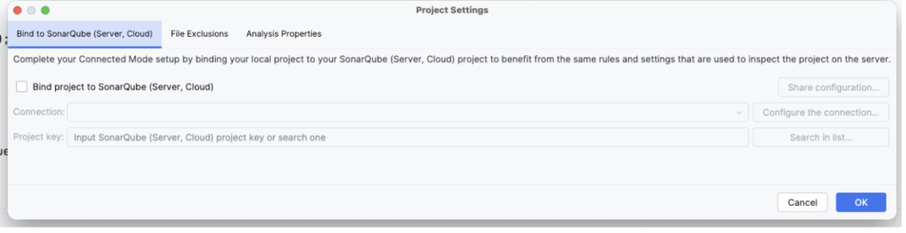

Check the "Bind project" toggle, and then click on "Configure the connection"
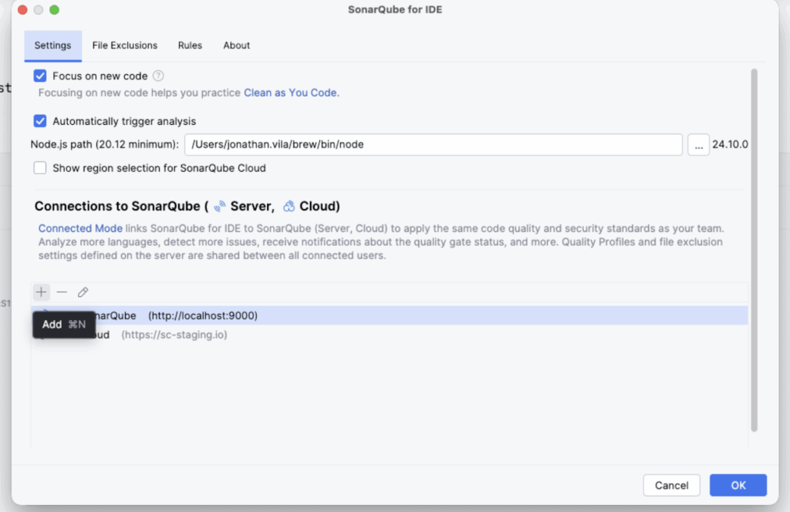

Click on the + icon to add the connection

**Step 2: Select SonarQube Cloud** Give your connection a name (e.g., "SonarQube Cloud") and select **SonarQube Cloud**.
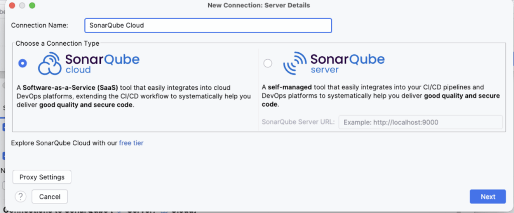

**Step 3: Authentication (The Token)** You need a token. Click the button **"Create Token"** (it opens your browser). Log in to SonarQube Cloud, it will generate the token, and automatically copy it in IntelliJ, go back to IntelliJ. Then click **Next**.
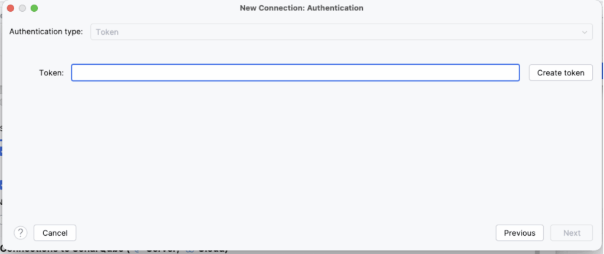

**Step 4: Select Organization** Choose your company's Organization from the list.
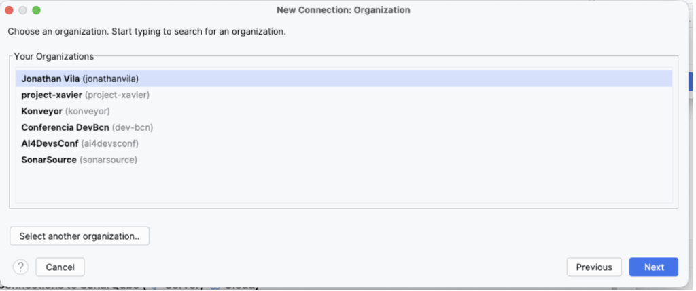

**Step 5: Bind the Project** Now that the connection is made, IntelliJ will ask which specific project on the server matches your current open folder. Search for your project key (e.g., my-company_backend-api) and click **Bind**.



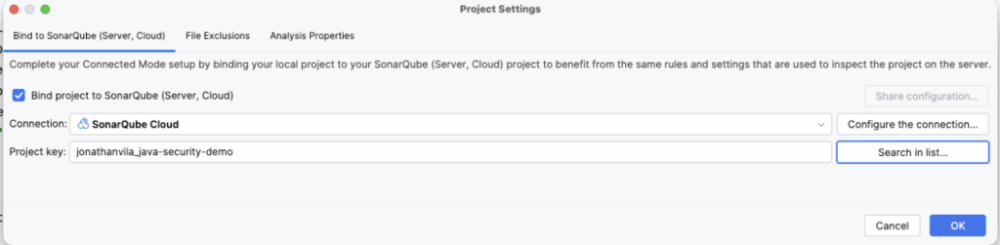

**Result:** You will see a notification: *"Project bound successfully."* Now, your IDE rules are perfectly synced with the cloud or server that you have connected with. No more surprises.

## **Problem #2: "Why did the server catch a SQL Injection my IDE missed?"**

You are running SonarQube for IDE, but the server still found a critical vulnerability. You feel betrayed. *"Why didn't you highlight this line?"*

**The Scenario:** You are writing a custom native query because JPA was too slow for a report.

```java
public List<User> searchUsers(String userName) {

    // SonarQube for IDE might miss this if it's complex, 

    // but the Server's Taint Analysis will catch it.

    String query = "SELECT * FROM users WHERE name = '" + userName + "'"; 

    return entityManager.createNativeQuery(query).getResultList();

}
```

**The Solution:** **Speed vs. Depth (Taint Analysis).**

Your IDE needs to be snappy. If the plugin paused your typing to trace how userName travelled from the Controller @RequestParam, through the Service, into this Repository, your laptop would freeze.

**Connected Mode** balances this:

1. **IDE:** Catches logic errors and local code smells instantly.
2. **SonarQube Cloud:** Performs complex issue detection, such as **Taint Analysis,** to detect that userName is an untrusted input ending up in a SQL query (Sink).

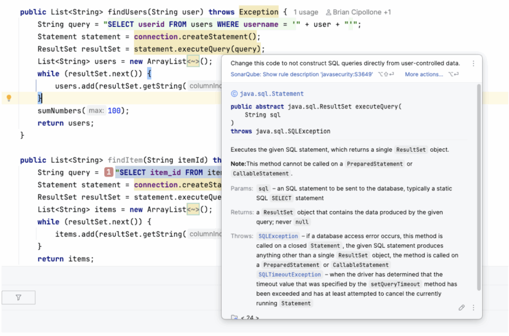

## **Problem #3: "I hate switching windows to check why the build failed"**

You pushed your code. The GitHub Actions build failed. Now you have to log in to the SonarQube dashboard, find your project, find your branch... too many clicks.

**The Solution:** **Pull Request Decoration.**

When you use SonarQube Cloud, it talks directly to your Git provider. If your Quality Gate fails, SonarQube will **post a comment** right inside your PR conversation, exactly on the line of code that failed.

It feels like a senior Java dev reviewing your code: *"Hey, this concatenation allows SQL Injection. Use parameters instead."*
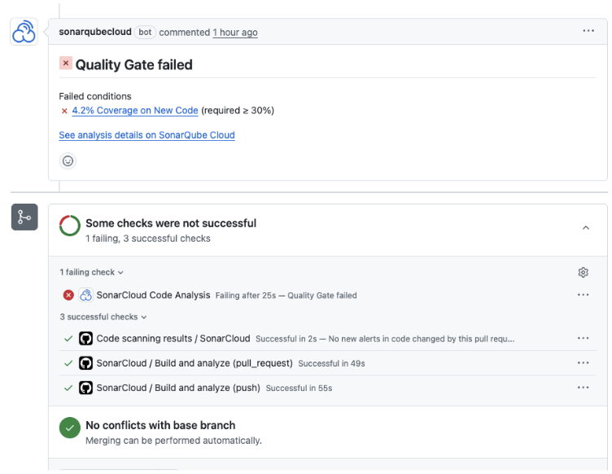

SonarQube Cloud checks on the CI/CD
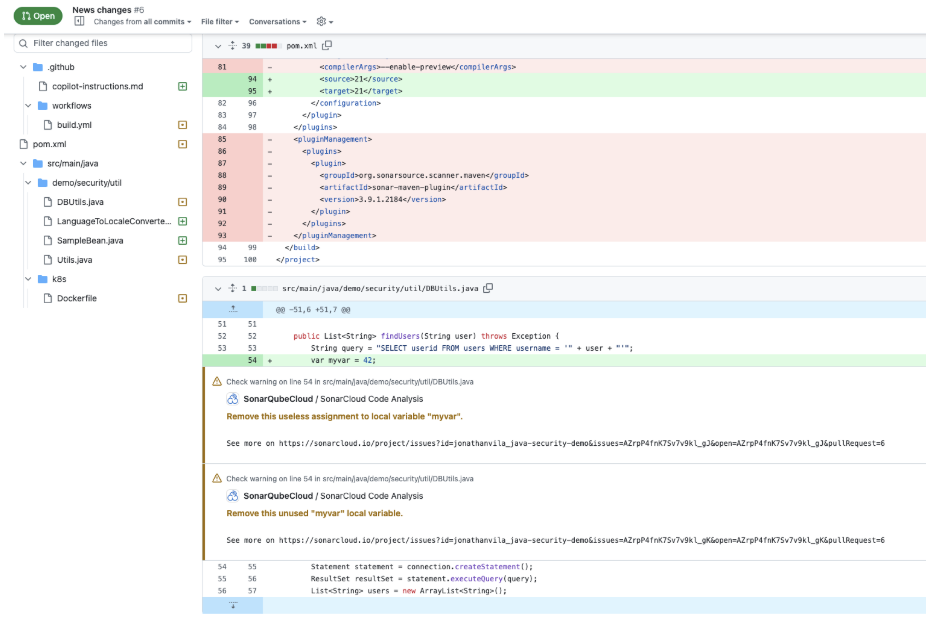

Comments from SonarQube Cloud directly appearing in the PR changes

## **Problem #4: "The Quality Gate is unreasonable! We are a startup!"**

This is a common complaint. *"I cannot merge because the server asks for 80% coverage on the whole project, but we have a huge legacy monolith with 0% tests. I can't fix 5 years of debt in one day!"*

**The Solution:** Customizing the **Quality Gate** and **New Code Definition**.

SonarQube Cloud allows you to define what "New Code" means for *your* specific situation.

1. **The "New Code" Philosophy:** Don't stress about the 10,000 bugs from 2019. Focus on addressing issues in new code that you add. Configure your Quality Gate to only check **New Code** .
   * *Condition:* "Coverage on New Code \> 80%".
   * *Result:* You can merge if *your* changes are tested, even if the rest of the app is a mess.
2. **Custom Profiles:** Your Tech Lead can clone the "Sonar way (Java)" profile and disable rules that don't fit your style (e.g., maybe you don't care about "Trailing comments" or specific naming conventions).



We can inherit the Sonar default profile, and modify it
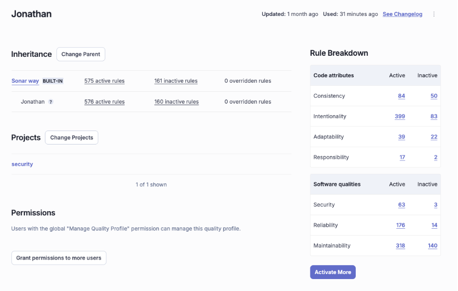

We see in our profile we have one more rule activated



By tuning the gate, the tool becomes a helper, not a blocker. We can define our thresholds that resonate better with our maturity and goals.
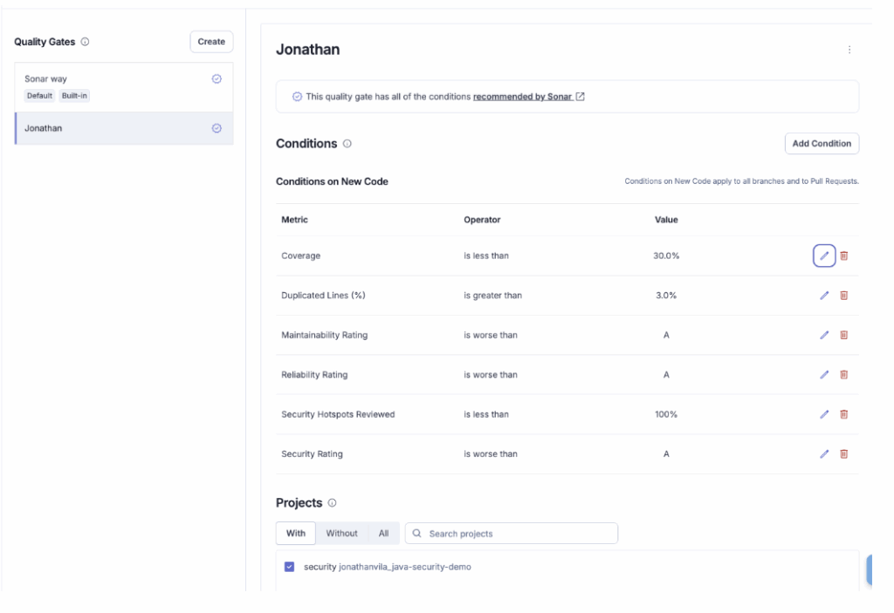

## **Problem #5: "Context is King: When a 'Bug' is actually a Feature"**

General rules are great, but sometimes they don't fit your specific reality.

Maybe SonarQube flags a **"hardcoded password"**, but you know that in this specific Test Utility class, using a dummy password is perfectly fine. Or maybe it flags a "Null Pointer Risk", but you know that the data structure was validated by a framework annotation that the static analyzer can't see.

If the **Quality Gate** is blocking the merge, you don't have to rewrite valid code just to please the tool.

**The Solution**: Issue Lifecycle Management.

You have the final say. You can override the tool's judgment in the SonarQube Cloud UI.

1. **Mark as** "Won't Fix (Accept)" or "False Positive":
   * **Won't Fix (Accept)**: "I agree this is technically a code smell, but for this specific business case, it is the correct implementation." (e.g., a specific algorithm requirement).
   * **False Positive**: "The tool is confused; this variable can technically never be null here."
   * ***Tip*** *:* You can leave a comment explaining your reasoning so the next developer understands why this exception exists.
2. **Assigning the Issue** : If the pipeline failed because of a bug in a file you touched, but the bug was actually part of a legacy method written by your colleague Bob, you can Assign it to him. It's not about blaming; it's about making sure the right person handles the debt. You can optionally also [integrate](https://docs.sonarsource.com/sonarqube-cloud/managing-your-projects/administering-your-projects/jira-integration) with SonarQube Cloud with your Jira workflow.



## **Problem #6: "I'm lost in the details: How is the project actually doing?"**

You fixed the PR issues, but your manager asks: *"Is the application getting better or worse?"* You need the helicopter view.

**The Solution:** The SonarQube Cloud Dashboard (The Command Center).

This is where you see the health of your project at a glance. The most important thing here is understanding the Two Tabs:

1. **"New Code" Tab (Your Daily Focus)** : This is the default view. It shows the health of the code you changed in the current period (e.g., the last sprint or the last release).
   * ***Goal*** *:* Keep this Green. If this is Green, you are stopping the leak.
2. **"Overall Code" Tab (The Legacy Debt):** This shows the entire project history. It contains all the bugs from 5 years ago.
   * ***Goal*** *:* Clean this up gradually. Don't let the big red numbers here scare you; focus on the "New Code" tab first.

The dashboard gives you the famous Ratings (A, B, C, D, E) for:

* Reliability (Bugs)
* Security (Vulnerabilities)
* Maintainability (Code Smells)

It's the report card for your code.
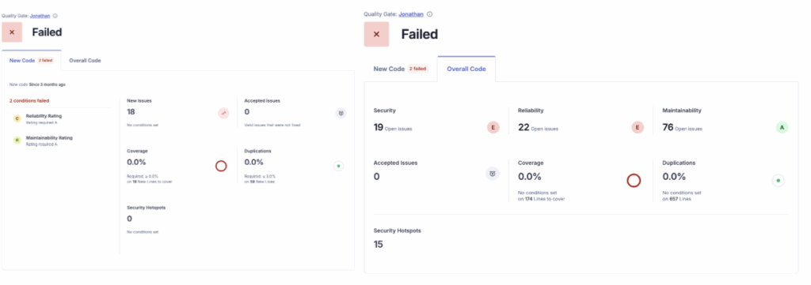

## **🛠️ How to Feed the Monster (Maven \& CI/CD)**

So, how do we actually send the analysis reports to SonarQube Cloud? You don't need complex scripts.

### **1. The Maven Configuration (** **pom.xml** **)**

You don't strictly *need* to edit the pom.xml if you pass everything in the command line, but it's cleaner to define your project properties here.

Add this to your \<properties\> section:

```xml
<properties>

    <sonar.organization>my-company-org</sonar.organization>

    <sonar.host.url>https://sonarcloud.io</sonar.host.url>

    <sonar.projectKey>my-company_my-java-app</sonar.projectKey>

</properties>
```

Now, you can run the analysis manually from your terminal (great for debugging):

```bash
# You need your SONAR_TOKEN (generate it in My Account -> Security)

mvn verify sonar:sonar -Dsonar.token=your_generated_token_here
```

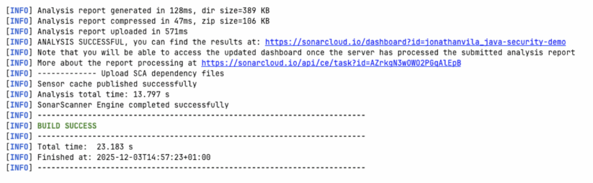

### **2. The GitHub Actions Pipeline**

We don't want to run commands manually. We want this to happen automatically on every push.

Here is a standard **GitHub Actions** workflow (.github/workflows/build.yml) that builds your Java project and analyzes it.

**Prerequisite:** Go to GitHub Repository Settings -\> Secrets, and add SONAR_TOKEN.

```yaml
name: Build and Analyze

on:

  push:

    branches:

      - main

  pull_request:

    types: [opened, synchronize, reopened]

jobs:

  build:

    name: Build and Analyze

    runs-on: ubuntu-latest

    steps:

      - uses: actions/checkout@v3

        with:

          fetch-depth: 0  # Important! Disables shallow clone for better analysis

      - name: Set up JDK 17

        uses: actions/setup-java@v3

        with:

          java-version: 17

          distribution: 'temurin'

          cache: 'maven'

      - name: Cache SonarQube Cloud packages

        uses: actions/cache@v3

        with:

          path: ~/.sonar/cache

          key: ${{ runner.os }}-sonar

          restore-keys: ${{ runner.os }}-sonar

      - name: Build and Analyze

        env:

          GITHUB_TOKEN: ${{ secrets.GITHUB_TOKEN }}  # Needed for PR Decoration

          SONAR_TOKEN: ${{ secrets.SONAR_TOKEN }}

        run: mvn -B verify org.sonarsource.scanner.maven:sonar-maven-plugin:sonar
```

**Why is this cool?** Because of the pull_request trigger and the GITHUB_TOKEN, SonarQube Cloud knows exactly where to post those comments on your PR.



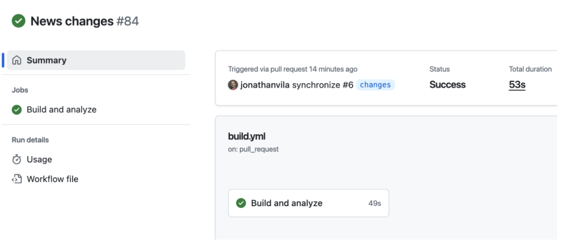

## **🎯 Summary**

In Part 2, we moved from "My Code" to "Our Code."

1. **Connected Mode** ensures your IntelliJ rules match the server rules.
2. **Taint Analysis** catches the complex security holes (SQLi) your IDE can't handle.
3. **Quality Gates** can be customized to focus on "New Code" so you aren't punished for legacy debt.
4. **Maven \& GitHub Actions** automate the process, providing feedback directly in your PR.

Now your pipeline is running, and your code is clean. But wait... you imported commons-text and spring-boot-starter-web. Are those safe? What if a hacker attacks you through a library you didn't even write? (*Remember Log4j and Log4Shell vulnerability ?*).

That is exactly what we will cover in**Part 3: SonarQube Advanced Security \& SBOMs.**

**Stay tuned! 😉**
