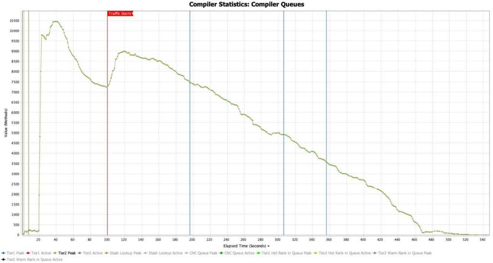
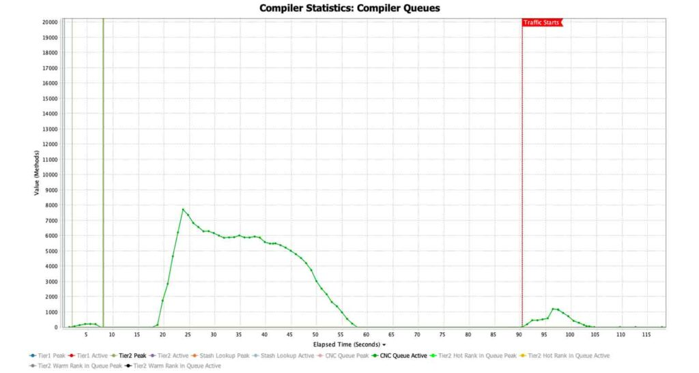
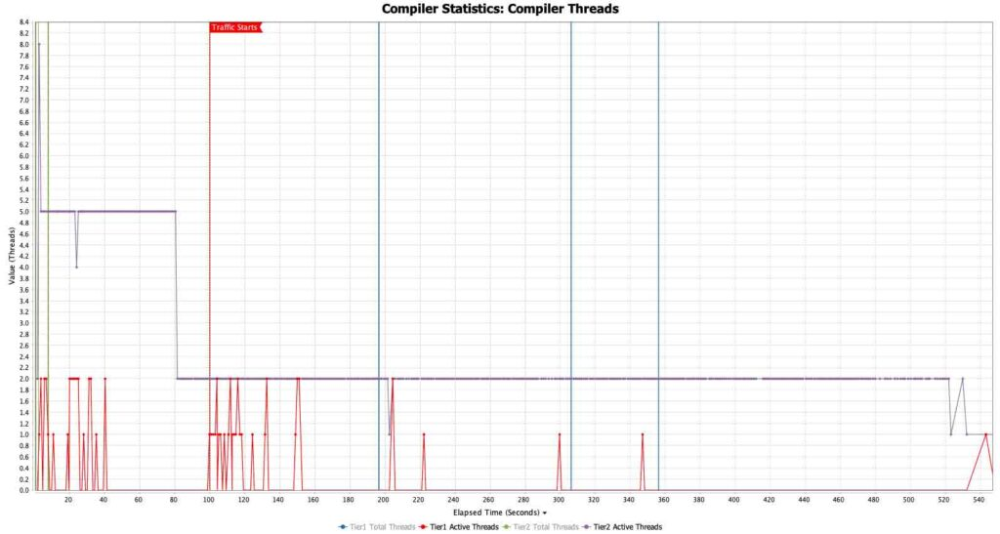
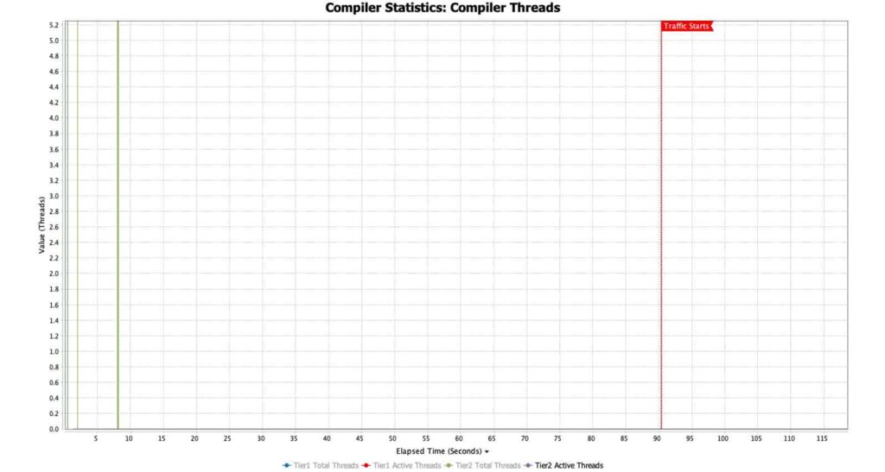
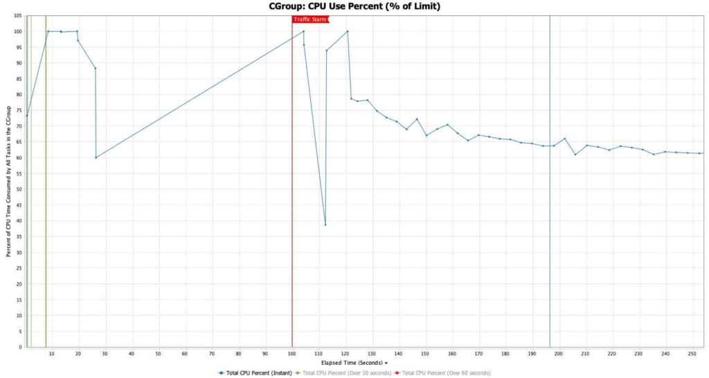
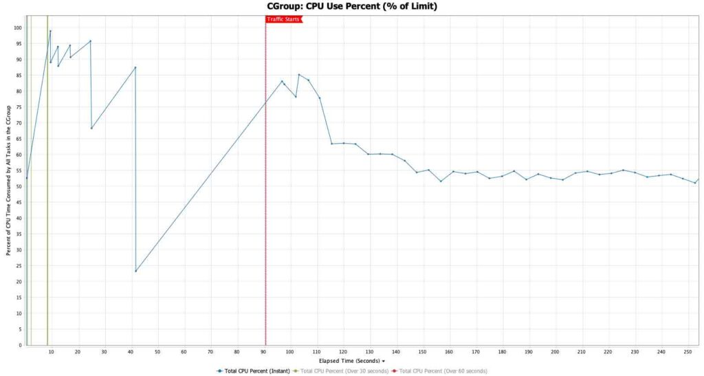

*Traditional Java executes code in slower interpreted mode, known as Java warmup, until it can build an optimized profile. This means it can only start optimizing once the application takes traffic and touches the critical code paths. Just when you are scaling out for a large bump in traffic, your machines are running at their slowest and are splitting their available CPU power between handling requests and performing expensive JIT optimizations*

You can use Azul Optimizer Hub on AWS to enhance the performance of Java applications by improving the way the JVM works. In this post you will learn how improving the JVM will help you to:

* **Reduce Java warmup time** by reusing information from previous runs to compile code before it's needed
* **Offload JIT compilation** to a separate, dedicated JIT farm to make full use of the CPU for the tasks your application is designed for
* **Make code run faster** by performing more resource-heavy JIT compilations than would be otherwise possible on limited client JVM resources

Cloud DevOps teams and engineering teams use [Azul Platform Prime](https://www.azul.com/products/prime) to reduce cloud waste and leverage committed cloud spend, all while improving carrying capacity and maintaining service levels for growing workloads. Platform Prime includes the following components:

Azul Zing Builds of OpenJDK {#h-azul-zing-builds-of-openjdk-nbsp-nbsp}
----------------------------------------------------------------------

Azul Zing Builds of OpenJDK (Zing) is a modern, TCK-compliant Java runtime based on OpenJDK. You don't need to recompile your code to run your Java workloads with Zing. Zing delivers:

* Lower latency outliers thanks to the [C4 pauseless garbage collector](https://www.azul.com/products/components/pgc/)
* Higher throughput and lower median latency thanks to the [Falcon JIT compiler](https://www.azul.com/products/components/falcon-jit-compiler/)
* Lower Java warmup time and fewer de-optimizations thanks to the [ReadyNow warmup optimizer](https://www.azul.com/products/components/readynow/) and [Cloud Native Compiler](https://www.azul.com/products/intelligence-cloud/cloud-native-compiler/)

Azul Optimizer Hub {#h-azul-optimizer-hub-nbsp-nbsp}
----------------------------------------------------

[Azul Optimizer Hub](https://www.azul.com/products/components/azul-optimizer-hub/) is a scalable set of services that you deploy on Kubernetes in your Virtual Private Cloud (VPC). Using Optimizer Hub, Java applications can reach full speed more quickly and with minimal client-side CPU load. Optimizer Hub provides two services that solve the traditional Java warmup problem:

* **ReadyNow Orchestrator:** Monitors usage patterns across your entire fleet to build optimization profiles that drive compilations on the JVM. Newly started JVMs skip the profiling stage and compile methods as soon as they're initialized, enabling much of your JIT compilation to happen during application initialization before taking traffic.
* **Cloud Native Compiler:** Provides server-side optimization by offloading JIT compilation to a separate, dedicated JIT farm. Cloud Native Compiler caches optimizations to avoid repeating the same optimization hundreds of times, allowing clients to devote 100% of their CPU to handling requests without reserving capacity for initial JIT compilation spikes.

Amazon Services to run Optimizer Hub {#h-amazon-services-to-run-optimizer-hub-nbsp-nbsp}
----------------------------------------------------------------------------------------

A full Java system on AWS that uses Optimizer Hub may consist of the following environments.

In the above diagram, you replace the Java Virtual Machine (Oracle, OpenJDK, Corretto) on the instances running on EC2, EKS, or Fargate with Zing. Zing communicates with the Optimizer Hub instances closest to them. Each Optimizer Hub instance is a shared service that can serve thousands of Java apps.

### Your applications and other Java systems {#h-your-applications-and-other-java-systems-nbsp-nbsp}

In addition to the applications that you code for yourself, third-party applications like Apache Kafka can benefit from Zing and Optimizer Hub. All these can be deployed on AWS using one of the available options like EC2-instances, Elastic Container Service (ECS), Elastic Kubernetes Service (EKS), etc.

Many of those applications can run on Graviton-based systems which are more cost-effective compared to Intel-based systems.

### Optimizer Hub on EKS {#h-optimizer-hub-on-eks-nbsp-nbsp-nbsp}

Optimizer Hub runs on any x86 Kubernetes-compliant system, so AWS EKS is a perfect environment to deploy it, taking these system requirements into account:

* **Instance Types:** On-demand or reserved EC2 instances (no spot instances)
* **Sizing:** Minimum 8 vCores and 32GB RAM per node
* **Recommended Instances:** m6 or m7 instance families

You can either use an existing Kubernetes cluster or create a new one with the AWS \`eksctl\` tool and the provided configuration files which are documented on [Cluster Provisioning on EKS](https://docs.azul.com/optimizer-hub/installation/aws-eks#custer-provisioning):

<pre class="EnlighterJSRAW" data-enlighter-language="generic" data-enlighter-theme="" data-enlighter-highlight="" data-enlighter-linenumbers="" data-enlighter-lineoffset="" data-enlighter-title="" data-enlighter-group="">eksctl create cluster -f opthub_eks.yaml&nbsp;</pre>

Azul provides a detailed step-by-step instruction to install all of the Optimizer Hub components on this EKS cluster in [Installing Optimizer Hub](https://docs.azul.com/optimizer-hub/installation/kubernetes#installing-optimizer-hub). Next to modifying some configuration files, only a few commands need to be executed:

<pre class="EnlighterJSRAW" data-enlighter-language="generic" data-enlighter-theme="" data-enlighter-highlight="" data-enlighter-linenumbers="" data-enlighter-lineoffset="" data-enlighter-title="" data-enlighter-group="">helm repo add opthub-helm https://azulsystems.github.io/opthub-helm-charts/&nbsp;&nbsp;
helm repo update&nbsp;&nbsp;
kubectl create namespace my-opthub&nbsp;&nbsp;
helm install opthub opthub-helm/azul-opthub \&nbsp;&nbsp;
&nbsp; -n my-opthub \&nbsp;&nbsp;
&nbsp; -f values-override.yaml&nbsp;&nbsp;</pre>

Connecting your applications to Optimizer Hub {#h-connecting-your-applications-to-optimizer-hub-nbsp-nbsp}
----------------------------------------------------------------------------------------------------------

Once an Optimizer Hub instance is available within your environment, you can instruct any Java application to connect to it to store or get ReadyNow profiles, and offload its compilations:

<pre class="EnlighterJSRAW" data-enlighter-language="generic" data-enlighter-theme="" data-enlighter-highlight="" data-enlighter-linenumbers="" data-enlighter-lineoffset="" data-enlighter-title="" data-enlighter-group="">java -XX:OptHubHost=&lt;host&gt;[:&lt;port&gt;] &lt;other-options&gt; -jar yourapp.jar&nbsp;&nbsp;</pre>

Java warmup improvement results {#h-java-warmup-improvement-results}
--------------------------------------------------------------------

Based on the extended garbage collector logs provided by Zing, we can dive into the behavior of an example application running without and with Cloud Native Compiler. The charts below are screenshots taken from [GC Log Analyzer](https://docs.azul.com/gc-log-analyzer/), a tool by Azul to visualize the data from garbage collector log files and ReadyNow profiles. The GC log files produced by Zing contain, next to info about the garbage collector, a lot more information about compilations and other behaviors of the runtime.

The application is an e-commerce application running in an 8 vCore container on Kubernetes. The readiness check is configured to begin 90 seconds into the run, giving it time to initialize the application and warm up as much of the important Java code as possible before traffic starts. Our goal is to:

* Decrease the readiness wait period by finishing JIT optimizations earlier
* Reduce the number of vCores the client needs to serve traffic within SLAs

Compiler queues {#h-compiler-queues-nbsp-nbsp}
----------------------------------------------

The compiler queue charts show how much work the JVM must handle to compile the Java bytecode to the best possible native code for the system it's running on, based on how the code is used.

In the first chart it takes about 20 seconds to load the runtime, then it starts compiling the application code. The immediate spike in compilations before traffic starts is one of the benefits of ReadyNow. Normally, OpenJDK would only start compiling once traffic starts. ReadyNow, on the other hand, can front-load many compilations to the beginning of the run, before traffic starts. There is always a smaller set of compilations that cannot be initialized until traffic starts, because they depend on the state that only exists once traffic starts. So, you see another bump in the compilation queue at 100s when traffic starts. Overall, it takes about 8 minutes to reach a stable point where all the bytecode has been recompiled.

The second chart shows the same app running with Optimizer Hub. The initial pre-traffic compilation queue is cleared completely in about 35 seconds. When traffic starts, these critical methods are not placed at the end of a long queue. Instead they are cleared immediately, allowing the application to reach full speed almost immediately. This is due to two factors:

* Optimizer Hub can devote many more threads to JIT compilation than are available on the local machine
* Optimizer Hub can serve up results from its cache rather than recompiling every method

The results mean we can change the readiness check to allow traffic 30 seconds earlier, at the 60-second mark.

<figure class="wp-block-gallery has-nested-images columns-default is-cropped wp-block-gallery-1 is-layout-flex wp-block-gallery-is-layout-flex">
 <figure class="wp-block-image size-large">
  
 </figure>
 <figure class="wp-block-image size-large">
  
 </figure>
</figure>

Compiler threads {#h-compiler-threads-nbsp-nbsp}
------------------------------------------------

When running with local JIT compilation, the application was configured to give the maximum number of threads to the JIT compiler during the warmup period to finish as many compilations as possible before traffic starts. Once traffic starts, the allowed number of JIT threads is reduced to two, to ensure that the majority of the CPU is handling traffic.

In the first chart, the allowed JIT threads are maxed out all the way until the compilation queue is cleared.

In the second graph with Optimizer Hub and Cloud Native Compiler, there is no client-side tier 2 JIT compilation happening at all.

<figure class="wp-block-gallery has-nested-images columns-default is-cropped wp-block-gallery-2 is-layout-flex wp-block-gallery-is-layout-flex">
 <figure class="wp-block-image size-large">
  
 </figure>
 <figure class="wp-block-image size-large">
  
 </figure>
</figure>

CPU use percentage {#h-cpu-use-percentage-nbsp-nbsp}
----------------------------------------------------

With the CPU Use percent chart, we get insights into how the available vCPUs are used. The important change here is that in our Optimizer Hub run, the team reduced the vCore requests from 8 to 5. So, in the CPU percentage charts here, the Optimizer Hub run is already running at 37.5% less CPU.

The first chart shows consistent high CPU -- over 50% of the 8 vCores allotted -- lasting all the way until the compilation queue is cleared. The CPU utilization then settles at around 30%, meaning 70% of the capacity is wasted once JIT compilation finishes.

The second chart shows what happens when the compilation activity is removed from the client. There are still short bumps in CPU utilization in periods when the JVM has no optimized code at all, but the CPU then settles immediately at around 55% of the 5 vCores allotted. The machine is able to handle all of the requests, staying within its response time SLAs and within its CPU utilization autoscaling limits, with 3 fewer vCores.

<figure class="wp-block-gallery has-nested-images columns-default is-cropped wp-block-gallery-3 is-layout-flex wp-block-gallery-is-layout-flex">
 <figure class="wp-block-image size-large">
  
 </figure>
 <figure class="wp-block-image size-large">
  
 </figure>
</figure>

Case study: real-world impact {#h-case-study-real-world-impact-nbsp-nbsp}
-------------------------------------------------------------------------

A major online retailer struggled with balancing cloud costs and customer satisfaction due to aggressive scaling requirements (up to 20x steady-state size during peak events). Their challenge: JVM warmup delays caused transaction processing slowdowns and missed requests whenever new nodes joined the rotation.

Results after implementing Optimizer Hub:

* New JVMs entered the rotation already warmed up through shared compilations
* JIT compilation was consolidated to dedicated, optimized machines
* Business nodes were right-sized for steady-state workloads
* Significant reduction in error rates and cart abandonment
* Deemed "the single most impactful change the teams had made all year"

The solution has since expanded to their supply chain, vendor management, and warehousing systems with similar cost reductions.

Impact on errors {#h-impact-on-errors-nbsp-nbsp}
------------------------------------------------

The following chart shows the impact the solution had on their indicators of customer satisfaction (reduction in error/abandonment rate) for their most critical business application. As you can see the number of these errors is heavily reduced.

Conclusion {#h-conclusion-nbsp-nbsp}
------------------------------------

Java applications running on AWS face a fundamental challenge: they perform at their worst precisely when you need them most, during scaling events and traffic spikes. Traditional JVM warmup creates a perfect storm where new instances consume CPU cycles for compilation while simultaneously trying to handle incoming requests. This leads to degraded performance, increased error rates, and potentially poor user experiences.

Azul Optimizer Hub solves this challenge by separating the compilation from execution. Through ReadyNow Orchestrator's shared optimization profiles and Cloud Native Compiler's dedicated JIT farm, your Java applications can be "ready for production" from the moment they need to start serving traffic.

*** ** * ** ***

*[Originally published on the Azul Blog](https://www.azul.com/blog/make-java-fleets-warm-up-faster-on-aws/)*
