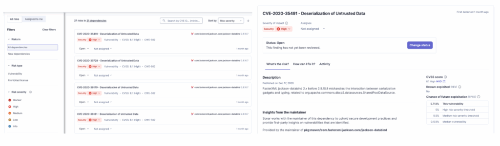
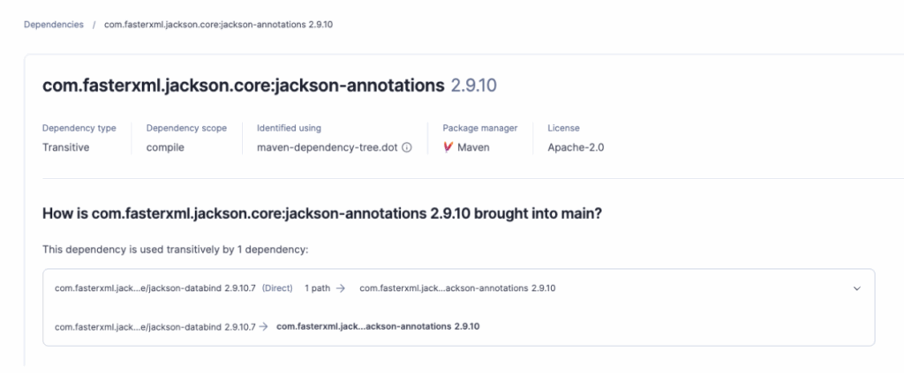
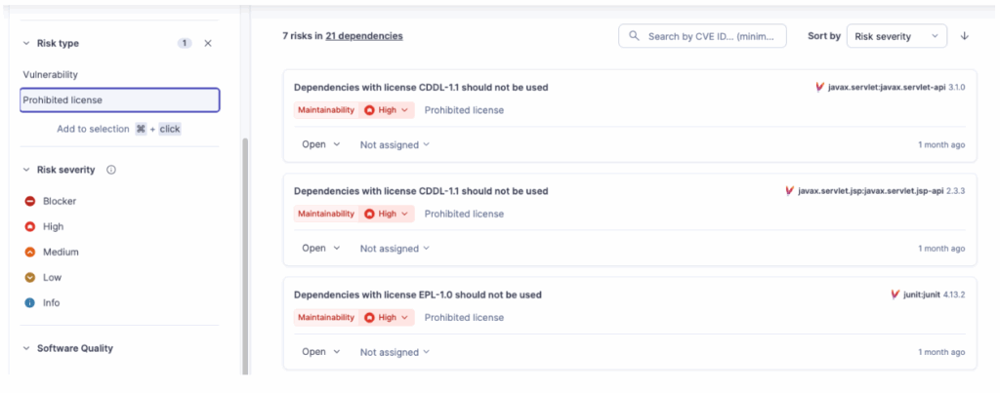
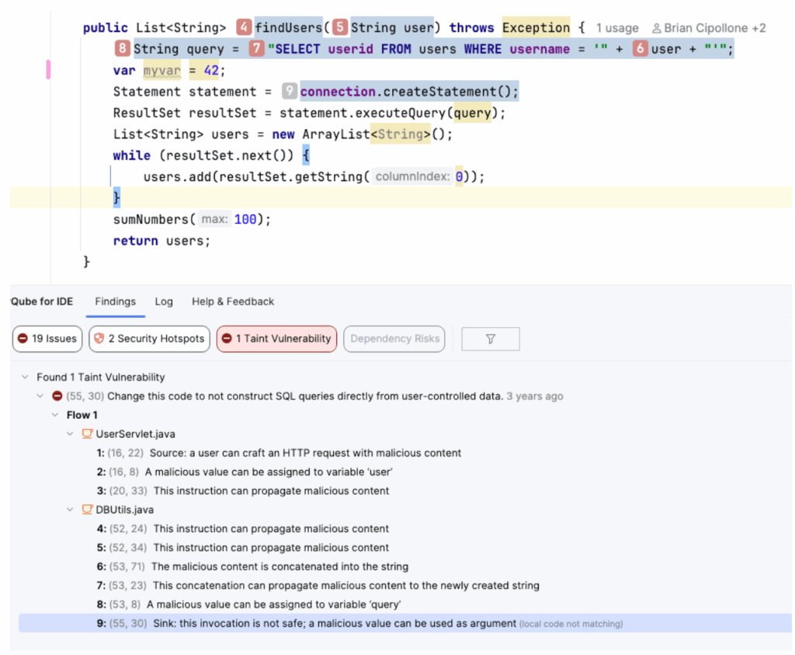
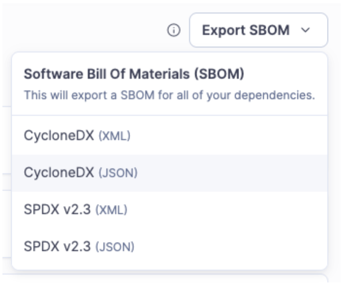

Hola Java developers! 👋

Welcome to **Part 3**.

* In [**Part 1**](https://foojay.io/today/developers-guide-to-sonarqube-part-1/), we turned your IntelliJ into a security guard.
* In [**Part 2**](https://foojay.io/today/developers-guide-to-sonarqube-part-2/), we connected it to the server to enforce the Quality Gate.

We are feeling good. Our code is high quality. Our logic is sound. But here is the scary reality: In a modern Spring Boot application, **you only wrote about 10% of the code.**

The other 90%? It comes from Maven Central. It's Hibernate, Jackson, Apache Commons, Spring Security... You are building a house, and you made sure *your* bricks are solid. But did you check if the foundation you bought from a stranger is made of explosive material? 🧨

Remember **Log4j** ? You didn't write that bug, but *you* had to fix it on a Saturday night.

This is **Part 3** . Today, we look at [**SonarQube Advanced Security**](https://docs.sonarsource.com/sonarqube-cloud/advanced-security) and how to stop the "Trojan Horses" in your dependencies.


**Problem #1: "I didn't write this bug, why is it my problem?"** {#h2-0-problem-1-i-didn-t-write-this-bug-why-is-it-my-problem}
-------------------------------------------------------------------------------------------------------------------------------

You add spring-boot-starter-web to your pom.xml. It works great. You deploy. Two months before, a hacker found a vulnerability in the underlying Tomcat server. You have no idea because you don't read CVE reports for breakfast.

**The Solution:** **Software Composition Analysis (SCA).**

SonarQube Advanced Security doesn't just look at your .java files. It looks at your pom.xml (or build.gradle). It compares every library you use against a massive database of known vulnerabilities (CVEs).

If you are using version 2.4.0 of a library, and version 2.4.1 fixes a critical security hole, SonarQube Advanced Security will flag it as a **Security Vulnerability** (CVE) in your report.

* **You don't need to search for it.**
* **You don't need to subscribe to newsletters.**
* As part of code analysis, it just tells you: *"Upgrade this jar to version X to be safe."*




**Problem #2: "The Dependency Hell" (Transitive Dependencies) 🔥** {#h2-1-problem-2-the-dependency-hell-transitive-dependencies}
--------------------------------------------------------------------------------------------------------------------------------

You check your pom.xml. "I am clean! I don't use log4j! I only use my-reporting-tool!" But SonarQube says you are vulnerable. Why?

**The Solution:** **The Dependency Tree.**

This is the classic Java nightmare. You import **Library A** , which imports **Library B** , which imports the vulnerable **Library C**.

You never invited **Library C**, but it's living in your house. If you run mvn dependency:tree, you might see a horror story like this:

```
[INFO] --- maven-dependency-plugin:3.3.0:tree (default-cli) @ my-payment-app ---

[INFO] com.company:my-payment-app:jar:1.0.0

[INFO] +- com.thirdparty:legacy-reporting-tool:jar:4.2.0:compile

[INFO] |  \- com.legacy:xml-exporter:jar:1.5.0:compile

[INFO] |     \- org.apache.logging.log4j:log4j-core:jar:2.14.1:compile  <-- 🚨 VULNERABLE!
```


SonarQube Advanced Security visualizes this chain instantly. It shows you exactly *how* the vulnerability got in, so you know you need to upgrade legacy-reporting-tool to fix the root cause.



**Problem #3: "Wait, I can't use this library? It's open source!" ⚖️** {#h2-2-problem-3-wait-i-can-t-use-this-library-it-s-open-source}
---------------------------------------------------------------------------------------------------------------------------------------

You found the perfect library to resize images. You import it. It works. Six months later, the Legal Department calls you screaming. *"You used a library with a* ***GPL-3.0*** *license! Now we have to open-source our entire proprietary banking application!"*

**The Solution:** **License Policy Management.**

Not all open source is free to use however you want. Some licenses (like MIT or Apache) are permissive. Others (like GPL or AGPL) are "viral"---they can force you to share your source code.

SonarQube Advanced Security scans your dependencies and allows you to define license policies to detect **License Risks**.

* It highlights libraries with risky licenses (Copyleft).
* It allows you to approve or ban specific licenses for your organization.

It saves you from a massive lawsuit (or a complete rewrite) later.



**Problem #4: "The Sneaky Attack" (Advanced SAST \& Taint Analysis) 🕵️‍♂️** {#h2-3-problem-4-the-sneaky-attack-advanced-sast-taint-analysis}
---------------------------------------------------------------------------------------------------------------------------------------------

Standard dependency checkers are dumb. They just say: *"You have Library X version 1.0. It has a CVE."* But what if the vulnerability isn't a known CVE? What if the danger comes from **how you use the library**?

**The Solution:** **Advanced SAST with Taint Analysis.**

First, what is **Taint Analysis**? Imagine "User Input" is a bucket of red paint (Taint). If you pour that paint into a variable, the variable turns red. If you pass that variable to a method, the method turns red. If that red paint eventually reaches a database query or a log file (The Sink) without being cleaned, you have a vulnerability (SQL Injection, Log Injection).

**The SonarQube Magic:** SonarQube advanced SAST applies this logic to **Dependencies** . It analyzes the source code of the commonly used open source libraries you use. It traces the flow **from your code -\> into the library -\> into the danger zone**.

**Here is the "Invisible" Vulnerability:** You might write a simple Controller that looks 100% safe to you, but advanced SAST included in SonarQube Advanced Security sees what happens inside the library:

Java

```java
// --- YOUR CODE (The Source) ---

@GetMapping("/cleanup")

public void cleanTempFiles(@RequestParam("file") String fileName) {

    // 1. You receive "Red Paint" (Tainted Input)

    // 2. You pass it to a library. You think: "It's just a utility."

    FileUtils.deleteSystemFile(fileName); 

}

// --- THE LIBRARY CODE (The Sink) ---

// You can't see this source code, but SonarQube analyzes the bytecode!

public class FileUtils {

    public static void deleteSystemFile(String path) {

        // 3. The library takes your input and executes a command

        // VULNERABILITY: If I send "; rm -rf /", this executes it.

        Runtime.getRuntime().exec("rm -f " + path); // <--- Taint reaches here! 🔴

    }

}
```


Standard tools ignore this because they don't look *inside* the library's logic. SonarQube flags this immediately as **Command Injection**.



**Problem #5: "The Government is knocking at the door (SBOMs \& Regulations)" 📜** {#h2-4-problem-5-the-government-is-knocking-at-the-door-sboms-regulations}
-------------------------------------------------------------------------------------------------------------------------------------------------------------

It is not just your manager asking for reports anymore. The world has changed. New strict regulations, like the **Executive Order 14028** in the USA and the **Cyber Resilience Act (CRA)** in Europe, are changing the game.

They require software vendors to provide transparency. They want an **SBOM (Software Bill of Materials)** . Think of it as the "Ingredients List" on a cereal box, but for your software. If you sell software today, or work with the government, you *must* prove you aren't selling vulnerable code.

**The Solution:** **Automated SBOM Generation in Advanced Security.**

You don't want to write this list by hand in Excel. SonarQube creates this for you automatically during the build analysis. It generates a standard **CycloneDX** report (JSON or XML) that lists every single component in your application.

```json
{

  "bomFormat" : "CycloneDX",

  "specVersion" : "1.6",

  "version" : 1,

  "metadata" : {

    "timestamp" : "2025-12-12T10:50:06Z",

    "component" : {

      "type" : "application",

      "bom-ref" : "security",

      "name" : "security",

      "version" : "main"

    },

    "supplier" : {

      "name" : "SonarSource SA",

      "url" : [ "https://sonarsource.com" ]

    }

  },

  "components" : [ {

    "type" : "library",

    "bom-ref" : "pkg:maven/com.fasterxml.jackson.core/<a href="/cdn-cgi/l/email-protection" class="__cf_email__" data-cfemail="315b50525a425e5f1c505f5f5e455045585e5f4271031f081f0001">[email protected]</a>",

    "supplier" : {

      "url" : [ "https://repo1.maven.org/maven2/com/fasterxml/jackson/core/jackson-annotations/2.9.10/jackson-annotations-2.9.10.jar" ]

    },

    "name" : "com.fasterxml.jackson.core:jackson-annotations",

    "version" : "2.9.10",

    "scope" : "required",

    "licenses" : [ {

      "expression" : "Apache-2.0"

    } ],

    "purl" : "pkg:maven/com.fasterxml.jackson.core/<a href="/cdn-cgi/l/email-protection" class="__cf_email__" data-cfemail="2842494b435b474605494646475c495c4147465b681a0611061918">[email protected]</a>"

  }, {

    "type" : "library",

    "bom-ref" : "pkg:maven/com.fasterxml.jackson.core/<a href="/cdn-cgi/l/email-protection" class="__cf_email__" data-cfemail="2c464d4f475f4342014f435e496c1e0215021d1c">[email protected]</a>",

    "supplier" : {

      "url" : [ "https://repo1.maven.org/maven2/com/fasterxml/jackson/core/jackson-core/2.9.10/jackson-core-2.9.10.jar" ]

    },

    "name" : "com.fasterxml.jackson.core:jackson-core",

    "version" : "2.9.10",

    "scope" : "required",

    "licenses" : [ {

      "expression" : "Apache-2.0"

    } ],

    "purl" : "pkg:maven/com.fasterxml.jackson.core/<a href="/cdn-cgi/l/email-protection" class="__cf_email__" data-cfemail="1d777c7e766e7273307e726f785d2f3324332c2d">[email protected]</a>"

  }

....
```


You just click "Download," hand it to the auditor (or the automated compliance system), and go back to coding.

<figure class="wp-block-image size-full is-resized">
 
</figure>


**🎯 Summary** {#h2-5-summary}
------------------------------

In **Part 3** , we learned that security is not just about *writing* code, it's about *managing* the ecosystem.

1. **SCA** finds the known bombs (CVEs) in your pom.xml.
2. **License Management** keeps the Legal team happy and protects your IP.
3. **Advanced SAST (Taint Analysis)** finds the hidden attacks inside the libraries themselves.
4. **SBOMs** simplify compliance with US and EU regulations.

Now we have a fully secure development lifecycle.

* **IDE:** High Quality Code \& Secrets.
* **PR:** Quality Gate \& Taint Analysis.
* **Build:** Supply Chain Security.

We are finding bugs in our code, and we are finding vulnerabilities in our libraries.

But... finding bugs is only half the battle. You still have to fix them. And let's be honest, fixing complex issues or refactoring old code takes time we don't have.

What if the tool could fix the code for you? What if your AI assistant actually knew your company's rules?

That is the finale. Part 4: The AI Revolution -- AI CodeFix, MCP, and Remediation Agents.

Stay tuned! 😉
