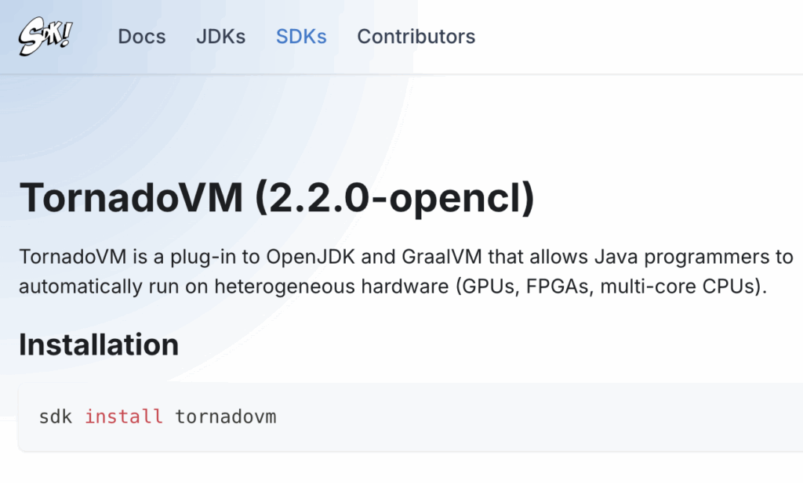

Starting with **TornadoVM 2.0** , installing and using TornadoVM is easier than ever. The project now provides prebuilt SDKs for multiple operating systems, architectures, and accelerator backends, and is also available via **Maven Central** for seamless integration with existing Java codebases.{#viewer-bsvyh182}

This guide walks you through:{#viewer-aq221189}

* Installing the TornadoVM SDK
* Verifying your setup
* Integrating TornadoVM into Java projects using Maven

*** ** * ** ***

Prerequisites {#viewer-f868f305-69f0-46b4-bbc6-baaa3d02051b}
------------------------------------------------------------

Before installing TornadoVM, ensure that your system has the following:{#viewer-k00hu10420}

- **Java Development Kit (JDK) 21**{#viewer-x90cz2860}

- **JAVA_HOME** correctly set to your JDK 21 installation{#viewer-v7w992863}

<pre class="EnlighterJSRAW" data-enlighter-language="bash" data-enlighter-theme="" data-enlighter-highlight="" data-enlighter-linenumbers="" data-enlighter-lineoffset="" data-enlighter-title="" data-enlighter-group="">sdk install java 21.0.2-open</pre>

SDKMAN! will automatically set **JAVA_HOME** and make the JDK available to TornadoVM.

*** ** * ** ***

Downloading and Installing the TornadoVM SDK {#viewer-71800d5d-9ec2-4119-b8cc-36e88d6c117f}
-------------------------------------------------------------------------------------------

TornadoVM SDKs come as ZIP archives tailored for different operating systems, CPU architectures, and accelerator backends. Choose the SDK that matches your setup from the official [++TornadoVM webpage++](https://www.tornadovm.org/downloads) or the [SDKMAN! TornadoVM page](https://sdkman.io/sdks/tornadovm/).{#viewer-dae9277e-ba59-42c1-b958-a40a2e031a81}  

<figure class="aligncenter size-large is-resized">
 
</figure>

You can choose a backend-specific build:{#ib4ew13010}

|--------------|------------------------|
| Backend      | SDKMAN! Latest Version |
| OpenCL       | 2.2.0-opencl (default) |
| PTX          | 2.2.0-ptx              |
| SPIR-V       | 2.2.0-spirv            |
| All Backends | 2.2.0-full             |

### Installation Steps by Operating System {#m9n2a452}

#### Linux / macOS {#viewer-a24da4d5-8325-4e5e-81f0-e6289232fe0c}

Open a terminal and run:{#viewer-942675ef-8b3d-44f9-ba30-0b5847ce2896}

<pre class="EnlighterJSRAW" data-enlighter-language="bash" data-enlighter-theme="" data-enlighter-highlight="" data-enlighter-linenumbers="" data-enlighter-lineoffset="" data-enlighter-title="" data-enlighter-group="">sdk install tornadovm 2.2.0-opencl</pre>

```bash

sdk install tornadovm 2.2.0-opencl
```

After installation, SDKMAN! automatically sets the **TORNADOVM_HOME** environment variable.

#### Windows (10+)

Using Command Prompt or PowerShell:

<pre class="EnlighterJSRAW" data-enlighter-language="powershell" data-enlighter-theme="" data-enlighter-highlight="" data-enlighter-linenumbers="" data-enlighter-lineoffset="" data-enlighter-title="" data-enlighter-group="">curl -L -o tornadovm-2.2.0-opencl-windows-amd64.zip https://github.com/beehive-lab/TornadoVM/releases/download/v2.2.0/tornadovm-2.2.0-opencl-windows-amd64.zip

tar -xf tornadovm-2.2.0-opencl-windows-amd64.zip

set TORNADO_SDK=%cd%\tornadovm-2.2.0-opencl

set PATH=%TORNADO_SDK%\bin;%PATH%</pre>

*** ** * ** ***

Verify Available Devices {#h2-3-verify-available-devices}
---------------------------------------------------------

Once TornadoVM is installed, verify that your system detects the available hardware accelerators.

{#uhu5s12601}

Run the following command:{#sm644474}

<pre class="EnlighterJSRAW" data-enlighter-language="bash" data-enlighter-theme="" data-enlighter-highlight="" data-enlighter-linenumbers="" data-enlighter-lineoffset="" data-enlighter-title="" data-enlighter-group="">tornado --devices</pre>

This command lists all devices recognized by TornadoVM, including CPUs and GPUs. If your accelerator appears in the output, your system is ready.{#9q1el478}

*** ** * ** ***

Run Your First TornadoVM Program {#h2-4-run-your-first-tornadovm-program}
-------------------------------------------------------------------------

TornadoVM includes example applications that demonstrate how Java programs can be accelerated transparently.{#ibr6b482}

A simple starting point is a **Matrix-Vector multiplication** example.{#ta49l9349}

#### Linux / macOS {#w6a3l486}

<pre class="EnlighterJSRAW" data-enlighter-language="bash" data-enlighter-theme="" data-enlighter-highlight="" data-enlighter-linenumbers="" data-enlighter-lineoffset="" data-enlighter-title="" data-enlighter-group="">java @$TORNADOVM_HOME/tornado-argfile -cp $TORNADOVM_HOME/share/java/tornado/tornado-examples-2.2.0.jar uk.ac.manchester.tornado.examples.compute.MatrixVectorRowMajor</pre>

#### Windows (10+)

<pre class="EnlighterJSRAW" data-enlighter-language="powershell" data-enlighter-theme="" data-enlighter-highlight="" data-enlighter-linenumbers="" data-enlighter-lineoffset="" data-enlighter-title="" data-enlighter-group="">java @%TORNADOVM_HOME%\tornado-argfile -cp %TORNADOVM_HOME%\share\java\tornado\tornado-examples-2.2.0.jar uk.ac.manchester.tornado.examples.compute.MatrixVectorRowMajoruk.ac.manchester.tornado.examples.compute.MatrixVectorRowMajor</pre>

This program runs a Java application that TornadoVM automatically offloads to available accelerators.{#3rprp494}

*** ** * ** ***

Integrating TornadoVM into Java Projects Using Maven {#3ca69bda-e774-4774-9cb1-9c7004841816}
--------------------------------------------------------------------------------------------

Since **TornadoVM v2.0.0** , TornadoVM has been available via [Maven Central](https://central.sonatype.com/namespace/io.github.beehive-lab), which simplifies adding it to your Java projects. To integrate TornadoVM, add the following dependency to your ***pom.xml***:{#fa986f36-2454-46d2-bd91-c14f8b4dbb96}

<pre class="EnlighterJSRAW" data-enlighter-language="bash" data-enlighter-theme="" data-enlighter-highlight="" data-enlighter-linenumbers="" data-enlighter-lineoffset="" data-enlighter-title="" data-enlighter-group="">&lt;dependencies&gt;
  &lt;dependency&gt;
    &lt;groupId&gt;io.github.beehive-lab&lt;/groupId&gt;
    &lt;artifactId&gt;tornado-api&lt;/artifactId&gt;
    &lt;version&gt;2.1.0&lt;/version&gt;
  &lt;/dependency&gt;
  &lt;dependency&gt;
    &lt;groupId&gt;io.github.beehive-lab&lt;/groupId&gt;
    &lt;artifactId&gt;tornado-runtime&lt;/artifactId&gt;
    &lt;version&gt;2.1.0&lt;/version&gt;
  &lt;/dependency&gt;
&lt;/dependencies&gt;</pre>

This setup allows your project to compile and run with TornadoVM support without manual SDK management.{#e7129922-9c05-4948-959a-58ed0571ed45}

### Example: Accelerating a Simple Java Kernel {#54dd0a45-2253-4cbe-84c1-a4aca4409490}

Here is a basic example class of how to use TornadoVM to accelerate a Java method (vectorAdd):{#0491a289-1514-4666-b9fd-9da119c8abce}

<pre class="EnlighterJSRAW" data-enlighter-language="java" data-enlighter-theme="" data-enlighter-highlight="" data-enlighter-linenumbers="" data-enlighter-lineoffset="" data-enlighter-title="" data-enlighter-group="">import uk.ac.manchester.tornado.api.ImmutableTaskGraph;
import uk.ac.manchester.tornado.api.TaskGraph;
import uk.ac.manchester.tornado.api.TornadoExecutionPlan;
import uk.ac.manchester.tornado.api.annotations.Parallel;
import uk.ac.manchester.tornado.api.common.TornadoDevice;
import uk.ac.manchester.tornado.api.enums.DataTransferMode;
import uk.ac.manchester.tornado.api.runtime.TornadoRuntimeProvider;
import uk.ac.manchester.tornado.api.types.arrays.IntArray;

public class VectorAdd {

    private static void vectorAdd(IntArray a, IntArray b, IntArray c) {
        for (@Parallel int i = 0; i &lt; c.getSize(); i++) {
            c.set(i, a.get(i) + b.get(i));
        }
    }

    public static void main(String[] args) {
        int size = Integer.parseInt(args[0]);

        IntArray a = new IntArray(size);
        IntArray b = new IntArray(size);
        IntArray c = new IntArray(size);

        a.init(10);
        b.init(20);

        TornadoDevice firstDevice =
                TornadoRuntimeProvider.getTornadoRuntime()
                        .getBackend(0)
                        .getDevice(0);

        TaskGraph taskGraph = new TaskGraph("s0")
                .transferToDevice(DataTransferMode.EVERY_EXECUTION, a, b)
                .task("t0", VectorAdd::vectorAdd, a, b, c)
                .transferToHost(DataTransferMode.EVERY_EXECUTION, c);

        ImmutableTaskGraph immutableTaskGraph = taskGraph.snapshot();
        TornadoExecutionPlan executionPlan = new TornadoExecutionPlan(immutableTaskGraph);

        executionPlan.withDevice(firstDevice).execute();

        System.out.println("Computation completed on device: " + firstDevice.getDescription());

        System.out.print("c[0.." + (size - 1) + "] = ");
        for (int i = 0; i &lt; size; i++) {
            System.out.print(c.get(i));
            if (i &lt; size - 1) System.out.print(", ");
        }
        System.out.println();

        // Optional: quick check
        System.out.println("Expected each element = 30");
    }
}</pre>

This example shows how to offload a simple vector addition to the accelerator device detected by TornadoVM.{#288785fa-3464-48f8-a256-c3be764f8756}

You can compile and run this class in a new project, as follows:{#vhodb68880}

<pre class="EnlighterJSRAW" data-enlighter-language="bash" data-enlighter-theme="" data-enlighter-highlight="" data-enlighter-linenumbers="" data-enlighter-lineoffset="" data-enlighter-title="" data-enlighter-group="">mvn clean compile
tornado --threadInfo -cp target/classes VectorAdd 256</pre>

The output will be something like this:{#7hpnd75899}

<pre class="EnlighterJSRAW" data-enlighter-language="bash" data-enlighter-theme="" data-enlighter-highlight="" data-enlighter-linenumbers="" data-enlighter-lineoffset="" data-enlighter-title="" data-enlighter-group="">WARNING: Using incubator modules: jdk.incubator.vector
Task info: s0.t0
	Backend           : OPENCL
	Device            : Apple M4 Pro CL_DEVICE_TYPE_GPU (available)
	Dims              : 1
	Global work offset: [0]
	Global work size  : [256]
	Local  work size  : [64, 1, 1]
	Number of workgroups  : [4]

Computation completed on device: Apple M4 Pro CL_DEVICE_TYPE_GPU (available)
c[0..255] = 30, 30, 30, 30, 30, 30, 30, 30, 30, 30, 30, 30, 30, 30, 30, 30, 30, 30, 30, 30, 30, 30, 30, 30, 30, 30, 30, 30, 30, 30, 30, 30, 30, 30, 30, 30, 30, 30, 30, 30, 30, 30, 30, 30, 30, 30, 30, 30, 30, 30, 30, 30, 30, 30, 30, 30, 30, 30, 30, 30, 30, 30, 30, 30, 30, 30, 30, 30, 30, 30, 30, 30, 30, 30, 30, 30, 30, 30, 30, 30, 30, 30, 30, 30, 30, 30, 30, 30, 30, 30, 30, 30, 30, 30, 30, 30, 30, 30, 30, 30, 30, 30, 30, 30, 30, 30, 30, 30, 30, 30, 30, 30, 30, 30, 30, 30, 30, 30, 30, 30, 30, 30, 30, 30, 30, 30, 30, 30, 30, 30, 30, 30, 30, 30, 30, 30, 30, 30, 30, 30, 30, 30, 30, 30, 30, 30, 30, 30, 30, 30, 30, 30, 30, 30, 30, 30, 30, 30, 30, 30, 30, 30, 30, 30, 30, 30, 30, 30, 30, 30, 30, 30, 30, 30, 30, 30, 30, 30, 30, 30, 30, 30, 30, 30, 30, 30, 30, 30, 30, 30, 30, 30, 30, 30, 30, 30, 30, 30, 30, 30, 30, 30, 30, 30, 30, 30, 30, 30, 30, 30, 30, 30, 30, 30, 30, 30, 30, 30, 30, 30, 30, 30, 30, 30, 30, 30, 30, 30, 30, 30, 30, 30, 30, 30, 30, 30, 30, 30, 30, 30, 30, 30, 30, 30, 30, 30, 30, 30, 30, 30, 30, 30, 30, 30, 30, 30
Expected each element = 30</pre>

*** ** * ** ***

What's Next? {#d8l4z496}
------------------------

After running your first program, you can:{#oicl4498}

* Explore more TornadoVM [++examples++](https://github.com/beehive-lab/TornadoVM/tree/master/tornado-examples/src/main/java/uk/ac/manchester/tornado/examples)
* [++Integrate++](https://www.tornadovm.org/technology) TornadoVM into your own Java projects
* [++Learn++](https://tornadovm.readthedocs.io/en/latest/programming.html#expressing-parallelism-within-java-methods) the Loop Parallel API and Kernel API

{#nztn010736}

Full documentation is available here:[++https://tornadovm.readthedocs.io/en/latest/++](https://tornadovm.readthedocs.io/en/latest/){#ln5i2502}

*** ** * ** ***

Final Thoughts {#wuvt7505}
--------------------------

Using SDKMAN!, getting started with TornadoVM takes only a few commands. Once installed, TornadoVM allows Java developers to take advantage of heterogeneous hardware without rewriting applications in specialized languages.{#7i174507}

If you know Java, you are ready to start accelerating your applications with TornadoVM.{#0vjkf12069}

Happy accelerating 🚀
