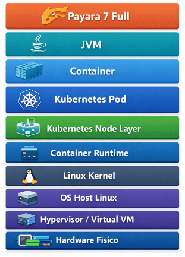
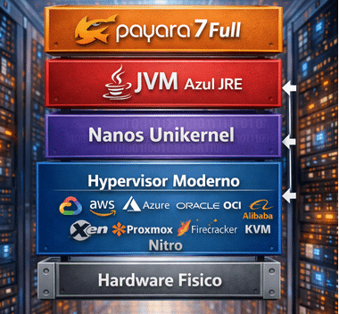
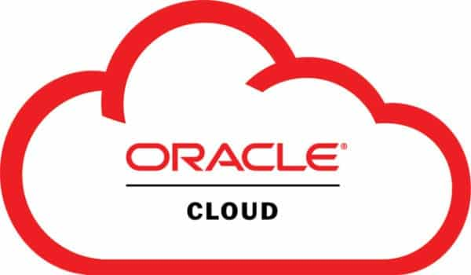

The evolution of the Java and Jakarta Enterprise ecosystem is converging toward an increasingly simple, efficient, and scalable architecture that improves security, delivers higher performance, and reduces hardware and infrastructure costs.

For years, Kubernetes has been considered the de‑facto standard for modernizing Java applications in a cloud‑native direction. However, Kubernetes is not the only way to achieve scalability, continuous upgrades, and isolation. An alternative approach --- often underestimated --- is to leverage the **hypervisors already included and fully managed by major cloud providers** , using **Unikernel** images based on [**Nanos**](https://nanovms.com).

Nanos images are not just an alternative to containers: they are **lighter, faster, more secure, more performant, and more efficient** . Unlike containers, which coexist with a general‑purpose Linux kernel, a Nanos image contains **only what the Java application needs** , allowing the JVM to use **100% of the CPU and RAM** of the VM. The result is a more efficient environment with **higher density** , **less waste** , and **lower operational costs**.

### Why Nanos Unikernel

VMs vs. Containers vs. Unikernels

 

The Key Point: Cloud hypervisors already have everything you need...

When you use a cloud provider, you are already relying on an advanced hypervisor that provides:

* automatic scheduling
* hardware isolation
* VM-level health checks
* auto-scaling groups
* rolling instance replacement

Kubernetes adds a second orchestration layer on top of this, introducing additional complexity and overhead. With Nanos Unikernel, the Java application runs **directly on the hypervisor**, with no container runtime,no kubelet, and no control plane.

And because a Nanos image does not include Linux, userland, shells, or system processes, **all VM resources are dedicated exclusively to the JVM**.

This results in:

* higher performance
* lower latency
* higher throughput
* better hardware utilization
* **more workloads per physical node compared to containers**

### What Changes Compared to Kubernetes

|-------------------------------------------------------------------------------------------------------------------------------|--------------------------------------------------------------------------------------------------------------------------------------|
| ##### Kubernetes Model  | ##### Nanos Unikernel Model  |

With Nanos:

* you remove Linux
* you remove the container runtime
* you remove Kubernetes
* you keep scaling, upgrades, and isolation
* **you gain a runtime lighter, faster, and more efficient than containers**

Containers, although considered "lightweight," still inherit:

* a full Linux kernel always in memory
* process scheduling
* virtualized networking
* overlay filesystems
* namespace and cgroup overhead

Nanos eliminates all of this. The Java application runs directly on the hypervisor, with no process context switching and no container runtime.  

The result:

* faster startup
* lower latency
* higher throughput
* **better performance on the same hardware**

### Nanos Images = Cloud-Native Immutable Images

Each Nanos build produces a **single immutable VM image** , versioned and ready to be replaced.  

Unlike container images, Unikernel images:

* do not include Linux
* do not include userland
* do not include unnecessary libraries
* contain only what the application needs
* have no shell, no users, no SSH
* have a minimal attack surface
* consume less CPU and RAM
* allow the JVM to use **all available resources**

This not only increases security but also enables **higher application density** : on the same physical node you can run **more Nanos VMs than containers**, thanks to the drastically smaller footprint.

### CI/CD: GitHub Actions for Building Azul 25 + Payara 7 on Nanos Images

|---------------------------------------------------------------------------------------------------------|---------------------------------------------------------------------------------------------------------|------------------------------------------------------------------------------------------------------------------------|
|  |  |  |

The CI/CD pipeline plays the same role it would with containers, but the final output is a **lightweight, immutable Unikernel Nanos Image**.

The repository *AngeloRubens/ci-cd-nanos-unikernel* demonstrates how to:
* build Nanos images with Azul JRE and Payara7 Full by GithubAction Pipeline
* version them
* publish them as artifacts
* prepare them for the cloud provider

Because Nanos images are lighter than containers, the pipeline becomes:

* faster
* more predictable
* more cost-efficient

### Scaling: The Hypervisor Does Kubernetes' Job

With Kubernetes:

* HPA
* scheduler
* pod replacement
* control plane

With Nanos on the cloud:

* auto-scaling groups
* versioned VM images
* VM-level health checks
* instance replacement

Nanos VMs have **extremely fast boot times**, often faster than containers. Since all CPU and RAM are dedicated to the JVM, each instance can handle more traffic, reducing the total number of VMs required.

This means:

* faster scaling
* fewer instances to maintain
* **lower cost per unit of load**

### Application Upgrades: Rolling Just Like Kubernetes

The upgrade pattern is surprisingly similar.

**Kubernetes**

* new image
* rollout
* pod drain
* old pod termination

**Nanos on the cloud**

* new Unikernel image
* auto-scaling group update
* new instances start
* old instances terminate

Since Nanos images are smaller and faster, rollouts are:

* faster
* more predictable
* less expensive

### Security: Stronger Isolation than Containers

Container security is configuration-based (seccomp, AppArmor, SELinux, Kubernetes policies).  

Nanos security is **architectural**.

|-------------------------------------------------|-------------------------------------------------|
|  |  |

And because there are no system processes, **all resources are dedicated to the JVM**, increasing performance and reducing costs.

### Nanos Is a Better Choice

* you want scaling and rolling upgrades
* you want to reduce operational costs
* you want to maximize the cloud hypervisor
* you want **better security, higher density, better performance, and lower costs**

### Conclusion

With Nanos Unikernel on the cloud you can:

* leverage hypervisors already included and managed
* achieve scaling, upgrades, and isolation
* drastically reduce complexity and overhead
* maintain an immutable, GitOps-friendly model
* dedicate 100% of resources to the JVM
* achieve superior performance
* increase application density
* **significantly reduce infrastructure costs**

Nanos shows that cloud-native can exist **without adding complexity** , and can be **secure** , **faster, lighter, safer, more efficient, and more cost-effective**.

### Further Reading and Resources

*

  ###### [Deep dive into Jakarta EE and Nanos Unikernel -- The Future of Cloud Computing](https://83ik77b8jj36297derqdh7.codia.website/)

*

  ###### [NanoVMs -- Official Nanos Unikernel website](https://nanovms.com/)

*

  ###### [OPS -- Official tool for building and managing Unikernel images](https://ops.city/)

*

  ###### [CI/CD GitHub Actions example for Nanos Unikernel images](https://github.com/AngeloRubens/ci-cd-nanos-unikernel)
