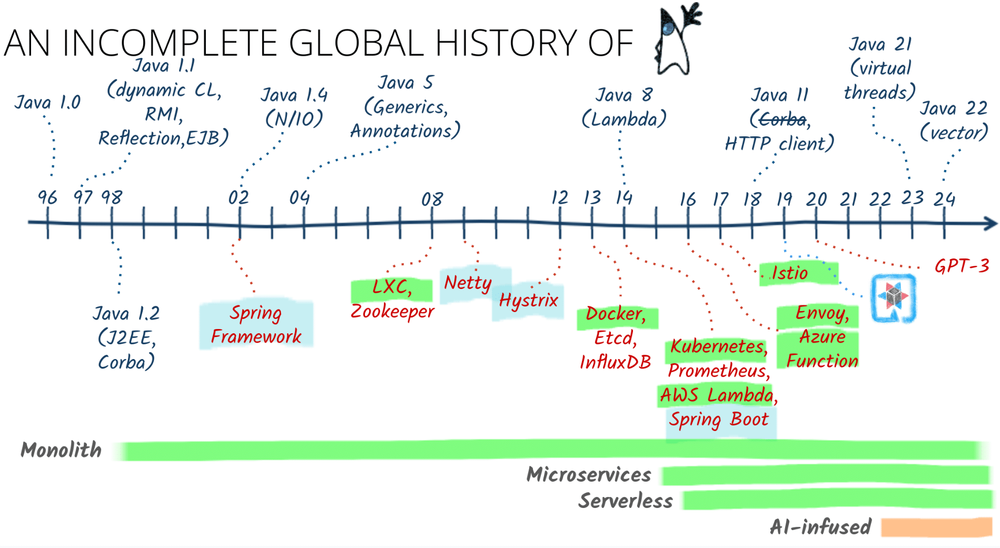
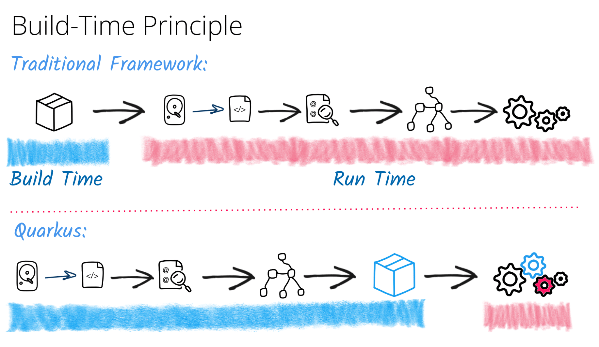
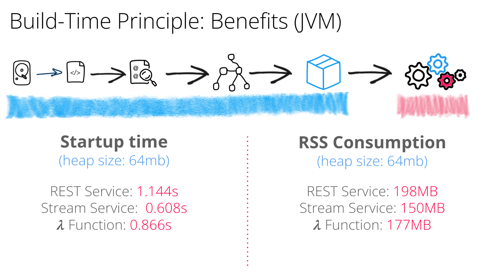
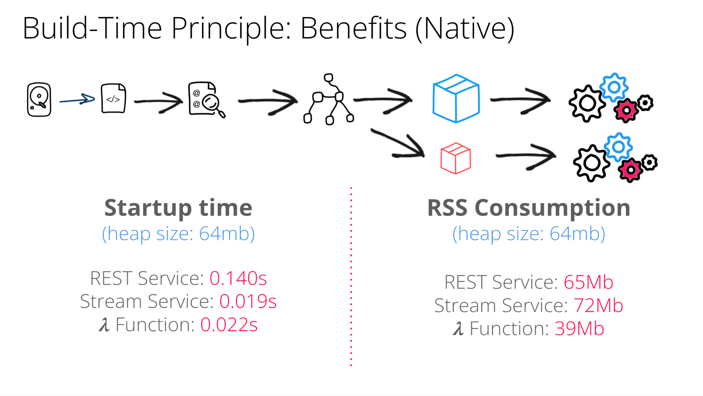
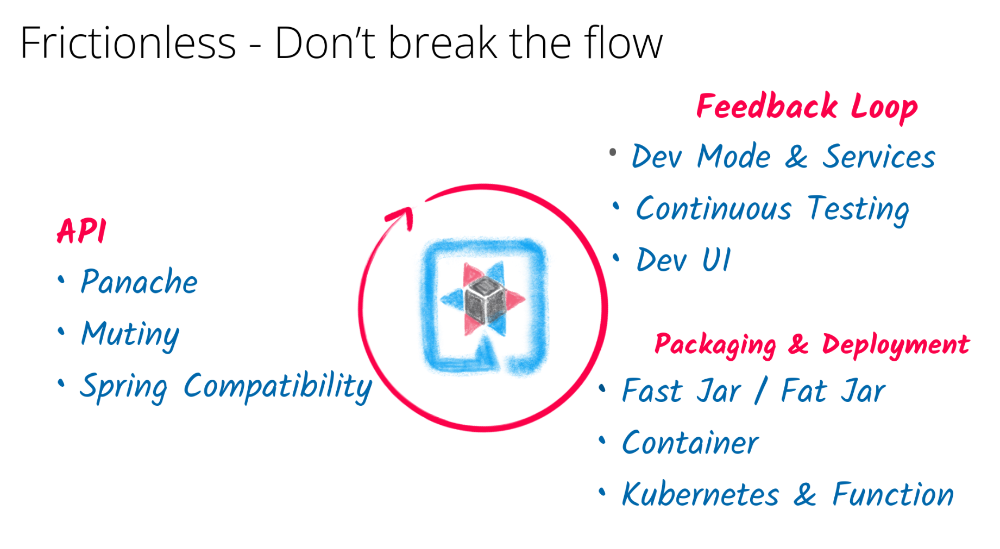
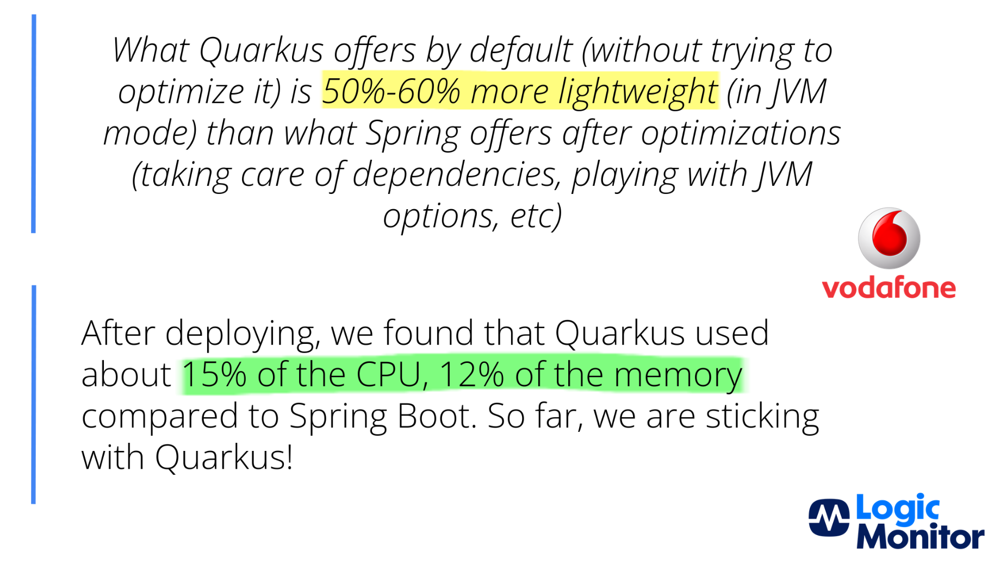
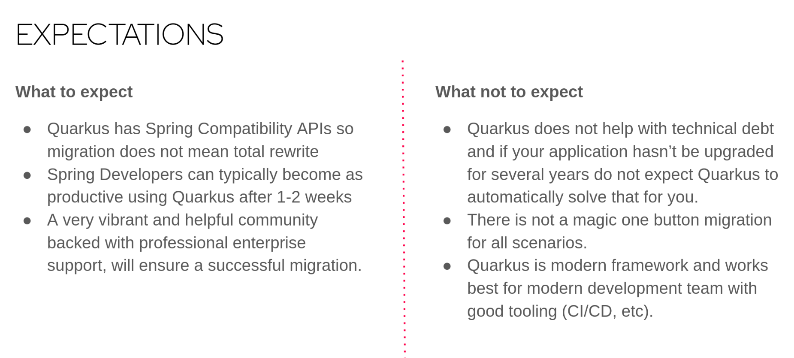

Public clouds such as AWS, Microsoft Azure, and Google Cloud, and platforms like Red Hat OpenShift, favor services that start fast and stay lean. Quarkus is engineered for exactly that.

Build time processing reduces runtime overhead and results in rapid startup, a small memory footprint, and frictionless deployment across Kubernetes, OpenShift, serverless, and managed container services in any cloud. If your Java services need to start in milliseconds, run dense on shared nodes, and still feel great to build, Quarkus was made for that job.

Quarkus is a Java runtime that seamlessly integrates popular frameworks and libraries, shaping both the structure of modern applications and the developer experience behind them. In this post, "runtime" means the full execution stack in production: JVM or native, plus Quarkus and the integrated frameworks.

Quarkus itself can also work as a framework, as it constitutes a higher-level layer that provides structure and APIs.

Why Quarkus stands out? {#_why_quarkus_stands_out}
--------------------------------------------------

In modern software development, runtimes and frameworks form the foundation of productivity and consistency. Frameworks promote uniformity, simplify infrastructure, and enable automation at scale.

Quarkus is a cloud-native Java runtime that integrates multiple frameworks and optimizes them for fast startup, low memory use, and smooth deployment across any cloud. It runs well on Kubernetes and Red Hat OpenShift, and it also integrates with native cloud services, from compute platforms such as AWS EC2 and Google Cloud Run to serverless offerings and managed container platforms.

Then, during development, Quarkus live reload provides instant feedback by applying code changes without a rebuild or restart. This shortens the inner loop and helps teams iterate faster than traditional redeploy cycles.

But beyond speed and live reload, Quarkus integrates established Java specifications such as CDI-Lite, JAX-RS, and JPA, with implementations provided by Arc (CDI-Lite), RESTEasy (JAX-RS), and Hibernate ORM (JPA). It also enforces its own conventions, drives behavior with annotations, and defines how applications are structured.

In this sense, Quarkus is a development framework and runtime for cloud-native Java applications. It adheres to industry standards and offers compatibility with technologies such as Spring, Apache Kafka, and Apache Camel to support familiar, flexible development models.

Quarkus as a versatile framework {#_quarkus_as_a_versatile_framework}
---------------------------------------------------------------------

Beyond staple traits of modern frameworks, Quarkus introduces two platform-defining features: buildtime optimization and deep extensibility.

* **Buildtime optimization** : Quarkus shifts work from runtime to build time wherever possible.  
  This approach reduces startup overhead and memory usage, resulting in a lean, fast, and efficient application tailored for production.

  Figure 1. Quarkus performs at build time what traditional frameworks do at runtime: reading configuration files, scanning annotations, and building a model of the application.

  

  Figure 2. Thanks to buildtime initialization, the resulting application starts faster and consumes less memory.

  

  Figure 3. All the benefits of buildtime initialization also apply when compiling to a native binary.
* **Extensibility** : Quarkus exposes extension points for everything from startup hooks to request filters. Over 800 [extensions](https://extensions.quarkus.io) allow seamless integration with modern technologies such as Kafka, OpenTelemetry, and OpenID Connect.These extensions integrate with Quarkus and participate in its buildtime and runtime lifecycle, making them first-class components of Quarkus.

### Simplified developer experience {#_simplified_developer_experience}

Frameworks succeed when they reduce complexity without sacrificing flexibility.  

Quarkus does exactly that:

* Preconfigures popular libraries with sensible defaults.
* Offers unified configuration and developer tooling.
* Provides instant feedback with live reload and continuous testing.
* Dev Services for automatic provisioning of databases, brokers, and other services in dev mode.
* Continuous testing to run tests in the background and surface results immediately.

This makes Quarkus both powerful and approachable.

You can start with a simple REST endpoint and scale it into a production-grade service without changing your development model.

Figure 4. Frictionless developer experience: Vastly improved development feedback loop, unified approach to producing different package types, and using proven APIs that Java developers already know.

These features give developers structure, sensible defaults, and clear conventions during development, and they deliver fast startup, low memory use, and operational consistency in production.

### Performance that matters {#_performance_that_matters}

Teams optimize for different goals, such as startup latency, sustained throughput, memory footprint, elasticity, and cost. Quarkus addresses these needs by shifting work from run time to build time, keeping one development model across JVM and native, and exposing production signals such as health checks, metrics, and tracing.

Start with **JVM mode** for most services. On the JVM, Quarkus often starts faster and uses less memory than traditional JVM-based runtimes because it performs more work at build time. Just-in-time compilation raises steady-state throughput, scales well across cores, and offers mature garbage collectors and tuning options. The JVM also provides rich observability and diagnostics, which help you understand and tune live systems.

Use **native mode** when startup latency and memory footprint are strict constraints. Native executables start in milliseconds and can use less memory, which supports scale-to-zero workflows and lowers idle costs on small instances. Trade-offs include lower peak throughput, limited multi-core scaling, a single-threaded garbage collector in current native images, longer build times, and a slower inner loop for developers.

If your system needs both profiles, split by workload. Run bursty or event-driven endpoints in native mode, and run long-lived high-throughput services on the JVM.

**Observability note.**   

JVM mode exposes richer diagnostics and metrics, including GC, heap, and thread telemetry, JFR, and profiler support, which makes issue triage and performance tuning easier. Native mode still exports application-level metrics and traces with Micrometer and OpenTelemetry, but it offers fewer VM-level signals.

Always measure your workload:

* For native, reduce reflection and dynamic class loading, trim resources, and consider profile-guided optimizations (PGO) where supported. PGO is not available in Mandrel and currently requires an Oracle GraalVM distribution that provides PGO.
* For the JVM, choose a garbage collector that matches your latency and heap goals, budget for warmup, and test steady-state throughput under realistic load.

Taken together, these in production choices provide measurable wins:

* [Vodafone Greece replaces Spring Boot with Quarkus](https://quarkus.io/blog/vodafone-greece-replaces-spring-boot/)
* [Quarkus vs. Spring Boot](https://www.logicmonitor.com/blog/quarkus-vs-spring)

### Security {#_security}

Quarkus uses a standards-first composable security model.  

You enable what you need and configure it for your environment:

* **Transport:** Enable HTTPS in the application by configuring TLS.
* **Authentication:** Choose Basic, form-based, mTLS, OpenID Connect (OIDC), or WebAuthN.
* **Authorization:** Enforce RBAC on web endpoints with `@RolesAllowed`, `@DenyAll`, and `@PermitAll`.

This lets you apply the right security controls for each deployment.

### Observability and control surfaces {#_observability_and_control_surfaces}

Common control surfaces, such as metrics, logging, tracing, and configuration, are essential for site reliability engineers (SREs) and platform teams.

Quarkus exposes:

* Unified logging with [`quarkus-logging`](https://quarkus.io/guides/logging).
* Centralized logging with OpenTelemetry (OTLP logs) with [OpenTelemetry](https://quarkus.io/guides/opentelemetry).
* Metrics and tracing with [Micrometer and OpenTelemetry](https://quarkus.io/guides/telemetry-micrometer-to-opentelemetry).
* Unified configuration of all the application's aspects by using `application.properties` or environment variables.

This standardization enables automation and scalable monitoring.

### Modular and production-ready {#_modular_and_production_ready}

Following a lean-core, modular-at-the-edge approach, Quarkus delivers:

* A minimal core for fast startup.
* Pluggable extensions for authentication, tracing, messaging, and more.
* Built-in production primitives, including health checks, readiness and liveness probes, and graceful shutdown.
* Fault tolerance with standard annotations, for example, retries, circuit breakers, bulkheads, and timeouts.

Whether you are building a prototype or deploying to OpenShift, Quarkus adapts. This modularity spans both the framework-level APIs developers work with and the runtime behaviors that execute beneath them.

Because Quarkus modularity is declarative and unified across extensions, it supports a platform-like developer experience without the rigidity of traditional frameworks.

### Building your stack with Quarkus {#_building_your_stack_with_quarkus}

We will explore this topic in depth in part 3 of this series. For now, here is how Quarkus fits into the picture.

Frameworks can serve as a foundation for creating higher-level abstractions.

Quarkus fits this model by enabling teams to build customized stacks and internal frameworks on top of it.

Unlike many traditional frameworks, Quarkus provides a unified extension architecture that supports deep customization. Organizations can tailor Quarkus to fit specific domains, technologies, or compliance needs. This enables the creation of organization-specific developer experiences, including internal stacks built on a unified Quarkus extension architecture.

By encouraging consistency, offering buildtime integration, and exposing clean extension points, Quarkus supports the creation of opinionated, scalable internal frameworks without forking or reinventing the core.

By packaging Quarkus extensions, curated defaults, and service templates into an internal Quarkus stack, teams focus on business logic. At the same time, your framework layer standardizes infrastructure, security, and operational integrations across services. This has been proven by Logicdrop, who refactored their entire Spring Boot stack with Quarkus, reducing container size by \~75%, achieving sub-second startup times, and significantly improving developer productivity.

For more information, see the [Logicdrop customer story](https://quarkus.io/blog/logicdrop-customer-story/) and their [GitLab automation write-up](https://quarkus.io/blog/logicdrop-automating-quarkus-with-gitlab/?utm_source=chatgpt.com).

Conclusion {#_conclusion}
-------------------------

Quarkus unifies the strengths of a development framework and a runtime. As a framework, it provides structure, conventions, and a cohesive developer experience. As a runtime, it delivers fast startup, low memory use, and operational consistency in the cloud. This dual role helps teams standardize practices, reduce costs, and ship resilient cloud-native services.

Quarkus is built in the open under the Apache License 2.0, governed with the Commonhaus model, and developed end-to-end on GitHub. Beyond the core project, the ecosystem includes the [Quarkiverse Hub](https://hub.quarkiverse.io/), a community-run collection of [Quarkus extensions](https://quarkus.io/extensions/) and related projects. The Quarkiverse Hub provides repository hosting with build, CI, and release publishing, so features land as versioned, testable modules you can adopt, fork, or extend.

So, that's all for now, thank you for reading, and let's meet again in the third article of this series, which will cover building your own stack with Quarkus.

For a closer look at how Quarkus makes Java cloud-native, see the [introductory blog post](https://quarkus.io/blog/mmaler-blogpost-1-intro/).
