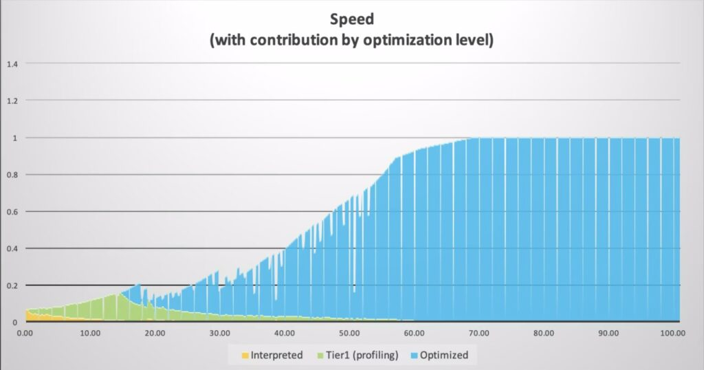

In cloud environments with auto-scaling, a "scaling loop" can make Java application warmup even worse. It can cause you to run unnecessary instances. Even worse, Java warmup might never end. Fortunately, there are four reliable fixes for this issue.

*In this post you will learn:*

* *High CPU during startup triggers auto-scaling and spins up more instances*
* *One solution is to give the compiler more resources*
* A second solution is to *lower the compilation threshold*
* A third solution is to use the ReadyNow feature in Azul Platform Prime to start fast every time
* In a fourth solution, we add Azul's Optimizer Hub to offload compilations to dedicated hardware

**You've probably noticed it: You start a Java application and the CPU usage spikes. It remains high for a while, then gradually settles. That's the warmup phase, and it's completely normal. But in cloud environments with auto-scaling, it creates a nasty problem. High CPU during startup triggers auto-scaling. More instances spin up. Those new instances also undergo this warmup phase with high CPU utilization. More scaling gets triggered. You see where this is going? Let's call it the "scaling loop problem," and it's both expensive and frustrating.**

Let me explain what's happening and show you some solutions.

What's actually happening during warmup? {#h-what-s-actually-happening-during-warmup}
-------------------------------------------------------------------------------------

When you start a Java application, the JVM can't run at full speed immediately. It needs to do a few things first.

* **Loads libraries and classes:** The JVM loads itself with all the core libraries and the execution environment. Then it loads your classes as they're needed, starting from your `main` method. This part is quick.
* **Starts JIT compilation:** Then the real work starts with the Just-In-Time (JIT) compilation. The Java code you wrote was compiled into bytecode (class files). These are platform-independent, but they're not very fast. The JVM runs this bytecode through an interpreter and monitors how your code behaves.
* **Reaches Tier 1:**After a method has been invoked a predefined number of times (e.g., 1,000 times), it is recompiled to native code (Tier 1). This is already much faster.
* **Reaches Tier 2:** The JVM keeps watching. After it reaches a second threshold (e.g., 10,000 times), it re-compiles with heavy optimizations (Tier 2) based on how your code actually runs.

This chart from Azul shows how performance improves over time in seconds \[Figure 1\]. The drops? Those are de-optimizations when the JVM realizes its assumptions used for the Tier 2 compilation were wrong:

But while all these compilations are happening, your app also needs to handle requests. The JVM is conservative and prevents the compilations from interfering too much with your application. So warmup can take a while.

Is Java warmup actually your problem? {#h-is-java-warmup-actually-your-problem}
-------------------------------------------------------------------------------

Before you start troubleshooting, check whether the warmup is actually causing issues in your use case. The easiest way? Analyze your [Garbage Collector](https://www.azul.com/products/components/pgc/) (GC) logs! These logs are available from any OpenJDK runtime. But when using Azul Zing Builds of OpenJDK (Azul Zing), you get much more detailed logs than with standard OpenJDK.

You can enable GC logging using the following command-line options. More options are available as [documented here](https://docs.azul.com/gc-log-analyzer/usage/generating-logs), but in this case, we need a single file (filecount=0 disables file rotation).

<pre class="EnlighterJSRAW" data-enlighter-language="generic" data-enlighter-theme="" data-enlighter-highlight="" data-enlighter-linenumbers="" data-enlighter-lineoffset="" data-enlighter-title="" data-enlighter-group="">java -Xlog:gc,safepoint:/my_log_dir/gc.log::filecount=0 \
    -jar my-application.jar</pre>

Then open the log with the [Azul GC Log Analyzer](https://docs.azul.com/gc-log-analyzer/). Check these charts to find potential bottlenecks:

* **Compiler Queues**: Big backlog? The compiler can't keep up.
* **Compiler Threads**: All threads maxed out for a long time? You need more resources.
* **Tier 2 Compile Counts**: Shows compilation activity and queue evictions.
* **Tier 2 Wait Time**: How long methods wait to get compiled.

How the scaling loop works {#h-how-the-scaling-loop-works}
----------------------------------------------------------

Here's a typical scenario in cloud environments:

Your app starts and hits 80% CPU during warmup. Auto-scaling sees this and spins up three more instances. Those three instances also begin warming up at 80% CPU. Now you've got four instances, all consuming resources. The monitoring thinks you're under load and adds even more instances.

Eventually, everything settles down. CPU drops to 20% as your JVM finishes compilations and is only handling the load. But now you're running 10 instances when you only need three for your actual traffic. You're paying for seven idle instances!

Or worse: if you have alerts configured to restart containers that exceed 90% CPU for 2 minutes, your instances never finish warming up. They get killed and restarted, creating an infinite loop.

We've seen both scenarios. They're not fun. Here are four solutions for the Java scaling loop problem.

|----------------------------------------------------------------------------------------------------------------|
| **Pro Tip:** Links to documentation for the features in this article are listed at the bottom of this article. |

Solution 1: Give the compiler more resources {#h-solution-1-give-the-compiler-more-resources}
---------------------------------------------------------------------------------------------

The simplest fix? Let the compiler use more CPU to finish faster.

[Falcon](https://www.azul.com/products/components/falcon-jit-compiler/) is the default optimizing JIT compiler in Azul Platform Prime, Azul's high-performance [Java platform](https://www.azul.com/) that includes Zing. With Falcon, you can control thread allocation:

<pre class="EnlighterJSRAW" data-enlighter-language="generic" data-enlighter-theme="" data-enlighter-highlight="" data-enlighter-linenumbers="" data-enlighter-lineoffset="" data-enlighter-title="" data-enlighter-group=""># Set total compiler threads
java -XX:CIMaxCompilerThreads=3 \
    -jar my-application.jar

# Or split between Tier 1 and Tier 2
java -XX:C1MaxCompilerThreads=2 \
    -XX:C2MaxCompilerThreads=4 \
    -jar my-application.jar</pre>

You can also add extra compilers for a fixed duration. The following example adds two extra compiler threads for the first 60 seconds. After that, they're freed up for your application. If the number of seconds is less than your alert threshold, it won't trigger your scaling monitoring.

<pre class="EnlighterJSRAW" data-enlighter-language="generic" data-enlighter-theme="" data-enlighter-highlight="" data-enlighter-linenumbers="" data-enlighter-lineoffset="" data-enlighter-title="" data-enlighter-group="">java -XX:CompilerWarmupPeriodSeconds=60 \
     -XX:CompilerWarmupExtraThreads=2 \
     -jar my-application.jar</pre>

**When this works:**

* You have spare CPU capacity.
* JVM restarts are infrequent.
* It's simple to implement. You only need to add one or two flags.

**Downsides:**

* This approach needs extra CPU headroom.
* The application might be less responsive during startup.
* You're reserving resources you only need at startup.
* It doesn't stop aggressive auto-scaling.

Solution 2: Lower the compilation threshold {#h-solution-2-lower-the-compilation-threshold}
-------------------------------------------------------------------------------------------

Instead of waiting for 10,000 invocations, you can also decide to start the JIT sooner:

<pre class="EnlighterJSRAW" data-enlighter-language="generic" data-enlighter-theme="" data-enlighter-highlight="" data-enlighter-linenumbers="" data-enlighter-lineoffset="" data-enlighter-title="" data-enlighter-group="">java -XX:FalconCompileThreshold=5000 \
    -jar my-application.jar

# Or lower both thresholds
java -XX:C1CompileThreshold=500 \
    -XX:FalconCompileThreshold=5000 \
    -jar my-application.jar</pre>

**When this works:**

* You have clear "hot" methods that get called frequently.
* You have extra CPUs available.

**Downsides:**

* The JIT gets more code to compile.
* Higher CPU during warmup (compiling more methods faster).
* Wasted work on methods that aren't actually hot.

Solution 3: ReadyNow to learn once and start fast forever {#h-solution-3-readynow-to-learn-once-and-start-fast-forever}
-----------------------------------------------------------------------------------------------------------------------

This is where things get interesting. ReadyNow is an Azul Zing feature that changes the game. Instead of learning from scratch every time, it saves what it learned from previous runs.

Here's how it works:

<pre class="EnlighterJSRAW" data-enlighter-language="generic" data-enlighter-theme="" data-enlighter-highlight="" data-enlighter-linenumbers="" data-enlighter-lineoffset="" data-enlighter-title="" data-enlighter-group=""># First run - create a profile
java -XX:ProfileLogOut=/var/app/profiles/readynow.profile \
     -jar my-application.jar

# Next runs - use the profile
java -XX:ProfileLogIn=/var/app/profiles/readynow.profile \
     -jar my-application.jar</pre>

The first run creates a profile that includes all compiler decisions. Subsequent runs read this profile and immediately compile all methods to produce the optimal code based on the information from the previous run. No waiting for invocation thresholds. The warmup time drops dramatically \[Figure 2\].

You can update the profile across multiple runs when you specify both a `ProfileLogIn` and `ProfileLogOut` and reuse the out-file as the in-file in a following run. After a few iterations, you've got an optimal profile that captures your app's actual behavior.

**This is perfect for:**

* When you use containerized deployments, you can bake the profile from a training run into your image.
* When you have multiple instances of the same application.
* When there are strict SLA requirements.

**Things to know:**

* The first run still has the regular warmup cycle. Or you need to create the profile during a training run.
* You need to manage profile files, storage, etc.
* The profiles are version-specific. When you deploy a new version, you'll need to create a new profile.
* When the workload changes, you need to generate a new profile.

Solution 4: Optimizer Hub as the full solution {#h-solution-4-optimizer-hub-as-the-full-solution}
-------------------------------------------------------------------------------------------------

If you're running at scale, [Optimizer Hub](https://www.azul.com/products/components/azul-optimizer-hub/) is worth looking at. It's part of [Azul Platform Prime](https://www.azul.com/products/prime/) and provides two services: [Cloud Native Compiler](https://www.azul.com/products/intelligence-cloud/cloud-native-compiler/) and [ReadyNow Orchestrator](https://www.azul.com/products/components/readynow/).

### Cloud Native Compiler {#h-cloud-native-compiler}

Instead of having all your JVMs compile the class files to native code, the Cloud Native Compiler service lets you move this compilation to dedicated hardware. Your JVM sends the bytecode to the Cloud Native Compiler service, which compiles it and sends back the optimized code.

Why this matters:

* The resources handling the compilation can scale independently from your application instances.
* You can use the highest optimization levels without impacting your application's performance.
* Caching! If 100 instances require the same method to be compiled, it's compiled only once and reused.

### ReadyNow Orchestrator {#h-readynow-orchestrator}

The ReadyNow Orchestrator service handles profile management for you \[Figure 3\]:

* It provides a central storage for all profiles.
* It collects profiles from different JVMs.
* From all those profiles, the best one is automatically promoted.
* It serves the optimal profile to new instances.

### Setting it up {#h-setting-it-up}

You deploy Optimizer Hub as a Kubernetes service within your own environment using the [installation instructions in the documentation](https://docs.azul.com/optimizer-hub/installation/install-optimizer-hub). You can use an existing cluster or create a new one. All your applications can use this Optimizer Hub instance within your environment.

Once Optimizer Hub is available within your environment, you need to add the following command-line options to start your application:

<pre class="EnlighterJSRAW" data-enlighter-language="generic" data-enlighter-theme="" data-enlighter-highlight="" data-enlighter-linenumbers="" data-enlighter-lineoffset="" data-enlighter-title="" data-enlighter-group="">java -XX:OptHubHost=&lt;optimizer-hub-host&gt;[:&lt;port&gt;] \
     -XX:+CNCEnableRemoteCompiler \
     -XX:+EnableRNO \
     -XX:ProfileName=my-app \
     -jar my-application.jar</pre>

Your JVM automatically sends compilation requests to the Cloud Native Compiler and synchronizes profiles through the ReadyNow Orchestrator. If Optimizer Hub is unavailable, it falls back to local compilation.

**Best for:**

* Large deployments with tens, hundreds, or even thousands of JVMs.
* Environments where you frequently deploy with auto-scaling.
* When you need the absolute fastest warmup.

**Keep in mind:**

* Optimizer Hub requires a Kubernetes infrastructure within your environment.
* It's more operationally complex.
* Monitor network latency for compilation requests (typically minimal).
* It is overkill for small deployments.

What should you do? {#h-what-should-you-do}
-------------------------------------------

Start simple. If you're beginning to address warmup issues, try increasing the CPU first. It's one command-line flag.

If you're running multiple instances of the same application, especially in containers, use ReadyNow. Profile management is straightforward, and you can embed profiles in your container images.

If you're at scale, running hundreds of JVM instances, managing frequent deployments, or dealing with auto-scaling policies, Optimizer Hub makes sense. The setup investment pays off quickly, as proven in this post by Simon Ritter: [What Happens When 10,000 JVMs Collaborate in One Production Environment](https://www.azul.com/blog/what-happens-when-10000-jvms-collaborate-in-one-production-environment/).

Conclusion {#h-conclusion}
--------------------------

The warmup scaling loop is annoying and expensive. But you don't have to accept it. Modern Java runtimes, such as Azul Zing, provide practical tools to address this.

Start by allocating additional CPU to a project that is overwhelmed by alerts. Then add ReadyNow to scale up fast and use a trained profile to minimize the warmup time. Try Optimizer Hub to elevate your environment, with profiles and compilations centrally managed so your JVMs can focus on their real task: handling your business logic.

The key? Start somewhere. Measure the results. Adjust as needed.  

Don't accept slow startups or wasteful scaling loops. You've got options!

|                                                                                                                                                                                              More Info About Azul Optimizer Hub                                                                                                                                                                                               |
|-------------------------------------------------------------------------------------------------------------------------------------------------------------------------------------------------------------------------------------------------------------------------------------------------------------------------------------------------------------------------------------------------------------------------------|
| [Azul Platform Prime](https://www.azul.com/products/prime/) [Analyzing and Tuning Warmup](https://docs.azul.com/prime/analyzing-tuning-warmup) [Falcon Documentation](https://docs.azul.com/prime/Falcon-Compiler) [ReadyNow Documentation](https://docs.azul.com/prime/Use-ReadyNow) [Optimizer Hub Documentation](https://docs.azul.com/optimizer-hub/) [Azul GC Log Analyzer](https://docs.azul.com/prime/GC-Log-Analyzer) |
