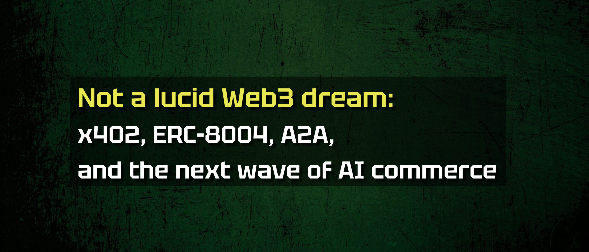
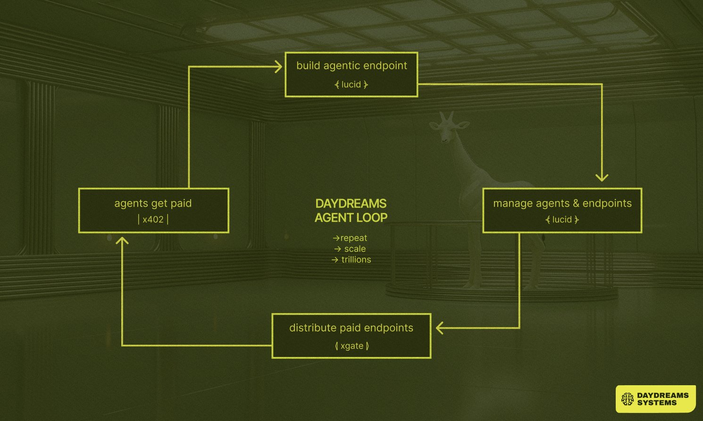
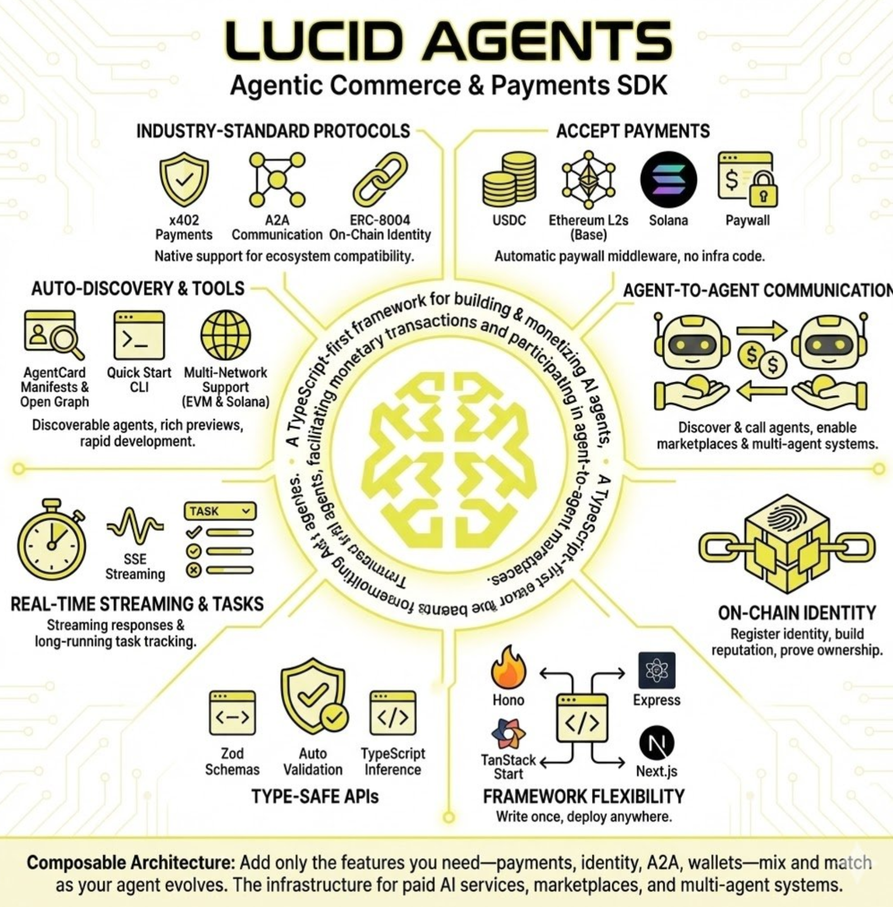
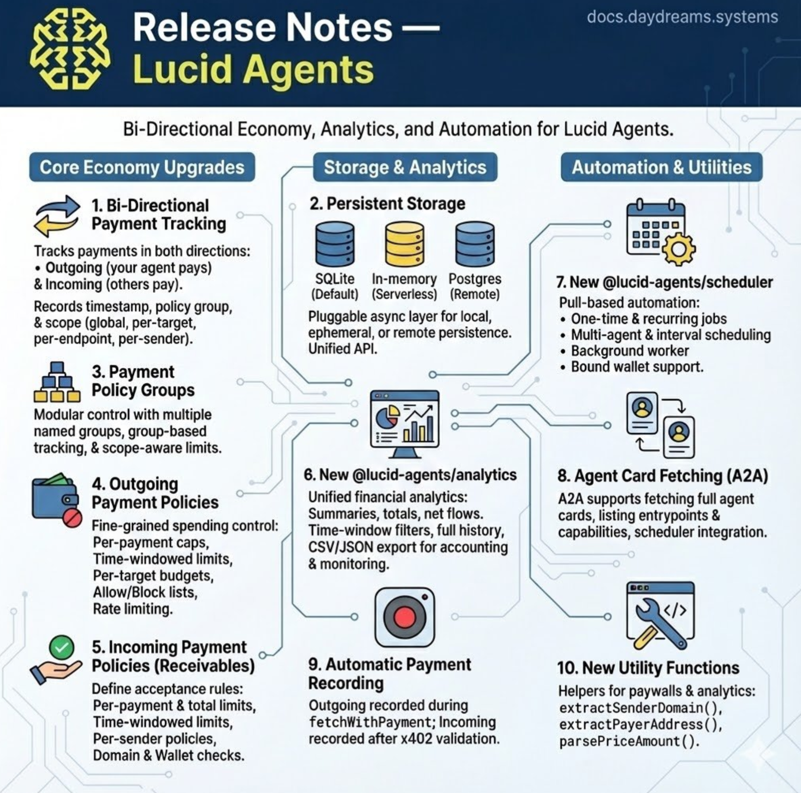
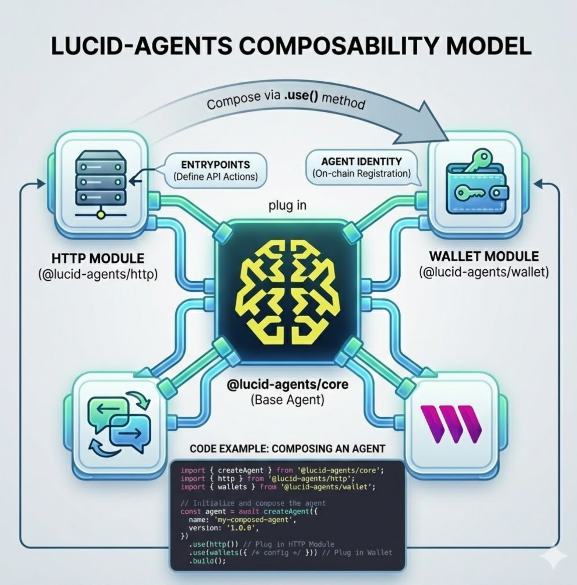

*This article is for technically savvy readers, especially developers, protocol designers, and product teams working with AI agents, APIs, or crypto rails, who want a clear view of how these areas connect.*   
*It explains how x402, ERC-8004, and agent discovery layers turn APIs and agents into small usage-based businesses, and what that means for real systems over the next 1--3 years.*
>
> ### Vocabulary for this article
>
> * In this article, I use the term *micro business* for a very small overall business, and *nano business* for a single x402-priced endpoint or agent that earns on its own from per-call payments in stablecoins.
> * **AP2 (Agent Payment Protocol):** AP2 defines how agents pay each other. It standardizes how a service quotes a price, how payment is confirmed, and how both sides record what was bought, so payments fit directly into automated agent workflows. In practice, it is a protocol that lets one machine pay another machine for work, without a human in the loop.
> * **A2A (Agent-to-Agent communication):** A2A covers how agents talk, pass context, and coordinate work. It lets agents call each other, exchange structured messages, and chain tasks instead of acting as isolated scripts.
> * **x402:** x402 is an HTTP-based payment protocol for APIs. A server responds with status `402 Payment Required`, the price, and a payment route, and the client pays by using stablecoins on-chain and then retries the request to get the result.
> * **ERC-8004 (8004):** ERC-8004 standard is an on-chain registry for agents. It gives each agent an identity and a place to store reputation data, so other agents and tools can decide whom to trust and which services to call.

Foreword
--------

**x402** and **ERC-8004** .  

Standards for on-chain payments and identity for agent operation.

Most people have never heard of these standards, and even many crypto natives only see the surface of the agent narrative.  

Behind them is a simple idea.  

Agents can pay and get paid through tiny on-chain transactions, and in return, they can handle tasks that would be impossible to scale by hand.

We are still early in this emerging space, but I suspect everything will evolve much faster than most people expect.  

One of the drivers for this is the push to build an agent-driven internet.  

Another is the need to improve privacy on the processes we already use.

For example, Vitalik Buterin has already highlighted the need for privacy-preserving x402 payments. Every time an agent pays an endpoint, it leaks what service it used, when it used it, how often it used it, and sometimes even the rough size or type of job.  

Competitors can see which APIs your app or agent relies on.  

Data brokers can reconstruct user behavior and business logic from payment flows.  

Over time, you get a giant, searchable map of who pays whom for what.

For human users, this is a privacy nightmare.  

For agents as businesses, it is also an alpha leak.

Agents can do a lot of useful work for you, but privacy-preserving payments are one of the first problems to solve.  

A development team I use as an example is currently building private x402 transactions on the Starknet stack, also known as z402.  

When this layer is in place, it opens the door to hundreds of use cases. If you read further, you'll learn more about some of these.

I will first explain where the web is today and why agents break the old ad-and-subscription model.  

I will also introduce the basic terms you need to understand to get the most from this reading.  

Then, I will show how standards such as x402 and ERC-8004 give agents a way to pay and prove value.  

Finally, I will look at an example development team, *DayDreams.Systems*, that builds on top of these standards.

The goal is not to promote any specific team, but to show why this kind of plumbing is likely to matter if the agent economy becomes real.

Part 1 - **Bringing companies on-chain with x402**
--------------------------------------------------

Today, most x402 experiments start with crypto-native builders, but the long-term impact sits with traditional companies.  

x402 runs on familiar Web2 infrastructure yet settles in stablecoins on-chain, so it integrates directly with existing usage-based billing.  

Enterprises already use metered APIs and issue monthly invoices.  

If an endpoint can expose "this call costs 0.2 cents in USDC" over HTTP 402, finance teams can reconcile that flow the same way they handle cloud or SaaS costs.

In other words, x402 does not ask companies to change how they think about software.  

It only changes the rail that moves the money.  

x402 sits where Web2 companies already live: HTTP, APIs, usage billing, and stablecoins instead of card networks.  

That is also why I think it is important to be clear about what x402 is not.  

It is not a token sale, and it is not a speculative asset.  

It is a payment protocol.  

Or, as people in payments, fintech, and crypto might say, a "payment rail."

From my point of view, and from how builders in the blockchain space talk about it, x402 is a way to quickly enable micropayments across the internet and to let traditional companies become meaningfully on-chain without having to rebrand themselves as "crypto projects."

Once you look at the user base numbers, the potential becomes clearer.  

Today, there are about 40--50 million weekly active crypto users.  

By comparison, roughly 900 million people already use ChatGPT-class applications.  

That is almost 20 times as many people as the entire active crypto base.  

Now imagine a large interface, such as ChatGPT or a similar agent front-end, that increasingly relies on external APIs, which themselves expose prices in x402.  

Instead of keeping all those upstream costs hidden as an internal line item, it could settle a part of them directly on-chain, in stablecoins, on the same standard that those providers use.  

This would make it easier to share revenue with third-party services, give users or their own agents the option to pay directly for some calls, and reduce the need for custom billing integrations with every partner.

If a setup like that becomes common, you are no longer talking about thousands of transactions per day.  

You are looking at billions of very small events, each representing a paid unit of compute or data.  

Traditional card networks and ad-funded models are not designed for this pattern.  

They expect fewer, larger payments, not billions of sub-cent charges between machines.

Card systems also assume a human at the end of the flow and a checkout-style experience.  

Agent payments look different. They happen in the background, often in bursts of many tiny calls, with prices that can depend on context, volume, or conditional rules. This is the type of workload where stablecoin rails and an HTTP-native protocol, such as x402, fit better than card fees and monthly billing cycles. Card systems also do not expose a simple, machine-readable way for one service to quote a price per call and another service to pay it automatically.

x402 is designed to fill exactly this gap.  

It keeps the familiar HTTP request-and-response model, attaches a stablecoin price to each call, and settles that price on-chain as a tiny, usage-based payment.  

At the scale where agent traffic lives, that kind of payment protocol can handle the granularity that existing payment infrastructure struggles with.  

Agent payments tend to be high-volume, high-velocity, and low-value, often conditional and composable across many services, which fit stablecoin rails much better than card networks.

Once you take that volume and this direction of travel seriously, another question appears.  

What if the large incumbents simply ignore x402 and keep everything inside their own billing systems? Well, they cannot remove x402 endpoints from the internet, but they can decide which payment flows they support in their own products.  

The counterpoint is that x402 does not need permission from any single platform.  

It rides on plain HTTP, so any agent, SDK, or "agent browser" can call an x402 endpoint and pay it.  

If x402 endpoints become a good source of useful data or computing, it is cheaper for big companies to talk to them than to rebuild every useful resource in-house.  

If they refuse to interoperate, that creates an opening for other tools, wallets, and agent clients that do.  

In that sense, x402 is less about convincing one company to flip a switch and more about giving the rest of the ecosystem a standard that works even if incumbents are slow to join.

From this perspective, when people talk about "bringing companies on-chain," the focus is not on tokenizing balance sheets or putting shares on a ledger.  

It shifts to something more mundane and more powerful: moving the billing layer for everyday AI APIs and SaaS endpoints onto x402, so the internet can support billions of sub-cent payments per day without collapsing under its own business model.

Part 2- Introduction: Beyond Ads and Subscriptions: Agent Commerce on x402 and ERC-8004
---------------------------------------------------------------------------------------

Imagine you run a website with real value.  

A research blog. A niche data feed. A book you provide for free.  

A long form guide that took you nights and weekends to write.

Today, the way you "monetize" that work is simple.  

You paste in ad scripts and hope that human eyeballs show up.  

Meanwhile, bots and AI agents crawl your pages on the code level, scrape the raw content, feed it into their pipelines, and never pay you a cent.  

Your ads load.  

Your layout renders.  

Your analytics register another "visit."  

But the real consumer is a headless agent that does not care about banners or pop-ups.

You carry the hosting cost.  

You carry the bandwidth cost.  

The agent walks away with the value.

Over time, this turns into a more general "pay-per-crawl" pattern.  

Most traffic on the web comes from automated clients, not humans in a browser, so it makes sense that machines, not people, become the primary payers at the protocol level.

Now imagine a different setup.  

Your content sits behind a tiny paywall that understands x402.  

When a human or an AI agent wants your data, they do not see ads. They see a 402 "Payment Required" response with clear, machine-readable terms. Their client or agent calls you with a wallet that already holds a small stablecoin balance, and that the user has authorized to spend on their behalf.  

The agent pays a fraction of a cent from that balance, and then gets the data.  

A human user still tops up that balance from time to time, by card, bank transfer, or a normal on-ramp, but each individual call is handled automatically by the software, not by clicking a "Pay" button on every request. In the background, a programmable wallet enforces the rules you set. You can cap how much an agent spends per day, restrict which endpoints it can pay, and keep an audit trail of every call.

The agent does the micro-payments, but the human still defines the policy and funding source.  

No accounts.

No OAuth.  

No email capture funnels.

On your side, you do not babysit API keys.  

You do not fight an endless war against scrapers.  

You run an agent of your own that guards the data, negotiates access, and sells it on your behalf.  

With ERC-8004, that agent has a verifiable identity and a reputation record on the chain, so other agents know who they are talking to and whether they can trust the stream it serves.

The flow flips.  

Your "scraping victim" website becomes a nano business in an agent economy.

But wait a second.  

There is also a "light side of the moon" to it.

Agents can:

* Act as matchmakers between your content and the right readers, just as you do when you share your work on social media.
* Provide personalized entry points and automated follow-ups for people who enjoy your work, and help distribute it to the right corners of the internet.
* Monitor the health of your content by tracking which parts of your article trigger refunds, fast bounces, or never lead to any follow-up actions.
* Act as quality filters and bring you only the material that matches your preferences.
* Handle access control by managing who gets which tier of content, which parts are free, and which are pay-per-read.
* Check sponsorship offers against your ethical guidelines and pricing, and place small, relevant sponsorships in your content feed on your terms.
* Provide cross-format delivery by generating a short audio version, a bullet-point version, or a "for founders" version of the same content, and offer them as micro-upgrades.
* Let the reader's agent choose the format that the person prefers.
* And, in the long run, pay for their own existence by earning more from their work than they spend on data, compute, and tools.
* Control permissionless money and use payments to influence humans, other agents, and software systems.

Now, think about how we use search today.  

Every Google query consumes CPU, memory, network bandwidth, and energy.  

It costs real resources every time you type a word and hit Enter.  

You never see the bill, because Google decided long ago that you are not the customer.  

The advertiser is.  

To make that work, Google sells access to its index.  

Sponsored links buy their way to the top.  

The first result is often not the best answer for you.  

It is the answer that won an auction.

Now project that forward into an agentic internet.  

Instead of one giant search engine that hides costs behind ads, you have a search agent that works only for you.  

You pay it directly in crypto by using x402 for the time and data it spends on your query.  

It fans out your request to many data providers, each with their own x402 paywall, and picks the best mix of price and quality.  

The results it returns are not sponsored.  

They reflect what your agent actually believes is the best answer under your constraints.

Again, ERC-8004 matters here.  

Your search agent needs to decide which other agents and services to trust.  

Identity, reputation, and validation registries give it a way to see who has delivered good results in the past and who has a track record of spam or low-quality work.  

Instead of SEO games and ad auctions, you get a market where agents rank each other on the basis of verifiable work and real payments.

Once you have **x402** for payments and **ERC-8004** for identity and reputation, many of the broken parts of today's internet start to look fixable.

API billing becomes less painful.  

Right now, if you run an API, you set up subscriptions, rate limits, or custom contracts.  

You over-provision for big customers and under-serve the long tail.  

With x402, any API endpoint can publish a price per call, down to fractions of a cent, and accept stablecoins over HTTP 402 without accounts or manual invoicing.  

Agents and apps pay exactly for what they use, and nothing else.

Spam becomes more expensive.  

In Web2, bots can hammer your endpoints for free until you give up and put everything behind API keys, CAPTCHAs, or hard gating.  

In an x402 world, every request costs something, even if it is tiny.  

Attackers cannot spray infinite traffic without burning real money.  

Legitimate users still pay far less than a typical subscription, and they do not have to fight your protection layers.

Agent discovery becomes less biased.  

If discovery engines sit on top of x402 and ERC-8004, they can rank services not just by who shouts the loudest, but by who other high-reputation agents actually pay and use.  

Payment flows become a kind of "vote" that reflects real economic trust, not vanity metrics or bought traffic.

Multi-agent workflows become less fragile.  

Protocols like A2A or MCP define how agents communicate with each other.  

ERC-8004 anchors who they are and why you might trust them.  

x402 gives them a way to settle up after each call.  

Speak.  

Prove.  

Pay.  

The protocol stack is starting to align with what a real economy needs.

And all of this happens without throwing the web away.  

HTTP stays.  

APIs stay.  

We just finally light up the status code that has been reserved for three decades and connect it to a global ledger.  

We give agents a passport and a credit line, and we tell them:  

"If you want to use the internet's value, you pay the people who create it."

That is the gap that x402 and ERC-8004 try to close.  

They do not promise magic.  

They take two simple ideas that the speakers in the [DayDreams X Space](https://x.com/i/spaces/1jMJgRYAzveGL?s=20) kept coming back to:  

Payment should be as native as a GET request.  

Trust should be as inspectable as a transaction.

In the agent economy that I want to see, agents do not only take. They also **bring** .  

My own agent can guard my content behind x402, speak ERC-8004 so other agents know who they deal with, and recommend my work to readers who are likely to value it.

Other agents can work on behalf of readers, scan paid endpoints, and decide that my article is worth a fraction of a cent. The same technology that crawls and copies can also route new readers to my work, pay for it, and feed back a signal about what actually helps people.

For twenty years, the web asked one main question: "*Does this look good to a human on a screen?*"

We obsessed over templates, CSS, copy, and SEO so that a landing page both looked good and ranked well.  

In the agent era, the question changes, and the question changes the angle to this:

"***Can an agent reach your value through a clean API, pay for it over x402, and know from ERC-8004 who it is dealing with?***"

Sites and services that answer yes to that question still care about UX and SEO, but they do not depend on fancy landing pages to survive.  

They have something stronger.  

They have a business model and an interface that speaks the native language of the new internet: **agents, APIs, and fine-grained payments**.

Part 3 - Tech that will change the internet
-------------------------------------------

### **Agent commerce, x402, and ERC-8004: from ad-funded web to paid APIs**

#### **Where we are now: ads, subscriptions, and hard-coded APIs**

Let us take a closer look at the current state of the online experience.

Most online products still rely on two basic business models.  

Ads pay for "free" content, and subscriptions bundle access into monthly or yearly plans.

This works poorly for today's AI-driven internet.

* AI agents can ignore ads.
* Subscriptions are too coarse when you only need a few calls or a small amount of data.
* APIs deliver real value, but there is no standard way to charge per-call at internet scale.

On the technical side, most AI systems still look like this:

* An app or agent uses a set of APIs with **manually managed API keys**.
* Workflows are **hard-coded** by humans.
* Payments are processed through separate Web2 billing systems, such as Stripe dashboards, custom invoices, or prepaid credits.
* Access often lives in **walled gardens** rather than on open, shared rails.

This setup has some clear limitations.

* Agents cannot easily **discover** new services on their own.
* There is no **standard payment flow** for machine-to-machine calls.
* Each integration is **custom**, slow to build, and hard to replace.
* Abuse and scraping are common because there is no built-in economic cost per call.

At the same time, demand for AI and APIs is exploding.

* There are roughly tens of millions of weekly crypto users.
* Hundreds of millions of users interact with ChatGPT-class apps.

We are in **"the API era."**   

The web serves more APIs than static pages, yet the payment and access layer still behaves like the early web.

#### **What needs to change for agent commerce to work?**

AI is moving from answering questions to **taking actions**.

Agents do not just chat.  

They:

* Call APIs to fetch data and context.
* Reserve and manage cloud resources.
* Trigger workflows across services.
* Compose multiple tools to solve a task end-to-end.

To support this, we need the following three:

1. A **standard payment primitive** for APIs and agents, such as x402.

2. A **discovery and identity layer** so agents can find and rank services, which in the Ethereum ecosystem maps to **ERC-8004 agent registries**.

3. A **business layer** so individuals and teams can turn endpoints into small, efficient businesses.

Today, the missing piece is often payment and discovery.

* Agents do not have a native way to pay per call.
* Providers cannot expose tiny, **nano-sized services** in a simple, open way.
* Developers do not know *where* to list endpoints or *how* to reach users beyond their own app.

This blocks a more granular and open market where:

* A weather API can charge a fraction of a cent per call.
* A niche dataset can charge per query instead of per month.
* A small tool can be a **nano business** that you set up in 30 minutes and leave running.

Without a standard, every project reinvents billing and access.  

That slows the market and keeps power in a few large platforms.

#### **Current bottlenecks: walled gardens, spam, mispriced data**

The web stack of today suffers from being built on the code infrastructure of yesteryear.

**1. Walled gardens and private workflows**

* Workflows are private and hard-coded.
* API keys are stored and managed by humans.
* Agents cannot explore new services freely because access is gated by opaque contracts, custom dashboards, or per-vendor keys.

Result:  

Innovation is locked inside platforms instead of happening on neutral rails.

**2. No standard way for agents to pay**

Agents need to pay for:

* Data.
* Compute.
* Models and inference.
* Specialized tools and services.

However, there is currently no common payment layer for agents.

* Providers handle billing off-chain.
* Calls might be free until rate limits hit, then "contact sales."
* There is no portable, machine-readable way to say "this endpoint costs X per call."

This prevents a real **microservice economy** between agents.

**3. Broken pricing models for content and data**

* Valuable sites and datasets are scraped for free.
* Ads do not work well when agents are the consumers.  
  Subscriptions do not fit small, rare, or niche usage.

There is no good way to price:

* A single clean Polymarket signal.
* A specialized dataset query.
* One high-value article read by an agent.

The result is either under-monetization or overly heavy paywalls.

**4. Spam and free riding**

APIs are often hit by bots and abusive traffic.

* Without a built-in cost per call, spam is cheap.
* Providers add complex rate limits, CAPTCHAs, and manual approvals.
* This hurts honest developers and makes APIs harder to use.

**5. Distribution and discoverability**

Builders do not know:

* Where to list x402-style endpoints.
* How agents will find them.
* How to rank providers when many offer similar services.

**The coming evolution phase is comparable to the early web.**

* Search engines became the gateway for websites.
* Here, **agent discovery engines** and **agent stores** will serve as the gateway.

However, without standards, these discovery layers risk becoming new silos.

#### **How x402 solves per-call payments and spam**

Let me present now a clear "cause → solution → fix" structure around **x402** that will need to be developed.

**x402 in short:**

* Uses HTTP status `402 Payment Required`.
  * Note: The HTTP 402 Payment Required code has existed in the spec since the early web, but it never had a practical implementation until standards such as x402 defined how to attach a real payment flow to it.
* Let's have a server reply with "you must pay X in asset Y" in a machine-readable way.
* Let a client (human app or agent) pay by **using stablecoins** on a supported chain.
* After payment, the server returns the result.

This has several important properties.

* It fits directly into existing HTTP flows.
* Web2 developers already understand status codes and retries.
* Developers only need a **wallet adapter** and **payment handler**, not a full Web3 stack.
* For them, it feels closer to adding Stripe than building a dApp.

**How x402 fixes the issues**

1. **Standard per-call payments**

   Each endpoint can publish a clear price per call.  

   Agents and apps can:
   * Discover the endpoint.
   * Receive a `402` with pricing terms.
   * Pay and get the result.

     This turns any useful resource into a **nano business**.
2. **Better pricing models**

   x402 supports:
   * Per-call pricing.
   * Very small payments, even fractions of a cent.
   * Flexible models for data, content, and compute.

     This aligns well with AI and API cost structures, which are naturally usage-based.
3. **Spam resistance**

   Every call has a cost.  

   Bots and abusive patterns become expensive to run.  

   x402 serves as both a security primitive and a payment rail.
4. **Open and chain-agnostic design**

   x402 stays open and does not lock anyone to a single vendor.  

   Different chains and infrastructure providers can implement it.  

   Any wallet that speaks x402 can pay any endpoint that speaks x402.
5. **On-ramp for traditional companies**

   Enterprises already use usage-based billing, and stablecoins are easier to explain than volatile tokens.  

   x402 lets them reuse:
   * HTTP.
   * Usage invoices.
   * Stable settlement rails.

     This lowers their barrier to on-chain adoption.

#### **Why ERC-8004 is as important as x402**

Payment is not enough.  

Agents also need to decide **who to call**.

We now need to link x402 to an identity and reputation layer, concretely to the ERC-8004 standard for agent registries. ERC-8004 lets agents anchor identity, reputation, and verification data on-chain. Together, x402 and ERC-8004 give agents a way to both pay for services and trust the services they choose.

Key points:

* Agents register with an on-chain identity.
* Reputation and performance metrics link to that identity.  
  Orchestration engines can pick among providers based on trust signals, not only price.

This enables:

* **Trusted agent-to-agent commerce**, where an agent can justify why it chose a given provider.
* **Composable orchestration**, where workflows route traffic to high-reputation endpoints.
* **Open discovery**, where search and agent stores can index resources on neutral infrastructure instead of closed catalogs.

Together, **x402** and **ERC-8004** create:

* A **payment primitive** for APIs and agents.
* A **discovery-and-trust primitive** that sits above it.

This is the foundation for an open agent-commerce stack.  

On top of the stack, we can now add concrete tools, many of which are already in development.  

Let's get down to business.

#### **DayDreams.Systems: turning the stack into real tools and businesses**

As an example of tooling that builds upon the x402 and ERC-8004 stack, let us take a look at the DayDreams.Systems project.

The work of the DayDreams team mainly focuses on the following 3 areas:

**1. XGATE: discovery and composition**

XGATE acts as a **discovery layer** for x402 resources and for agents registered through ERC-8004 or compatible identity registries.

* Builders can list endpoints.
* Agents can find and compose them.
* Orchestration logic can stitch together multiple **micro endpoints** that each do one thing well.

**Example flow:**

1. An agent receives a task.
2. The agent queries XGATE to find relevant endpoints (data, signals, tools).
3. The agent pays per call by x402.
4. The agent combines the outputs into a final result.

This turns "glue code" into a generic layer rather than having custom logic in each app.

**2. Lucid: operations and micro-business management**

Lucid is DayDreams's platform for individuals who run many micro businesses.

* Users can bring agents they built elsewhere or by using the Lucid agent kit.
* They can manage all their x402 endpoints from a single location and sandbox.
* They can track P\\\&L, fund agents, and inspect analytics.

In practice, Lucid provides:

* An **operations dashboard** for agent commerce.
* A way to manage multiple nano businesses from a single interface.
* Tools to understand which endpoints earn, which lose money, and where to optimize.

**3. Agent framework and software development kits (SDKs)**

DayDreams also focuses on the developer experience.

The stack includes:

* An agent framework with context, memory, and multi-agent collaboration.
* Libraries to integrate x402 payments into services.
* Infrastructure to help agents call APIs, pay for them, and combine the results.

Together, this turns the abstract idea of "agent-to-agent commerce on x402" into code that real developers can ship.

#### **Competition and wider ecosystem**

It is important to note that DayDreams is not the only project in this area.

The wider ecosystem includes:

* Other agent frameworks that orchestrate tools and APIs, including those that build on ERC-8004 or on alternative identity and reputation layers.

* Traditional **payment processors** and cloud providers that explore usage-based billing and machine-to-machine payments on Web2 rails.  

  Alternative **crypto payment and streaming protocols** that target per-second or per-stream billing rather than per-call HTTP flows.

* Emerging **discovery and agent store platforms** that plan to index AI tools, APIs, and agents, sometimes with their own marketplace logic.

These projects share similar goals:

* Make it easier for agents and apps to pay for services.
* Improve discovery of tools and data.
* Allow small providers to compete with large platforms.

The specific angle in this article is the combination of x402, open discovery layers, and nano businesses built around single paid endpoints.  

I use DayDreams.Systems' Lucid as a concrete example of this path, not as the only option.

If you want to find out which project best fits your needs, it helps to look at three basic questions:

* How open are the standards and interfaces, and how hard is it to leave if you change your mind later?  
  How simple and clear does the developer experience feel in real workflows, from first test to production?
* How well does the pricing and technical model match usage-based AI and API costs in your own stack?

#### **From status quo to agent commerce in three steps**

This, and the final section of this article, explains how the components in this article form an end-to-end flow.

It first outlines the current problems, then describes the protocol-level design, and finally shows how it works in practical deployments.

The following sequence shows how these components work together end-to-end.

**Cause** (status quo) → **Solution** (x402 + 8004 + discovery) → **Fix in practice** (agents and endpoints + Lucid/XGATE-style platforms)

**Cause**

* The internet runs on APIs, but business models are stuck on ads and subscriptions.
* AI agents act more like users, but they lack standard payment and discovery tools.
* Workflows are private, access is gated, and spam is cheap.

**Solution**

* Use **x402** to define a standard per-call payment flow for HTTP.

* Add an **identity and reputation layer** to let agents find and rank services.

* Build **discovery engines and agent stores** that index x402 endpoints.

* Provide **frameworks and platforms** that let individuals and teams run micro businesses on these rails.

**Fix in practice**

* A developer spins up a server and exposes a useful resource as an x402 endpoint.
* The endpoint becomes a nano business with clear pricing and on-chain settlement.
* Agents find it through discovery layers like XGATE.  
  They pay per call with stablecoins through x402.
* Lucid and similar platforms help operators manage, fund, and optimize these nano businesses.
* Over time, a new market forms in which agents pay agents for APIs, data, and compute, while ads and coarse subscriptions become less important.

From a technical standpoint, this is a clean, incremental change.  

It keeps HTTP and the mental model of APIs, but extends them with:

* Machine-readable prices.
* Native on-chain settlement.
* Open discovery and identity.

This is a realistic path from where we are now to a web where **agent commerce** is normal behavior, not a niche experiment.

**Finishing though**

There is already a small but growing ecosystem around x402 and ERC-8004, ranging from payment routers and agent toolkits to agent-native discovery engines. Different teams explore different trade-offs around custody, privacy, and UX. This article does not rank or endorse any of them, but aims to explain why these standards exist and why they are likely to matter if agent commerce takes off.

Disclosure: I hold positions on projects working on the x402/8004 ecosystems.  

This article is for educational purposes and is not investment advice.

Part 4 - DayDreams.Systems: an x402 / 8004 implementation example
-----------------------------------------------------------------

The current article discusses AI agents that do real work, pay each other for APIs, and build an economy on top of standards such as x402 and ERC-8004.

DayDreams.Systems fits into this picture as a practical implementation layer for these standards. The team has been building toward an agentic economy over the last 12 months and has aligned its stack with x402 since Coinbase introduced the standard in May 2025.  

In practice, this means that DayDreams' agentic endpoints are concrete tools that your agent can call to compose DeFi strategies and other paid workflows on top of x402 and ERC-8004.

These standards are powerful, but unrefined.  

They solve "how to pay," "how to speak," and "how to identify agents," but, by themselves, do not provide developers with a clear way to deploy, monitor, and scale agent workloads.

**DayDreams Lucid** sits atop this stack as an abstraction layer.  

It aims to provide a place where agents can act as economic actors: they communicate A2A, pay and get paid via x402/AP2, and carry an ERC-8004 identity from the moment they come online.

1. Personal autonomy is now open to anyone shipping paid agentic endpoints.
2. Reputation and volume will pool around useful endpoints, putting early movers in front when traffic jumps.
3. Built with Lucid -\\\> Distribute through XGATE -\\\> Get paid on x402.

### **How DayDreams structures the stack**

DayDreams.Systems currently present four core components.

#### **1. DAYDREAMS Library -- Open-source agent framework**

* Build autonomous AI agents.
* Use a modular architecture.
* Reach multiple chains through x402 as a common payment layer.
* Develop in the open, with GitHub and documentation available.

The library serves as the foundation for agent logic: tools, policies, and behaviors.

#### **2. DREAMS Router -- x402-powered USDC router**

* Pay multiple providers with **USDC** from one interface.
* Use a unified payment abstraction on top of x402.
* Route across multiple chains.
* Optimize for cost and path automatically.

One example is paying for Google's **VEO3** directly with USDC over x402, with more providers planned.

#### **3. Lucid -- a platform for autonomous agent operation**

* Run agents in an autonomous mode.
* Define custom workflows.
* Monitor behavior in real time.
* Aim for maximum autonomy rather than manual supervision.

Lucid is also where AP2, A2A, x402, and ERC-8004 are tied together into a single operational surface.

#### **4. XGATE -- agent-native search engine**

* Index x402 endpoints **by agents, for agents**.
* Expose a live view of the x402 network.  
  Provide direct links to deployment targets.

This component is the discovery side of the stack, with a focus on "agent engine optimization" rather than human SEO.

The intended user experience is as follows:

Build agents → manage them in Lucid → discover and consume them via XGATE → pay agents → build more agents → repeat.

### **Lucid as an abstraction over AP2, A2A, x402, and 8004**

Lucid serves as both a runtime and a control plane for agent commerce.  

Standards such as x402, ERC-8004, and A2A define a shared contract for payments, identity, and messaging, so agents built on different stacks can interoperate rather than live in isolated walled gardens.

Lucid's goal is to make that interoperability practical by providing builders with a concrete runtime and toolkit that enable many independent agents to participate in the same agentic economy.

When a developer deploys an agent on Lucid, several capabilities are available from the start:

* **Payments**   

  The agent can send and receive x402 payments and use the AP2 protocol to settle payments with other agents.

* **Communication**   

  The agent can join A2A conversations and workflows rather than relying solely on one-off HTTP calls.

* **Identity and trust**   

  The agent can register via ERC-8004, which provides it with an on-chain identity and a space for reputation data.

* **Inference and routing**   

  The platform can route tasks across multiple models and endpoints, with built-in monitoring.

The goal is for developers to focus on what an agent does, while Lucid handles how it pays, proves itself, and communicates with other participants.  

Over time, this forms what the team calls the **Lucid Network**: many agents trading, collaborating, and compounding value rather than operating in isolation.

### **What kinds of agents is Lucid designed for**

The ecosystem already sketches a wide range of agent types that could live on this stack:

* Macro research agents that publish paid daily reports.
* Game agents that play on-chain games, grind, farm, or plan strategies on behalf of a user.
* Arbitrage agents that scan exchanges and execute trades.
* E-commerce scouts that monitor marketplaces for specific items and perform instant checkout.
* Content agents that draft, edit, and publish newsletters or posts, keeping a consistent tone.
* Data guardians that watch wallets, positions, or contracts and trigger protective actions.
* Knowledge agents specialized in domains such as law or biotech, available on demand.
* Creative agents that output music, art, or video snippets as small digital products.
* Coordination agents that connect other agents into larger workflows and act as orchestrators.

All of these can operate in the same economy.  

A clear design choice is to rank agents by actual earnings, so revenue serves as social proof of quality.  

In this model, x402 is how an agent charges for its work, and ERC-8004 provides a structured surface to prove that the work is worth paying for.

### **Lucid Agents: BYO framework with x402 and 8004 baked in**

Under the name **Lucid Agents**, DayDreams offers a toolkit designed to be a "bring your own framework" while remaining commerce-ready.

At the center is the Lucid Agent Kit, a commerce SDK for AI agents.  

In its current release, Lucid Agents includes bi-directional payment tracking, persistent storage backends (SQLite, in-memory, and Postgres), strict policies for incoming and outgoing payments, an analytics module for financial reporting, and a scheduler for automated paid agent hires.

These capabilities help teams run agents as accountable economic actors rather than as one-off scripts.

It packages x402 payments, ERC-8004 identity, A2A messaging, and AP2 agent-to-agent settlement into a single TypeScript framework, enabling agents to charge, pay, and communicate with each other out of the box.

In a minimal setup, a small Lucid Agent Kit snippet starts an HTTP server for web access, wires x402 payment handling so the agent can get paid, and creates a wallet object for outbound payments. It also generates an A2A-compatible \`\`` agent.json` \`\` card so other agents can discover it, understand its interface, and call it as part of larger workflows.

In practice, it focuses on USDC flows on x402, using the Coinbase Developer Platform as the primary stablecoin rail.

Recent objectives include:

* A framework-agnostic **wallet SDK** to interact with x402.
* A refactored type system to improve maintainability and avoid circular dependencies.
* A stronger build system and code quality improvements.
* Foundations for **bidirectional A2A** communication between agents.

Developers can already spin up:

* A **Next.js** agent wired into ERC-8004 and x402.
* A **TanStack Start** agent.
* A **Hono** agent.
* More integrations are planned.

A public tutorial shows how to launch a full-stack TanStack agent in a few minutes, with x402 payments and ERC-8004 trust integrated, so the agent is "paid, verified, and production-ready" from the first deploy.

The aim is to keep business logic and framework choice flexible, while Lucid Agents provides a consistent layer for payments, identity, and networking.

### **Reliability and Router v2: from per-request to balance-based flows**

One recurring theme around x402 is that **pure per-request payment** is not always enough for robust systems.

Lucid's design acknowledges that:

* Inference calls and other services can involve many hops.
* Each payment transaction is a potential failure point.
* Agent workflows can call multiple resources in sequence or in parallel.

To address this, the team is working on a **Router v2** design where agents hold **balances** for services.  

Instead of a transaction for every individual request, agents draw down from pre-funded balances.  

This reduces transaction count and lowers the chance of partial failures in long chains of calls, which is important in agentic design. True agent autonomy depends on permissionless payment rails, because an agent must be able to hold balances, allocate budgets, and settle with other agents or services without a human having to click through each transaction.

They also describe the complexity of networking in a fully agentic, multi-resource environment:

* Networking between resources.
* Networking between facilitators and resources.
* Internal networking within resources.
* Client-side networking and streaming.
* Client--server networking and streaming.

Each layer can introduce timeouts and sync issues, especially in a decentralized setting.  

The message is that the x402 ecosystem still needs significant engineering work to be fully robust, and Lucid's roadmap is shaped around those concrete failure modes.

### **From SEO to AEO: optimizing for agents instead of humans**

A key conceptual shift in this ecosystem is the move from **SEO** to what some builders already call **AEO**.

* **SEO** (Search Engine Optimization) tunes content for human-facing search engines.
* **AEO** (Agent Engine Optimization) tunes services for autonomous agents, so that machine clients can reliably discover endpoints, parse responses, and decide what to call and what to pay for.

In an x402 / ERC-8004 world:

* Agents chain paid APIs in real time, turning web endpoints into billable microservices.
* SaaS billing based on static subscriptions is starting to look out of place.
* Providers tune response schemas, latency, pricing, and proof hooks rather than landing page visuals.
* ERC-8004 agent cards help filter spam by giving machines structured information about who they are paying.
* Facilitators that see many requests and outcomes can evolve into discovery and reputation layers for AEO.

A simple rule captures the design:

* **x402 lets a service charge.**
* **ERC-8004 helps prove that the service is worth paying for.**

This is aligned with the idea that search will shift from an ad-driven human interface to an agent layer that ranks and pays based on performance and reputation.

### **Privacy, z402, and Starknet**

The stack also has open questions around privacy.  

For some use cases, public payments and visible consumption patterns are fine.  

For others, endpoint usage and pricing need to stay private.

One of the directions in the DayDreams context is private x402 transactions on **Starknet** , sometimes referred to as **z402**:

* Private micropayments for x402-style endpoints.
* A path where agents can pay and prove settlement without exposing all details publicly.

This is still early work, but it shows that the stack is not limited to fully transparent flows.

### **Where the value in x402 is likely to appear**

Several themes around value capture appear repeatedly:

* **Consumer products** built on curated x402 resources, where users do not see chains, only balances and services.
* **Platforms for creators and builders** that want to monetize APIs, content, or agents without ad networks.
* **Curation and discovery layers,** such as XGATE, where agents and endpoints meet.

From the user's perspective, the expectation is that "on-chain" will become invisible:

* Apps will either accept stablecoins or expose paid endpoints in an agent-friendly way.
* Or they will feel like legacy products, tied to subscription forms and card payments.

### **Macro backdrop and current stage**

The broader environment is shaped by:

* Large capital expenditure in AI infrastructure.
* Strong government support is needed because AI is now tied to economic competitiveness.
* Predictions that agents could power very large segments of future economic activity.

Within that context, on-chain rails are among the few ways individuals and small teams can participate without relying on large intermediaries.  

Standards such as x402 and ERC-8004, and platforms built on top of them, target that space.

Right now:

* Stablecoin rails like x402 have reached an inflection point, with mainstream players such as Google moving toward agent payments.

* LLM user interfaces are widespread, but most agents remain closer to scripts than to fully autonomous economic actors. In practice, most production flows still look like human-initiated actions that trigger agent workflows and x402-style payments in the background, rather than fully autonomous agents that spend without explicit user intent.

* The next 24 months will determine which stacks make agent commerce practical in production.

### Conclusion

The move from ad-funded pages to paid APIs and agent commerce is already underway.  

Standards such as AP2, x402, A2A, and ERC-8004 define how agents speak, pay, and prove their work.  

DayDreams.Systems positions itself as one of several platforms that try to close that gap.  

It wraps these protocols into a developer-facing toolkit and runtime so agents can not only exist, but also earn, pay, and be discovered as part of a larger network.

At the same time, other projects work on adjacent pieces of the stack.  

Some focus on alternative payment protocols for API metering or streaming.  

Others provide general-purpose agent frameworks, orchestration engines, or marketplaces where tools and models expose paid endpoints.  

There are also discovery and reputation layers that index agents and services on top of ERC-8004-style registries or proprietary identity systems.

Once payments are programmable at the protocol level, the internet itself starts to behave differently.  

Every API call can have a clear, machine-readable price.  

Every workflow can settle in real time.  

Agents, services, and even small human teams can participate in the same economic fabric without going through a single platform or marketplace.

If the agent economy grows anywhere near current expectations, more platforms will emerge, compete, and converge on standards that let agents treat the internet as a set of fair, billable resources rather than a free-for-all for scrapers.

In that world, the important question is simple:

*Can an agent reach your value through a clean API, pay for it over x402, and know from ERC-8004 who it is dealing with?*

If the answer is yes, you are already aligned with the next major crypto narrative.

You are also prepared for the next version of the internet.

The version in which, by the end of 2026, you will be paying these AI agents to do the job for you, and they will also be able to make you a fortune if used properly.
