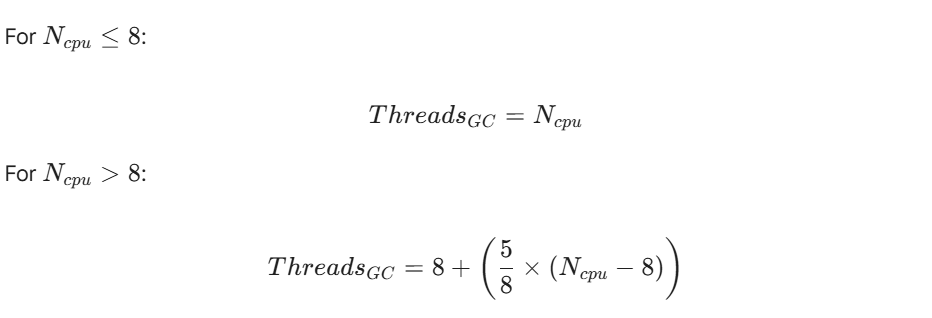

Memory management remains the primary factor for application performance in enterprise Java environments. Between 2017 and 2025, the ecosystem shifted from manual tuning to architectural selection. Industry data suggests that 60 percent of Java performance issues and 45 percent of production incidents in distributed systems stem from suboptimal Garbage Collection (GC) behavior. This guide provides a strategic framework for selecting collectors based on workload characteristics. It covers the transition from legacy collectors to Generational ZGC, analyzing trade-offs regarding throughput, latency, and hardware constraints with mathematical precision.

## Introduction

The era of "write once, run anywhere" has evolved. In modern cloud-native architectures, you must "tune everywhere." The migration from bare-metal monoliths to containerized microservices fundamentally changed how the Java Virtual Machine (JVM) interacts with memory.

A collector that performs well for a batch process often fails in a low-latency trading API. Selecting the wrong collector is no longer a minor configuration error. It is an architectural flaw. This flaw leads to cascading latency in microservices, instability in database connections, and wasted cloud resources.

This guide analyzes five primary workload categories. It synthesizes performance data from **JDK 8 through JDK 25**. It provides a technical decision matrix for Senior Architects and Site Reliability Engineers (SREs).

## Workload Analysis and Strategic Selection

We categorize applications based on their resource patterns and business goals. Each category requires a distinct memory management strategy supported by specific mathematical tuning models.

### Microservices (Spring Boot/Quarkus)

**The Challenge:** You must balance Resident Set Size (RSS) efficiency against startup time.  

In Kubernetes environments, engineers often restrict pods to fewer than 2 processors and 2 GB of RAM. The JVM ergonomics often default to the Serial GC in these conditions. This happens even if you specify another collector.

**The Strategy:**   

For most microservices, G1 GC is the balanced choice. However, deployment density matters. Research shows that G1 is the most memory-efficient collector for dense environments. In JDK 20 and later, engineers removed one of the marking bitmaps from G1. This reduced its native memory footprint, making it highly suitable for small containers.

**Warning on ZGC in Microservices:**   

Do not blindly apply ZGC to small containers. ZGC requires significant headroom. It typically needs 25 to 35 percent free memory to function without stalling. In an 8 GB container, ZGC images are significantly larger than G1 images. Tests show that ZGC struggles to manage trees of 10 services in constrained RAM. It often fails with Out-Of-Memory (OOM) errors where G1 remains stable.

### Legacy JEE (WebLogic/JBoss/Payara)

**The Challenge:** These systems handle large session states and accumulate legacy memory leaks.  

Older applications relied on Concurrent Mark Sweep (CMS). CMS was designed for shorter pauses but required shared processor resources. It was deprecated in JDK 9 and removed in JDK 14.

**The Strategy:**   

G1 GC is the primary successor for these workloads. It handles large heaps up to 128 GB by using region-based incremental collection.  

Operators must monitor heap usage after full cycles. If heap usage consistently stays above 85 percent, the application likely has a memory leak. This indicates a code issue rather than a tuning issue.

### Stateful UI (Vaadin/JSF)

**The Challenge:** These frameworks generate numerous medium-lived objects.  

User sessions reside in the heap for minutes or hours. This behavior contradicts the "weak generational hypothesis" that most objects die young. Standard configurations often promote these session objects to the Old Generation too quickly. This leads to expensive full-heap collections.

**The Strategy:**   

Tuning the `SurvivorRatio` is critical here. A standard ratio is 8 to 1. Changing this to 6 to 1 allows objects to stay in the Young Generation longer. Empirical testing shows this reduces premature promotions by **25 to 30 percent**. Generational ZGC is also an optimal choice here. It manages mixed collections across generations effectively.

### Data Intensive (Spark/Flink/Batch)

**The Challenge:** The priority is raw throughput.  

Batch workloads must complete processing windows quickly. Individual pause times do not matter. A 5-second pause is acceptable if the job finishes 10 minutes earlier.

**The Strategy:**   

Parallel GC (the "throughput collector") remains the champion. It utilizes all available cores for collection, achieving 95 to 98 percent processing efficiency. However, it requires careful thread configuration on large multi-core servers to prevent OS context-switching overhead.

**Mathematical Tuning Model: GC Threads**   

To optimize Parallel GC, explicitly set the thread count (Threads~GC~*) based on your available CPU cores (N* ~cpu~).

This formula ensures the GC utilizes resources efficiently without overwhelming the operating system scheduler on massive batch servers.

### Ultra-Low Latency

**The Challenge:** High-frequency APIs require sub-millisecond pauses.  

Trading systems cannot tolerate the unpredictable pauses of G1 or Parallel GC. However, low-latency collectors like ZGC race against the application's object creation. If the application creates objects faster than the collector can clean them, you hit an "Allocation Stall."

**The Strategy:**   

ZGC maintains pause times under 1 millisecond for heaps ranging from 8 GB to 16 TB using colored pointers and load barriers. To ensure stability, you must monitor the Allocation Rate.

**Mathematical Tuning Model: Allocation Rate**   

You must calculate the Allocation Rate (R~alloc~) over a time period (*t*) to determine if your heap headroom is sufficient.

If R~alloc~ consistently approaches the concurrent collection speed of ZGC, you must either increase the heap size or optimize the code. For modern stacks on JDK 21 or later, Generational ZGC is the superior choice as it handles high allocation rates by frequently clearing the Young Generation, preventing stalls.

## Technical Performance Deep Dives

This section explores the specific trade-offs involved in migration and architecture design.

### Migration Trade-offs: ParallelOld to ZGC

Migrating from ParallelOld to ZGC is a trade-off between raw speed and predictability.

You trade approximately 7 to 15 percent of raw throughput for a 1000x improvement in pause predictability.

ZGC imposes a "tax" on the system.

* **CPU Overhead:** ZGC adds an 8 to 20 percent CPU overhead. This comes from the concurrent threads that run alongside your application.
* **Cache Efficiency:** The use of colored pointers and read barriers impacts the processor cache. L3 cache hit rates often decline by 10 to 15 percent due to pointer metadata operations.
* **NUMA Penalty:** In Non-Uniform Memory Access (NUMA) architectures, ZGC relocation threads can suffer a 20 to 30 percent performance penalty. You must pin these threads to local memory domains to avoid this.

### Microservices and Cumulative Latency

In a microservice architecture, latency accumulates. A single user request often triggers a chain of calls across 5 to 10 services. This creates a "fan-out" effect.

If each service uses a collector like G1 or Parallel, the pauses add up. Cumulative GC pauses across a chain can amplify total latency by 3 to 5 times compared to a monolith.

Using ZGC or Shenandoah dramatically mitigates this. Tests indicate that migrating to low-latency collectors reduces this cascading latency effect by 65 percent. However, this introduces resource contention. The collector competes with application threads for CPU cycles and memory bandwidth.

### Database Connectivity Stability

Database connections are heavy, long-lived objects. They test the stability of a collector.

Empirical testing indicates that CMS was historically the most stable collector for database-intensive microservices. It handled the highest number of managed instances before crashing.

Early versions of ZGC (Non-Generational) struggled here. In small container tests with DB connections, non-generational ZGC frequently threw NullPointerException errors. It failed to maintain connectivity due to allocation stalls.

Generational ZGC (JDK 21+) resolves these issues. It frequently collects the young generation where session-related objects reside. This protects the long-lived database connections.

**Benchmark:** In Apache Cassandra tests, non-generational ZGC failed at 75 concurrent clients. Generational ZGC **maintained stability with up to 275 concurrent clients**.

## Technical Matrix and Decision Logic

Use this data to guide your architectural decisions.

### Collector Comparison (JDK 8–25)

| **Collector**  | **Supported JDK** | **Ideal Heap Size** | **Pause Time Target** | **CPU Overhead** |   **Key Technology**    |
|----------------|-------------------|---------------------|-----------------------|------------------|-------------------------|
| **Serial**     | 8–25              | \< 100 MB           | N/A (Long STW)        | Lowest           | Single-threaded STW     |
| **Parallel**   | 8–25              | Any                 | Acceptable STW        | Low              | Multi-threaded STW      |
| **G1**         | 9–25 (Default)    | 6 GB – 128 GB       | \< 200ms              | Medium           | Region-based evacuation |
| **ZGC**        | 11–25             | 8 GB – 16 TB        | \< 1ms                | High (8-20%)     | Colored pointers        |
| **Shenandoah** | 12–25             | 2 GB – 10 TB        | \< 10ms               | High             | Concurrent compaction   |

### The Decision Tree

Follow this logic to select the correct collector.

#### **Scenario A:** **The Resource Constraint**

Is the environment a tiny container (\< 2 cores/2GB RAM) or is the heap \< 100 MB?

* **Selection:** Use Serial GC (`-XX:+UseSerialGC`).

#### **Scenario B: The Batch Processor**

Is the priority 4–8 hour batch processing windows where total throughput is the only metric?

* **Selection:** Use Parallel GC (`-XX:+UseParallelGC`).

#### **Scenario C: The Generalist**

Is the application a general web service with balanced latency and throughput needs? Is the heap-to-container ratio \> 80%?

* **Selection:** Use G1 GC (`-XX:+UseG1GC`).

#### **Scenario D: The High-Performance Specialist**

Does the application require sub-1ms response times on large heaps (\> 32 GB) on JDK 21+? Do you have 25% memory headroom?

* **Selection:** Use Generational ZGC (`-XX:+UseZGC -XX:+ZGenerational`).

#### **Scenario E: The Alternative**

Are you on a non-Oracle OpenJDK and require low latency without ZGC multi-mapping?

* **Selection:** Use Shenandoah GC (`-XX:+UseShenandoahGC`).

#### G1 vs Generational ZGC in 2026

For years, the standard advice was "G1 is always best." The arrival of Generational ZGC in JDK 21 through JDK 25 challenges this.

The legacy non-generational ZGC suffered from allocation stalls. It had to scan the entire heap to find garbage. This works poorly when an application creates objects faster than the collector can clean them.

Generational ZGC exploits the Weak Generational Hypothesis, most objects die young.

By splitting the heap into generations, it achieves two goals:

1. **Throughput:** It improves throughput by 10 percent compared to its single-generation predecessor.
2. **Stability:** It prevents the allocation stalls that plagued earlier versions in high-concurrency environments.

Architect's Note:

In JDK 25, G1 remains the most memory-efficient option regarding RSS. For performance-critical stacks on JDK 21+, Generational ZGC should be the baseline, provided you provision the infrastructure with at least 25 percent memory headroom.

## The Architect's Roadmap: Optimization by JDK Version

As a Principal Java Architect, I recognize that being "stuck" on a specific JDK version often involves balancing legacy stability with the need for modern performance. Here is your roadmap for optimization and troubleshooting, depending on which version of the JVM you are currently tethered to.

### If you are on Java 8...

* **Manage the Metaspace Shift:** Since the Permanent Generation was removed in JDK 8, you must monitor your native memory usage for class metadata using `-XX:MaxMetaspaceSize`. Avoid the "bad practice" of simply renaming old `MaxPermSize` flags to Metaspace without conducting a fresh analysis of your application's class-loading needs.
* **Address the CMS Maintenance Gap:** If you are using the Concurrent Mark Sweep (CMS) collector on free builds, be aware that it is no longer maintained and lacks critical backported patches. If performance is degrading, transition to the Parallel GC for throughput or G1 GC for a balance of latency, though be wary that G1 in the Java 8 era utilized significantly more native memory than modern versions.
* **Tune for Premature Promotion:** If you see high Stop-The-World (STW) durations in the Old generation, increase your `SurvivorRatio` from the default 8:1 to 6:1. This provides more breathing room for medium-lived objects and can reduce premature promotions by up to 30%.
* **Leverage Performance Editions:** If an upgrade is impossible, consider utilizing specialized runtimes like Liberica JDK Performance Edition, which can provide a \~10% performance boost for legacy workloads.

### If you are on Java 11...

* **Re-evaluate Inherited Flags:** Do not carry over your Java 8 tuning scripts blindly; flags that benefited the Parallel collector often conflict with the G1 GC heuristics now active by default. For example, manually setting the young generation size can prevent G1 from accurately meeting its `MaxGCPauseMillis` targets.
* **Be Cautious with Experimental ZGC:** While ZGC was introduced in JDK 11, it was experimental and limited to Linux. It lacks generational capabilities in this version, making it highly susceptible to allocation stalls if your application's allocation rate is high.
* **Monitor G1 Native Footprint:** G1 was significantly improved in JDK 11 to reduce its native memory overhead, which was a major complaint in earlier versions. Use Native Memory Tracking (NMT) with `-XX:NativeMemoryTracking=summary` to ensure your container limits are not being breached by the collector's internal data structures.

### If you are on Java 17...

* **Commit to ZGC for Large Heaps:** Since JDK 15, ZGC has been production-ready and is the primary choice for heaps ranging from 8 GB to 16 TB where sub-millisecond latency is required. However, ensure you have 15-25% memory headroom beyond your peak working set to accommodate ZGC's concurrent relocation work and metadata.
* **Enable Huge Pages:** On Linux, enable Transparent Huge Pages (THP) or explicit large pages to achieve a "free lunch" performance boost of approximately 10%.
* **Transition from CMS:** If you are migrating from Java 8/11 to 17, remember that CMS was removed in JDK 14. You must move to G1 or ZGC; G1 is typically the most stable choice for memory-constrained environments where the heap-to-container ratio exceeds 80%.
* **Use Modern Diagnostics:** Utilize JDK Flight Recorder (JFR) for profiling with less than 2% overhead to identify fine-grained allocation patterns and object creation rates.

### If you are on Java 21...

* **Activate Generational ZGC:** This is the most significant change in modern JVM performance. Use the flags `-XX:+UseZGC -XX:+ZGenerational` to handle high allocation rates that would have caused stalls in earlier versions. In benchmarks like Apache Cassandra, this version remains stable with up to 275 concurrent clients, whereas the non-generational version often failed at 75.
* **Exploit the Weak Generational Hypothesis:** Generational ZGC improves throughput by 10% compared to legacy ZGC by focusing its collection efforts on the young generation where most objects "die young".
* **Leverage G1 Efficiency:** If your environment is extremely memory-constrained, the G1 collector in JDK 21 is more efficient than ever, as it now requires only one marking bitmap instead of two, significantly reducing its Resident Set Size (RSS).
* **Adopt Compact Object Headers:** Consider enabling the compact object headers feature (experimental in 24, but maturing in late 21 updates) to reduce the memory footprint of every object on the heap, improving overall throughput.

> **Analogy:** Navigating Java versions is like maintaining a building's HVAC system. **Java 8** is an old boiler where you must manually watch the pressure gauges (Metaspace and PermGen). **Java 11 and 17** are modern units that work well but require you to clear out the old filters (inherited flags) to be effective. **Java 21** is a smart climate control system: by enabling Generational ZGC, the system finally becomes intelligent enough to focus its energy only on the rooms currently in use (the young generation), saving you massive amounts of manual labor and resource cost.

## Conclusion

**There is no single "best" collector. There is only the right collector for your specific constraints.**

Parallel GC is a massive double-decker bus. It carries the most passengers (throughput) but blocks all traffic when it stops. G1 is a fleet of mid-sized shuttles. They cause frequent but short delays. Generational ZGC is a network of drones. They deliver instantly, but they consume more energy and space to operate.

Align your JVM configuration with your business goals. Monitor your allocation rates using the equations provided. And most importantly, stop treating memory management as an afterthought.

**References**

1. Gullapalli, V. (2025). *Adaptive JVM Optimization: Charting the Path from ParallelOld to ZGC Excellence*. Al-Kindi Publisher. Journal of Computer Science and Technology Studies, 7(8).
2. Edelveis, C. (2024). *An Overview of Java Garbage Collectors*. BellSoft Corporation.
3. Cai, Z., Blackburn, S. M., Bond, M. D., \& Maas, M. (2022). *Distilling the Real Cost of Production Garbage Collectors*. arXiv:2204.06782.
4. Johansson, S. (2023). *Garbage Collection in Java: Choosing the Correct Collector*. Oracle Corporation (Java YouTube Channel).
5. Oracle Corporation. (2023-2025). *Java Platform, Standard Edition HotSpot Virtual Machine Garbage Collection Tuning Guide, Release 21*. Oracle Help Center.
6. Reddit Community. (2021-2025). *How to choose the best Java garbage collector*. r/java.
7. Korando, B. (2023). *Introducing Generational ZGC*. Inside Java.
8. Johansson, S. (2023). *JDK 21: The GCs keep getting better*. OpenJDK Performance Blog.
9. Ericson, A. (2021). *Mitigating garbage collection in Java microservices*. Mid Sweden University. DiVA portal.
10. Canales, F., Hecht, G., \& Bergel, A. (2021). *Optimization of Java Virtual Machine Flags using Feature Model and Genetic Algorithm*. ACM ICPE '21 Companion.
11. Diakogiannis, A. D. (2024). *The Generational Z Garbage Collector (ZGC)*. JEE.gr.
12. Diakogiannis, A. D. (2017). *Ta Java VM Options pou prepei na ksereis ti kanoun!*. JEE.gr.
