Originally published at [developer.ibm.com](https://developer.ibm.com/articles/j-java-performance/ "developer.ibm.com").

*By Vijay Sundaresan, Mark Stoodley, Marius Pirvu, Grace Robinson, Laura Cowen*

*Explore real‑world benchmarks, tuning options, and best‑practice strategies to optimize latency, throughput, and memory on modern hardware with Semeru Runtimes, an OpenJDK distribution.*

When running applications in the cloud, performance matters. An application that handles more requests with less CPU and memory is cheaper to run. Java and its associated frameworks are widely appreciated for stability, throughput performance, and portability but not typically recognized for starting quickly, ramping up quickly, or consuming resources frugally. These limitations can pose significant challenges, especially when migrating Java applications to the cloud or developing new cloud-native Java solutions where more resources immediately make deployments more expensive.

Efficient cloud-native applications have at least four key performance metrics:

1. Fast startup time
2. Fast rampup time (time to peak performance)
3. High throughput
4. Low memory footprint

Throughout this article, we'll use a 'report card' metaphor with these metrics to assess the kinds of problems Java applications typically experience and the relative contributions of recent innovations, particularly in the [IBM Semeru Runtimes JDK](https://developer.ibm.com/articles/awb-where-do-you-get-your-java/ "IBM Semeru Runtimes JDK"), to help improve performance in your Java applications.

IBM Semeru Runtimes JDK is a free, production-ready Java distribution built with the OpenJDK class libraries and the Eclipse OpenJ9 JVM. It is designed as a drop-in replacement for any other JDK to help developers build and run Java applications efficiently and effectively. It can be easily [downloaded](https://developer.ibm.com/languages/java/semeru-runtimes/downloads/ "downloaded") or installed using, for example, [SDKman](https://sdkman.io/ "SDKman") (run sdk install java 25.0.1-sem).

Performance for typical Java applications
-----------------------------------------

The following figure shows a typical transactional Java application and its typical performance over time across the four key metrics:

* A start-up period (startup time) when the application is getting up and running but not yet handling any requests or doing any useful work.
* A ramp-up period (rampup time) when various caches are populated, thread pools are warmed up, and the JIT compiler is warmed up.
* Throughput, which slowly increases and might follow a curve like the one shown in the graph. When all warmup activities are completed, the application reaches a state of peak throughput (steady state).
* Memory footprint (light gray line), which initially increases rapidly as the application starts compiling, before settling down to a relatively steady memory usage when compilation is complete.

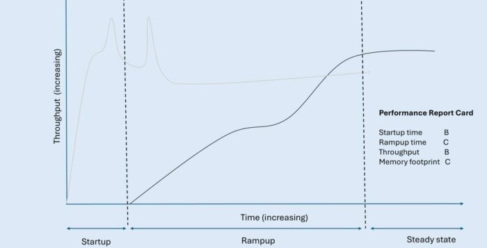

Longer startup time means paying for resources that aren't delivering any value (that is, responding to requests). Slower rampup means paying for resources while getting less than full value (that is, requests are taking longer and not as many are being fulfilled). Overall throughput performance should be as high as possible to minimize either the size of machine needed or the number of machines needed to handle incoming customer workload. The initially spiky memory usage is expensive too, so we'll look at how to smooth out that line towards the end of the article.

Each of the recent Java performance innovations discussed in this article has a potential impact on the key metrics that define performant cloud-native applications. In our report card, we've started by grading each metric without the contribution of the innovations.

| Typical Java application performance report card | Grade |
|--------------------------------------------------|-------|
| Startup Time                                     | B     |
| Rampup Time                                      | C     |
| Throughput                                       | B     |
| Memory Footprint                                 | C     |

These grades might seem somewhat arbitrary, but we've assigned them based loosely on our own qualitative view of the competitive picture of the Java deployment technologies available across the entire Java ecosystem, including other JDKs like [Eclipse Temurin](https://adoptium.net/en-GB/temurin "Eclipse Temurin") and [GraalVM native images](https://www.graalvm.org/ "GraalVM native images"). We'll see throughout this article how to improve the grade for each of these key metrics.

Improving an application's startup and rampup time
--------------------------------------------------

Three key Semeru JDK innovations can help with both startup time and rampup time: shared classes cache, InstantOn, and Cloud Compiler.

### Improving startup and rampup time with shared classes cache

For two decades, Semeru (formerly IBM SDK for Java) has included a technology called "[shared classes cache](https://eclipse.dev/openj9/docs/shrc/ "shared classes cache")." With this feature enabled and properly configured, many Java applications start in about half the time required by other JDK distributions. But recent improvements to shared classes cache mean that more applications can benefit in this way.

The shared classes cache stores Java classes and JIT-compiled code in an on-disk format that can be memory-mapped on demand into a running JVM. This means that Java applications can reuse the class loading and JIT compilation effort spent in earlier runs of an application without spending as much effort to process those classes and JIT-compiled methods. However, to achieve the startup improvements, an application either needed to rely exclusively on URLClassLoaders (which the JDK has instrumented to take advantage of the shared classes cache) or you had to modify your class loaders.

For many applications, the shared classes cache just worked "out of the box." Running the [Daytrader8 application](https://github.com/OpenLiberty/sample.daytrader8 "Daytrader8 application") on [Open Liberty](https://openliberty.io/guides/getting-started.html "Open Liberty") with the shared classes cache configured in Semeru, we saw improved startup time performance compared to other JDKs. Increasing the size of the cache enables more JIT-compiled methods to be stored which can further improve startup time.

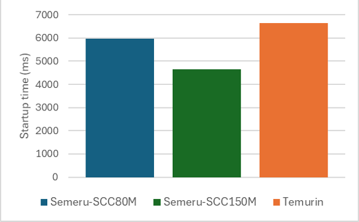

But some applications, such as the JBoss EAP application server, saw very little startup improvement with the shared classes cache because not all classes were loaded by a URLClassLoader. Before we improved the shared classes cache, an example JBoss application (such as AcmeAir) was only able to store 3,340 classes and 3,250 compiled methods in the shared classes cache. These classes and compiled methods are from the Java class libraries themselves, not the application server or the application.

|                                  | Semeru Java17 baseline | Semeru Java17 with -XX:+ShareOrphans |
|----------------------------------|------------------------|--------------------------------------|
| # of classes in shared cache     | 3340                   | 18875                                |
| # of AOT methods in shared cache | 3250                   | 5639                                 |

With the improved shared classes cache, there is a dramatic increase in the number of classes (almost 5x) and AOT methods (almost double) now eligible to be loaded by SharedClassCache. By reusing more classes and compiled JIT code, JBoss starts the AcmeAir application 11% faster (msec) with just one additional command-line option (`-XX:+ShareOrphans`). This option has now been made default if a user runs with the shared classes cache enabled in recent releases of IBM Semeru Runtimes.

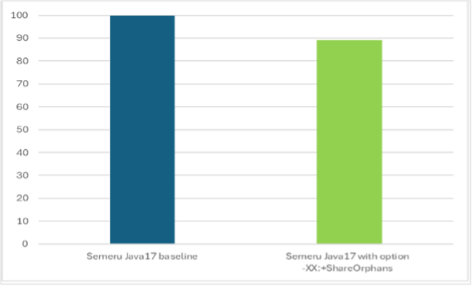

Although 11% is a significant improvement, it isn't enough to really change our report card. But the shared classes cache isn't the only technology available in IBM Semeru Runtimes that can improve the time it takes to start Java applications.

### Improving startup and rampup time with InstantOn

[InstantOn](https://openliberty.io/docs/latest/instanton.html "InstantOn") is a whole-stack solution for achieving extremely fast startup times for Java apps. Java applications running on Open Liberty with InstantOn can start up in milliseconds rather than seconds, enabling serverless use cases. InstantOn is [based on a Linux technology called CRIU](https://foojay.io/today/how-we-developed-the-eclipse-openj9-criu-support-for-fast-java-startup/ "InstantOn") (available on x86, AArch64, IBM Power, IBM Z) so it is primarily relevant to containers on Linux platforms.

CRIU allows you to snapshot a process and write all the process state into checkpoint files on disk which can then be restored later. We take the checkpoint after having already started the application and run it to a certain point; when we restore, we only need to pick up execution from that point. Because we don't need to start the application from scratch when we restore, the startup time is reduced significantly.

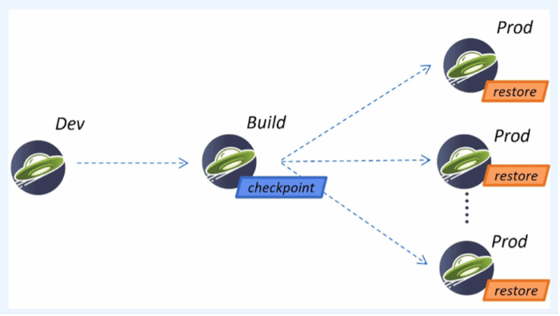

So, how do you use InstantOn to make your application start faster? The easiest way is to package your application to run on Liberty and Semeru, which together hide most of the complexity of CRIU and OS-level details of how it works. This is a unique solution in the industry in terms of being whole stack, as there have been several [changes made to both Liberty and Semeru](https://dzone.com/articles/five-java-developer-must-haves-for-ultra-fast-star "changes made to both Liberty and Semeru") to make configuration a painless experience for the end-user.

To use InstantOn, you develop your application as normal. The only change is an additional step when building the container image: you start your application, run it to the point where you want to take your CRIU checkpoint, and then you take the checkpoint. In the Liberty application Dockerfile, you just specify whether the checkpoint should be taken before or after the application starts by specifying a single option, "beforeAppStart" or "afterAppStart". When the image is built, a set of checkpoint files are created, which are included in the container image along with everything else. When deploying to production, Liberty first looks for checkpoint files at a designated location and restores from those files, resulting in extremely fast startup. If there are no checkpoint files found, the normal startup (using the JVM and no checkpoint files) is performed.

As seen with three different applications running on Open Liberty, PingPerf, Rest Crud, and AcmeAir Microservice Main, InstantOn can start your application almost 10X faster! The following figure shows the first response times (msec; lower is better) of each application without and with InstantOn.

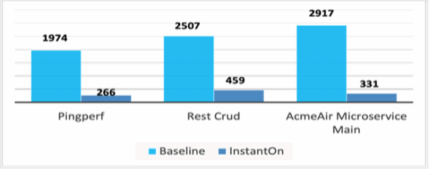

You can also use the InstantOn support in IBM Semeru Runtimes to start Java workloads that don't use Open Liberty, but the user experience isn't quite as simple. In the following figure, a [Quarkus](https://code.quarkus.io/ "Quarkus") app that normally starts in approximately 5 seconds with Temurin can start in milliseconds (time to first response) with InstantOn, which makes it comparable to what we see with the [GraalVM](https://www.graalvm.org/ "GraalVM") native image.

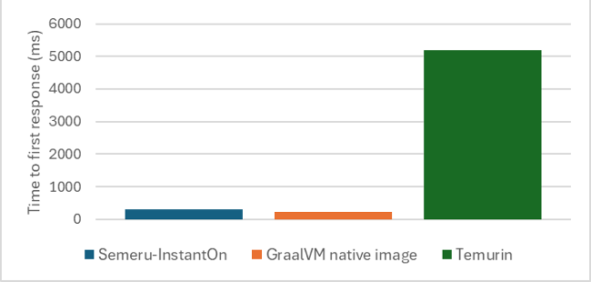

The benefit of InstantOn over GraalVM native images is that your application can dynamically load new classes and has an active JIT compiler even after the checkpoint is restored: the application instance restores as a fully functional JVM. You don't need to change how you write and maintain your Java applications. Retaining this full Java support with high throughput, low memory footprint, and seamless dev-prod parity makes this solution broadly appealing to many Java developers.

|     Characteristics     | Semeru InstantOn | Semeru JVM | GraalVM Native |
|-------------------------|------------------|------------|----------------|
| Full Java Support       | Yes              | Yes        | No             |
| InstantOn               | Yes              | No         | Yes            |
| High throughput         | Yes              | Yes        | No             |
| Low memory (under load) | Yes              | Yes        | Yes            |
| Dev-prod parity         | Yes              | Yes        | No             |

Returning to our typical application performance graph, these improvements mean that everything moves to the left. The startup period, which was noticeable in terms of time on the x-axis, becomes almost nothing because you can start up very, very quickly. The application starts much faster, and because of that you reach peak throughput earlier with reduced rampup time.

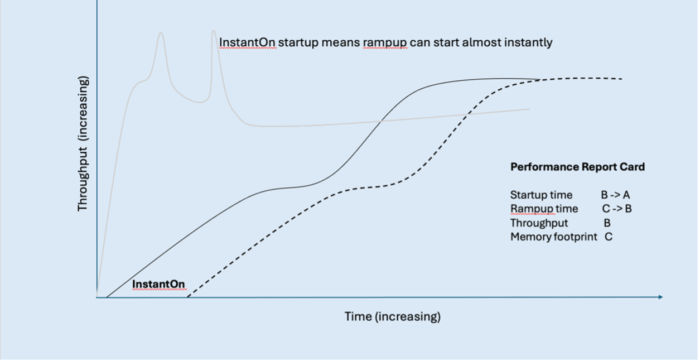

InstantOn improves the grade on our report card for startup time and for rampup time. But because the rampup improvement came from just shifting the performance curve to the left, we'll only improve the rampup time grade to a 'B' as the application is still ramping up at roughly the same rate.

| Java application report card with startup innovations | Grade |
|-------------------------------------------------------|-------|
| Startup Time                                          | B → A |
| Rampup Time                                           | C → B |
| Throughput                                            | B     |
| Memory Footprint                                      | C     |

If you're already using Semeru Runtimes, but haven't tried the InstantOn feature yet, see [CRIU support](https://eclipse.dev/openj9/docs/criusupport/ "CRIU support") and [Liberty InstantOn](https://openliberty.io/docs/latest/instanton.html "Liberty InstantOn").

### Improving startup and rampup time with Semeru Cloud Compiler

We can improve rampup time further by using the Cloud Compiler. The Cloud Compiler (sometimes also called [JIT Server](https://developer.ibm.com/articles/jitserver-optimize-your-java-cloud-native-applications/ "JIT Server")) decouples the JIT compiler from the JVM to operate as an independent process or even as a remote service. The JIT compiler is a critical JVM component because it helps enable high throughput for Java applications, but its overhead is like the Garbage Collector in that it is active at run time. The Cloud Compiler moves this overhead out of the running application container. Multiple applications can also connect to the same JIT compiler process to reduce costs even further.

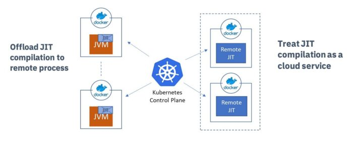

As a separate process, the compiler can scale independently of the rest of the application. You can give more CPU or more memory to the Cloud Compiler according to demand and significantly improve the ramp-up time of the application, or applications, connected to the Cloud Compiler.

To enable the Cloud Compiler for Open Liberty applications running in OpenShift with the Liberty operator, just toggle `spec.semeruCloudCompiler.enable` from `false` to `true` in your `OpenLibertyApplication` custom resource. This sets up a Cloud Compiler for you and sets up the connections to the client too.

You can also easily try Cloud Compiler outside Kubernetes or OpenShift by starting a server with `JDK/bin/jitserver` and adding `-XX:+UseJITServer` to the client JDK command line. Refer to the [documentation](https://eclipse.dev/openj9/docs/jitserver/ "documentation") for additional configuration options.

Let's look at some applications in real performance tests.

The following figure illustrates the throughput of the Daytrader8 application running on Open Liberty with Cloud Compiler.

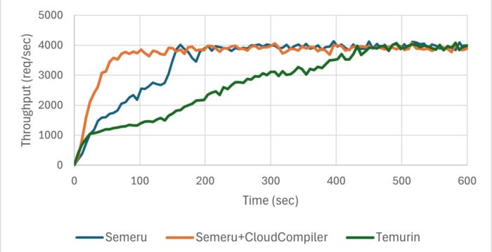

The following figure illustrates the throughput of the RestCRUD application running on Quarkus with Cloud Compiler.

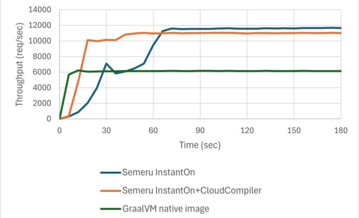

The real applications didn't ramp up as steeply as our fictional curve but they were clearly trending toward that goal. The blue line shows throughput without Cloud Compiler, whereas the orange line represents throughput with Cloud Compiler enabled. Using the Cloud Compiler allowed Daytrader8 to process 60% more transactions within the first 150 seconds and achieve peak throughput 55% faster. Similarly, the Cloud Compiler helped RestCRUD handle 80% more transactions during the first 60 seconds and achieve peak throughput 73% faster.

This remarkable improvement stems from two key factors:

* Application threads ran without interruption from JIT compilation activity.
* Cloud Compiler, running on more CPUs, performed compilations faster, enabling the application to benefit from optimized native code much sooner.

We are looking to further improve this trend and shift this whole graph to the left even further (by \~10 seconds). We call this 'InstantHot'. Just as InstantOn will enable us to rapidly start up applications, InstantHot will enable us to both rapidly start up and rapidly ramp up applications, providing a powerful combination for our Java applications.

Using the Cloud Compiler with our application significantly changes the shape of the rampup graph, and improves rampup time---converting our rampup grade from a B to an A.

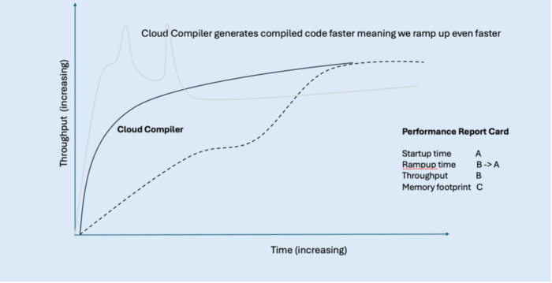

Let us look at our scores again with these innovations:

| Java application report card with rampup innovations | Grade |
|------------------------------------------------------|-------|
| Startup Time                                         | A     |
| Rampup Time                                          | B → A |
| Throughput                                           | B     |
| Memory Footprint                                     | C     |

If you're using Semeru Runtimes, but you haven't yet tried the Cloud Compiler technology, see [JITServer technology](https://eclipse.dev/openj9/docs/jitserver/ "JITServer technology") and [Semeru Cloud Compiler](https://www.ibm.com/docs/en/was-liberty/core?topic=operator-semeru-cloud-compiler&utm_source=ibm_developer&utm_content=in_content_link&utm_id=articles_j-java-performance&cm_sp=ibmdev-_-developer-articles-_-ibmcom "Semeru Cloud Compiler").

Our startup and rampup scores are now looking great, both with scores of A. However, our other important performance factors, throughput and memory footprint, aren't looking as good yet. Let's look at how we can improve our throughput grade first.

Improving an application's throughput
-------------------------------------

To improve our application's throughput, the trend line on our graph needs to be higher on our y-axis. Investing in further JIT compiler optimizations in Semeru Runtimes can help here.

### Improving throughput with Semeru Runtimes

Our goal is to get good throughput performance improvement for Semeru on multiple applications while still achieving fast startup and rampup time, with low memory footprint. So far, we have seen Semeru throughput (shown in the rampup graphs) be very competitive on Liberty and Quarkus apps. For another example, we improved benchmark suite [TPC-H](https://www.tpc.org/tpch/ "TPC-H") query times with [Apache Spark](https://spark.apache.org/ "Apache Spark") by an average of 36%.

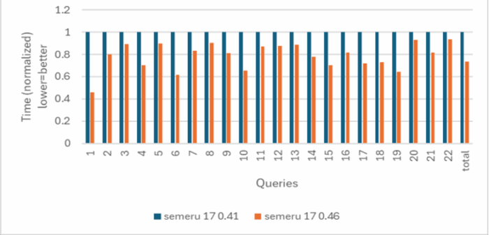

We achieved these improvements through a variety of different techniques, including platform tuning on the latest hardware (for example, Java intrinsics, array copying, and object allocation), general performance enhancements (for example, `java.lang.invoke.*` class, final static field folding, and change trade-offs with other performance metrics), and analyzing and tuning apps. Since the default policy in the Semeru JDK is to balance for all performance metrics out of the box, we also have an option `--Xtune:throughput` which skews the trade-off toward improved throughput performance at the cost of other metrics.

Security is another important consideration for most enterprise applications. The Semeru JDK also optimizes Java cryptographic operations using native acceleration, thus achieving the best of both worlds: security and throughput performance. The following figure shows our hypothetical Java application's throughput performance with Semeru.

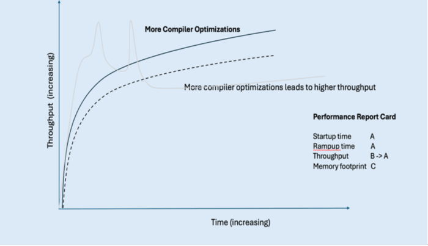

For throughput, we've been able to improve throughput from a grade B to an A as a result of all this work.

| Java application report card with throughput innovations | Grade |
|----------------------------------------------------------|-------|
| Startup Time                                             | A     |
| Rampup Time                                              | A     |
| Throughput                                               | B → A |
| Memory Footprint                                         | C     |

However, we still have a low score for memory footprint. Let's look at this last element of our score card and see what we can do to improve this and turn our Java distribution into a "straight A student."

Improving an application's memory footprint
-------------------------------------------

The following figure shows a typical memory graph when an application starts: when the application first starts, memory use rapidly increases as the application starts compiling, hence the large spikes at the start of our graph as these resources are used. When these compilations are complete, the application's memory usage settles down and reaches a relatively steady memory footprint.

While the steady-state memory use is typically much better than with other Java distributions, this trendline demonstrates how the stereotypical memory footprint is not very efficient and can be improved, hence the C grade in our report card. Let's look at how we can improve this grade.

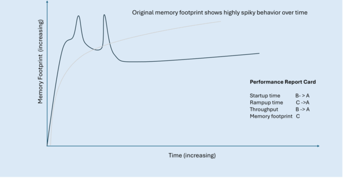

### Improving memory footprint with Semeru Cloud Compiler

With an active Semeru Cloud Compiler, memory spikes during application rampup are eliminated, and the trend line quickly reaches a steady memory state. The JIT compiler consumes resources in its own separate container where we can more efficiently allocate memory across both the compiler and its clients.

We ran the same two applications (Daytrader8 on Open Liberty and RestCRUD on Quarkus) as when we looked at rampup, and measured their memory footprint.

As you can see in the following graph, for Daytrader8 on Open Liberty, without the Cloud Compiler (blue trendline) the memory footprint has a few large spikes and takes a longer period to reach its steady state. With the Cloud compiler (orange trendline), we removed those spikes and the application reached steady state much sooner.

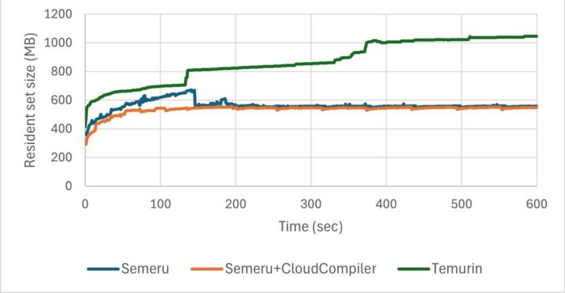

Similarly, for RestCRUD on Quarkus, the Cloud Compiler removed the large spikes and the application reached steady state much sooner.

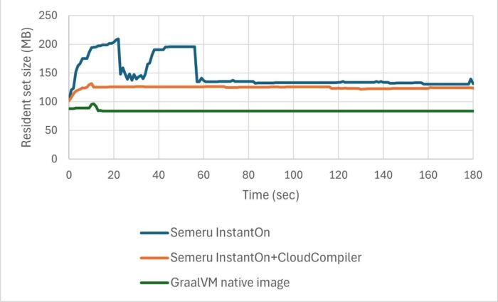

The following figure shows our hypothetical Java application's memory footprint with Cloud Compiler.

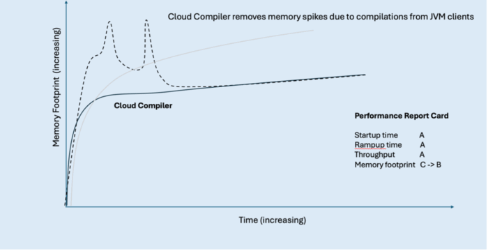

This innovation allows us to improve our score for memory footprint from a C to a B, but there is even more we can do to achieve a straight A report card.

| Java application report card with memory spike innovations | Grade |
|------------------------------------------------------------|-------|
| Startup Time                                               | A     |
| Rampup Time                                                | A     |
| Throughput                                                 | A     |
| Memory Footprint                                           | C → B |

### Improving memory footprint with Semeru Runtimes

As well as removing the memory spikes and reaching this steady state sooner, we want to try and reduce the overall memory footprint that our application needs, lowering this trendline on our graph. We can do this using Semeru Runtimes.

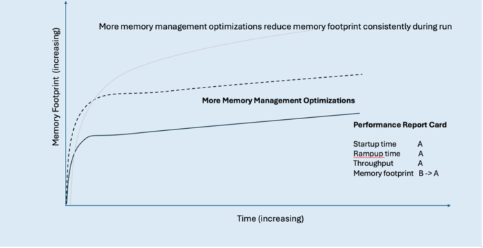

Semeru's memory footprint characteristics even without the Cloud Compiler are quite good throughout the run when running in JVM mode as well as when compared with native image. Even though memory footprint is not as good as native image in absolute terms, the fact that Semeru delivers almost 2x the throughput while consuming only a bit more memory means that from a "throughput per megabyte of memory" metric, Semeru does exceptionally well. This kind of metric demonstrates a key point: Semeru is achieving all these performance characteristics all at once, making the overall user experience a more balanced one from a performance perspective.

| Java application report card with memory footprint innovations | Grade |
|----------------------------------------------------------------|-------|
| Startup Time                                                   | A     |
| Rampup Time                                                    | A     |
| Throughput                                                     | A     |
| Memory Footprint                                               | B → A |

Summary
-------

Overall, by making use of the innovations and improvements discussed in this article---Semeru Runtimes, shared classes cache, InstantOn, and Semeru Cloud Compiler---we've transformed our imaginary JDK performance report card to a straight-A student.

| Java application report card with all innovations | Grade |
|---------------------------------------------------|-------|
| Startup Time                                      | B → A |
| Rampup Time                                       | C → A |
| Throughput                                        | B → A |
| Memory Footprint                                  | C → A |

Now, our two performance graphs for throughput and memory footprint have vastly different trendlines for our application:

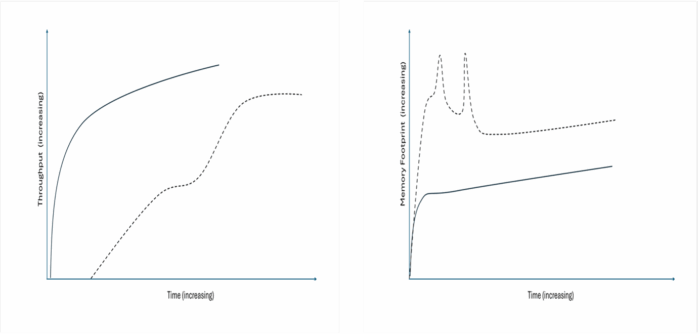

The exciting thing is that this work is ongoing and we're continuing to investigate and research how we can continue to improve these critical metrics (just like any good straight A student) and make our Java applications even more performant with IBM Semeru Runtimes. So keep an eye on this space, there's more to come.

Next Steps
----------

Hopefully this article has helped to inspire you to consider how you could make your own Java applications more performant with IBM Semeru Runtimes, whether it be your startup time, rampup time, throughput, or memory footprint.

We highlighted several tools and innovations to use in your own apps to help with each of these metrics, and we showed how everything fits together in a comprehensive performance strategy aimed at improving different metrics and applications without stark tradeoffs from a usability or performance viewpoint. By taking a balanced approach to performance, it really is possible to have it all with IBM Semeru Runtimes.

If you're not already using Semeru Runtimes but would like to try it out, [download it now](https://developer.ibm.com/languages/java/semeru-runtimes/downloads/ "download it now").

Alternatively, if you're interested in finding out more about Liberty and how it complements Semeru Runtimes, try our [Getting Started guide](https://openliberty.io/guides/getting-started.html "Getting Started guide") on the Open Liberty website.
