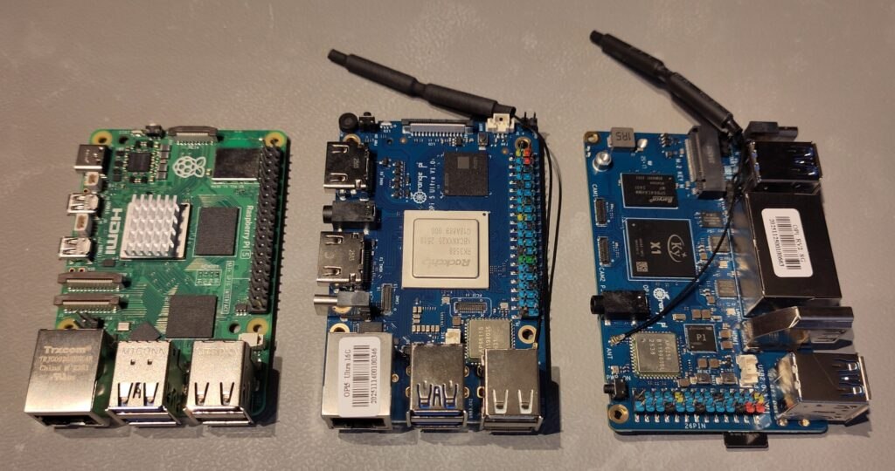
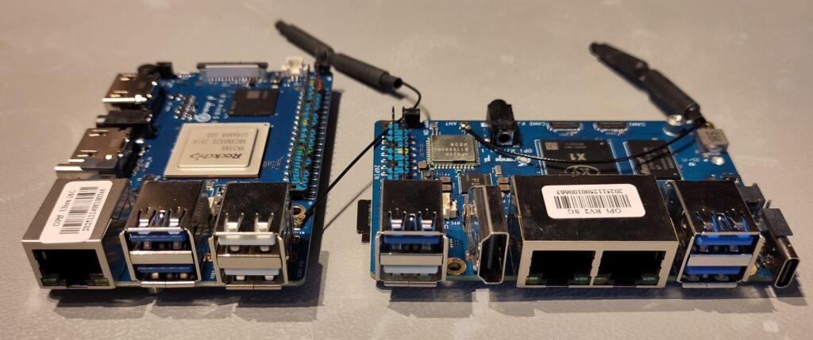
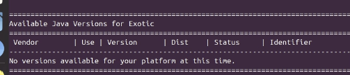

As part of my 2026 learning goals around Java on Single Board Computers and RISC-V (see [this post about x86 versus ARM versus RISC-V](https://webtechie.be/post/2026-01-07-x86-arm-riscv/)), I've been asking various suppliers to send me evaluation boards. After testing the [LattePanda IOTA](https://webtechie.be/post/2025-11-25-first-test-lattepanda-iota-with-ubuntu-and-java/), I received two boards from OrangePi to evaluate: the OrangePi 5 Ultra (ARM) and the OrangePi RV2 (RISC-V).

I got both boards for free, but what I write here and show in the video is not controlled by OrangePi or any other supplier.



## OrangePi Lineup

OrangePi offers a diverse range of single board computers at various price points. For this table, I focused on the two boards that I received:

|                                                        Board                                                         |   SOC   |  Type  |    CPU     | Cores |   Speed    |                                                                                           Price |
|----------------------------------------------------------------------------------------------------------------------|---------|--------|------------|:-----:|:----------:|------------------------------------------------------------------------------------------------:|
| [Raspberry Pi 4](https://api.pi4j.com/board-information/MODEL_4_B)                                                   | BCM2711 | ARMv8  | Cortex-A72 |   4   |   1.8Ghz   |         [68€ (4GB)](https://www.amazon.com.be/-/en/Raspberry-Pi-Model-4GB-LPDDR4/dp/B09TTNF8BT) |
| [Raspberry Pi 5](https://api.pi4j.com/board-information/MODEL_5_B)                                                   | BCM2712 | ARMv8  | Cortex-A76 |   4   |   2.4Ghz   | [79€ (4GB)](https://www.amazon.com.be/-/en/Raspberry-4GB-Quad-Core-ARMA76-64-bit/dp/B0CK3L9WD3) |
| [OrangePi 5 Ultra](http://www.orangepi.org/html/hardWare/computerAndMicrocontrollers/details/Orange-Pi-5-Ultra.html) | RK3588  | ARMv8  | Cortex-A76 |   4   |   2.0GHz   |                                         [175$ (8GB)](https://www.amazon.com/dp/B0FL2B8V8B?th=1) |
| [OrangePi RV2](http://www.orangepi.org/html/hardWare/computerAndMicrocontrollers/details/Orange-Pi-RV2.html)         | Ky X1   | RISC-V |            |   8   | 2.0GHz (?) |                                          [53$ (4GB)](https://www.amazon.com/dp/B0DZ6W7XD5?th=1) |

The OrangePi 5 Ultra is a high-end board with the powerful RK3588 SOC (same chip used in many Android TV boxes and mini PCs), while the OrangePi RV2 is their budget RISC-V with a Kylin X1 processor.


## Test Boards

I received two boards, two eMMC modules, and two power supplies. So everything to get me started! But to speed things up, I decided to use SD cards for the Operating System and will use the eMMC modules later, which should give a significant better performance.

### OrangePi 5 Ultra

More info about the OrangePi 5 Ultra is available here:

* [Product page](http://www.orangepi.org/html/hardWare/computerAndMicrocontrollers/details/Orange-Pi-5-Ultra.html)
* [Documentation](http://www.orangepi.org/html/hardWare/computerAndMicrocontrollers/service-and-support/Orange-Pi-5-Ultra.html)
* [User Manual](https://drive.google.com/drive/folders/1_MwhgA72OF2NCl3SwzzrA3XLGtdAYYq4)
* [Ubuntu Images](https://drive.google.com/drive/folders/1ca_0M3b1cZoXJP7rVUd2fUgdeAbCZbZk)

I used the image: `Orangepi5ultra_1.0.0_ubuntu_jammy_desktop_xfce_linux6.1.43`.

### OrangePi RV2

More info about the OrangePi RV2 is available here:

* [Product page](http://www.orangepi.org/html/hardWare/computerAndMicrocontrollers/details/Orange-Pi-RV2.html)
* [Documentation](http://www.orangepi.org/html/hardWare/computerAndMicrocontrollers/service-and-support/Orange-Pi-RV2.html)
* [User Manual](https://drive.google.com/drive/folders/1EAS0zgeR0cbZlLHeph5I_Y43rhKoS5af)
* [Ubuntu Images](https://drive.google.com/drive/folders/1QgQRX-wtvsTJnOoMBVct-g5HLWb7g6n-)

I used the image: `Orangepirv2_1.0.0_ubuntu_noble_desktop_gnome_linux6.6.63`.

## Getting Started

### Hardware Setup

Both boards arrived well-packaged. The OrangePi 5 Ultra looks almost identical as a Raspberry Pi 5. It has an excellent build quality with very similar connecters, except it has a full HDMI in and out, compared to two micro HDMI out on the Raspberry Pi 5. The RV2 has again the same size as a Raspberry Pi, but with a completely different port layout and only 26 GPIO pins compared to 40 on the Raspberry Pi 5 and OrangePi 5 Ultra. Both boards have a detachable Wi-Fi antenna-cable.


Installation for both followed a similar pattern: download the Ubuntu image from OrangePi's Google Drive, flash to microSD, and boot.

## Java Installation and Testing

### OrangePi 5 Ultra (ARM)

For the ARM-based 5 Ultra, I wanted to test the full Java stack including JavaFX. With SDKMAN I could quickly install a JDK and JBang.

#### Installing SDKMAN

Run the `curl` command to install SDKMAN, and open a new shell, or use the `source` command to activate SDKMAN:

```
curl -s "https://get.sdkman.io" | bash
source "$HOME/.sdkman/bin/sdkman-init.sh"
sdk version
```

SDKMAN provides easy access to multiple Java distributions and versions. For this board, I installed Azul Zulu 25 with JavaFX:

```
sdk install java 25.0.1.fx-zulu
sdk install jbang
```

#### Testing with Pi4J Examples

I cloned my [JBang project from the Pi4J repositories](https://github.com/Pi4J/pi4j-jbang) to run some tests:

```
git clone https://github.com/Pi4J/pi4j-jbang.git
cd pi4j-jbang
```

The plain Java examples worked perfectly. The JavaFX example also ran smoothly, demonstrating that the RK3588 GPU is well-supported in Ubuntu. The board feels very responsive with these first, quick tests.

### OrangePi RV2 (RISC-V)

The RV2 was more challenging, as expected with RISC-V hardware.

#### Java Installation

SDKMAN doesn't yet have RISC-V support to install Java. I made a [GitHub issue](https://github.com/sdkman/sdkman-cli-native/issues/367) and [first pull request](https://github.com/sdkman/sdkman-candidates/pull/74#event-21926242644), and will try to get this moving. I hope this will help more Java developers to experiment with RISC-V.
 

For now, the Ubuntu repositories are the way to go:

```
sudo apt update
sudo apt upgrade
sudo apt install openjdk-25-jdk
```

This installed OpenJDK 25 for RISC-V (but without JavaFX dependencies).

#### Testing Basic Java

I ran the same JBang examples that worked on the OrangePi 5 Ultra. Plain Java code executed without issues, but JavaFX examples failed as expected due to missing dependencies. The same issues with Pi4J are reported regarding user rights, something to investigate in the future.

#### OrangePi RV2 Performance Comparison

[Phoronix](https://www.phoronix.com/) conducted comprehensive benchmarks comparing the OrangePi RV2 with Raspberry Pi boards. Their [Java SciMark 2.2 tests](https://www.phoronix.com/review/orange-pi-rv2-benchmarks/5) show the RV2 is 2-7 times slower than the Raspberry Pi 5 depending on the workload.

The [overall benchmark results](https://www.phoronix.com/review/orange-pi-rv2-benchmarks/7) paint a clearer picture:


The RV2 scores lower than both the Raspberry Pi 4 and 5 across most tests. This isn't a surprise because RISC-V is still maturing, and the Ky X1 is an early implementation. The 8 cores help with parallel workloads, but single-threaded performance lags behind ARM equivalents.

In contrast, the OrangePi 5 Ultra performs exceptionally well and should be comparable to the Raspberry Pi 5 performance thanks to the powerful RK3588 SOC. But that's an other personal goal for 2026, setting up a good benchmark to compare Java performance on various boards...

## Conclusion

These two boards represent vastly different approaches. The OrangePi 5 Ultra is a premium board that competes directly with high-end single-board and desktop computers for many tasks. It's more expensive than a Raspberry Pi but delivers impressive performance. Thanks to SDKMAN and the various Java tools that work just as wel as on any other type of Linux computer, including JavaFX, it's an attractive platform for serious development work for a low price.

The OrangePi RV2, on the other hand, is clearly a budget RISC-V board for experimenters. The performance doesn't match ARM boards in the same price range (yet?), but that's not really the point. It's an affordable way to explore RISC-V, contribute to ecosystem development, and prepare for a future where RISC-V becomes more competitive.

For Java developers specifically: if you need a powerful ARM board for actual work, the OrangePi 5 Ultra is worth considering. If you're curious about RISC-V and want to help mature the Java ecosystem on this architecture, the RV2 provides a low-cost entry point.

My testing continues with more RISC-V boards coming soon! If you're working on similar projects or have experience with Java on OrangePi boards, I'd love to hear about it. Feel free to reach out through [Mastodon](https://foojay.social/@frankdelporte) or the [Foojay.io community](https://foojay.io/).
