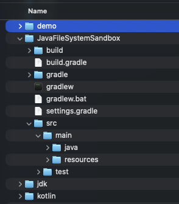
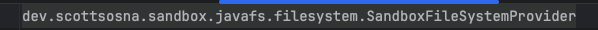

So what does *file system* mean to you? Most think of file systems as directories and files accessed via your computer: local disk, remotely shared via [NFS](https://en.wikipedia.org/wiki/Network_File_System) or [SMB](https://en.wikipedia.org/wiki/Server_Message_Block), thumb drives, something else. Sufficient for those who require basic file access, nothing more nothing less.

That perspective of file systems is too limited: [VCS](https://www.atlassian.com/git/tutorials/what-is-version-control) repositories, [archive files](https://en.wikipedia.org/wiki/Archive_file) (zip/jar), remote systems can be viewed as file systems, potentially accessed via the same APIs used to for local file access while still maintaining security and data requirements. Or how about a file system which automatically [transcodes](https://www.dacast.com/blog/what-is-transcoding/) videos to different formats or extracts audio metadata for vector searches? Wouldn't it be cool to use standard APIs rather than create something customized? Definitely!

Java provides a file system abstraction that enables solution-specific implementations accessed via the APIs used for traditional disk-backed file systems. Potentially overwhelming at first blush, getting the basics bootstrapped is remarkably straight-forward, with the implementation effort dependent on what your requirements need.

In this post, I'll explain the basics of Java's file systems to get you started. I created a [starter project](https://github.com/scsosna99/java-file-system-starter) which is a bare-bones Java file system with two operation implemented ([create directory](https://docs.oracle.com/en/java/javase/21/docs/api/java.base/java/nio/file/spi/FileSystemProvider.html#createDirectory(java.nio.file.Path,java.nio.file.attribute.FileAttribute...)) and [exists](https://docs.oracle.com/en/java/javase/21/docs/api/java.base/java/nio/file/spi/FileSystemProvider.html#exists(java.nio.file.Path,java.nio.file.LinkOption...))) are used via a [demo class](https://github.com/scsosna99/java-file-system-starter/blob/main/src/main/java/dev/scottsosna/sandbox/javafs/Runner.java). If you're a glutton for punishment, you can also clone/fork my [neo4j-filesystem](https://github.com/scsosna99/neo4j-filesystem) project which is an almost fully-functioning file system minus some edge cases.

## History of File Systems Within Java

A short, flippant, perhaps not even completely correct history of the Java APIs for [file systems](https://en.wikipedia.org/wiki/File_system). Not required reading, jump ahead if you're getting antsy to start actual work!
> 
>
> *The initial release of [Java 1.0](https://en.wikipedia.org/wiki/Java_version_history#JDK_1.0) provided access to the operating system's file system via [java.io.File](https://docs.oracle.com/en/java/javase/25/docs/api/java.base/java/io/File.html), a simple implementation built on blocking I/O and single-threaded operations. Usable but limited, adequate performance but definitely not scalable. Acceptable for a small target audience, perhaps viewed as more proof-of-concept than anything; doubtful that [James Gosling](https://computerhistory.org/profile/james-gosling/) or anyone at [Sun](https://www.britannica.com/money/Sun-Microsystems-Inc) envisioned the boheimeth Java has since become.*
>
> *Java continued growth and inroads in software engineering lead to its First Age of (I/O) Enlightenment: [Java 1.4](https://en.wikipedia.org/wiki/Java_version_history#J2SE_1.4) introduced [Java NIO](https://javaalmanac.io/jdk/1.4/api/java/nio/package-summary.html), providing better abstractions, non-blocking I/O, multi-threaded operations, and more. Performance improved. And there was some rejoicing (maybe).*
>
> *However, Java NIO was difficult to use (or so I've read), leading to the Second Age of (I/O) Enlightenment: [Java 1.7](https://en.wikipedia.org/wiki/Java_version_history#Java_SE_7) introduced [Java NIO.2](https://docs.oracle.com/javase/8/docs/technotes/guides/io/enhancements.html#jdk7) to address perceived usability issues **and** implemented a [File System](https://docs.oracle.com/en/java/javase/25/docs/api/java.base/java/nio/file/FileSystem.html) abstraction that allowed customized file systems. No longer restricted to OS perspective, one can now implement a file system based on your specific requirements . The crown jewels: [java.nio.file.Files](https://docs.oracle.com/en/java/javase/25/docs/api/java.base/java/nio/file/Files.html) which delegates operations to whichever file system based on a file/directory [Path](https://docs.oracle.com/en/java/javase/21/docs/api/java.base/java/nio/file/Path.html). And there was more rejoicing.*

Prior to a recent project, I had not used (actually avoided) Java NIO and did not understand its value. Yes, java.nio.file.Files simplifies repetitive, templated I/O operations, nothing more, nothing less. I had a superficial understanding at best, legacy java.io.File was sufficient ... until it wasn't.

Most important are the Java NIO.2 changes which allow solutions to implement *their* file systems based on *their* requirements that seamlessly integrate with the JVM. Third-party or customized implementations are no longer necessary which should greatly simplifying many aspects of your solution.

## Before You Start

Implementing your first custom file system will not be quick, straight-forward nor painless, so I recommend you consider the following to create a high-level, conceptual design before you start coding. The design is not immutable; in fact, I fully expect course corrections and refinements as you get deeper. Even an in-your-head design makes future decisions easier to contextualize and implement. You'll thank me later!

**NOTE** : Java is [POSIX](https://en.wikipedia.org/wiki/POSIX)-biased -- unsurprising considering its [Sun Solaris origins](https://www.oreilly.com/library/view/java-the-legend/9781492048299/ch01.html) -- and therefore so is its file system abstraction: path separator, owner user/groups, [access modes](https://docs.oracle.com/en/java/javase/21/docs/api/java.base/java/nio/file/AccessMode.html), [file permissions](https://docs.oracle.com/en/java/javase/21/docs/api/java.base/java/nio/file/attribute/PosixFilePermission.html), file types, etc. Moving away from POSIX likely means working around, rather than with, Java's file systems. Possible? Yes. Recommended? No.. *You've been warned*.

### URI Design

[URI](https://docs.oracle.com/en/java/javase/21/docs/api/java.base/java/net/URI.html)s have two important purposes within Java file systems:

* the URI identifies the specific file system with which to work;
* the URI identifies a specific file or directory within the specified file system.

The URI is *the* core concept upon which a Java file system is built, and understanding its construction and purpose is required.

A URI has four components that are relevant for file systems:

* **scheme** : Uniquely identifies to which file system implementation Java should delegate operations. Required and must be unique among all file systems present in the JVM. \[The exception is the JVM's \[default file system\](<https://docs.oracle.com/en/java/javase/21/docs/api/java.base/java/nio/file/FileSystems.html#getDefault>()), typically *file://* for OS local storage.\].
* **user:password** : Optional username/password for user authentication, such as authenticating to remote system before operations are executed. **NOTE** : passwords in cleartext are not secure. *Use at your own risk*.
* **host** : Optional. Host names *generally* identify the remote system to connect to, but also are used to partition the file system for security or data management purposes. For example, each user or customer may have a dedicated partition.
* **/path/to/file** : A fully-qualified or relative path to identify a specific directory or file. The most common path separator is a slash; using other special characters is possible (somewhat) but introduces other problems. If you require directories, stick with slashed. *Again, you have been warned*.

URI query strings may be used for unique requirements but generally are not necessary.

### File Tree Management

You need to track the directories and files comprising your file tree, but where? Relational and document-based NoSQL database systems are obvious choices, your requirements may lead you elsewhere.

What data or properties are stored with each entry? Definitely directory/file name and parent/child info. Security? Owners? Timestamps? Encryption key? Something else? Consider carefully what you include and what you don't.

Managing a file tree is challenging: operating systems structures -- e.g., \*nix [iNodes](https://en.wikipedia.org/wiki/Inode) or [NTFS](https://learn.microsoft.com/en-us/windows-server/storage/file-server/ntfs-overview)'s master file table in [Windows](https://www.microsoft.com/en-us/windows/?r=1)-- have evolved to be highly optimized and efficient. Your challenge providing efficient access and navigation while maintaining your organization's non-functional requirements. I've experience customized file systems struggle to provide both efficient tree management (write) and navigation (read), leading to on-going hacks to fix the performance problem of the day. File trees are simple graphs, but arbitrary directory depth and number of files/directories within a directory are problematic.

### Binary Storage

Where does your file system store the actual file, the raw bytes representing the file uploaded to your file system? Storing locally is feasible, though counter-intuitive; storing files externally is more likely, such as [AWS S3](https://aws.amazon.com/s3/), [Azure Blob Storage](https://azure.microsoft.com/en-us/products/storage/blobs), [Google Cloud Storage](https://cloud.google.com/storage), even a [database which supports blobs](https://www.postgresql.org/docs/7.1/jdbc-lo.html). Each approach has different functionality, limitations, costs, so choose wisely for the sake of your implementation.

Your solution may require functionality not always available to your file storage approach. Must files be automatically encrypted/unencrypted? Do you need file's metadata to be extracted and stored separately? Can users request previous versions of a file? Anything else?

File storage is as simple or as complicated as defined by your requirements.

## The Bare Minimum

Four components must be present to bootstrap your Java file system. Clone the [starter file system](https://github.com/scsosna99/java-file-system-starter) repository if you want to follow along in your IDE: after reviewing you'll understanding how little magic is actually involved.

* *Implement [Path](https://docs.oracle.com/en/java/javase/21/docs/api/java.base/java/nio/file/Path.html)* : Represents a file system's directory or file based on its URI representation, created either by direct calls to [FileSystem.getPath()](https://docs.oracle.com/en/java/javase/21/docs/api/java.base/java/nio/file/FileSystem.html#getPath(java.lang.String,java.lang.String...)) or indirectly via [Path.of()](https://docs.oracle.com/en/java/javase/21/docs/api/java.base/java/nio/file/Path.html#of(java.net.URI)). Implement the methods:
  * Constructor to which a generic Path or path as a string are passed in; the associated FileSystem instance may also be useful.
  * `getFileName()`
  * `getParent()`
  * `subpath()`
  * `toUri()`

* *Extend* [*FileSystem*](https://docs.oracle.com/en/java/javase/21/docs/api/java.base/java/nio/file/FileSystem.html): An instance of a file system, usually identified by a truncated URI (e.g., scheme and hostname). For example, a zip file has its own [ZipFileSystem](https://github.com/openjdk/jdk/blob/master/src/jdk.zipfs/share/classes/jdk/nio/zipfs/ZipFileSystem.java) instance with which to interact with the zip file via the Java file system. Implement the methods:
  * Constructor which accepts a FileSystemProvider
  * `getPath()`
  * `provider()`

* *Extend \[FileSystemProvider\](<https://docs.oracle.com/en/java/javase/21/docs/api/java.base/java/nio/file/FileSystem.html#provider>())* : The power engine of a Java file system, as the functionality implemented determines what/how your file system operates. A singleton is registered with the JVM at startup. Once registered, operations for the defined scheme are forwarded to the FileSystemProvider instance. Implement the methods:
  * `getScheme()`
  * `newFileSystem()`
  * `getFileSystem()`
  * `getPath()`

* *Register FileSystemProvider* : Create the resource file `META-INFO/services/java.nio.file.spr.FileSystemProvider`. The file must contain the fully-qualified class name for your file system provider.

That's it. Really. Review the starter project. You now have a working Java file system which does absolutely nothing. At this point, you are ready to implement the functionality required by your custom file system. So far, so good!

## Next Steps

Implement, implement, implement. Now the real \~fun\~ work begins. Some suggestions:

* *Database Layer*: Managing the file tree is fundamental to every operation of your file system, so you'll need at least the basics in place immediately. Define the entries supported -- directories, files, maybe symbolic links -- with the necessary metadata. Implement the CRUD operations. Emulate path navigation to ensure arbitrary depth doesn't cause problems.
* *My First Operations* : I started with basic directory operations that don't require storing files: `createDirectory()`, `exists()`, `delete()`, `deleteIfExists()`. Test by creating FileSystem and making calls to [Files](https://docs.oracle.com/en/java/javase/21/docs/api/java.base/java/nio/file/Files.html). Start to get feel for how things fit together.
* *File Storage*: After directories work comes files, so you are unable to avoid figuring your file management strategy. Early on, local disk may actually be sufficient to allow you to proceed. Define a robust interface that allows additional implementations without require larger rework. A bit-bucket file storage implement provides for large-scale file tree work when actual files aren't required.
* *My First File Operations* : Implement `FileSystem.newInputStream()` and `FileSystem.newOutputStream()` to start creating files using `Files.createFile()` or `Files.copy()`. Now you've got something vaguely useful.
* *Local File System Testing*: My file system is intended to be a fully-functioning POSIX-based file system, so dug deep into code for working with a local file for better understanding: method return values, exceptions thrown, edge cases, enum interpretation, how attributes are implemented, etc. Create demos/tests using Files and see what works, what doesn't, debug, refactor, etc., etc.
* *Patience* : Frustrating initially, rewarding later. The abstraction makes some things much more difficult than I expected/wanted, but little by little the pieces start fitting together. This is **not** an afternoon's work!

## Final Thoughts

Now with a better understanding, I have additional ideas on unique ways to leverage Java file systems. Could I have asked AI to do this for me? Sure, but what fun would that have been! Creating a custom Java file system was both geeky and fun, perhaps more fun than I have had in a while, plus I have a deeper understanding of a core Java concept. Score!

### References Links

* <https://github.com/scsosna99/java-file-system-starter>
* <https://github.com/scsosna99/neo4j-filesystem>
* <https://docs.oracle.com/en/java/javase/21/docs/api/java.base/java/nio/file/package-summary.html>
* <https://docs.oracle.com/en/java/javase/21/docs/api/java.base/java/nio/file/spi/FileSystemProvider.html>

### Image Credits

* "James Gosling 2008" by Peter Campbell is licensed under CC BY-SA 4.0.
* "URI Format" generated by [Claude.AI](https://claude.ai/new) based on my prompts.
* "File Tree" © 2026 Scott C Sosna
* "NetApp FAS270" by mondopiccolo is licensed under CC BY-NC 2.0.
* "Code Snippets" © 2026 Scott C Sosna
