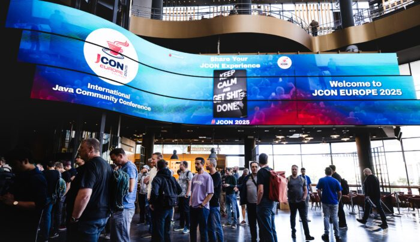
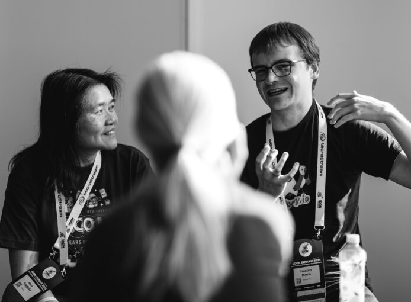
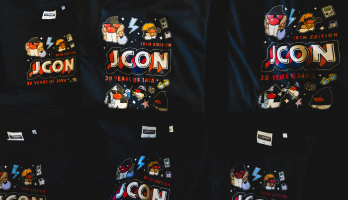
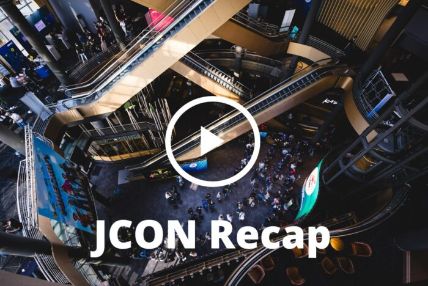

At [JCON EUROPE](https://2026.europe.jcon.one/), developers, speakers, and contributors from across the globe come together to exchange ideas, share experiences, and connect around Java.

What makes our Java community special isn't just new frameworks, AI, or shiny tooling --- it's the people.

JCON EUROPE 2025 brought together a truly international community: participants from 60+ countries and speakers from 40+ countries. Different backgrounds, cultures, and perspectives --- united by a shared passion for Java.

Throughout the conference, one theme kept coming up: connection. People met old friends, made new ones, and had deep conversations in hallways, mentoring sessions, and after talks. Many of you told us that having direct access to speakers and fellow developers, and the openness of those discussions, was where the real value happened.

For many, a highlight was meeting the people who build the frameworks and libraries you use every day. Being able to ask questions, challenge ideas, and talk about real-world problems directly with maintainers and contributors turned talks into conversations, and those conversations into learning.

You showed just how vibrant the Java ecosystem really is. Through countless conversations, talks, and hallway discussions, it became clear how many active people in the Java space are working on interesting, innovative, and forward-looking ideas. Seeing that energy firsthand --- and learning directly from those building and evolving the tools we use every day --- made it obvious that the strength of Java comes from its people, and from learning together in person rather than in isolation.

We heard how much you valued practical tips, deep dives, and the chance to bring new ideas back to your teams. For some, it was their first conference since Covid, and they left feeling energized, inspired, and ready to return with colleagues next time.

Now we're taking everything we learned and actively shaping the JCON EUROPE 2026 experience --- refining the program, deepening the technical content, and creating even more space for meaningful exchange. If you care about Java, build with it every day, and want to learn from---and contribute to---the people shaping its future, we want you to be part of it. Join us at JCON EUROPE 2026, bring your ideas, your questions, and your experience --- and help us continue to prove, together, that Java is alive through its community.

### Foojay.io friends, you're invited---for free!

As proud members of the Java ecosystem, Foojay collaborators of all shapes and sizes can join JCON EUROPE 2026 at no cost via this link: <https://pretix.eu/impuls/europe2026/redeem?voucher=FOOJAY-COMMUNITY>

### Relive JCON EUROPE 2025

