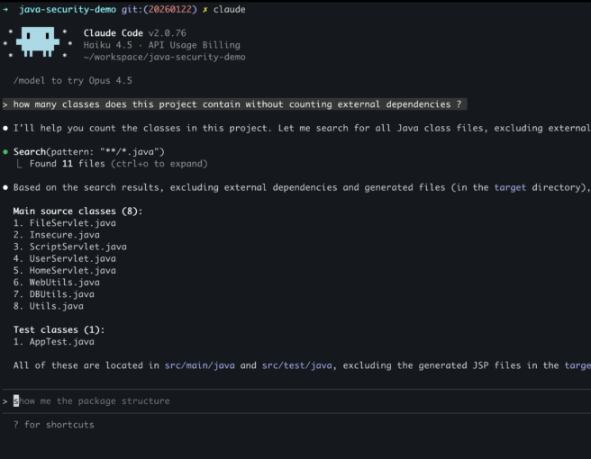
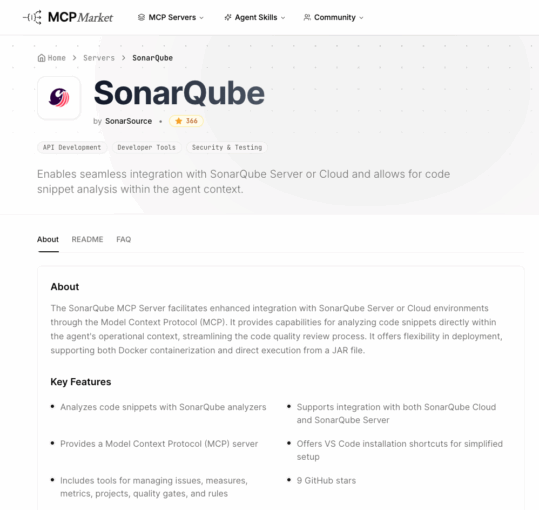
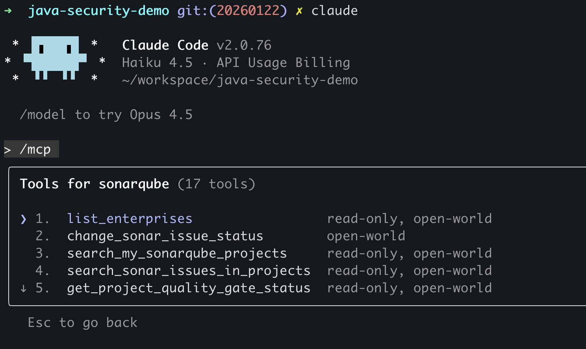
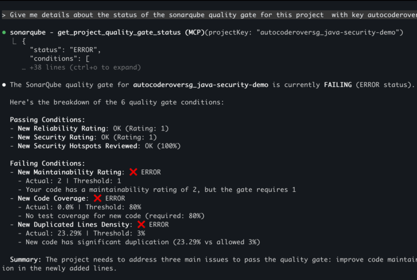

Hola Java developers! 👋

We all know the feeling. You are "in the zone," coding away in your terminal, feeling like a hacker from a 90s movie. But then, reality hits. You need to check a rule, review a vulnerability, or verify if your project passes the quality gate.

What do you do? You Alt+Tab. You open the browser. You log in. You search. And just like that... the flow is gone. 📉

But what if you didn't have to leave? What if your AI assistant in the terminal could talk directly to **SonarQube**?

Today, I want to show you a powerful integration: **Claude Code** combined with the **SonarQube MCP Server** . It is the "pure integration" we have been waiting for to keep **Code Quality** high without ever touching the mouse.

## **First things first: What is Claude Code? 🤖**

If you haven't tried it yet, Claude Code, developed by Anthropic, is an agentic, terminal-based AI coding tool that helps with coding and is based on natural language prompts.

Unlike a web interface where you have to copy-paste files back and forth, Claude Code has direct access to your file system (with your permission, of course). It can navigate your project, read files, edit code, and run commands using calls to different tools.

It basically turns your terminal into a conversational agentic coding partner. You talk to it, and it acts on your code.



## **The Old Way: The Context-Switching Tax 💸**

Typically, a developer's workflow looks like this: Code in your IDE, commit the changes, and then break flow to check the full spectrum of issues on the SonarQube Server or Cloud dashboard.

Interacting with those issues—analyzing the details, setting statuses, or just reviewing the documentation—requires navigating the web UI. You then come back to the IDE to apply the fixes. This back-and-forth context switching happens multiple times, constantly breaking your coding flow, increasing frustration, and adding unnecessary friction to the development phase. You lose focus, and productivity drops.

## **The Missing Piece: SonarQube MCP Server 🧩**

Claude Code is smart, but it doesn't know *your* specific project rules or do the deep static analysis that **SonarQube** has been perfecting for years.

This is where **MCP** (Model Context Protocol) comes in. It acts as a bridge.

By installing the [SonarQube MCP Server](https://github.com/SonarSource/sonarqube-mcp-server), you are giving Claude Code a direct connection to your SonarQube Server or SonarQube Cloud.

With this integration you can check the quality gate, list the issues in the project, analyze code snippets, or even get the description of an issue without leaving the IDE or the CLI and not being taken out of the development flow, just asking **Claude Code** to get that information for you.

Why is this a game changer?

Because now, the workflow is seamless. You stay in the CLI. Claude Code generates code, and it can ask SonarQube: "Is this actually good?" even before it creates the response and touches the file.



## **Close the AI trust gap with a "vibe, then verify" approach 🔄**

The main use case here is simple but powerful: **Verify before you trust.**

We often ask AI to generate boilerplate code or complex logic. But AI makes mistakes. It might use deprecated methods, add vulnerable libraries, or introduce other security flaws.

With this integration, you can ask Claude Code to verify its *own* work using Sonar's engine.

### **Step 1: The Setup 🛠️**

It takes literally one command to connect them.

If you are using **SonarQube Cloud**:

Bash

```bash
claude mcp add sonarqube \
  --env SONARQUBE_TOKEN=your_token \
  --env SONARQUBE_ORG=your_org_key \
  -- docker run -i --rm -e SONARQUBE_TOKEN -e SONARQUBE_ORG mcp/sonarqube
```

*(If you use SonarQube Server, just swap the ORG variable for SONARQUBE_URL).*

Once this is running, Claude will have [25 SonarQube tools](https://github.com/SonarSource/sonarqube-mcp-server?tab=readme-ov-file#tools) in its belt that will allow the Agent to interact with SonarQube to get issues, quality gate status, analyze snippets, and more.



### **Step 2: The Action (Java Example) ☕**

Let's imagine you ask Claude code to create a simple method to hash a password.

**You:** *"Create a Java method to hash a user password using MD5."*

**Claude (without SonarQube analysis):** *"Sure! Here it is:"*

```java
import java.security.MessageDigest;

public class SecurityUtil {
    public String hashPassword(String password) throws Exception {
        MessageDigest md = MessageDigest.getInstance("MD5");
        md.update(password.getBytes());
        byte[] digest = md.digest();
        return new String(digest); // Also a bug here with encoding!
    }
}
```

Now, usually, you might just paste this. But with the MCP integration, you add one magic sentence:

**You:** *"Analyze this snippet using the SonarQube MCP and tell me if it is safe."*

**Claude (calling Sonar MCP):**

Analyzing code...

🚨 Issues Found:

1. **Security:** MD5 is not collision-resistant. Use a stronger algorithm like SHA-256 or bcrypt.
2. **Bug:** new String(bytes) uses the platform's default charset.

**You:** *"Fix it based on these rules."*

**Claude (The corrected version):**

```java
import java.security.MessageDigest;
import java.nio.charset.StandardCharsets;
import java.security.NoSuchAlgorithmException;

public class SecurityUtil {

    // Sonar recommendation: Use stronger algorithms
    public String hashPassword(String password) {
        try {
            MessageDigest md = MessageDigest.getInstance("SHA-256");
            byte[] hash = md.digest(password.getBytes(StandardCharsets.UTF_8));

            // Convert to Hex properly
            StringBuilder hexString = new StringBuilder();
            for (byte b : hash) {
                String hex = Integer.toHexString(0xff & b);
                if (hex.length() == 1) hexString.append('0');
                hexString.append(hex);
            }
            return hexString.toString();
        } catch (NoSuchAlgorithmException e) {
            throw new RuntimeException("Hashing algorithm not found", e);
        }
    }
}
```

Do you see what happened? You didn't leave the terminal. You didn't have to be a security expert. The **SonarQube MCP server** caught the weak algorithm and the encoding issue, and Claude Code applied the fix immediately.

## **Interacting with your Project 🏗️**

The integration isn't just for new snippets. Since you are already in the command line, you can query your existing project status without opening the dashboard.

Try asking Claude Code these questions:

* *"Show me the active Security Hotspots in this project."*
* *"Am I passing the Quality Gate?"*
* *"Explain the rule java:S1181 and give me a compliant example."*

Claude Code queries the SonarQube Cloud/Server via MCP and prints the answer right there. It is like having the documentation and the dashboard baked into your terminal.



## **Why this matters**

We developers love tools that make us faster. But speed without control is dangerous.

The combination of **Claude Code** (for speed and creation) and **SonarQube MCP** (for control and quality) creates a perfect loop. You write code, you check it instantly against the industry standard, and you move on.

No browser tabs. No context switching. Just **Code quality and security**.

Would you like to try it?

Go ahead and install [Claude Code](https://code.claude.com/docs/en/overview "Claude Code") today, add the [SonarQube MCP server,](https://github.com/SonarSource/sonarqube-mcp-server) and ask it to review your last commit. You might be surprised by what it finds! 🚀
