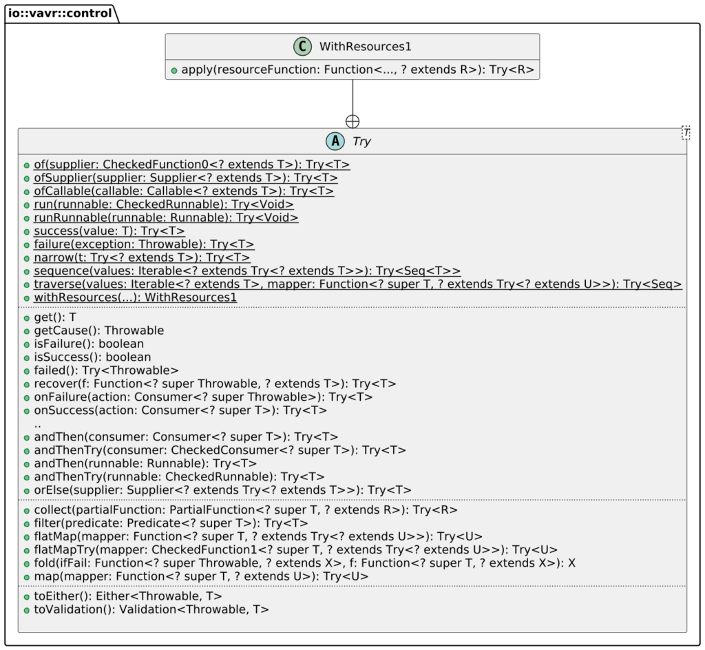
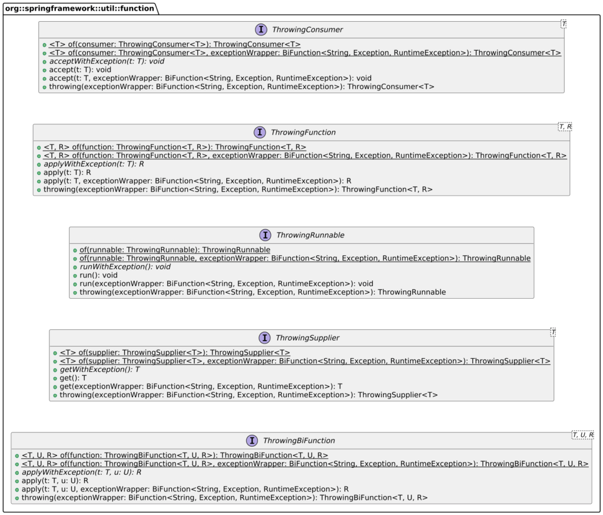
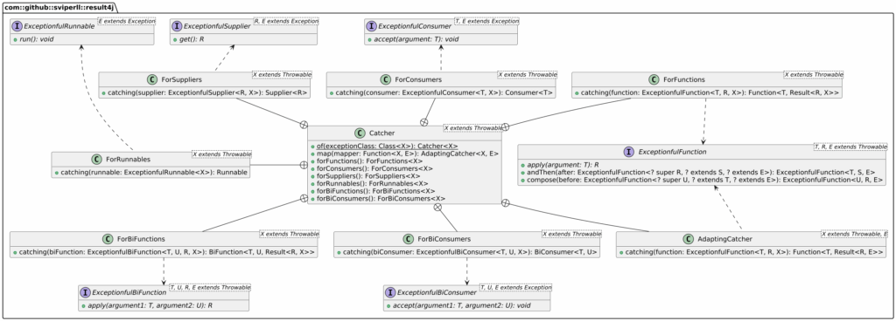

I got a lot of interesting feedback on [Checked exceptions and lambdas](https://blog.frankel.ch/checked-exceptions-lambdas/). Let's start with my own: after writing the post, I realized I had written a [similar post](https://blog.frankel.ch/exceptions-lambdas/) some time ago.

## Mistakes I made

I made a mistake in the code regarding Apache Commons Lang 3, where I mistakenly used the `recover()` function, which is actually from Vavr.

Apache Commons Lang provides a regular utility function, which mimics the custom code we wrote last week. Vavr offers the `Try` class, which encapsulates methods that throw checked exceptions. It also bridges Java to a more functional style.

Here's the corrected code using `Try`:

```java
var foo = new Foo();
CheckedFunction1<String, String> throwingFunction = foo::throwing;
var result = List.of("One", "Two").stream()
                 .map(input ->
                     Try.of(() -> throwingFunction.apply(input))
                        .recover(IOException.class, e -> "")
                        .getOrElse("")
                 ).toList();
```

Vavr's API is quite large, but `Try` itself has a pretty understandable surface:



## Things I forgot

On Mastodon, Oliver Drotbohm pointed out that the Spring Framework has wrapping utilities:
> Post by @[odrotbohm@chaos.social](mailto:odrotbohm@chaos.social)  
> View on Mastodon



## Things I learned

Another feedback I don't remember where from mentioned Result4J. It's a library I never heard of before.
> The project provides Result-type similar to Result-type in Rust that allows to return either successful result or otherwise some kind of error.
>
> In Java, the native way of reporting errors are exceptions, either checked or unchecked. You do not need Result-type most of the time in Java-code, where you can directly throw exceptions. But there are situations, where more functional-style is used. In such situations pure-functions are expected that throw no exceptions. Handling exception in such situations can be cumbersome and require a lot of boilerplate code. Result-type and associated helper-classes help with exception handling and allow to write idiomatic functional code that can interact with methods that throw exceptions.
>
> -- [Result-type for Java](https://github.com/sviperll/result4j)

You can use it in the following way (from the `README`):

```java
Catcher.ForFunctions<IOException> io = Catcher.of(IOException.class).forFunctions();
String concatenation = Stream.of("a.txt", "b.txt", "c.txt")
                .map(io.catching(name -> loadResource(name)))
                .collect(ResultCollectors.toSingleResult(Collectors.join()))
                .orOnErrorThrow(Function.identity());
```



## Additional feedback

On Bluesky, Donald Raab, Eclipse Collections' former designer, mentioned a post of his about how Eclipse Collections handles checked exceptions.
> Thanks for sharing! I wrote the following blog about "Exception Handling in #EclipseCollections" a few years ago. There's a link to a great blog from @brianvermeer.nl in here as well. 🙏  
>
> medium.com/javarevisite...
>
> [\[image or embed\]](https://bsky.app/profile/did:plc:32pvqze7gwulqykh2npkjhcu/post/3mcpuhzz3r22o?ref_src=embed)
>
> — Donald Raab ([@thedonraab.bsky.social](https://bsky.app/profile/did:plc:32pvqze7gwulqykh2npkjhcu?ref_src=embed)) [Jan 18, 2026 at 19:30](https://bsky.app/profile/did:plc:32pvqze7gwulqykh2npkjhcu/post/3mcpuhzz3r22o?ref_src=embed)

You can read the post [here](https://medium.com/javarevisited/exception-handling-in-eclipse-collections-9e37a68fc6a9). It also references another interesting read by Brian Vemeer on the subject, [Exception Handling in Java Streams](https://dev.to/brianverm/exception-handling-in-java-streams-2mjh).

## Conclusion

Feedback is always great. Thanks to feedback, I realized I made a mistake, received pointers to the same features in Spring, and discovered result4j. Having coded for years in Kotlin and more recently in Rust made me appreciate the Result approach. I'll evaluate the usage of result4j as an alternative to Vavr in future projects.

**To go further:**

* [Vavr's Try](https://docs.vavr.io/#_try)
* [Guide to Try in Vavr](https://www.baeldung.com/vavr-try)
* [Result-type for Java](https://github.com/sviperll/result4j)
* [Eclipse Collections](https://eclipse.dev/collections/index.html)

*Originally published at [A Java Geek](https://blog.frankel.ch/feedback-checked-exceptions-lambdas/) on February 1^st^, 2026*
