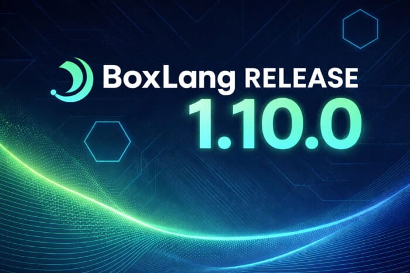

We're excited to announce **BoxLang 1.10.0**, a feature-packed release that brings powerful functional programming capabilities, elegant loop syntax, and enterprise-grade distributed locking to the BoxLang runtime. This release represents a significant leap forward in developer productivity and application scalability.

## 🎯 What's New

### Nine New Array Methods for Functional Programming

BoxLang 1.10.0 introduces nine powerful array methods that bring modern functional programming patterns to your collections. These methods enable cleaner, more expressive code while reducing the need for verbose iteration patterns.

Data Chunking for Pagination  

Split arrays into manageable chunks - perfect for pagination, batch processing, or UI rendering:

```java
items = [ 1, 2, 3, 4, 5, 6, 7, 8, 9, 10 ]
pages = items.chunk( 3 )
// Result: [ [1,2,3], [4,5,6], [7,8,9], [10] ]

// Real-world pagination
products = productService.getAllProducts()
productPages = products.chunk( 20 )
productPages.each( ( page, index ) => {
    println( "Page #index# contains #page.len()# products" )
} )
```

Smart Element Finding with Defaults  

The new `findFirst()` and `first()` methods eliminate null-checking boilerplate by supporting default values:

```java
users = [
    { name: "Alice", role: "user" },
    { name: "Bob", role: "admin" },
    { name: "Charlie", role: "user" }
]

// Find with default fallback
admin = users.findFirst( 
    ( u ) => u.role == "admin",
    { name: "Guest", role: "guest" }
)

// Safe first element access
settings = configArray.first( { theme: "default", locale: "en" } )
```

Data Grouping and Aggregation  

The `groupBy()` method transforms arrays into grouped structures using either property keys or custom functions:

```java
// Group by property
transactions = [
    { id: 1, category: "food", amount: 45.20 },
    { id: 2, category: "transport", amount: 12.50 },
    { id: 3, category: "food", amount: 28.75 }
]

byCategory = transactions.groupBy( "category" )
// Result: {
//   food: [ {...}, {...} ],
//   transport: [ {...} ]
// }

// Group by custom logic
bySizeCategory = transactions.groupBy( ( t ) => {
    return t.amount > 100 ? "large" : t.amount > 50 ? "medium" : "small"
} )
```

Flatten Nested Structures  

Control how deep to flatten nested arrays with the new `flatten() ` method:

```java
nested = [ [1, [2, 3]], [4, [5, [6]]] ]

nested.flatten()      // [1, 2, 3, 4, 5, 6] - fully flattened
nested.flatten( 1 )   // [1, [2, 3], 4, [5, [6]]] - one level only
nested.flatten( 2 )   // [1, 2, 3, 4, 5, [6]] - two levels

// Real-world: flatten API response structures
apiResults = [
    { items: [ {id: 1}, {id: 2} ] },
    { items: [ {id: 3}, {id: 4} ] }
]
allItems = apiResults.map( ( r ) => r.items ).flatten()
```

Map and Flatten in One Operation  

The `flatMap()` method combines mapping and flattening - essential for working with nested data structures:

```java
orders = [
    { orderId: 1, items: [ "A", "B" ] },
    { orderId: 2, items: [ "C", "D", "E" ] }
]

// Extract and flatten all items
allItems = orders.flatMap( ( order ) => order.items )
// Result: [ "A", "B", "C", "D", "E" ]

// vs. the verbose alternative:
allItems = orders.map( ( order ) => order.items ).flatten()
```

Filter Inverse with Reject  

The `reject()` method provides the inverse of `filter()`, making exclusion logic more readable:

```java
products = [
    { name: "Laptop", inStock: true },
    { name: "Mouse", inStock: false },
    { name: "Keyboard", inStock: true }
]

// More readable than filter with negation
outOfStock = products.reject( ( p ) => p.inStock )

// vs. the filter equivalent
outOfStock = products.filter( ( p ) => !p.inStock )
```

Matrix Operations with Transpose  

Convert rows to columns in 2D arrays - essential for data analysis and matrix operations:

```java
matrix = [
    [ 1, 2, 3 ],
    [ 4, 5, 6 ]
]

transposed = matrix.transpose()
// Result: [ [1, 4], [2, 5], [3, 6] ]

// Real-world: reorganize tabular data
salesData = [
    [ "Q1", 1000, 1200, 900 ],
    [ "Q2", 1100, 1300, 950 ]
]
byMonth = salesData.transpose()
// Now organized by columns instead of rows
```

Remove Duplicates with Type Control  

The `unique()` method removes duplicate values with optional type comparison:

```java
numbers = [ 1, 2, 2, 3, 1, 4, 3 ]
numbers.unique()  // [ 1, 2, 3, 4 ]

// Type-aware uniqueness
mixed = [ 1, "1", 2, "2", 1 ]
mixed.unique()        // [ 1, "1", 2, "2" ] - preserves types
mixed.unique( "any" ) // [ 1, 2 ] - type-insensitive
```

Combine Arrays Element-wise with Zip  

The `zip()` method combines multiple arrays element-by-element, perfect for correlating related datasets:

```java
names = [ "Alice", "Bob", "Charlie" ]
ages = [ 25, 30, 35 ]
cities = [ "NYC", "LA", "Chicago" ]

combined = names.zip( ages, cities )
// Result: [
//   [ "Alice", 25, "NYC" ],
//   [ "Bob", 30, "LA" ],
//   [ "Charlie", 35, "Chicago" ]
// ]

// Real-world: combine headers with data
headers = [ "Name", "Email", "Role" ]
values = [ "Alice", "[email protected]", "Admin" ]
record = headers.zip( values )
```

### Elegant Loop Destructuring Syntax

BoxLang 1.10.0 introduces destructuring syntax `for` for loops, eliminating verbose iteration patterns:

```java
// Struct iteration with key and value
userData = {
    name: "Alice",
    email: "[email protected]",
    role: "admin"
}

for ( key, value in userData ) {
    println( "#key#: #value#" )
}

// Array iteration with item and index
colors = [ "red", "green", "blue" ]
for ( color, index in colors ) {
    println( "Color #index#: #color#" )
}

// Query iteration
for ( row, rowNumber in getUserQuery() ) {
    println( "Processing user #row.name# (row #rowNumber#)" )
}
```

This new syntax replaces verbose patterns like `structEach()` and manual index tracking:

```java
// Old verbose approach
userData.each( ( key, value ) => {
    println( "#key#: #value#" )
} )

// New clean syntax
for ( key, value in userData ) {
    println( "#key#: #value#" )
}
```

### Distributed Cache Locking for Clustered Environments

The `lock` component now integrates with cache providers implementing the `ILockableCacheProvider` interface, enabling distributed locking across multiple servers without external coordination systems.

```java
// Distributed lock across all servers in cluster
lock( name="processPayment", cache="redisCache", timeout=30 ) {
    // Critical section protected cluster-wide
    payment = paymentGateway.charge( orderId )
    updateInventory( orderId )
    sendConfirmationEmail( orderId )
}

// Traditional local lock still available
lock( name="updateLocalCache", type="exclusive", timeout=10 ) {
    localCache.update( key, value )
}
```

**Requirements** : Distributed locking requires a cache provider that implements `ILockableCacheProvider`. Compatible providers include:

* **bx-redis** - Redis-backed distributed locking
* **bx-couchbase** - Couchbase distributed locks
* Custom cache providers implementing the locking interface  
  Standard BoxLang caches and the default cache implementation do not support distributed locking.

### Dynamic Module Management

New module loading methods enable runtime module management, perfect for plugin architectures and dynamic extensions:

```java
moduleService = getModuleService()

// Load a single module at runtime
moduleService.loadModule( expandPath( "/plugins/customAuth" ) )

// Load all modules from a directory
moduleService.loadModules( expandPath( "/extensions" ) )

// Check module status
if ( moduleService.hasModule( "customAuth" ) ) {
    settings = moduleService.getModuleSettings( "customAuth" )
    println( "Custom auth enabled: #settings.enabled#" )
}
```

This is especially valuable for:

* **Plugin systems** - Load user-installed plugins dynamically
* **Feature flags** - Enable/disable modules based on configuration
* **Java integration** - Allow Java applications to extend BoxLang functionality at runtime

## ⚡ Performance Optimizations

### Fully-Qualified Name Resolution

Significant optimizations to fully-qualified name (FQN) resolution improve class loading and component instantiation performance. Applications with heavy component usage will see noticeable improvements in startup time and runtime performance.

### ASM Compilation Improvements

The ASM compiler now handles large methods with try/catch blocks more efficiently through improved method splitting. This reduces bytecode size and improves compilation speed for complex business logic.

### Streaming Binary Responses

The `content` component now uses chunked transfer encoding for binary responses instead of buffering the entire response in memory. This reduces memory pressure and improves performance for large file downloads, PDF generation, and image serving.

```java
// Efficiently stream large PDFs without memory buffering
content( type="application/pdf" ) {
    writeOutput( generateLargePDF() ) // Now streams in chunks
}
```

## 🛠️ Developer Experience Enhancements

### MiniServer Warmup URLs

The MiniServer runtime now supports warmup URLs to pre-initialize your application before serving production traffic:

```java
{
  "warmupURLs": [
    "http://localhost:8080/api/health",
    "http://localhost:8080/admin/cache/prime",
    "http://localhost:8080/database/connect"
  ],
  "web": {
    "http": {
      "enable": true,
      "port": 8080
    }
  }
}
```

Warmup requests execute sequentially during server startup, ensuring:

* Caches are populated
* Database connections are established
* Critical initialization is complete
* The application is fully ready before accepting requests  

  ### Runtime Introspection Variables

  Two new server scope variables aid debugging and runtime identification:

```java
// Get the Java process ID
println( "Running on PID: #server.java.pid#" )

// Identify active compiler (ASM, Java, or Noop)
println( "Using compiler: #server.boxlang.compiler#" )
```

These variables are invaluable for:

* **Container deployments** - Identifying processes in Kubernetes/Docker
* **Performance profiling** - Connecting to the correct JVM for profiling tools
* **Debugging** - Understanding which compilation strategy is active  

  ### Module Binary Directory

  BoxLang now creates a `bin/` folder in the BoxLang home directory, preparing for future CommandBox integration where modules can provide CLI commands and executables:

```bash
~/.boxlang/
  └── bin/
      ├── module-cli-tool
      └── custom-command
```

### JSR-223 Configuration Flexibility

The JSR-223 scripting engine integration now supports environment variables and system properties for configuration, enabling containerized deployments:

```java
# Environment variable configuration
export BOX_JSR223_TIMEOUT=30000
export BOX_JSR223_ENABLE_LOGGING=true

# System property configuration
java -Dboxlang.jsr223.timeout=30000 \
     -Dboxlang.jsr223.enableLogging=true \
     -jar app.jar
```

## 🔧 Additional Improvements

### Type System Enhancements

* **Numeric Casting** - General numeric casting now truncates by default for consistent behavior across integer conversions  
  **- Set Length Support** - The `len()` function now works on `java.util.Set` collections  
  **- BigDecimal/Long Support** - `formatBaseN()` now properly handles `java.lang.Long` types

  ### Cache Hierarchy

  The cache retrieval system now properly follows the context cache hierarchy:

```java
// Application cache takes precedence over global cache
cache( "userSessions" )  // Checks app cache first, then global

// Explicit cache provider targeting
cacheGet( "key", "redisCache" )  // Direct provider access
```

This ensures application-level cache isolation while maintaining fallback to global caches.

### Date/Time Improvements

* New date mask support: `"January, 05 2026 17:39: 13 -0600"` format
* Fixed date equality issues in compatibility mode with different timezones
* Resolved `false` being incorrectly cast to DateTime objects in compat mode

### Query Component Enhancements

```java
// Columns now accept arrays
query = queryNew( [ "id", "name", "email" ] )

// Relaxed dbtype validation for better CFML compatibility
query = new Query()
query.setDatasource( "myDB" )
query.setSQL( "SELECT * FROM users" )
```

### Oracle SQL Improvements

The runtime now automatically removes trailing semicolons from Oracle SQL statements, eliminating common syntax errors.

## 🐛 Notable Bug Fixes

### Compilation \& ASM

* **\[BL-1505\]** Reworked splitting of large methods in ASM compiler
* **\[BL-2017\]** Fixed ASM compilation failure with closures inside ternary expressions
* **\[BL-2094\]** Fixed double transpilation in string replace operations with nocase flag
* **\[BL-2141\]** Resolved parser issue with text operator between two interpolated variables  

  ### Class \& Component System

* **\[BL-2059\]** Fixed inheritance at three levels losing variables scope when functions assigned as variables
* **\[BL-2110\]** Resolved error calling pseudo constructor when using `getClassMetadata()`
* **\[BL-2117\]** Fixed missing metadata annotations on abstract UDFs
* **\[BL-2119\]** Interface errors when implementing class doesn't set defaults that interface specifies
* **\[BL-2121\]** Injected UDFs now have correct "current" template reference
* **\[BL-2122\]** UDF called from thread inside class no longer loses class reference  

  ### Struct \& Collection Handling

* **\[BL-2138\]** Fixed struct assignment creating string keys instead of integer keys
* **\[BL-2142\]** Resolved string hash collisions in structs causing key conflicts  

  ### File \& I/O Operations

* **\[BL-2095\]** File member methods no longer incorrectly accessible on `java.io.File` instances
* **\[BL-2096\]** `getCanonicalPath()` now preserves trailing slash on directories
* **\[BL-2118\]** Fixed `directoryCopy()` mishandling trailing slashes
* **\[BL-2124\]** Compat mode `directoryCopy()` now overwrites by default for CFML compatibility  

  ### HTTP \& Networking

* **\[BL-2081\]** Fixed HTTP timeout error with BigDecimal to Integer casting
* **\[BL-2098\]** HTTP component no longer fails when empty string passed for proxy server
* **\[BL-2105\]** Resolved duplicate cookies being set with different paths  

  ### Compatibility Mode Fixes

* **\[BL-1917\]** Fixed `urlEncodedFormat()` differences from Lucee/ACF
* **\[BL-2079\]** Regression fix for date equality with different timezones
* **\[BL-2088\]** Compat cache BIFs now properly use context cache retrieval hierarchy
* **\[BL-2091\]** Timeout attribute is now optional on lock tag in Lucee compat mode
* **\[BL-2129\]** Variable attribute is now optional on execute component in compat mode
* **\[BL-2131\]** Compat mode now allows duplicate UDF declarations in CF source files  

  ## 🚀 Get Started

  ### Download BoxLang 1.10.0:

[BoxLang Runtime](http://https://boxlang.io/download?_gl=1*1ngsauj*_gcl_au*NDk3OTAwOTEuMTc2ODUxNjQ4Nw..*_ga*MTg5MDU4NDYzMS4xNzMyMDQwMzg2*_ga_663JFQ7YGX*czE3NzAxOTY1NjYkbzgyJGcxJHQxNzcwMTk2NzI2JGo1MCRsMCRoMA.. "BoxLang Runtime")  
[VS Code Extension](http://https://marketplace.visualstudio.com/items?itemName=ortus-solutions.vscode-boxlang "VS Code Extension")

### Resources:

[Documentation](http://https://boxlang.ortusbooks.com/ "Documentation")  
[GitHub Repository](http://https://github.com/ortus-solutions/boxlang "GitHub Repository")  
[Community Discord](http://https://discord.gg/boxlang "Community Discord")

### 🙏 Thank You

BoxLang 1.10.0 represents contributions from our amazing community, enterprise customers, and the Ortus Solutions team. Special thanks to everyone who reported issues, tested features, and provided feedback.

We're excited to see what you build with BoxLang 1.10.0!
