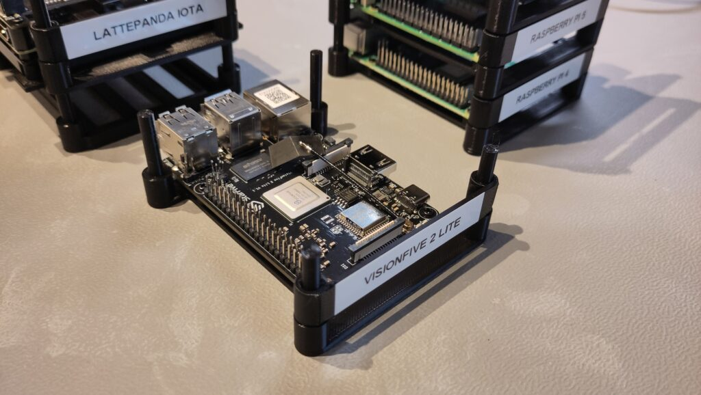
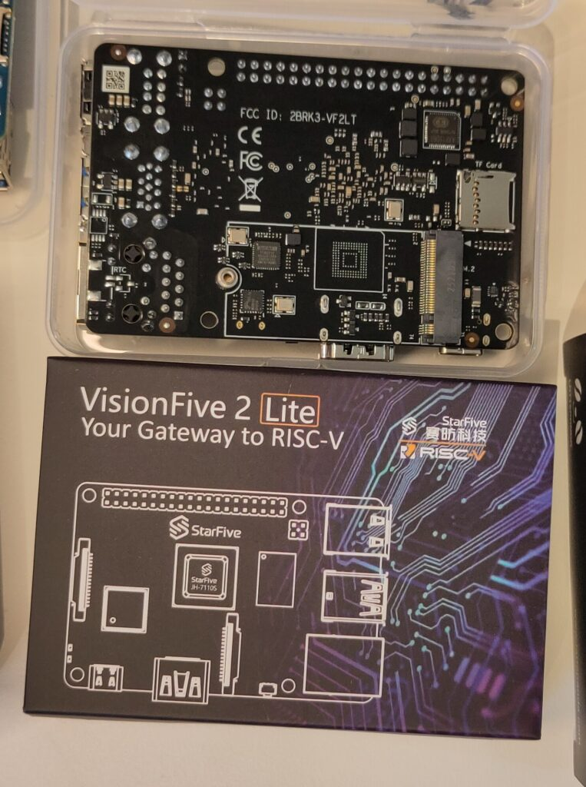
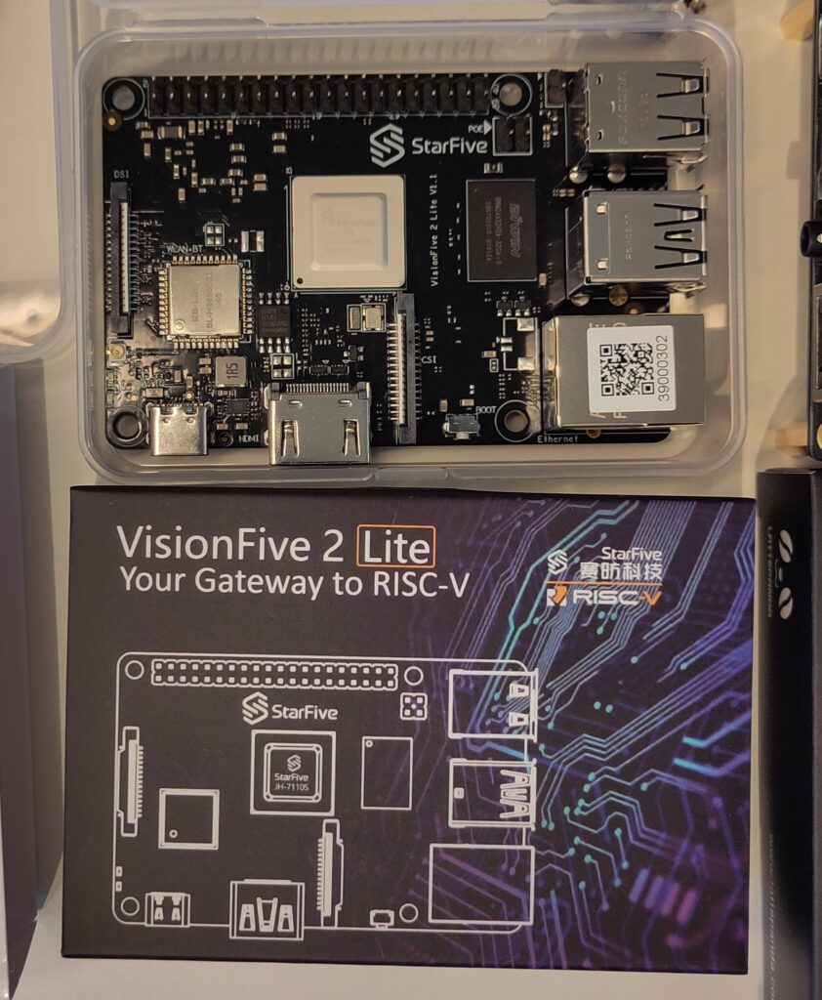

As part of my 2026 learning goals around Java on RISC-V (see [this post about x86 versus ARM versus RISC-V](https://foojay.io/today/java-on-single-board-computers-x86-vs-arm-vs-risc-v/)), I've asking various suppliers to send me evaluation boards. I already published about two and adding a third one now:

* [LattePanda IOTA](https://foojay.io/today/first-experiments-with-java-on-the-lattepanda-iota/)
* [OrangePi 5 Ultra and OrangePi RV2](https://foojay.io/today/first-test-of-java-on-the-orange-pi-arm-and-risc-v/)
* In this post: StarFive VisionFive 2 Lite

I got all these boards for free, but what I write here and show in the video is not controlled by StarFive or one of the other suppliers.



## Why RISC-V?

RISC-V is an open standard instruction set architecture, driving by the community. Unlike architectures from ARM, Intel, and AMD which must be licensed. This openness has lead to innovation across the industry, and boards like the VisionFive 2 Lite make it accessible to developers like us who want to experiment with (Java) applications on alternative architectures.

## StarFive VisionFive

The VisionFive from StarFive is a range of affordable boards for your first steps into the RISC-V world. Here's how the VisionFive's compare to the latest Raspberry Pi's:

|                               Board                                |   SOC   |  Type  |    CPU     | Cores |  Speed  |                                                   Price                                                    |
|--------------------------------------------------------------------|---------|--------|------------|-------|---------|------------------------------------------------------------------------------------------------------------|
| [Raspberry Pi 4](https://api.pi4j.com/board-information/MODEL_4_B) | BCM2711 | ARMv8  | Cortex-A72 | 4     | 1.8Ghz  | [68€ (4GB)](https://www.amazon.com.be/-/en/Raspberry-Pi-Model-4GB-LPDDR4/dp/B09TTNF8BT)                    |
| [Raspberry Pi 5](https://api.pi4j.com/board-information/MODEL_5_B) | BCM2712 | ARMv8  | Cortex-A76 | 4     | 2.4Ghz  | [79€ (4GB)](https://www.amazon.com.be/-/en/Raspberry-4GB-Quad-Core-ARMA76-64-bit/dp/B0CK3L9WD3)            |
| [VisionFive](https://www.starfivetech.com/en/site/boards)          | U74     | RISC-V |            | 2     | 1.25GHz |                                                                                                            |
| [VisionFive 2](https://www.starfivetech.com/en/site/boards)        | JH7110  | RISC-V |            | 4     | 1.5GHz  | [87€ (4GB)](https://www.amazon.com.be/-/en/Waveshare-VisionFive2-Integrated-4GB-Compatible/dp/B0BRN9RP1N/) |
| [VisionFive 2 Lite](https://www.starfivetech.com/en/site/boards)   | JH7110S | RISC-V |            | 4     | 1.25GHz | [59€ (4GB)](https://www.amazon.com.be/-/en/StarFive-VisionFive-4-Core-Gigabit-Ethernet/dp/B0FSZZDXL4/)     |

### Test Board

I received a VisionFive 2 Lite for testing:

* [Product page](https://www.starfivetech.com/en/site/boards)
* [Documentation](https://doc-en.rvspace.org/Doc_Center/visionfive_2_lite.html)
* [Quick Start Guide](https://doc-en.rvspace.org/VisionFive2Lite/VisionFive2LiteQSG/)
* [Ubuntu Images and other software](https://github.com/starfive-tech/VisionFive2/releases)
  * Used: `ubuntu-24.04.3-preinstalled-desktop-riscv64+vf2-lite.img`

<figure class="wp-block-gallery has-nested-images columns-default is-cropped wp-block-gallery-1 is-layout-flex wp-block-gallery-is-layout-flex">
 <figure class="wp-block-image size-large">
  
 </figure>
 <figure class="wp-block-image size-large">
  
 </figure>
 <figure class="wp-block-image size-large">
  
 </figure>
</figure>

I burned the Ubuntu image to an SD card, but if you want to use eMMC, you can follow these instructions: [Flashing OS to Onboard eMMC (eMMC Version)](https://doc-en.rvspace.org/VisionFive2Lite/VisionFive2LiteQSG/VisionFive2_QSGLite/flashing_os_to_onboard_emmc_emmc_version.html). This OS has the pre-configured account `user` with password `starfive`.

On the Ubuntu website, more installation instructions are [available for a lot of different boards](https://canonical-ubuntu-hardware-support.readthedocs-hosted.com/boards/how-to/), e.g. for the [VisionFive 2 Lite](https://canonical-ubuntu-hardware-support.readthedocs-hosted.com/boards/how-to/starfive-visionfive-2-lite/).

## Getting Started

### Hardware Setup

The board arrived well-packaged, and has a very similar layout to the Raspberry Pi 5. Biggest connection difference: one big HDMI connector instead of two micro-HDMI ports.

### Installing Ubuntu

StarFive provides several OS options, but I opted for Ubuntu 24.04.3 LTS Desktop for RISC-V. The process is well-documented:

1. Download the image: `ubuntu-24.04.3-preinstalled-desktop-riscv64+vf2-lite.img` from the [StarFive GitHub releases](https://github.com/starfive-tech/VisionFive2/releases)

2. Burn the image to an SD card (I used the Raspberry Pi Imager tool)

3. First boot uses `user` as the username with password `starfive`

4. The first boot took a bit longer than expected before the desktop appeared. Once up, the system felt responsive for basic tasks, though noticeably slower than a Raspberry Pi 5.

## Java Installation and Testing

This is where things get interesting. RISC-V support in the Java ecosystem has improved significantly, but it's still relatively new compared to ARM and x86_64.

### Installing Java

Ubuntu for RISC-V includes OpenJDK in the repositories, so it can be installed with `sudo apt install`, after you have done update and upgrade:

```
sudo apt update
sudo apt upgrade
sudo apt install openjdk-25-jdk
```

This installed OpenJDK 25.0.1, built for RISC-V architecture. The installation was straightforward, taking only a few minutes including dependencies. To verify the installation:

```
java -version
```

### Simple Java Tests

I just wanted to quickly try out a few existing test scripts, and used my [JBang project in the Pi4J repositories](https://github.com/Pi4J/pi4j-jbang). As you can see in the video "plain" Java and libraries work as expected. [Pi4J](https://www.pi4j.com/) and JavaFX were not successful, but also that was expected. I will try Pi4J after the release of its version 4, when it uses the [Foreign Function and Memory (FFM) API](https://openjdk.org/jeps/454). As we installed a "normal OpenJDK Build", which doesn't include the JavaFX dependencies, we can't run the example.

## Conclusion

The VisionFive 2 Lite is an intriguing board for Java developers curious about RISC-V. At around 60€, it's an accessible way to explore this "other type of" architecture without significant investment. The performance isn't going to compete with a recent Raspberry Pi, but that's not really the point. My first goal was to find out if Java works on it (of course!), and how easy it us to use. And of course, to feed my curiosity to learn new stuff...

Later more, when I try to get Pi4J working on it!

If you're working on similar projects or have experience with Java on RISC-V, I'd love to hear about it. Feel free to reach out through [Mastodon](https://foojay.social/@frankdelporte) or the [Foojay.io community](https://foojay.io/).
