Have you ever wondered why updates and upgrades are so essential for any system? Well, it's no secret: They ensure that systems remain relevant and efficient. With MongoDB, it's no different. Whenever we think about updating, we seek efficiency, security, performance, and other benefits that come with updated systems. However, every update introduces changes that need to be carefully managed. In this article, we will cover some of the new features of MongoDB version 8.0 and highlight the key considerations you should take into account before migrating to this new version.

What's new in version 8.0? {#h2-0-what-s-new-in-version-8-0}
------------------------------------------------------------

The most popular document database is [now faster than ever](https://www.mongodb.com/products/updates/version-release/?utm_campaign=devrel&utm_source=third-party-content&utm_medium=cta&utm_content=foojay.io&utm_term=tony.kim). MongoDB 8.0 is an excellent choice for those looking for performance, cutting-edge technology, and an intuitive experience. It offers a notable improvement in throughput and latency, compared to earlier versions. Internal testing against 7.0 demonstrates 32% faster reads, 59% faster updates, and 200%+ faster time-series queries. The release of this latest version focuses on several key pillars:

**Performance improvement**: MongoDB 8.0 offers significant performance improvements, such as faster reads, writes, and bulk operations. Do you know about insertMany and bulkInsert? Well, they have been optimized! So, if your application experiences high loads, upgrading to 8.0 can drastically reduce response times and improve throughput, ensuring that your system remains scalable even under heavy usage.

**Security**: In MongoDB 8.0, Queryable Encryption introduces the ability to perform range queries on encrypted fields using the $lt, $lte, $gt, and $gte operators.

**Resilience, scalability, and high availability**: With MongoDB 8.0, horizontal scaling is now faster and more affordable. This method allows applications to go beyond the limits of traditional databases by spreading data across multiple servers, known as shards, without needing to prepare large amounts of resources in advance. The new sharding features in MongoDB 8.0 make data distribution up to 50 times faster while cutting costs by up to 50%.

General changes {#h2-1-general-changes}
---------------------------------------

### Queryable Encryption {#h3-2-queryable-encryption}

With the new version, Queryable Encryption enables you to search within a range, using operators like $lt, $lte,$gt, and $gte, for example, to filter data by specific intervals, such as dates or numerical values, while keeping the data encrypted.  
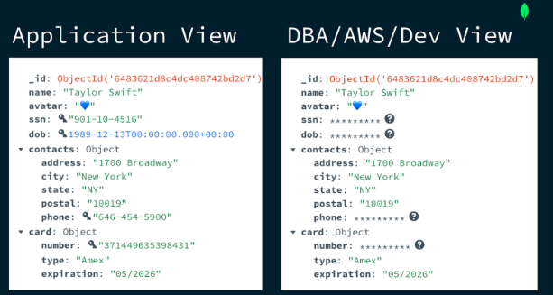

*MongoDB encrypted data view*

If you want to learn more, the article [Java Meets Queryable Encryption: Developing a Secure Bank Account Application](https://www.mongodb.com/developer/products/atlas/java-queryable-encryption/?utm_campaign=devrel&utm_source=third-party-content&utm_medium=cta&utm_content=foojay.io&utm_term=tony.kim) provides detailed instructions on how to implement a Java application to explore this new feature in the version.

### Express query stages {#h3-3-express-query-stages}

Express was introduced as a new execution stage that optimizes the query path for simple use cases. If you are running a simple query that uses a single _id index, for example...

```
db.customer.find({_id: ObjectId('670ec6b005b98857588f5b6a')}).explain()
```


...you will see that this new EXPRESS_IXSCAN stage has been included.  
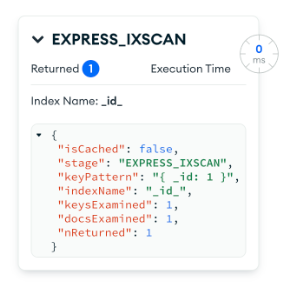

*MongoDB Compass Explain plan view*

EXPRESS stages can be one of the following:

* EXPRESS_CLUSTERED_IXSCAN
* EXPRESS_DELETE
* EXPRESS_IXSCAN
* EXPRESS_UPDATE

Instead of executing the classic plan stage, your query will now utilize this new stage. This skips regular query planning and execution, delivering up to a 17% improvement in performance.

### Query shape and query settings {#h3-4-query-shape-and-query-settings}

The query shape in MongoDB represents a set of attributes that group similar queries together, including filters, sorting, projections, aggregation stages, and the namespace. This enables MongoDB to improve performance by reusing query plans for structurally similar queries, leading to more efficient execution. Starting in MongoDB 8.0, the query shape supports query settings, allowing you to define specific behaviors for matching queries.

One such behavior is the reject: true setting. When applied, MongoDB will automatically reject any query matching this shape, regardless of its specific values.

**Use case:** Imagine you're managing a database receiving queries from third-party applications. One application starts sending heavy queries that perform a collection scan (COLLSCAN), significantly slowing down the system---for example, a query like:

```
db.pizzaOrders.find({price: 10})

// Explain Plan
"winningPlan": {
     "stage": "COLLSCAN",
     "filter": {
       "price": {
         "$eq": 20
       }
     },
   },
```


We can set a querySettings to reject queries that match this structure (independent of the values):

```
db.adminCommand( {  
 setQuerySettings: {
      find: "pizzaOrders",
      filter: {
         price: 20
      },
      $db: "my_database"
   },
   settings: {          
      comment: "Will be rejected",
      reject: true
   }
} )
```


This command sets a query shape where any query looking for price in the pizzaOrders collection will be rejected, regardless of the actual price value provided in the query. (The focus is entirely on the query's structure.) Therefore, if we execute a query that matches this structure...

```
db.pizzaOrders.find({price: 10})
```


...the query will be automatically rejected by MongoDB:  
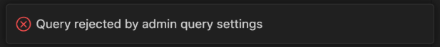

*Query rejected by admin query settings*   

To see all query settings, you can use the $querySettings stage in an aggregation pipeline:

```
db.aggregate( [
   { $querySettings: {} }
] )
```


Result:

```
[ 
{
   "queryShapeHash": "4DD2DED8A25C787DFA41325883052FABB97DDEE567B2636A3B188DDF0CCFE6F0",
   "settings": {
     "reject": true,
     "comment": "Will be rejected"
   },
   "representativeQuery": {
     "find": "pizzaOrders",
     "filter": {
       "price": 20
     },
     "$db": "my_database"
   }
 }
]
```


However, if you want to inspect query shapes---i.e., the different types of queries that have been executed---you have two options:

1. Use**$queryStats** .
   * This aggregation stage provides statistics on queries run **since the last server restart**.

```
use('admin');

db.aggregate( [
{ $queryStats: {} }
])
```


2. 

This helps analyze query patterns and optimize performance.

2. Check the MongoDB logs.

* Slow queries are logged with their **queryShapeHashes** in the MongoDB logs.
* This is useful for identifying inefficient queries that need optimization.

To remove, we can use the query shape hash:

```
db.adminCommand(
   {
       removeQuerySettings: '4DD2DED8A25C787DFA41325883052FABB97DDEE567B2636A3B188DDF0CCFE6F0'
   }
)
```


This approach is valuable as it ensures the database won't be affected by third-party queries that could cause high resource consumption, all without the need to make changes to the application.

Compatibility and deprecations {#h2-5-compatibility-and-deprecations}
---------------------------------------------------------------------

### Query behavior {#h3-6-query-behavior}

Before version 8.0, if you searched for values equal to null, fields with the value undefined would also be returned. However, in this new version, data stored as undefined will no longer be returned in queries with null equality---for example:

```
// People collection

[
   { _id: 1, name: null },
   { _id: 2, name: undefined }
]

// Given this collection, if you run the following query…

db.people.find({name: null})

// result is...

[
   { _id: 1, name: null }
]
```


Data with undefined will no longer be returned. If your application contains data with undefined, you can rewrite or migrate undefined data and queries to account for this behavior change.

**Note**: The undefined type has been deprecated, and in some cases, if you attempt to insert undefined, it will be converted to null.

### Index filters {#h3-7-index-filters}

Consider using setQuerySettings, as discussed in the query shape section of this article, since index filters are deprecated in this version. SetQuerySettings offers significantly more functionality, making it the preferred choice. With index filters now deprecated, it's advisable to switch to setQuerySettings to take advantage of its advanced features.

Migration planning and strategy {#h2-8-migration-planning-and-strategy}
-----------------------------------------------------------------------

Now that you've seen the new features in the latest version and decided to upgrade to the newest MongoDB release, there are a few things you need to be aware of. This topic will describe some strategies and steps that are ideal to ensure a smooth and successful migration of a replica set in MongoDB Atlas.

Keep in mind that each scenario has its own particularities, and understanding how your application uses MongoDB features is crucial to an effective migration. Analyze which features are heavily used and how they might be impacted by the upgrade.

Additionally, remember that you can [consult specialists to support](https://www.mongodb.com/services/consulting/?utm_campaign=devrel&utm_source=third-party-content&utm_medium=cta&utm_content=foojay.io&utm_term=tony.kim) you in achieving a successful migration. While this tutorial focuses on Atlas, there are also resources available for self-managed upgrades.

### Pre-migration assessment {#h3-9-pre-migration-assessment}

#### Upgrade version path

All replica set members must be running version 7.0 before upgrading to version 8.0.

It's important to note that it's not possible to migrate directly from version 5.0-series to 8.0, for example, nor from 6.0-series to 8.0. To do so, you must upgrade successively, version by version, until you reach version 7.0.

#### Review release notes

No other place will contain more valuable information than the release notes of the version you are looking for. Always make sure to pay attention to each note released, especially for any breaking changes, new features, and deprecated functionalities.

#### Check the driver compatibility

Before upgrading anything MongoDB related, it's crucial to check the compatibility tables in the documentation for your driver. To **avoid** **breaking your application**, you should ensure that the MongoDB version is compatible with the MongoDB driver that you plan to use. Take a look at this image:  
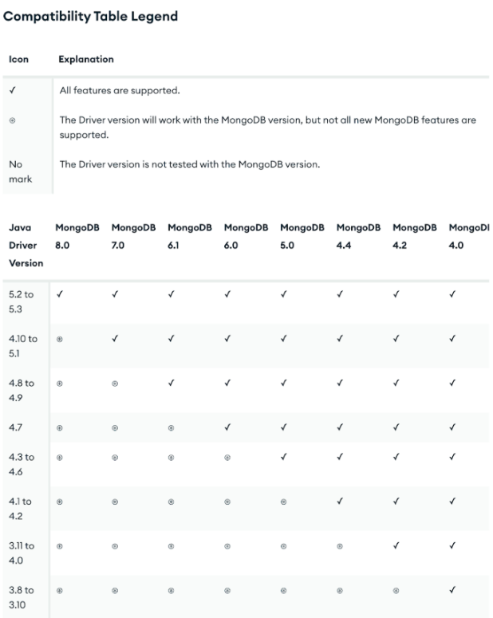

*MongoDB Java Driver Compatibility Table*

We can see that to use all the features of MongoDB 8.0, you need to use the driver version 5.2 to 5.3. Application drivers may need to be updated to take full advantage of newer server features. In some cases, outdated drivers may be completely incompatible with newer versions of MongoDB.

#### Cluster health check

Another crucial point before starting the migration is to check the health of all the members of your replica set. **Ensure all nodes are running optimally.** You can find this information by accessing the "Database Cluster" menu and clicking on your cluster:  
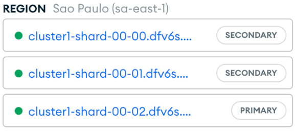

*Cluster health*

On this screen, you will notice that each node has a green dot next to its name, indicating that the health is fine.

### Staging cluster: your testing hub {#h3-10-staging-cluster-your-testing-hub}

To ensure a safe update and mitigate risks, it is essential to work with a testing environment. The [staging environment](https://www.mongodb.com/docs/atlas/tutorial/major-version-change/?utm_campaign=devrel&utm_source=third-party-content&utm_medium=cta&utm_content=foojay.io&utm_term=tony.kim) acts as a safe zone to test new versions, features, and changes without impacting end users. With the production cluster in a healthy state, it's time to follow these steps:

1. **Create a staging cluster**

#### This step involves creating a dedicated cluster for testing purposes. Follow the standard process to set up a new cluster, *ensuring it matches the current production version* to simulate the production environment accurately.

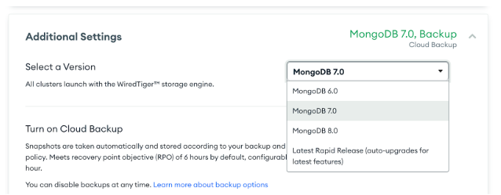

*Additional Settings - Creating a new Cluster*

2. **Refresh staging with production data**

#### Restore a recent backup from the production cluster to ensure the staging environment mirrors the current state of production. You can do this through the Atlas interface by selecting the backup, choosing the restore option, and targeting the staging cluster.

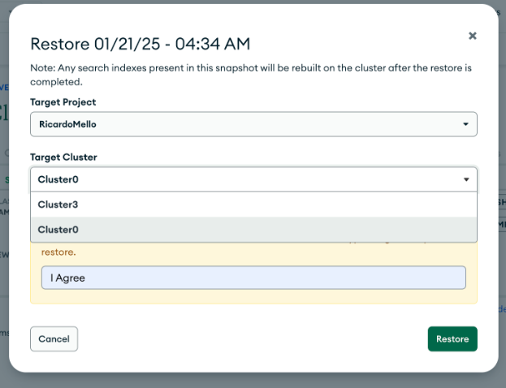

*Restoring Backup*

3. **Upgrade staging cluster to 8.0**

#### Update the staging cluster to MongoDB 8.0 to test the new version and its features. To do this, simply click on the cluster and select "Edit Configuration" and "Additional Settings":

<figure class="aligncenter size-full is-resized">
 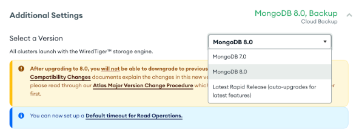
</figure>

4. **Test your application**

#### Run tests to make sure everything works as expected, including both database and application tests.

### Upgrade production cluster {#h3-11-upgrade-production-cluster}

After testing in a staging environment, ensure that the **Feature Compatibility Version (FCV)** is set appropriately, before upgrading the production cluster.

<br />

FCV provides an extra layer of security during the upgrade process by controlling which features of the new MongoDB version are enabled in the cluster. This allows you to transition gradually to the latest version, making sure everything works correctly before fully enabling the new features in production.  
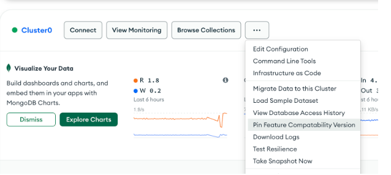

*Pinning Feature Compatibility Version*

Although it's not mandatory, configuring the FCV gives you flexibility. If necessary, you can revert to the previous version by adjusting the FCV setting. This ensures that you can manage the migration process with minimal risk and have more control over any potential issues.

Once you've configured the FCV (if desired), you can proceed with upgrading the production cluster. To do so, simply follow the same steps outlined in the previous section, but this time, apply them to the production cluster.

### Monitoring {#h3-12-monitoring}

Post-migration is just as important as all the previous steps. Monitoring the operation is crucial to ensure the success of the process.
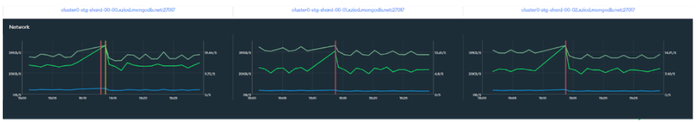

*MongoDB Atlas metrics*

Some important points to check are:

**Node health**: Monitor the health of the nodes to ensure they are functioning correctly.

**Latency of operations**: Keep an eye on the latency of read and write operations to ensure there are no performance issues.

**Query performance**: Monitor the performance of queries to ensure they are running efficiently after the upgrade.

**Indexes**: Check that indexes are functioning properly and optimize them if necessary.

Last but not least, check the metrics for each node in your cluster. They will provide valuable insight into the overall health of your system. You can find them in the "Metrics" tab of your cluster:  
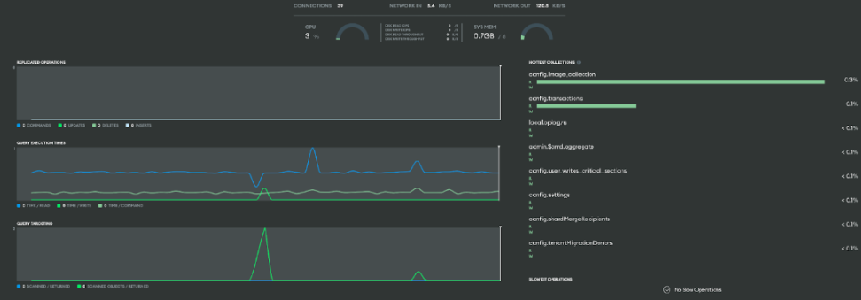

### *Cluster node metrics* {#h3-13-cluster-node-metrics}

### Recap {#h3-14-recap}

Your upgrade plan should be customized to align with your organization's specific needs and goals. Make sure to monitor your MongoDB cluster's support lifecycle and stay updated on version releases, so you can prepare for a seamless and efficient upgrade.

1. Understand how your application interacts with MongoDB features.
2. Recognize any necessary changes to your application.
3. Plan your upgrade well in advance.
4. Don't overlook driver updates.
5. Conduct thorough testing before proceeding with the upgrade.

How complex is your upgrade? {#h2-15-how-complex-is-your-upgrade}
-----------------------------------------------------------------

Now that we've outlined the key steps for a successful upgrade---including pre-migration assessment, staging cluster testing, and checking driver compatibility---let's evaluate how complex your upgrade might be. The effort required to upgrade to MongoDB 8.0 depends on multiple factors, including your current version, driver compatibility, data size, and experience level.

### Straightforward upgrades {#h3-16-straightforward-upgrades}

If you are already on MongoDB 7.0, have updated drivers, and are running on a fully supported Atlas tier, then the migration is generally quicker and more straightforward. In these cases, setting up a staging cluster, validating health, and performing the upgrade can be completed efficiently, often with minimal or no downtime.

### More complex upgrades {#h3-17-more-complex-upgrades}

If you're on an older version (e.g., 5.0 or 6.0), you'll need to upgrade incrementally (e.g., 5.0 → 6.0 → 7.0 → 8.0), as mentioned before. Additionally, if your drivers are outdated or you have custom configurations, the process may take several hours and require more thorough testing to prevent compatibility issues.

Since upgrade time varies significantly based on these factors, using a staging cluster as a reference (discussed in the previous section) **can help estimate the duration.** While this approach won't provide an exact time, it can give you an approximate idea of the total upgrade duration, allowing you to plan accordingly.

Regardless of complexity, following best practices---such as testing a staging environment and monitoring cluster health---ensures a smooth and reliable transition. The effort is well worth it, as upgrading unlocks better performance, security improvements, and new features.

Conclusion {#h2-18-conclusion}
------------------------------

This article highlighted key changes in the latest version, including compatibility considerations, deprecated features, and best practices for a smooth migration. By understanding these aspects, you can ensure a seamless transition to MongoDB 8.0 and continue benefiting from its enhanced capabilities.

For more information and help, please read the resources referenced throughout (listed below) or connect with us in the MongoDB community.
