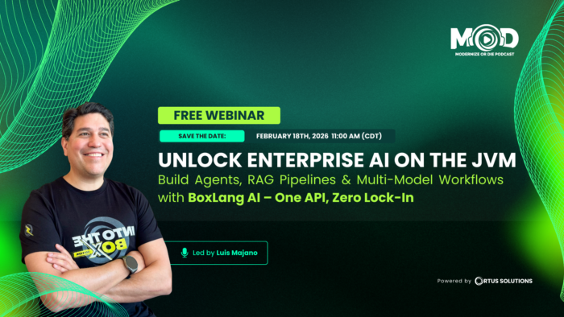

**Build Agents, RAG Pipelines \& Multi-Model Workflows --- One API, Zero Lock-In**   

Modern enterprises want to move fast with AI---but juggling different providers, SDKs, formats, and deployment models quickly becomes complex and brittle.

That's why we're excited to announce our upcoming webinar:

**Unlock Enterprise AI on the JVM: Build Agents, RAG Pipelines \& Multi-Model Workflows with BoxLang AI One API, Zero Lock-In Led by Luis Majano**

In this session, you'll discover **BoxLang AI** , an open-source library that brings unified, fluent AI orchestration to the JVM ecosystem. With a single, intuitive API, BoxLang AI lets you integrate 12+ **leading AI providers** (including OpenAI, Claude, Gemini, Grok, Ollama, Groq, and more), switch models, or combine them into advanced workflows---**without rewriting your code.**

## What You'll Learn

We'll explore production-ready capabilities designed for real-world applications, including:

* Autonomous AI Agents with memory, tools, reasoning, and sub-agents
* Advanced RAG \& Vector Search with support for 10+ vector databases and 30+ file formats
* Multi-Tenant Memory \& Observability using an event-driven architecture
* MCP Microservices to expose and consume AI tools as distributed services
* Local \& Streaming AI via Ollama for privacy-focused or real-time experiences
* Structured outputs, custom extensions, and hybrid intelligence pipelines

You'll also see live demos and practical examples showing how to apply these features in everyday development.

## Who Should Attend

This webinar is ideal for:

* JVM \& Java developers
* BoxLang / CFML developers
* Enterprise engineering teams
* AI engineers moving from experimentation to production

If you're building chatbots, internal tools, code assistants, content generators, or full AI-driven systems, this session will show you how to reduce complexity and avoid vendor lock-in while accelerating delivery.

## Register Now

Ready to transform how you build intelligent JVM solutions?

[Register Now](https://Webinar-Enterprise-AI-on-the-JVM.eventbrite.com)

We look forward to seeing you there!

## Join the Ortus Community

Be part of the movement shaping the future of web development. Stay connected and receive the latest updates on, **product launches, tool updates, promo services and much more.**

**Follow Us on Social media and don't miss any news and updates:**

* <https://twitter.com/ortussolutions>
* <https://www.facebook.com/OrtusSolutions>
* <https://www.linkedin.com/company/ortus-solutions-corp>
* <https://www.youtube.com/OrtusSolutions>
* <https://github.com/Ortus-Solutions>
