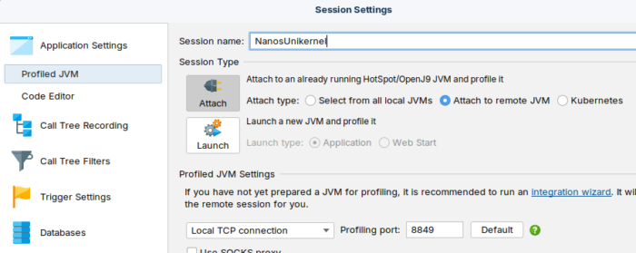
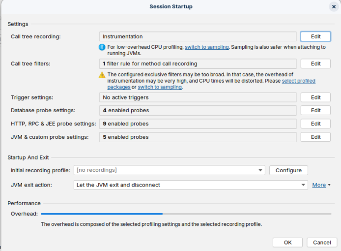
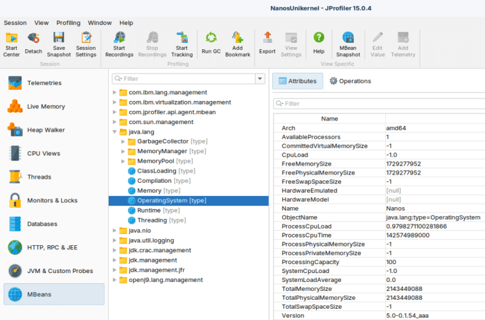
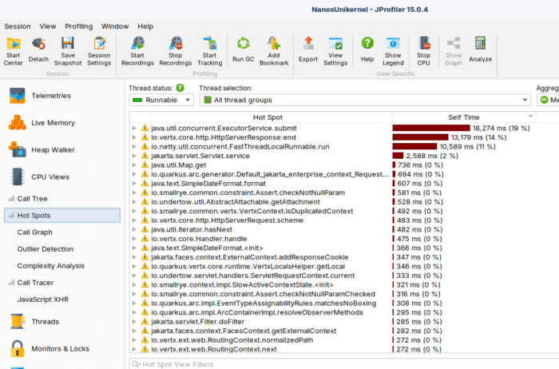
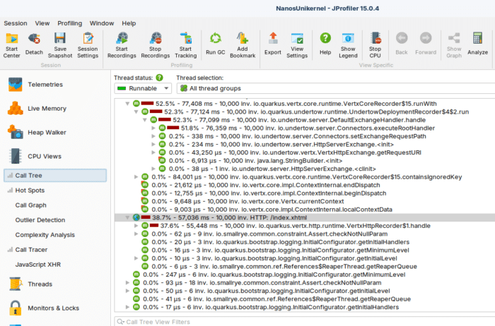
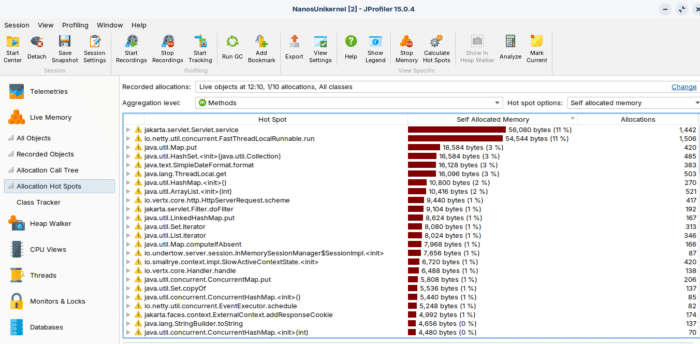

### Profiling a Java Application Running Inside an Unikernel with JProfiler {#h3-0-profiling-a-java-application-running-inside-an-unikernel-with-jprofiler}

Unikernels are often associated with minimalism and tight resource control.

But can we profile a Java application running inside a unikernel using a standard JVM profiler?

The answer is yes.

In this guide, we will walk step by step through profiling a Quarkus  

application running inside a Nanos unikernel using **JProfiler** and  
**IBM Semeru JRE 25 (OpenJ9)**.

No special hacks. Just standard JVM tooling.


* Ops (<https://ops.city/>)
* JProfiler (<https://www.ej-technologies.com/jprofiler>)
* A Quarkus application packaged as a runnable JAR


We start from a clean Proof of Concept directory:

```bash
quarkusProfiling$ ls
config.json  jprofiler15  myQuarkusApp  tmp
```

Directory breakdown:

* `config.json` → Ops/Nanos configuration file
* `jprofiler15/` → extracted JProfiler distribution
* `myQuarkusApp/` → packaged Quarkus runnable JAR
* `tmp/` → writable directory inside the unikernel


Below is the complete `config.json` used for this setup:

```json
{
    "Version": "1.0.0",
    "Dirs":["myQuarkusApp","jprofiler15","tmp"], 
    "Args": [
        "-agentpath:/jprofiler15/bin/linux-x64/libjprofilerti.so=port=8849,address=0.0.0.0",
        "-jar",
        "myQuarkusApp/quarkus-faces-runner.jar"
    ],
    "RunConfig": {
        "Ports": ["8080","8849"]
    },
    "BaseVolumeSz": "300m"  
}
```

Explanation {#h2-1-explanation}
-------------------------------

### Dirs {#h3-2-dirs}

```json
"Dirs":["myQuarkusApp","jprofiler15","tmp"]
```

These directories are embedded into the unikernel filesystem:

* The application
* The JProfiler native agent
* A writable tmp directory


### Args {#h3-3-args}

```json
"-agentpath:/jprofiler15/bin/linux-x64/libjprofilerti.so=port=8849,address=0.0.0.0"
```

This is the key configuration.

We explicitly load the **JProfiler native JVMTI agent** at JVM startup.

Important parameters:

* `port=8849` → port used by the profiler
* `address=0.0.0.0` → listen on all interfaces

Then we launch the application:

```json
"-jar", "myQuarkusApp/quarkus-faces-runner.jar"
```


### RunConfig {#h3-4-runconfig}

```json
"Ports": ["8080","8849"]
```

We expose:

* `8080` → Quarkus HTTP endpoint
* `8849` → JProfiler agent port


### BaseVolumeSz {#h3-5-basevolumesz}

```json
"BaseVolumeSz": "300m"
```

Allocates 300 MB for the unikernel filesystem.


From the project root directory, run:

```bash
ops pkg load AngeloRubens/SemeruJREx64Linux:25.0.1 --nightly -c config.json
```

What this command does {#h2-6-what-this-command-does}
-----------------------------------------------------

* Loads IBM Semeru JRE 25 (OpenJ9)
* Applies our local `config.json`
* Embeds the application and profiler agent
* Boots the unikernel locally

There is no separate container or VM runtime.\\  

The JVM runs directly inside the unikernel.


When the unikernel starts, you will see:

```bash
running local instance
booting /home/lop/.ops/images/java ...
[0.227374] en1: assigned 10.0.2.15
```

The unikernel has booted and received an IP address.

Then the JVM starts and the profiler agent initializes:

    JProfiler> Protocol version 68
    JProfiler> OpenJ9 JVMTI detected.
    JProfiler> Java 25 detected.
    JProfiler> 64-bit library
    JProfiler> Listening on port: 8849.

This confirms:

* OpenJ9 JVM detected
* Java 25 runtime
* JVMTI available
* Native agent loaded successfully


Instrumentation Phase {#h2-7-instrumentation-phase}
---------------------------------------------------

    JProfiler> Enabling native methods instrumentation.
    JProfiler> Can retransform classes.
    JProfiler> Native library initialized
    JProfiler> VM initialized

This means:

* Class retransformation is supported
* Native methods can be instrumented
* The agent is fully integrated


Final State {#h2-8-final-state}
-------------------------------

    JProfiler> Retransforming 11 base class files.
    JProfiler> Base classes instrumented.
    JProfiler> Waiting for a connection from the JProfiler GUI ...
    JProfiler> Using address 0.0.0.0.

At this point:

* The JProfiler agent is listening on port 8849
* The JVM is waiting for a GUI connection

The profiling infrastructure inside the unikernel is fully operational.


Open JProfiler.

1. Click **New Session**
2. Select **Attach to remote JVM**
3. Enter:
   * Host: `127.0.0.1`
   * Port: `8849`
4. Connect





The GUI will attach to remote JVM running inside the unikernel(or connect to remote jvm running in you cloud provider or onprem).

From here you can:

* Inspect CPU hotspots
* Analyze memory allocations
* Capture heap snapshots
* Monitor threads
* View GC activity

Exactly as you would with a standard JVM.

SO Info(Nanos name):



CPU Hot Spots



CPU Call Tree



Live Objects




Unikernels do not remove JVM capabilities.

JProfiler uses:

* JVMTI
* Native agent loading via `-agentpath`
* Standard TCP communication

As long as:

* The agent library is available
* The port is exposed
* The JVM supports JVMTI

Profiling works.

The environment (VM, container, unikernel) does not change the JVM instrumentation model.


Profiling a Java application inside a unikernel is straightforward.

By:

* Embedding the profiler native agent
* Exposing the profiler port
* Using a standard JVM (IBM Semeru OpenJ9)

You can use JProfiler --- or any JVMTI-based tool --- without  

limitations.

Unikernels do not prevent observability.\\  

They simply run your JVM in a different execution model.

And from the JVM perspective, everything works exactly as expected.

If you want, yoou can see the sample app of this post, running into nanos Unikernel on Arm64 Ampere Oracle OCI Cloud <http://80.225.94.232:8080/index.xhtml>
