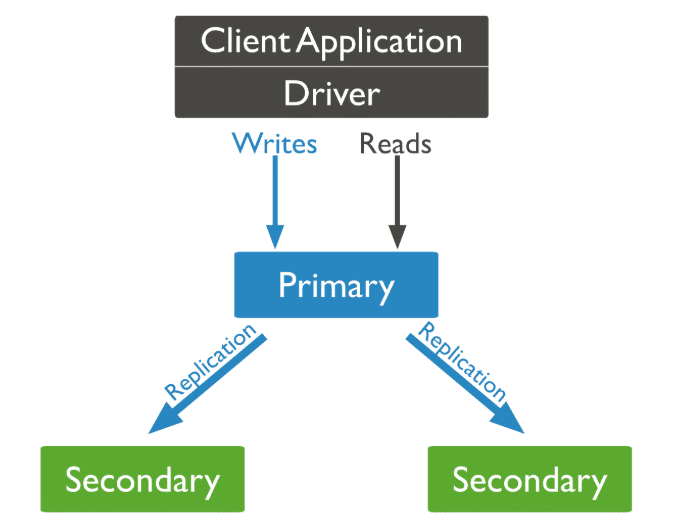
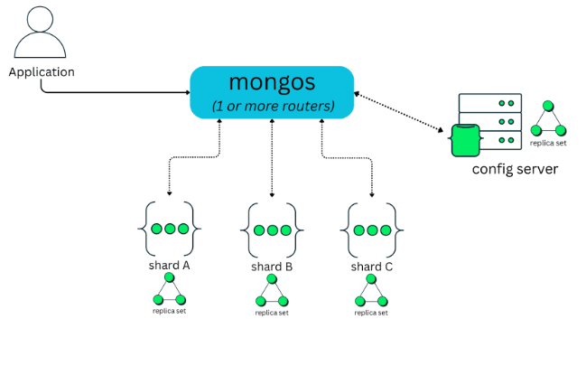
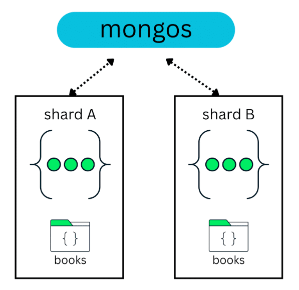
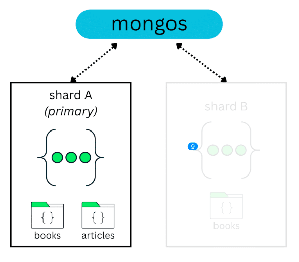
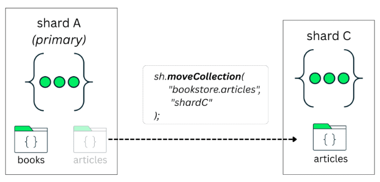
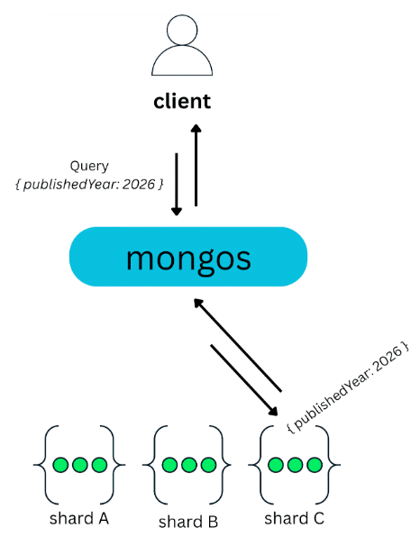
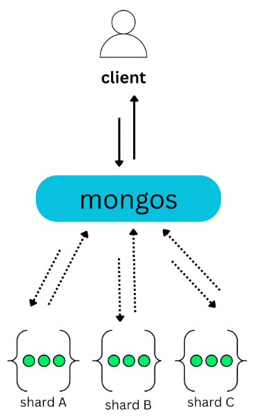
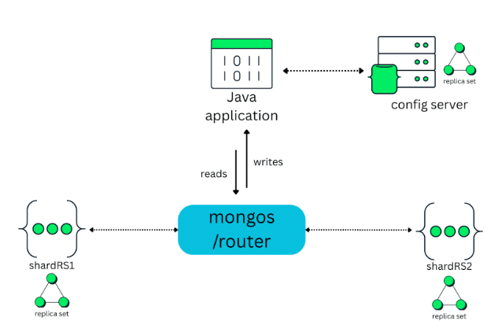

When we think about a system that operates at scale, we are usually talking about an application that needs to serve millions of users. This often happens when an application suddenly becomes popular and usage grows much faster than expected. As more people start using it, the system naturally begins to struggle to keep up with the load.

More users mean more requests, more data being generated, and more pressure on the database. If nothing is done, bottlenecks start to appear and the overall performance of the system degrades. There are two traditional ways to deal with this problem: vertical scaling and horizontal scaling.

Adding more CPU, memory, or storage to a single server is known as vertical scaling. On the other hand, we have horizontal scaling, which takes a different approach. Instead of relying on a single powerful server, the system distributes the load across multiple machines.

This is where [sharding](https://www.mongodb.com/resources/products/capabilities/sharding/?%20utm_campaign=devrel&%20utm_source=third-part-content&utm_medium=cta&utm_content=sharding_mongodb_foojay&utm_term=ricardo.mello) becomes relevant.

Sharding as a horizontal scaling strategy {#h2-0-sharding-as-a-horizontal-scaling-strategy}
-------------------------------------------------------------------------------------------

Consider a common e-commerce application scenario. On regular days, the volume of traffic and transactions is predictable and easily supported by the existing infrastructure. During events like Black Friday, however, this volume can increase significantly in a short period of time. When this happens, the database is often one of the first components to become a bottleneck. More concurrent writes, more reads, and larger datasets start to push a single server to its limits, making it necessary to take action to keep the system responsive and available.

A common reaction is to scale the database vertically by adding more resources to the server. This approach often helps at first, since more CPU and memory allow the database to process more requests and increase throughput. However, vertical scaling is expensive and has a hard physical limit. At some point, it is no longer possible to add more resources to the same machine, either because of hardware constraints or cost.

So, what is the alternative? Instead of making a single server bigger, we scale horizontally by adding more machines. MongoDB supports horizontal scaling through its sharding architecture, allowing data to be distributed across multiple servers and avoiding oversized infrastructure after peak periods. At a high level, adopting sharding usually involves:

1. Understanding a sharded cluster architecture.
2. Distributing data in a sharded cluster.
3. Choosing a shard key.
4. Tuning shard keys based on access patterns.

Let's walk through each of these, starting from the basics.

Understanding a sharded cluster architecture {#h2-1-understanding-a-sharded-cluster-architecture}
-------------------------------------------------------------------------------------------------

Sharding doesn't exist in isolation. It is built on top of a few core MongoDB concepts, one of which is [replication](https://www.mongodb.com/docs/manual/replication/?%20utm_campaign=devrel&%20utm_source=third-part-content&utm_medium=cta&utm_content=sharding_mongodb_foojay&utm_term=ricardo.mello).

At a high level, replication in MongoDB means having the same data stored on multiple servers. This is done through a replica set, which is usually composed of three nodes.

One node acts as the primary, receiving all write operations and replicating this information to the other secondary nodes:  

Now, imagine a simple scenario. You have one node running in São Paulo, another one in New York, and a third one in Bengaluru. All three nodes store the same data.

If the node in São Paulo becomes unavailable due to a hardware failure or a regional outage, MongoDB automatically elects one of the remaining nodes---for example, the one in New York or Bengaluru---to become the new primary. Write operations continue to work, and the application remains available.

When the São Paulo node comes back online, it rejoins the replica set as a secondary node and synchronizes its data again.

This approach helps maintain high availability and also simplifies disaster recovery. Since the data is already replicated across different locations, it can be recovered from another node if one of them is lost.

Building on top of this replication layer, a MongoDB sharded cluster is composed of three main components: **mongos** , **config servers** , and **shards**, as shown in the figure below:  

### Shards {#h3-2-shards}

As discussed in the previous section on replication, each [shard](https://www.mongodb.com/docs/manual/core/sharded-cluster-shards/#std-label-shards-concepts/?%20utm_campaign=devrel&%20utm_source=third-part-content&utm_medium=cta&utm_content=sharding_mongodb_foojay&utm_term=ricardo.mello) runs as a replica set, typically composed of three [mongod](https://www.mongodb.com/docs/manual/reference/program/mongod/?%20utm_campaign=devrel&%20utm_source=third-part-content&utm_medium=cta&utm_content=sharding_mongodb_foojay&utm_term=ricardo.mello) instances. This ensures high availability and fault tolerance at the shard level.

As the diagram shows, a sharded cluster can have one shard or multiple shards, depending on the size of the data and the scalability requirements of the application. Each shard is responsible for storing only a portion of the overall dataset, not the entire data.

This distribution allows the cluster to grow by adding new shards over time, instead of concentrating all data on a single server.

### Config servers {#h3-3-config-servers}

[Config servers](https://www.mongodb.com/docs/manual/core/sharded-cluster-config-servers/?%20utm_campaign=devrel&%20utm_source=third-part-content&utm_medium=cta&utm_content=sharding_mongodb_foojay&utm_term=ricardo.mello) run as a dedicated replica set and store the metadata that describes how data is distributed across the cluster, including shard keys and data-to-shard mappings.

### Mongos {#h3-4-mongos}

The client always connects to [mongos](https://www.mongodb.com/docs/manual/reference/program/mongos/?%20utm_campaign=devrel&%20utm_source=third-part-content&utm_medium=cta&utm_content=sharding_mongodb_foojay&utm_term=ricardo.mello), which acts as a router. The client never connects directly to shards or config servers. From the application's point of view, mongos looks like a regular MongoDB instance. When an operation is received, mongos uses the cluster metadata to determine which shard or shards should handle the request. It then routes the operation accordingly and returns the result back to the client.

In production environments, MongoDB automatically provisions and manages multiple mongos instances in Atlas, while in self-managed deployments, it is common to run multiple mongos processes for high availability and scalability.

Distributing data in a sharded cluster {#h2-5-distributing-data-in-a-sharded-cluster}
-------------------------------------------------------------------------------------

Data distribution across shards is usually done by spreading the data of a collection across multiple shards. For example, in a cluster with two shards, a *books* collection with 10 million documents can be split between those two shards:  

Now, in this same scenario, imagine that a new collection is created and it is **not sharded**---for example, an articles collection:  

By default, this collection is assigned to the database's primary shard. You can verify which shard is acting as the primary for a database by running:

<pre class="EnlighterJSRAW" data-enlighter-language="generic" data-enlighter-theme="" data-enlighter-highlight="" data-enlighter-linenumbers="" data-enlighter-lineoffset="" data-enlighter-title="" data-enlighter-group="">&gt; use config

&gt; db.databases.find({_id: "&lt;DATABASE_NAME&gt;"}, {primary: 1})</pre>

Since this primary shard may host multiple unsharded collections, they all end up sharing the same resources. As these collections grow, this can lead to resource contention.

Starting with MongoDB 8.0, this unsharded collection can be moved to a specific shard using [moveCollection](https://www.mongodb.com/docs/manual/tutorial/move-a-collection/?utm_campaign=devrel&%20utm_source=third-part-content&utm_medium=cta&utm_content=sharding_mongodb_foojay&utm_term=ricardo.mello). This allows the collection to benefit from dedicated resources and avoids competing with other collections on the same shard:  

When should you shard a collection? {#h2-6-when-should-you-shard-a-collection}
------------------------------------------------------------------------------

Sharding a collection is not something you do on day one. In most cases, a single replica set is enough for a long time. Sharding a collection becomes relevant when you start approaching the limits of what a single replica set can handle, either in terms of data size, throughput, or operational constraints.

### Vertical limits or cost {#h3-7-vertical-limits-or-cost}

This is a very common scenario, and it's the same one we discussed earlier with the e-commerce example, where traffic and sales can grow very quickly.

Continuing to scale up hardware is expensive and also limited. At some point, you simply can't keep adding more CPU and memory to the same machine.

When you reach this stage, sharding becomes a reasonable option to consider. Instead of relying on a single, increasingly large server, you distribute data and workload across multiple shards and scale more naturally.

### Large datasets {#h3-8-large-datasets}

One clear signal is data size. When a collection starts to grow into the multi-terabyte range, typically around **2-3 TB**, a single replica set becomes harder to manage. At this scale, operations such as index builds, backups, restores, and maintenance tasks take longer and carry more risk.

### Faster backup and restore times {#h3-9-faster-backup-and-restore-times}

Restoring a very large database on a single replica set can take hours, sometimes even days, depending on size and infrastructure. With sharding, data is split across shards, which allows restore operations to run in parallel. In practice, this can significantly reduce recovery time, especially in disaster recovery scenarios.

### High write or throughput requirements {#h3-10-high-write-or-throughput-requirements}

If the application needs to handle a high volume of writes or a large number of concurrent operations, a single primary node can become a bottleneck. This is common in systems that ingest data continuously, such as event streams, logs, transactions, or time-based workloads.

### Zonal or regional data requirements {#h3-11-zonal-or-regional-data-requirements}

When applications need to separate data by region, customer type, or compliance requirements, zone sharding becomes a strong reason to shard. For example:

* Customers from Brazil stored on shards in one region  
* Customers from the USA stored on shards in another

Choosing a shard key {#h2-12-choosing-a-shard-key}
--------------------------------------------------

So you've decided that sharding makes sense for your workload. The next question is: *How does MongoDB decide which data goes to which shard?*

**TL;DR:** MongoDB makes this decision through the [shard key](https://www.mongodb.com/docs/manual/core/sharding-shard-key/?%20utm_campaign=devrel&%20utm_source=third-part-content&utm_medium=cta&utm_content=sharding_mongodb_foojay&utm_term=ricardo.mello) and distribution options.

In simple terms, a shard key is the field, or set of fields, that MongoDB uses to split a collection and distribute its documents across shards. Without a shard key, MongoDB has no way to decide how data should be divided.

In practice, choosing a shard key also means defining an index. Once the shard key is in place, the collection is sharded using the shardCollection operation, and MongoDB starts distributing data across shards based on that key.

<pre class="EnlighterJSRAW" data-enlighter-language="generic" data-enlighter-theme="" data-enlighter-highlight="" data-enlighter-linenumbers="" data-enlighter-lineoffset="" data-enlighter-title="" data-enlighter-group="">sh.shardCollection(
&nbsp;"library.books",
&nbsp;{ publishedYear: 1 }
)</pre>

In this example, the publishedYear field is used as the shard key. If the collection is empty, MongoDB can create this index as part of the sharding operation. If the collection already contains data, you must create the index first, and only then shard the collection.

Once a shard key is defined, MongoDB breaks the collection into smaller logical ranges called [chunks](https://www.mongodb.com/docs/manual/core/sharding-data-partitioning/?%20utm_campaign=devrel&%20utm_source=third-part-content&utm_medium=cta&utm_content=sharding_mongodb_foojay&utm_term=ricardo.mello). Each chunk represents a range of shard key values.

To make this easier to visualize, imagine a collection sharded by a publishedYear field. MongoDB could create chunks that represent ranges such as 1900 to 1905, 1906 to 1910, 1911 to 1915, and so on. Documents with shard key values that fall within the same range are grouped into the same chunk.

These chunks are then distributed across the shards in the cluster. As data grows and new chunks are created, MongoDB continuously works to keep the distribution balanced.

This process is handled by the [balancer](https://www.mongodb.com/docs/manual/core/sharding-balancer-administration/?%20utm_campaign=devrel&%20utm_source=third-part-content&utm_medium=cta&utm_content=sharding_mongodb_foojay&utm_term=ricardo.mello), a background component responsible for moving chunks between shards when needed. Its goal is to prevent one shard from holding significantly more data or handling more load than others.

### Targeted operations vs. broadcast operations {#h3-13-targeted-operations-vs-broadcast-operations}

At this point, it is important to understand that the shard key affects not only how data is stored, but also how queries are executed.

When a query includes the shard key, MongoDB can determine exactly where the data is located. Using the cluster metadata stored on the config servers, mongos knows which shard owns the relevant chunk and routes the operation directly to that shard. Only that shard executes the query and returns the result, which is then forwarded back to the client. These are known as [targeted operations](https://www.mongodb.com/docs/manual/core/sharded-cluster-query-router/#targeted-operations-vs.-broadcast-operations/?%20utm_campaign=devrel&%20utm_source=third-part-content&utm_medium=cta&utm_content=sharding_mongodb_foojay&utm_term=ricardo.mello), and they are typically fast and efficient:  

On the other hand, when a query doesn't include the shard key, MongoDB can't determine which shard holds the requested data. In this case, mongos has no choice but to broadcast the query to all shards:  

Each shard executes the operation on its own subset of the data and sends the result back to mongos, which then merges the results before returning them to the client. These are known as **broadcast operations** , or **scatter-gather queries**.

A common issue with scatter-gather is that they must wait for every shard to respond. For example, in a cluster with 50 shards, a single query is sent to all 50 shards and cannot complete until all of them return a response. Only after that can mongos merge the results and send the final response back to the client.

### An effective shard key {#h3-14-an-effective-shard-key}

This is where shard key selection becomes important. Very often, scatter-gather queries are a direct consequence of how the shard key was chosen.

So, *what makes a shard key "good"?* The honest answer is: **It depends**.

It depends on the data, on access patterns, and on how the application is used. A shard key that works well in one context may be a poor choice in another. That said, there are a few common characteristics that usually help guide this decision:

* Cardinality
* Frequency
* Monotonicity

Let's use a books collection as an example:

<pre class="EnlighterJSRAW" data-enlighter-language="generic" data-enlighter-theme="" data-enlighter-highlight="" data-enlighter-linenumbers="" data-enlighter-lineoffset="" data-enlighter-title="" data-enlighter-group="">{
&nbsp;"title": "Essential Artificial Intelligence - 3th Edition",
&nbsp;"author": "Thomas Williams",
&nbsp;"isbn": "978-0492974866",
&nbsp;"publishedYear": 2014,
&nbsp;"createdAt": "2026-01-01T00:00:00.000Z",
&nbsp;"price": 41.81
}</pre>

#### Cardinality

Cardinality is about how many different values a field can have. The more unique the values are, the higher the cardinality.

High cardinality is good because it allows MongoDB to split the data into many chunks and distribute it across shards more evenly. In the context of books, the ISBN field has high cardinality, since each book usually has a unique ISBN. This makes it a good candidate for distributing data.

#### Frequency

Frequency is about how often the same value appears in the dataset. If a high number of values appears very often, those can create bottlenecks. For example, many books can share the same publishedYear, such as 2014. This means publishedYear can have high frequency for certain values, which may cause too much data to land on the same shard.

#### Monotonicity

Monotonicity describes fields whose values always move in one direction over time, either increasing or decreasing. When a shard key is monotonically increasing, new documents tend to be written to the same shard, creating a write hotspot. In a books collection, fields like publishedYear or a creation timestamp increase over time, which can cause most new inserts to go to a single shard.

### So, why does shard key selection depend on your workload? {#h3-15-so-why-does-shard-key-selection-depend-on-your-workload}

The effectiveness of a shard key is always tied to how the application uses the data.

A field like publishedYear may raise concerns around frequency or monotonicity, but that doesn't automatically make it unusable.

For read-heavy workloads, where the application frequently runs queries such as

"find all books published between 2010 and 2015,"

using publishedYear as part of the shard key can be beneficial. In this case, range-based targeting allows MongoDB to efficiently route those queries to a subset of shards.

However, this comes with an important trade-off: Writes for new data will still be routed to a single shard. For write-heavy or insert-heavy workloads, this makes publishedYear a poor shard key choice, as it can easily lead to write hotspots.

Distribution options {#h2-16-distribution-options}
--------------------------------------------------

Another aspect that defines how effectively data is distributed across shards is the sharding strategy itself.

### Range-based {#h3-17-range-based}

Data is distributed based on [ranges](https://www.mongodb.com/docs/manual/core/ranged-sharding/?utm_campaign=devrel&%20utm_source=third-part-content&utm_medium=cta&utm_content=sharding_mongodb_foojay&utm_term=ricardo.mello) of shard key values. This is the most common approach, but it requires care, especially with fields that grow over time. We'll see an example of this next.

### Hashed {#h3-18-hashed}

The shard key value is [hashed](https://www.mongodb.com/docs/manual/core/hashed-sharding/?utm_campaign=devrel&%20utm_source=third-part-content&utm_medium=cta&utm_content=sharding_mongodb_foojay&utm_term=ricardo.mello) before distribution, which helps spread data evenly across all shards and avoids uneven inserts or write hotspots.

### Zone-based {#h3-19-zone-based}

This [zone](https://www.mongodb.com/docs/manual/tutorial/sharding-distribute-collections-with-zones/?utm_campaign=devrel&%20utm_source=third-part-content&utm_medium=cta&utm_content=sharding_mongodb_foojay&utm_term=ricardo.mello) strategy allows you to control where data lives by assigning ranges or values to specific shards. It can be combined with range or hashed sharding and is especially useful for separating data by region, such as customers from Brazil versus customers from the USA.

A quick lab: Range vs. hashed sharding {#h2-20-a-quick-lab-range-vs-hashed-sharding}
------------------------------------------------------------------------------------

To make this more concrete, let's walk through a simple experiment. For this experiment, the sharded cluster is composed of two shards:

* *shardRS1*
* *shardRS2*

In the middle of the cluster sits mongos, which acts as the router. The Java application doesn't connect directly to the shards or to the config servers. All read and write operations go through mongos:  

**Notice** : At this point, the cluster is already up and running. The config servers, shards, and mongos are fully configured, and the shards have already been added to the cluster. The focus of this section is not on how to deploy a sharded cluster, but on analyzing data distribution and behavior once sharding is applied. You can deploy your own quickly using [MongoDB Atlas](https://www.mongodb.com/docs/atlas/cluster-additional-settings/?utm_campaign=devrel&%20utm_source=third-part-content&utm_medium=cta&utm_content=sharding_mongodb_foojay&utm_term=ricardo.mello).

### Preparing the scenario {#h3-21-preparing-the-scenario}

The first step is to populate the cluster with data. To do that, we will insert 10 million book documents into the collection using a Java application with bulk writes.

<pre class="EnlighterJSRAW" data-enlighter-language="generic" data-enlighter-theme="" data-enlighter-highlight="" data-enlighter-linenumbers="" data-enlighter-lineoffset="" data-enlighter-title="" data-enlighter-group="">private void insertBooksBulk(MongoCollection&lt;Document&gt; col) {
&nbsp;&nbsp;&nbsp;List&lt;Document&gt; batch = new ArrayList&lt;&gt;(BATCH_SIZE);
&nbsp;&nbsp;&nbsp;InsertManyOptions opts = new InsertManyOptions().ordered(false);

&nbsp;&nbsp;&nbsp;for (int i = 0; i &lt; TOTAL_BOOKS; i++) {
&nbsp;&nbsp;&nbsp;&nbsp;&nbsp;&nbsp;&nbsp;batch.add(makeDoc(i));

&nbsp;&nbsp;&nbsp;&nbsp;&nbsp;&nbsp;&nbsp;if (batch.size() == BATCH_SIZE) {
&nbsp;&nbsp;&nbsp;&nbsp;&nbsp;&nbsp;&nbsp;&nbsp;&nbsp;&nbsp;&nbsp;col.insertMany(batch, opts);
&nbsp;&nbsp;&nbsp;&nbsp;&nbsp;&nbsp;&nbsp;&nbsp;&nbsp;&nbsp;&nbsp;logProgress(i + 1, TOTAL_BOOKS);
&nbsp;&nbsp;&nbsp;&nbsp;&nbsp;&nbsp;&nbsp;&nbsp;&nbsp;&nbsp;&nbsp;batch.clear();
&nbsp;&nbsp;&nbsp;&nbsp;&nbsp;&nbsp;&nbsp;}
&nbsp;&nbsp;&nbsp;}

&nbsp;&nbsp;&nbsp;if (!batch.isEmpty()) {
&nbsp;&nbsp;&nbsp;&nbsp;&nbsp;&nbsp;&nbsp;col.insertMany(batch, opts);
&nbsp;&nbsp;&nbsp;&nbsp;&nbsp;&nbsp;&nbsp;logProgress(TOTAL_BOOKS, TOTAL_BOOKS);
&nbsp;&nbsp;&nbsp;}
}</pre>

This is simply a way to simulate a cluster that already contains a large amount of data. You can check the entire code [here](https://github.com/ricardohsmello/mongodb-java-sample/blob/de430e9ebb734dc3eef9f9d9faad276570b796ec/src/main/java/com/example/mongodb/DataInitializer.java#L68).

After this step, we connect to mongos and inspect the *books* collection:

<pre class="EnlighterJSRAW" data-enlighter-language="generic" data-enlighter-theme="" data-enlighter-highlight="" data-enlighter-linenumbers="" data-enlighter-lineoffset="" data-enlighter-title="" data-enlighter-group="">Enterprise [direct: mongos] test&gt; use bookstore

switched to db bookstore

Enterprise [direct: mongos] bookstore&gt; db.books.countDocuments()

10000000</pre>

At this point, we have a collection with 10 million documents. The data is in place, but the collection is still not sharded.

### Range-based {#h3-22-range-based}

In this first experiment, we'll use the publishedYear field as the shard key. The goal is to observe how MongoDB distributes existing data, how the balancer reacts over time, and where problems can appear when new data keeps arriving.

#### Sharding the collection

Since the books collection already contains data, MongoDB requires an index on the shard key before sharding the collection:

<pre class="EnlighterJSRAW" data-enlighter-language="generic" data-enlighter-theme="" data-enlighter-highlight="" data-enlighter-linenumbers="" data-enlighter-lineoffset="" data-enlighter-title="" data-enlighter-group="">Enterprise [direct: mongos] bookstore&gt; db.books.createIndex({ publishedYear: 1 })

publishedYear_1</pre>

With the index in place, we can shard the collection:

<pre class="EnlighterJSRAW" data-enlighter-language="generic" data-enlighter-theme="" data-enlighter-highlight="" data-enlighter-linenumbers="" data-enlighter-lineoffset="" data-enlighter-title="" data-enlighter-group="">Enterprise [direct: mongos] bookstore&gt; sh.shardCollection("bookstore.books", { publishedYear: 1 })

{
&nbsp;collectionsharded: 'bookstore.books',
&nbsp;ok: 1,
&nbsp;'$clusterTime': {
&nbsp;&nbsp;&nbsp;clusterTime: Timestamp({ t: 1768281083, i: 44 }),
&nbsp;&nbsp;&nbsp;signature: {
&nbsp;&nbsp;&nbsp;&nbsp;&nbsp;hash: Binary.createFromBase64('AAAAAAAAAAAAAAAAAAAAAAAAAAA=', 0),
&nbsp;&nbsp;&nbsp;&nbsp;&nbsp;keyId: Long('0')
&nbsp;&nbsp;&nbsp;}
&nbsp;},
&nbsp;operationTime: Timestamp({ t: 1768281083, i: 44 })
}</pre>

At this point, MongoDB starts splitting the collection into chunks based on ranges of publishedYear values and distributing those chunks across the shards.

#### Observing initial data distribution

After sharding, we can inspect the cluster state using:

Enterprise \[direct: mongos\] bookstore\> sh.getShardedDataDistribution()

One of the first things worth checking is the **sharded data distribution**, which shows how documents are currently spread across shards:

<pre class="EnlighterJSRAW" data-enlighter-language="generic" data-enlighter-theme="" data-enlighter-highlight="" data-enlighter-linenumbers="" data-enlighter-lineoffset="" data-enlighter-title="" data-enlighter-group="">[&nbsp;
&nbsp;{
&nbsp;&nbsp;ns: 'bookstore.books',
&nbsp;&nbsp;shards: [
&nbsp;&nbsp;&nbsp;&nbsp;{
&nbsp;&nbsp;&nbsp;&nbsp;&nbsp;&nbsp;shardName: 'shardRS2',
&nbsp;&nbsp;&nbsp;&nbsp;&nbsp;&nbsp;numOrphanedDocs: 0,
&nbsp;&nbsp;&nbsp;&nbsp;&nbsp;&nbsp;numOwnedDocuments: 4247390,
&nbsp;&nbsp;&nbsp;&nbsp;&nbsp;&nbsp;ownedSizeBytes: 671087620,
&nbsp;&nbsp;&nbsp;&nbsp;&nbsp;&nbsp;orphanedSizeBytes: 0
&nbsp;&nbsp;&nbsp;&nbsp;},
&nbsp;&nbsp;&nbsp;&nbsp;{
&nbsp;&nbsp;&nbsp;&nbsp;&nbsp;&nbsp;shardName: 'shardRS1',
&nbsp;&nbsp;&nbsp;&nbsp;&nbsp;&nbsp;numOrphanedDocs: 4247390,
&nbsp;&nbsp;&nbsp;&nbsp;&nbsp;&nbsp;numOwnedDocuments: 5752610,
&nbsp;&nbsp;&nbsp;&nbsp;&nbsp;&nbsp;ownedSizeBytes: 908912380,
&nbsp;&nbsp;&nbsp;&nbsp;&nbsp;&nbsp;orphanedSizeBytes: 671087620
&nbsp;&nbsp;&nbsp;&nbsp;}
&nbsp;&nbsp;]
},
]</pre>

Here, the numOrphanedDocs field stands out. **Orphaned documents** are temporary leftovers created during chunk migrations. They appear when ownership of a chunk has moved to another shard, but the old copy hasn't been cleaned up yet.

This is normal behavior while the balancer is working and resolves automatically. A healthy state is when all shards eventually report numOrphanedDocs: 0.

#### Understanding chunk ranges

Next, let's look at the chunk metadata for the collection:

<pre class="EnlighterJSRAW" data-enlighter-language="generic" data-enlighter-theme="" data-enlighter-highlight="" data-enlighter-linenumbers="" data-enlighter-lineoffset="" data-enlighter-title="" data-enlighter-group="">collections: {
&nbsp;&nbsp;&nbsp;&nbsp;&nbsp;'bookstore.books': {
&nbsp;&nbsp;&nbsp;&nbsp;&nbsp;&nbsp;&nbsp;shardKey: { publishedYear: 1 },
&nbsp;&nbsp;&nbsp;&nbsp;&nbsp;&nbsp;&nbsp;unique: false,
&nbsp;&nbsp;&nbsp;&nbsp;&nbsp;&nbsp;&nbsp;balancing: true,
&nbsp;&nbsp;&nbsp;&nbsp;&nbsp;&nbsp;&nbsp;chunkMetadata: [
&nbsp;&nbsp;&nbsp;&nbsp;&nbsp;&nbsp;&nbsp;&nbsp;&nbsp;{ shard: 'shardRS1', nChunks: 4 },
&nbsp;&nbsp;&nbsp;&nbsp;&nbsp;&nbsp;&nbsp;&nbsp;&nbsp;{ shard: 'shardRS2', nChunks: 1 }
&nbsp;&nbsp;&nbsp;&nbsp;&nbsp;&nbsp;&nbsp;],
&nbsp;&nbsp;&nbsp;&nbsp;&nbsp;&nbsp;&nbsp;&nbsp;&nbsp;&nbsp;chunks: [
&nbsp;&nbsp;&nbsp;&nbsp;&nbsp;&nbsp;&nbsp;&nbsp;&nbsp;{ min: { publishedYear: MinKey() }, max: { publishedYear: 1993 }, 'on shard': 'shardRS1', 'last modified': Timestamp({ t: 2, i: 0 }) },
&nbsp;&nbsp;&nbsp;&nbsp;&nbsp;&nbsp;&nbsp;&nbsp;&nbsp;{ min: { publishedYear: 1993 }, max: { publishedYear: 1996 }, 'on shard': 'shardRS1', 'last modified': Timestamp({ t: 3, i: 0 }) },
&nbsp;&nbsp;&nbsp;&nbsp;&nbsp;&nbsp;&nbsp;&nbsp;&nbsp;{ min: { publishedYear: 1996 }, max: { publishedYear: 1999 }, 'on shard': 'shardRS1', 'last modified': Timestamp({ t: 4, i: 0 }) },
&nbsp;&nbsp;&nbsp;&nbsp;&nbsp;&nbsp;&nbsp;&nbsp;&nbsp;{ min: { publishedYear: 1999 }, max: { publishedYear: 2002 }, 'on shard': 'shardRS1', 'last modified': Timestamp({ t: 5, i: 0 }) },
&nbsp;&nbsp;&nbsp;&nbsp;&nbsp;&nbsp;&nbsp;&nbsp;&nbsp;{ min: { publishedYear: 2002 }, max: { publishedYear: 2005 }, 'on shard': 'shardRS1', 'last modified': Timestamp({ t: 6, i: 0 }) },
&nbsp;&nbsp;&nbsp;&nbsp;&nbsp;&nbsp;&nbsp;&nbsp;&nbsp;{ min: { publishedYear: 2005 }, max: { publishedYear: MaxKey() }, 'on shard': 'shardRS2', 'last modified': Timestamp({ t: 6, i: 1 }) }
&nbsp;&nbsp;&nbsp;&nbsp;&nbsp;&nbsp;&nbsp;],
&nbsp;&nbsp;&nbsp;&nbsp;&nbsp;&nbsp;&nbsp;tags: []
&nbsp;&nbsp;&nbsp;&nbsp;&nbsp;}
&nbsp;&nbsp;&nbsp;}</pre>

At this stage:

* Most historical ranges were placed on *shardRS1.*
* The most recent range (2005 -\> MaxKey) landed on *shardRS2.*

Each chunk represents a slice of the publishedYear range.

#### Balancer in action

As the balancer runs, MongoDB starts reorganizing chunks to reach a more stable distribution. We can observe this by running:

<pre class="EnlighterJSRAW" data-enlighter-language="generic" data-enlighter-theme="" data-enlighter-highlight="" data-enlighter-linenumbers="" data-enlighter-lineoffset="" data-enlighter-title="" data-enlighter-group="">Enterprise [direct: mongos] bookstore&gt; db.books.getShardDistribution();</pre>

The output shows the percentage of documents and data size per shard. As these percentages change, it indicates chunks being moved between shards.

<pre class="EnlighterJSRAW" data-enlighter-language="generic" data-enlighter-theme="" data-enlighter-highlight="" data-enlighter-linenumbers="" data-enlighter-lineoffset="" data-enlighter-title="" data-enlighter-group="">Totals

{
&nbsp;data: '1.48GiB',
&nbsp;docs: 14163496,
&nbsp;chunks: 6,
&nbsp;'Shard shardRS1': [
&nbsp;&nbsp;&nbsp;'41.54 % data',
&nbsp;&nbsp;&nbsp;'29.39 % docs in cluster',
&nbsp;&nbsp;&nbsp;'158B avg obj size on shard'
&nbsp;],
&nbsp;'Shard shardRS2': [
&nbsp;&nbsp;&nbsp;'58.45 % data',
&nbsp;&nbsp;&nbsp;'70.6 % docs in cluster',
&nbsp;&nbsp;&nbsp;'158B avg obj size on shard'
&nbsp;]
}</pre>

After the balancer settles, the chunk layout simplifies to:

<pre class="EnlighterJSRAW" data-enlighter-language="generic" data-enlighter-theme="" data-enlighter-highlight="" data-enlighter-linenumbers="" data-enlighter-lineoffset="" data-enlighter-title="" data-enlighter-group="">chunks: [
&nbsp;&nbsp;&nbsp;&nbsp;&nbsp;&nbsp;&nbsp;&nbsp;&nbsp;{ min: { publishedYear: MinKey() }, max: { publishedYear: 2005 }, 'on shard': 'shardRS1', 'last modified': Timestamp({ t: 6, i: 2 }) },
&nbsp;&nbsp;&nbsp;&nbsp;&nbsp;&nbsp;&nbsp;&nbsp;&nbsp;{ min: { publishedYear: 2005 }, max: { publishedYear: MaxKey() }, 'on shard': 'shardRS2', 'last modified': Timestamp({ t: 6, i: 1 }) }
&nbsp;]</pre>

**Note**: When a collection is sharded, MongoDB relies on the balancer to distribute chunks over time, which can be slow for large datasets.

Starting in MongoDB 8.0, **sh.shardAndDistributeCollection()** allows you to shard and immediately reshard to the same shard key, distributing data much faster without waiting for the balancer. For more details, see [*Reshard to the Same Shard Key*](https://www.mongodb.com/docs/manual/tutorial/resharding-back-to-same-key/?utm_campaign=devrel&%20utm_source=third-part-content&utm_medium=cta&utm_content=sharding_mongodb_foojay&utm_term=ricardo.mello) in the MongoDB documentation.

At this point, the distribution is clear:

* *shardRS1* stores documents with publishedYear ≤ 2005
* *shardRS2* stores documents with publishedYear \> 2005

#### What about new insertions?

The question then is, *What happens when new books are published in 2026 or later?*

In that case, all new documents will fall into the same shard key range. In our setup, that means every new insert is routed to *shardRS2*.

Over time, this leads to:

* Writes concentrating on a single shard.
* *shardRS2* becoming overloaded.
* *shardRS1* staying mostly idle.

This is a classic write hotspot scenario with range-based sharding on time-like fields.

#### Simulating the write hotspot

To make this visible, we insert another 10 million documents, all with publishedYear = 2026. The [code](https://github.com/ricardohsmello/mongodb-java-sample/blob/de430e9ebb734dc3eef9f9d9faad276570b796ec/src/main/java/com/example/mongodb/DataInitializer.java#L98C2-L98C13) is slightly modified for this purpose, as shown below:

<pre class="EnlighterJSRAW" data-enlighter-language="generic" data-enlighter-theme="" data-enlighter-highlight="" data-enlighter-linenumbers="" data-enlighter-lineoffset="" data-enlighter-title="" data-enlighter-group="">private Document makeDoc(long i) {
&nbsp;&nbsp;&nbsp;Random r = rnd;
&nbsp;&nbsp;&nbsp;String title = generateRandomTitle(r);
&nbsp;&nbsp;&nbsp;String author = generateRandomAuthor(r);
&nbsp;&nbsp;&nbsp;String isbn = generateUniqueIsbn(i);
&nbsp;&nbsp;&nbsp;int year = 2026;&nbsp;
&nbsp;&nbsp;&nbsp;double price = Math.round((19.99 + r.nextDouble() * 80.0) * 100.0) / 100.0;

&nbsp;&nbsp;&nbsp;return new Document("title", title)
&nbsp;&nbsp;&nbsp;&nbsp;&nbsp;&nbsp;&nbsp;&nbsp;&nbsp;&nbsp;&nbsp;.append("author", author)
&nbsp;&nbsp;&nbsp;&nbsp;&nbsp;&nbsp;&nbsp;&nbsp;&nbsp;&nbsp;&nbsp;.append("isbn", isbn)
&nbsp;&nbsp;&nbsp;&nbsp;&nbsp;&nbsp;&nbsp;&nbsp;&nbsp;&nbsp;&nbsp;.append("publishedYear", year)
.append("createdAt", LocalDateTime.now())
&nbsp;&nbsp;&nbsp;&nbsp;&nbsp;&nbsp;&nbsp;&nbsp;&nbsp;&nbsp;&nbsp;.append("price", price);
}</pre>

After the insert, checking the sh.status() again shows:

<pre class="EnlighterJSRAW" data-enlighter-language="generic" data-enlighter-theme="" data-enlighter-highlight="" data-enlighter-linenumbers="" data-enlighter-lineoffset="" data-enlighter-title="" data-enlighter-group="">collections: {
&nbsp;&nbsp;&nbsp;&nbsp;&nbsp;'bookstore.books': {
&nbsp;&nbsp;&nbsp;&nbsp;&nbsp;&nbsp;&nbsp;shardKey: { publishedYear: 1 },
&nbsp;&nbsp;&nbsp;&nbsp;&nbsp;&nbsp;&nbsp;unique: false,
&nbsp;&nbsp;&nbsp;&nbsp;&nbsp;&nbsp;&nbsp;balancing: true,
&nbsp;&nbsp;&nbsp;&nbsp;&nbsp;&nbsp;&nbsp;chunkMetadata: [
&nbsp;&nbsp;&nbsp;&nbsp;&nbsp;&nbsp;&nbsp;&nbsp;&nbsp;{ shard: 'shardRS1', nChunks: 11 },
&nbsp;&nbsp;&nbsp;&nbsp;&nbsp;&nbsp;&nbsp;&nbsp;&nbsp;{ shard: 'shardRS2', nChunks: 1 }
&nbsp;&nbsp;&nbsp;&nbsp;&nbsp;&nbsp;&nbsp;],
&nbsp;&nbsp;&nbsp;&nbsp;&nbsp;&nbsp;&nbsp;chunks: [
&nbsp;&nbsp;&nbsp;&nbsp;&nbsp;&nbsp;&nbsp;&nbsp;&nbsp;{ min: { publishedYear: MinKey() }, max: { publishedYear: 2005 }, 'on shard': 'shardRS1', 'last modified': Timestamp({ t: 6, i: 2 }) },
&nbsp;&nbsp;&nbsp;&nbsp;&nbsp;&nbsp;&nbsp;&nbsp;&nbsp;{ min: { publishedYear: 2005 }, max: { publishedYear: 2008 }, 'on shard': 'shardRS1', 'last modified': Timestamp({ t: 7, i: 0 }) },
&nbsp;&nbsp;&nbsp;&nbsp;&nbsp;&nbsp;&nbsp;&nbsp;&nbsp;{ min: { publishedYear: 2008 }, max: { publishedYear: 2011 }, 'on shard': 'shardRS1', 'last modified': Timestamp({ t: 8, i: 0 }) },
&nbsp;&nbsp;&nbsp;&nbsp;&nbsp;&nbsp;&nbsp;&nbsp;&nbsp;{ min: { publishedYear: 2011 }, max: { publishedYear: 2013 }, 'on shard': 'shardRS1', 'last modified': Timestamp({ t: 9, i: 0 }) },
&nbsp;&nbsp;&nbsp;&nbsp;&nbsp;&nbsp;&nbsp;&nbsp;&nbsp;{ min: { publishedYear: 2013 }, max: { publishedYear: 2015 }, 'on shard': 'shardRS1', 'last modified': Timestamp({ t: 10, i: 0 }) },
&nbsp;&nbsp;&nbsp;&nbsp;&nbsp;&nbsp;&nbsp;&nbsp;&nbsp;{ min: { publishedYear: 2015 }, max: { publishedYear: 2017 }, 'on shard': 'shardRS1', 'last modified': Timestamp({ t: 11, i: 0 }) },
&nbsp;&nbsp;&nbsp;&nbsp;&nbsp;&nbsp;&nbsp;&nbsp;&nbsp;{ min: { publishedYear: 2017 }, max: { publishedYear: 2019 }, 'on shard': 'shardRS1', 'last modified': Timestamp({ t: 12, i: 0 }) },
&nbsp;&nbsp;&nbsp;&nbsp;&nbsp;&nbsp;&nbsp;&nbsp;&nbsp;{ min: { publishedYear: 2019 }, max: { publishedYear: 2021 }, 'on shard': 'shardRS1', 'last modified': Timestamp({ t: 13, i: 0 }) },
&nbsp;&nbsp;&nbsp;&nbsp;&nbsp;&nbsp;&nbsp;&nbsp;&nbsp;{ min: { publishedYear: 2021 }, max: { publishedYear: 2023 }, 'on shard': 'shardRS1', 'last modified': Timestamp({ t: 14, i: 0 }) },
&nbsp;&nbsp;&nbsp;&nbsp;&nbsp;&nbsp;&nbsp;&nbsp;&nbsp;{ min: { publishedYear: 2023 }, max: { publishedYear: 2025 }, 'on shard': 'shardRS1', 'last modified': Timestamp({ t: 15, i: 0 }) },
&nbsp;&nbsp;&nbsp;&nbsp;&nbsp;&nbsp;&nbsp;&nbsp;&nbsp;{ min: { publishedYear: 2025 }, max: { publishedYear: 2026 }, 'on shard': 'shardRS1', 'last modified': Timestamp({ t: 16, i: 0 }) },
&nbsp;&nbsp;&nbsp;&nbsp;&nbsp;&nbsp;&nbsp;&nbsp;&nbsp;{ min: { publishedYear: 2026 }, max: { publishedYear: MaxKey() }, 'on shard': 'shardRS2', 'last modified': Timestamp({ t: 16, i: 1 }), jumbo: 'yes' }
&nbsp;&nbsp;&nbsp;&nbsp;&nbsp;&nbsp;&nbsp;],
&nbsp;&nbsp;&nbsp;&nbsp;&nbsp;&nbsp;&nbsp;tags: []
&nbsp;&nbsp;&nbsp;&nbsp;&nbsp;}
&nbsp;&nbsp;&nbsp;}</pre>

Two important observations:

* MongoDB split older ranges into many chunks.
* All new data accumulated in a single chunk on *shardRS2.*

**Important** : The*jumbo: 'yes'* flag indicates that this chunk became too large to split or move easily, making balancing harder. Read more in the [jumbo flag](https://www.mongodb.com/docs/manual/tutorial/clear-jumbo-flag/?utm_campaign=devrel&%20utm_source=third-part-content&utm_medium=cta&utm_content=sharding_mongodb_foojay&utm_term=ricardo.mello) documentation.

Hashed {#h2-23-hashed}
----------------------

In this second experiment, we could use ISBN, but it's not a good example because ISBN already has high cardinality and is naturally well distributed. In many cases, *{ isbn: 1 }*would already do the job.

A much more interesting candidate for hashed sharding is a field like createdAt. Fields like createdAt are monotonically increasing by nature. New documents are always created with higher timestamps than older ones.

To illustrate this, let's consider the createdAt field in our books collection. The dataset contains roughly 10 million documents distributed across three time periods:

* about 5 million documents created around *1989*
* about 3 million documents created around *2009*
* about 2 million documents created around *2027*

Before sharding the collection, MongoDB requires an index on the shard key. Since we're using a hashed shard key, we first create the hashed index on createdAt:

<pre class="EnlighterJSRAW" data-enlighter-language="generic" data-enlighter-theme="" data-enlighter-highlight="" data-enlighter-linenumbers="" data-enlighter-lineoffset="" data-enlighter-title="" data-enlighter-group="">Enterprise [direct: mongos] bookstore&gt; db.books.createIndex({ createdAt: "hashed" })</pre>

With the index in place, we can shard the collection:

<pre class="EnlighterJSRAW" data-enlighter-language="generic" data-enlighter-theme="" data-enlighter-highlight="" data-enlighter-linenumbers="" data-enlighter-lineoffset="" data-enlighter-title="" data-enlighter-group="">Enterprise [direct: mongos] bookstore&gt; sh.shardCollection("bookstore.books", { createdAt: "hashed" } )</pre>

Because the shard key is hashed, MongoDB doesn't use the natural ordering of the timestamps. Instead, it hashes each createdAt value and distributes documents based on the resulting hash ranges.

The result is an even distribution across shards: roughly 5 million documents per shard, with timestamps mixed across both shards. Each shard ends up holding a similar portion of the data from each time period:

**ShardRS1**

* \~2.5M docs from *1989*
* \~1.5M docs from *2009*
* \~1.0M docs from *2027*

**ShardRS2**

* \~2.5M docs from *1989*
* \~1.5M docs from *2009*
* \~1.0M docs from *2027*

 

This is exactly the behavior we want when dealing with monotonically increasing fields. New inserts no longer pile up on a single shard. Instead, writes are spread evenly across the cluster, avoiding hotspots.

Tuning shard keys based on access patterns {#h2-24-tuning-shard-keys-based-on-access-patterns}
----------------------------------------------------------------------------------------------

Choosing a shard key is not a one-time decision. As applications evolve, access patterns change, and shard keys often need to evolve as well. These changes usually show up in data distribution, balancing behavior, and query performance.

From the application side, this evolution is reflected in how queries are written and which fields are used to access data. That's why it's important to understand what the application actually needs to be aware of when working with a sharded collection.

### Refining the shard key: The application perspective {#h3-25-refining-the-shard-key-the-application-perspective}

So, from the application point of view, what does it really need to know?

The good news is that, in most cases, your application doesn't need to "know" that it is talking to a sharded cluster.

From the driver's perspective, you still connect to MongoDB the same way. The main difference is that, in production, the application connects to **mongos**, and mongos takes care of routing reads and writes to the appropriate shard.

What really matters for the application is how it queries the data.

### Where the app can hurt you: Queries that ignore the shard key {#h3-26-where-the-app-can-hurt-you-queries-that-ignore-the-shard-key}

Imagine our books collection is sharded by:

<pre class="EnlighterJSRAW" data-enlighter-language="generic" data-enlighter-theme="" data-enlighter-highlight="" data-enlighter-linenumbers="" data-enlighter-lineoffset="" data-enlighter-title="" data-enlighter-group="">{ publishedYear: 1 }</pre>

So the data is split between *shardRS1* and *shardRS2*.

Now, from the application side, a query like this looks innocent:

<pre class="EnlighterJSRAW" data-enlighter-language="generic" data-enlighter-theme="" data-enlighter-highlight="" data-enlighter-linenumbers="" data-enlighter-lineoffset="" data-enlighter-title="" data-enlighter-group="">@Repository

public interface BookRepository extends MongoRepository&lt;Book, String&gt; {
&nbsp;&nbsp;&nbsp;List&lt;Book&gt; findByTitle(String title);
}</pre>

But notice: Title is **not** the shard key. So when the app sends a query like...

<pre class="EnlighterJSRAW" data-enlighter-language="generic" data-enlighter-theme="" data-enlighter-highlight="" data-enlighter-linenumbers="" data-enlighter-lineoffset="" data-enlighter-title="" data-enlighter-group="">Enterprise [direct: mongos] bookstore&gt; db.books.find({ title: "Learning MongoDB" })</pre>

...mongos can't know which shard owns that document. It has no way to "target" a shard based on title. The result: The query becomes a **broadcast query**.

If you run...

<pre class="EnlighterJSRAW" data-enlighter-language="generic" data-enlighter-theme="" data-enlighter-highlight="" data-enlighter-linenumbers="" data-enlighter-lineoffset="" data-enlighter-title="" data-enlighter-group="">Enterprise [direct: mongos] bookstore&gt; db.books.find({ title: "Learning MongoDB" }).explain("executionStats")</pre>

...you'll typically see a winning plan with something like:

* "stage": "SHARD_MERGE"

That's MongoDB basically saying: "I had to ask multiple shards, and then merge the results."

And you'll often see per-shard stats like:

* *shardRS1* : nReturned: 1  
* *shardRS2*: nReturned: 0

This means that both shards were queried, but only one actually had the match.

### What if we add an index on the title? {#h3-27-what-if-we-add-an-index-on-the-title}

Adding an index on title helps each shard scan faster inside the shard, but it doesn't change the routing problem.

In other words:

* Index makes the query cheaper per shard.
* But it can still be broadcast, because title doesn't include the shard key.

So the cluster still has to ask both shards.

### Making queries shard-key aware {#h3-28-making-queries-shard-key-aware}

Given what we've just seen, the real issue isn't the lack of an index, but the lack of shard key information in the query. In our case, the collection is sharded by:

<pre class="EnlighterJSRAW" data-enlighter-language="generic" data-enlighter-theme="" data-enlighter-highlight="" data-enlighter-linenumbers="" data-enlighter-lineoffset="" data-enlighter-title="" data-enlighter-group="">{ publishedYear: 1}</pre>

So a query like this...

<pre class="EnlighterJSRAW" data-enlighter-language="generic" data-enlighter-theme="" data-enlighter-highlight="" data-enlighter-linenumbers="" data-enlighter-lineoffset="" data-enlighter-title="" data-enlighter-group="">Enterprise [direct: mongos] bookstore&gt; db.books.find({ publishedYear: 2020 })</pre>

...can be routed directly to the shard that owns the range for 2020. This turns the operation into a **targeted query**, typically showing up in the execution plan as:

<pre class="EnlighterJSRAW" data-enlighter-language="generic" data-enlighter-theme="" data-enlighter-highlight="" data-enlighter-linenumbers="" data-enlighter-lineoffset="" data-enlighter-title="" data-enlighter-group="">"winningPlan": {
&nbsp;"stage": "SINGLE_SHARD",
&nbsp;"shards": [
&nbsp;&nbsp;&nbsp;… // just one shard
&nbsp;]
}</pre>

### When does refining the shard key make sense? {#h3-29-when-does-refining-the-shard-key-make-sense}

Shard keys should be chosen based on query patterns from the start, not refined later to accommodate them.

In the case of publishedYear, the main risk is data concentration. If a large number of books are published in the same year, all documents for that year fall into the same shard key range. Over time, this range can grow too large, leading to oversized or even jumbo chunks.

In these situations, [refining the shard key](https://www.mongodb.com/docs/manual/core/sharding-refine-a-shard-key/?utm_campaign=devrel&%20utm_source=third-part-content&utm_medium=cta&utm_content=sharding_mongodb_foojay&utm_term=ricardo.mello) by extending it with an additional field can help MongoDB split the data more evenly and avoid operational issues:

<pre class="EnlighterJSRAW" data-enlighter-language="generic" data-enlighter-theme="" data-enlighter-highlight="" data-enlighter-linenumbers="" data-enlighter-lineoffset="" data-enlighter-title="" data-enlighter-group="">{ publishedYear: 1, title: 1 }</pre>

To refine a shard key, you first need to create an index that matches the new shard key:

<pre class="EnlighterJSRAW" data-enlighter-language="generic" data-enlighter-theme="" data-enlighter-highlight="" data-enlighter-linenumbers="" data-enlighter-lineoffset="" data-enlighter-title="" data-enlighter-group="">Enterprise [direct: mongos] bookstore&gt; db.books.createIndex({ publishedYear: 1, title: 1 })</pre>

Once the index is in place, you can refine the shard key using the refineCollectionShardKey command:

<pre class="EnlighterJSRAW" data-enlighter-language="generic" data-enlighter-theme="" data-enlighter-highlight="" data-enlighter-linenumbers="" data-enlighter-lineoffset="" data-enlighter-title="" data-enlighter-group="">Enterprise [direct: mongos] bookstore&gt; db.adminCommand({
&nbsp;refineCollectionShardKey: "bookstore.books",
&nbsp;key: { publishedYear: 1, title: 1 }
})</pre>

After the operation completes, you can verify that the shard key was updated by inspecting the collection metadata:

<pre class="EnlighterJSRAW" data-enlighter-language="generic" data-enlighter-theme="" data-enlighter-highlight="" data-enlighter-linenumbers="" data-enlighter-lineoffset="" data-enlighter-title="" data-enlighter-group="">Enterprise [direct: mongos] bookstore&gt; db.getSiblingDB("config") .collections.find({ _id: "bookstore.books" }, { key: 1 })</pre>

Expected output:

<pre class="EnlighterJSRAW" data-enlighter-language="generic" data-enlighter-theme="" data-enlighter-highlight="" data-enlighter-linenumbers="" data-enlighter-lineoffset="" data-enlighter-title="" data-enlighter-group="">[
&nbsp;&nbsp;&nbsp;{ _id: 'bookstore.books',
&nbsp;&nbsp;&nbsp;&nbsp;&nbsp;key: { publishedYear: 1, title: 1 }
&nbsp;&nbsp;&nbsp;}
]</pre>

### Application takeaway {#h3-30-application-takeaway}

From the application side, the key takeaway is simple:  
*Queries should try to include the shard key whenever possible.*

That means repository methods should reflect that decision. For example, instead of...

<pre class="EnlighterJSRAW" data-enlighter-language="generic" data-enlighter-theme="" data-enlighter-highlight="" data-enlighter-linenumbers="" data-enlighter-lineoffset="" data-enlighter-title="" data-enlighter-group="">List&lt;Book&gt; findByTitle(String title);</pre>

...you might prefer something like:

<pre class="EnlighterJSRAW" data-enlighter-language="generic" data-enlighter-theme="" data-enlighter-highlight="" data-enlighter-linenumbers="" data-enlighter-lineoffset="" data-enlighter-title="" data-enlighter-group="">List&lt;Book&gt; findByPublishedYearAndTitle(int publishedYear, String title);</pre>

This approach allows MongoDB to continue routing queries efficiently using publishedYear, while also supporting more specific filters like title, without changing the shard key entirely.

Resharding a collection {#h2-31-resharding-a-collection}
--------------------------------------------------------

Refining a shard key helps in many cases, but it doesn't solve every problem.

In our earlier examples, sharding by fields like publishedYear or createdAt worked well initially. Over time, however, access patterns changed, and most lookups became driven by ISBN instead of time-based queries, for instance. At this point, extending the existing shard key is no longer enough. What we need is a new shard key, and that's where [**resharding**](https://www.mongodb.com/docs/manual/core/sharding-reshard-a-collection/?utm_campaign=devrel&%20utm_source=third-part-content&utm_medium=cta&utm_content=sharding_mongodb_foojay&utm_term=ricardo.mello) comes in.

Resharding is a powerful, online operation, but it comes with important requirements and trade-offs. In particular, it requires additional temporary storage on each shard to hold both the collection data and its indexes while the data is being redistributed. A common way to estimate the required space is:

<pre class="EnlighterJSRAW" data-enlighter-language="generic" data-enlighter-theme="" data-enlighter-highlight="" data-enlighter-linenumbers="" data-enlighter-lineoffset="" data-enlighter-title="" data-enlighter-group="">( ( collection_storage_size + index_size ) * 2 ) / shard_count = storage_req</pre>

Keep in mind that resharding is an online operation, but it [requires extra disk](https://www.mongodb.com/docs/manual/core/sharding-reshard-a-collection/#before-you-begin/?utm_campaign=devrel&%20utm_source=third-part-content&utm_medium=cta&utm_content=sharding_mongodb_foojay&utm_term=ricardo.mello) space on the shards and a short write pause during the final step.

### Executing the reshard operation {#h3-32-executing-the-reshard-operation}

Once you've decided that a new shard key is required, you can reshard the collection using the reshardCollection command:

<pre class="EnlighterJSRAW" data-enlighter-language="generic" data-enlighter-theme="" data-enlighter-highlight="" data-enlighter-linenumbers="" data-enlighter-lineoffset="" data-enlighter-title="" data-enlighter-group="">Enterprise [direct: mongos] bookstore&gt; sh.reshardCollection("bookstore.books", { isbn: 1 } )</pre>

After running the reshardCollection command, MongoDB goes through a series of internal steps to complete the operation:

1. Copy data: Data is copied according to the new shard key.  
2. Build indexes: Required indexes for the new shard key are built.  
3. Catch up on writes: Sync writes operations.  
4. Commit: Ensure everything is consistent.

You can [monitor the progress](https://www.mongodb.com/docs/manual/tutorial/resharding-back-to-same-key/?utm_campaign=devrel&%20utm_source=third-part-content&utm_medium=cta&utm_content=sharding_mongodb_foojay&utm_term=ricardo.mello#monitor-the-resharding-operation.) of an ongoing resharding operation using $currentOp:

<pre class="EnlighterJSRAW" data-enlighter-language="generic" data-enlighter-theme="" data-enlighter-highlight="" data-enlighter-linenumbers="" data-enlighter-lineoffset="" data-enlighter-title="" data-enlighter-group="">Enterprise [direct: mongos] bookstore&gt; db.getSiblingDB("admin").aggregate([
&nbsp;&nbsp;&nbsp;{ $currentOp: { allUsers: true, localOps: false } },
&nbsp;&nbsp;&nbsp;{
&nbsp;&nbsp;&nbsp;&nbsp;&nbsp;$match: {
&nbsp;&nbsp;&nbsp;&nbsp;&nbsp;&nbsp;&nbsp;type: "op",
&nbsp;&nbsp;&nbsp;&nbsp;&nbsp;&nbsp;&nbsp;"originatingCommand.reshardCollection": "bookstore.books"
&nbsp;&nbsp;&nbsp;&nbsp;&nbsp;}
&nbsp;&nbsp;&nbsp;}
])</pre>

Once the operation completes, you can verify the new shard key by inspecting the collection metadata:

<pre class="EnlighterJSRAW" data-enlighter-language="generic" data-enlighter-theme="" data-enlighter-highlight="" data-enlighter-linenumbers="" data-enlighter-lineoffset="" data-enlighter-title="" data-enlighter-group="">Enterprise [direct: mongos] bookstore&gt; db.getSiblingDB("config") .collections.find({ _id: "bookstore.books" }, { key: 1 })</pre>

Expected output:

<pre class="EnlighterJSRAW" data-enlighter-language="generic" data-enlighter-theme="" data-enlighter-highlight="" data-enlighter-linenumbers="" data-enlighter-lineoffset="" data-enlighter-title="" data-enlighter-group="">[ { _id: "bookstore.books", key: { isbn: 1 } } ]</pre>

Conclusion {#h2-33-conclusion}
------------------------------

In this article, we walked through some of the core concepts behind MongoDB clustering, starting with replication and moving all the way to sharded clusters. Along the way, we explored how sharding works, how data is distributed, and how different shard key strategies behave in practice.

Sharding is one of the more advanced topics in MongoDB. While it can unlock scalability, throughput, and flexibility, it also introduces complexity. For that reason, sharding should never be treated as a default decision. Before sharding a workload, it's always recommended to evaluate the use case carefully and, whenever possible, consult [MongoDB Professional Services](https://www.mongodb.com/services/consulting/?utm_campaign=devrel&%20utm_source=third-part-content&utm_medium=cta&utm_content=sharding_mongodb_foojay&utm_term=ricardo.mello) or solution architects who specialize in sharding strategies.

It's also important to note that this article only scratches the surface. There are many other topics related to sharding, such as zone sharding, resharding, operational considerations, and long-term maintenance. All of these are covered in depth in the [MongoDB documentation](https://www.mongodb.com/docs/manual/sharding/?utm_campaign=devrel&%20utm_source=third-part-content&utm_medium=cta&utm_content=sharding_mongodb_foojay&utm_term=ricardo.mello).

If you want to start learning about sharding, I personally recommend exploring the learning paths and courses focused on [sharding strategies](https://learn.mongodb.com/courses/sharding-strategies?team=devrel-content/?utm_campaign=devrel&%20utm_source=third-part-content&utm_medium=cta&utm_content=sharding_mongodb_foojay&utm_term=ricardo.mello), with hands-on material to earn a skill badge and practice real-world scenarios.
