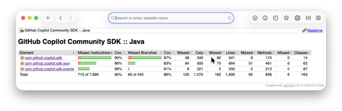
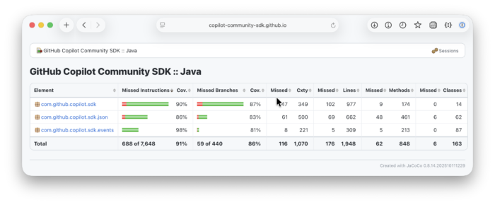

JaCoCo is the go-to code coverage tool for Java projects. It integrates seamlessly with Maven, generates detailed HTML reports, and works out of the box. But let's be honest --- the default reports look like they were designed in 2008, because they were.

If you're publishing coverage reports as part of your project documentation (on GitHub Pages, for example), you probably want them to match your site's look and feel. The good news: it's entirely possible. The bad news: JaCoCo offers zero built-in support for CSS customization.

In this post, I'll walk you through how we themed the JaCoCo reports in the [Copilot SDK for Java](https://github.com/copilot-community-sdk/copilot-sdk-java) project to match our Maven site design --- and how you can do the same.

The Problem
-----------

JaCoCo generates standalone HTML reports that reference their own `jacoco-resources/report.css` via a \`\` tag. There's no plugin configuration, no skin system, no hook to inject your own CSS. The generated HTML looks like this:

```html
<link rel="stylesheet" href="jacoco-resources/report.css" type="text/css"/>
```


That `report.css` controls everything: table styling, source code highlighting, coverage bar colors, breadcrumbs, typography. If you want to change the look, you need to replace that file after JaCoCo generates it.

Here is how the default CSS looks like:  


<br />

The Strategy: CSS Overlay
-------------------------

The approach is simple: let JaCoCo generate its reports with the default CSS, then **overwrite** `report.css` with your custom version. We do this at two levels:

1. **During `mvn site`** --- a Maven Resources Plugin execution copies our CSS after JaCoCo finishes
2. **During CI deployment** --- a workflow step overlays the CSS across all versioned documentation directories

### Step 1: Create Your Custom `report.css`

Start by grabbing JaCoCo's default `report.css`. You can find it in `target/site/jacoco/jacoco-resources/report.css` after running `mvn site` with coverage data, or in the [JaCoCo source code](https://github.com/jacoco/jacoco).

Place your customized version at:

```
src/site/jacoco-resources/report.css
```


Here's what ours looks like --- a light theme with rounded cards, GitHub-style colors, and a system font stack:

```css
/* ===== Custom JaCoCo Report Theme ===== */

body, td {
  font-family: -apple-system, BlinkMacSystemFont, 'Segoe UI', Roboto, sans-serif;
  font-size: 10pt;
  color: #24292f;
}

body {
  background: #f6f8fa;
  margin: 0;
  padding: 20px;
}

/* Breadcrumb navigation */
.breadcrumb {
  background: #fff;
  border: 1px solid #d0d7de;
  border-radius: 10px;
  padding: 10px 16px;
  margin-bottom: 20px;
}

/* Coverage table */
table.coverage {
  border-collapse: separate;
  border-spacing: 0;
  border: 1px solid #d0d7de;
  border-radius: 10px;
  overflow: hidden;
  width: 100%;
  background: #fff;
}

table.coverage thead {
  background: #f6f8fa;
}

table.coverage thead td {
  padding: 10px 14px;
  border-bottom: 2px solid #d0d7de;
  font-weight: 700;
}

table.coverage tbody td {
  padding: 8px 10px;
  border-bottom: 1px solid #eaeef2;
}

table.coverage tbody tr:hover {
  background: rgba(102, 126, 234, 0.04) !important;
}

/* Source code coverage highlights */
pre.source span.fc  { background-color: #dafbe1; }  /* fully covered - green */
pre.source span.nc  { background-color: #ffeef0; }  /* not covered - red */
pre.source span.pc  { background-color: #fff8c5; }  /* partially covered - yellow */
```


You can see the full file in our repo: [`src/site/jacoco-resources/report.css`](https://github.com/copilot-community-sdk/copilot-sdk-java/blob/5b61dfc0f9878245098f2d84eea63943b14944f5/src/site/jacoco-resources/report.css).
> **Important:** You must include the element icon classes (`.el_package`, `.el_class`, `.el_method`, etc.) and the sortable header classes (`.sortable`, `.up`, `.down`) in your custom CSS --- they reference GIF images that JaCoCo generates alongside the report. Omitting them breaks navigation icons and column sorting.

### Step 2: Overlay CSS During Maven Build

Add a `copy-resources` execution to your `maven-resources-plugin` configuration in `pom.xml`. The key is using `phase: site` so it runs **after** the JaCoCo reporting plugin generates its default CSS:

```xml
<plugin>
    <groupId>org.apache.maven.plugins</groupId>
    <artifactId>maven-resources-plugin</artifactId>
    <executions>
        <execution>
            <id>overlay-jacoco-css</id>
            <phase>site</phase>
            <goals>
                <goal>copy-resources</goal>
            </goals>
            <configuration>
                <outputDirectory>
                    ${project.reporting.outputDirectory}/jacoco/jacoco-resources
                </outputDirectory>
                <resources>
                    <resource>
                        <directory>src/site/jacoco-resources</directory>
                        <filtering>false</filtering>
                    </resource>
                </resources>
                <overwrite>true</overwrite>
            </configuration>
        </execution>
    </executions>
</plugin>
```


See this in context: [`pom.xml` (lines 371--387)](https://github.com/copilot-community-sdk/copilot-sdk-java/blob/main/pom.xml#L371-L387).

Now when you run `mvn site`, the custom CSS replaces JaCoCo's default immediately after report generation.

### Step 3: Handle CI Deployment (Optional)

If you deploy versioned documentation (like we do --- `snapshot/`, `latest/`, `1.0.8/`, etc.), you need to overlay the CSS for **all** version directories, not just the one Maven just built.

In our GitHub Actions deploy workflow, we add a step after all version builds complete:

```
- name: Overlay custom JaCoCo CSS
  run: |
    cd site
    for dir in */jacoco/jacoco-resources; do
      if [ -d "$dir" ]; then
        cp ../src/site/jacoco-resources/report.css "$dir/report.css"
        echo "Overlaid JaCoCo CSS in $dir"
      fi
    done
```


See the full workflow: [`deploy-site.yml`](https://github.com/copilot-community-sdk/copilot-sdk-java/blob/5b61dfc0f9878245098f2d84eea63943b14944f5/.github/workflows/deploy-site.yml).

Watch Out: Output Directory Paths
---------------------------------

This is the gotcha that caught us. JaCoCo has **two** plugin configurations in a typical Maven project, and they output to **different directories**:

|  Context   |        Plugin section         |          Default output path           |
|------------|-------------------------------|----------------------------------------|
| mvn verify | (goal: report, phase: verify) | Configurable (we use jacoco-coverage/) |
| mvn site   | (goal: report)                | jacoco/ (default)                      |

When deploying documentation, you typically run `mvn site`, not `mvn verify`. So the reports land in `jacoco/`, not wherever your build plugin is configured to write. **Your CSS overlay must target the same path the reporting plugin uses.** If they're mismatched, you'll end up with custom CSS in an empty directory and default CSS on your actual reports.

The Result
----------

Same data, completely different experience. The custom theme has clean white cards, rounded borders, GitHub-style coverage colors, modern typography.  


<br />

You can see the live result on our documentation site: [Copilot SDK for Java --- JaCoCo Report](https://copilot-community-sdk.github.io/copilot-sdk-java/snapshot/jacoco/).

Quick Start Checklist
---------------------

1. ☐ Run `mvn clean verify site` to generate a JaCoCo report with default CSS
2. ☐ Copy `target/site/jacoco/jacoco-resources/report.css` to `src/site/jacoco-resources/report.css`
3. ☐ Customize the CSS to match your site's design
4. ☐ **Keep all `.el_*` icon classes and `.sortable`/`.up`/`.down` sort classes** --- they reference JaCoCo's GIF assets
5. ☐ Add the `overlay-jacoco-css` execution to `maven-resources-plugin` in your `pom.xml`
6. ☐ If deploying to GitHub Pages with versioned docs, add the workflow overlay step
7. ☐ Run `mvn clean verify site` again and open `target/site/jacoco/index.html` to verify

Full Example
------------

The complete implementation is in the [Copilot SDK for Java](https://github.com/copilot-community-sdk/copilot-sdk-java) repository:

* [Custom `report.css`](https://github.com/copilot-community-sdk/copilot-sdk-java/blob/5b61dfc0f9878245098f2d84eea63943b14944f5/src/site/jacoco-resources/report.css) --- the full themed stylesheet
* [`pom.xml` overlay config](https://github.com/copilot-community-sdk/copilot-sdk-java/blob/5b61dfc0f9878245098f2d84eea63943b14944f5/pom.xml#L371-L387) --- the Maven copy-resources execution
* [Deploy workflow](https://github.com/copilot-community-sdk/copilot-sdk-java/blob/5b61dfc0f9878245098f2d84eea63943b14944f5/.github/workflows/deploy-site.yml) --- CI overlay step for versioned docs
* [Live report](https://copilot-community-sdk.github.io/copilot-sdk-java/snapshot/jacoco/) --- the themed output on GitHub Pages


*Built with ❤️ by [Bruno Borges](https://github.com/brunoborges) and [GitHub Copilot](https://github.com/features/copilot).*
