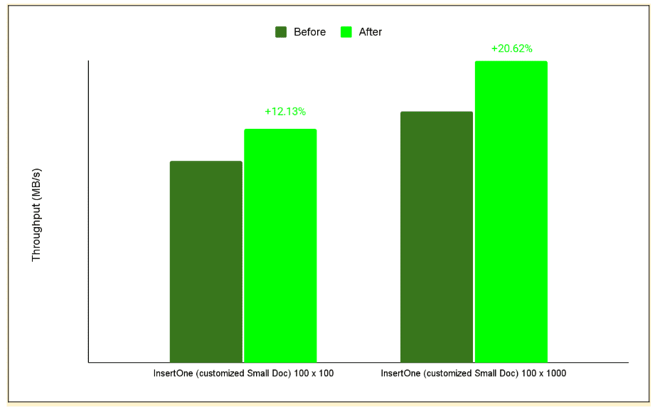
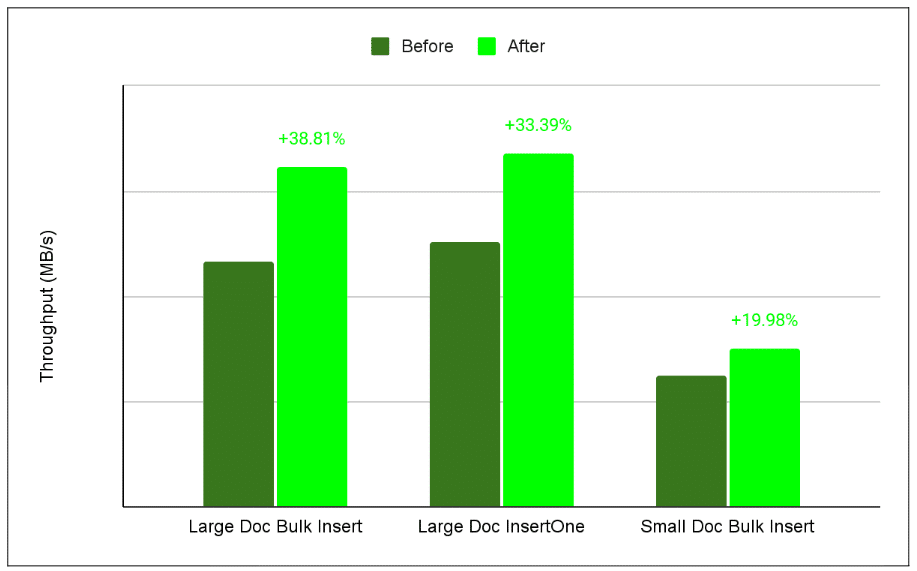
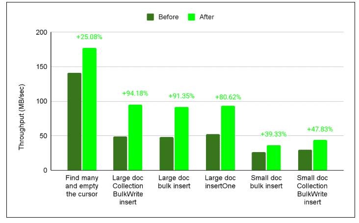

Co-authored by *Slav Babanin*.

[Donald Knuth](https://www-cs-faculty.stanford.edu/~knuth/){#https://www-cs-faculty.stanford.edu/~knuth/}, widely recognized as the 'father of the analysis of algorithms,' warned against premature optimization---spending effort on code that appears inefficient but is not on the critical path. He observed that programmers often focus on the wrong 97% of the codebase. Real performance gains come from identifying and optimizing the critical 3%. But, how can you identify the critical 3%? Well, that's where the philosophy of 'never guess, always measure' comes in.

In this blog, we share how the Java developer experience team optimized the MongoDB Java Driver by strictly adhering to this principle. We discovered that performance issues were rarely where we thought they were. This post explains how we achieved throughput improvements between 20% to over 90% in specific workloads. We'll cover specific techniques, including using SWAR (SIMD Within A Register) for null-terminator detection, caching BSON array indexes, and eliminating redundant invariant checks.

These are the lessons we learned turning micro-optimizations into macro-gains. Our findings might surprise you --- they certainly surprised us --- so we encourage you to read until the end.

Getting the metrics right {#h2-0-getting-the-metrics-right}
-----------------------------------------------------------

Development teams often assume they know where bottlenecks are, but intuition is rarely dependable. During this exercise, the MongoDB Java team discovered that performance problems were often not where the team expected them to be.

[Donald Knuth](https://www-cs-faculty.stanford.edu/~knuth/) emphasizes this concept in his paper on [Premature Optimization](https://wiki.c2.com/?PrematureOptimization):

Programmers waste enormous amounts of time thinking about the speed of noncritical parts of their programs, and these attempts to improve efficiency have a strong negative impact on debugging and maintenance. We should forget about small efficiencies, say about 97% of the time: *premature optimization is the root of all evil*. Yet we should not pass up our opportunities in that critical 3%.

To avoid 'premature optimization'---that is, improving code that appears slow but isn't on the critical path---we follow a strict rule: ***never guess, always measure***.

We applied the [Pareto principle](https://en.wikipedia.org/wiki/Pareto_principle) (also known as the 80/20 rule) to target the specific code paths responsible for the majority of execution time. For this analysis, we used [**async-profiler**](https://github.com/async-profiler/async-profiler). Its low-overhead, sampling-based approach allowed us to capture actionable CPU and memory profiles with negligible performance impact.

How we measured performance {#h2-1-how-we-measured-performance}
---------------------------------------------------------------

We standardized performance tests based on throughput (MB/s), simplifying comparisons across all scenarios. Our methodology focused on minimizing the influence of external variables and ensuring practical relevance.

Testing Methodology:

* **Tested representative workloads:** Testing focused on representative driver operations (for example, small, large, and bulk document inserts) executed via the MongoClient API, not isolated method microbenchmarks.  
* **Isolated the testing environment:** We conducted performance tests across multiple isolated cloud machines to minimize external variability and prevent performance degradation from resource contention (i.e., 'noisy neighbors'). Each test was run multiple times on each machine, and the median throughput score was used as the final result for that machine.  
* **Statistical verification:** Next, we aggregated the median results and directly compared the optimized branch mean throughput with the stable mainline mean.
  * We verified statistical significance through percentage improvement and z-score analysis.

From this exercise, we realized that what truly mattered was that the performance improvements appear at the MongoClient API level. Internal microbenchmarks may show significant gains, but since users interact solely through the API, any gains that do not manifest at the API level will not translate into noticeable improvements in application performance.

Refer to the [Performance Benchmarking drivers specification](https://github.com/mongodb/specifications/blob/master/source/benchmarking/benchmarking.md) for a more detailed description of these tests.

Below, we will explain the six techniques we used to optimize the MongoDB Java driver, while staying true to our guiding principle: 'never guess, always measure'.

1. Caching BSON array indexes

In [BSON](https://bsonspec.org/spec.html), array indexes are not merely integers; they are encoded as null-terminated strings, or CStrings. For example, the index 0 becomes the UTF-8 byte sequence for '0' (U+0030) followed by the UTF-8 byte sequence for NULL (U+0000). Encoding an array involves converting each numeric index to a string, encoding it into UTF-8 bytes, and then appending a null terminator:

<pre class="EnlighterJSRAW" data-enlighter-language="generic" data-enlighter-theme="" data-enlighter-highlight="" data-enlighter-linenumbers="" data-enlighter-lineoffset="" data-enlighter-title="" data-enlighter-group="">for (int i = 0; i &lt; arraySize; i++) {
&nbsp;&nbsp;&nbsp;&nbsp;encodeCString(Integer.toString(i));;
&nbsp;&nbsp;&nbsp;}</pre>

 

Calling toString() and encoding the result for every index was clearly suboptimal, because it repeats the same conversion work for the same indexes over and over again: each call rebuilds the String representation of i and then turns that String into a byte\[\]. This involves unnecessary copying, even though the result remains the same.

Our first improvement was to precompute and cache these immutable byte arrays for reuse in tight loops.

<pre class="EnlighterJSRAW" data-enlighter-language="generic" data-enlighter-theme="" data-enlighter-highlight="" data-enlighter-linenumbers="" data-enlighter-lineoffset="" data-enlighter-title="" data-enlighter-group="">private static final byte[][] PRE_ENCODED_INDICES = new byte[1000][];

for (int i = 0; i &lt; 1000; i++) {
&nbsp;&nbsp;&nbsp;&nbsp;PRE_ENCODED_INDICES[i] = (Integer.toString(i) + '\u0000').getBytes("UTF-8");
}</pre>

<pre class="EnlighterJSRAW" data-enlighter-language="generic" data-enlighter-theme="" data-enlighter-highlight="" data-enlighter-linenumbers="" data-enlighter-lineoffset="" data-enlighter-title="" data-enlighter-group="">for (int i = 0; i &lt; arraySize; i++) {
&nbsp;&nbsp;&nbsp;&nbsp;if (i &lt; PRE_ENCODED_INDICES.length) {
&nbsp;&nbsp;&nbsp;&nbsp;&nbsp;&nbsp;&nbsp;&nbsp;buffer.put(PRE_ENCODED_INDICES[i]);
&nbsp;&nbsp;&nbsp;&nbsp;} else {
&nbsp;&nbsp;&nbsp;&nbsp;&nbsp;&nbsp;&nbsp;&nbsp;encodeCString(Integer.toString(i));
&nbsp;&nbsp;&nbsp;&nbsp;}
}</pre>

This caching step was already effective. We also changed the cache layout from a jagged byte\[\]\[\] (that is, many small byte\[\] objects) to a flat byte\[\] representation.

<pre class="EnlighterJSRAW" data-enlighter-language="generic" data-enlighter-theme="" data-enlighter-highlight="" data-enlighter-linenumbers="" data-enlighter-lineoffset="" data-enlighter-title="" data-enlighter-group="">private static final byte[] PRE_ENCODED_INDICES;</pre>

The flat byte\[\] layout remains the preferred choice because it uses fewer heap objects and scales more efficiently as the cache grows due to spatial locality. Our benchmarks showed no significant throughput difference compared to jagged byte\[\]\[\] structures in smaller caches; this parity stems from the HotSpot's [Thread-Local Allocation Buffer (TLAB)](https://shipilev.net/jvm/anatomy-quarks/4-tlab-allocation/) allocator, which places small rows close together in memory. Even with [garbage collection](https://en.wikipedia.org/wiki/Garbage_collection_(computer_science)) (GC) settings that forced frequent promotion into the old generation, we often observed the same effect. Because that behaviour is JVM- and GC-specific rather than guaranteed, we use the flat array as the more robust solution. To quantify the impact of caching itself, we adapted the "**Small Doc** **insertOne"** workload from our performance specification for array-heavy documents. Instead of the original shape, each document now contained A arrays of B length (that is, 100×100, and 100×1000), so the total number of encoded array indexes per document was A × B. The larger the arrays we use per document, the more significant the difference is, as the array encoding fraction in the "**insertOne"** operation is larger for larger arrays.

**Figure 1.** The figure below shows the before-and-after results of performance tests on 100x100 and 100x1000 array documents. The larger arrays saw the greatest improvement in performance.  

2. Java Virtual Machine (JVM) intrinsics {#h2-2-2-java-virtual-machine-jvm-intrinsics}
--------------------------------------------------------------------------------------

As Java developers, we write code with many abstractions, which makes the code easier to maintain and understand; however, these abstractions can also cause significant performance issues. What is easy for humans to read isn't always what the machine prefers to execute, which is why having [mechanical sympathy](https://wa.aws.amazon.com/wellarchitected/2020-07-02T19-33-23/wat.concept.mechanical-sympathy.en.html) may be beneficial.

For example, in BSON, numbers must be encoded with [little-endian order](https://www.geeksforgeeks.org/dsa/little-and-big-endian-mystery/). In our original code, when encoding an int to BSON, we wrote each byte to a ByteBuffer separately, doing manual shifting and masking to produce little-endian byte order.

<pre class="EnlighterJSRAW" data-enlighter-language="generic" data-enlighter-theme="" data-enlighter-highlight="" data-enlighter-linenumbers="" data-enlighter-lineoffset="" data-enlighter-title="" data-enlighter-group="">write(value &gt;&gt; 0);

write(value &gt;&gt; 8);

write(value &gt;&gt; 16);

write(value &gt;&gt; 24);</pre>

However, this approach wasn't efficient. It required individual bounds checks and manual byte shuffling for every byte written, which showed up as a hotspot in profiles. We chose to adopt ByteBuffer's methods---such as putInt, putLong, and putDouble. This method collapses four separate byte operations into a single call (putInt) that handles byte order automatically.

Under the hood, modern JITs (e.g., in HotSpot) can compile these methods using intrinsics---such as Unsafe.putInt and Integer.reverseBytes---often mapping them to efficient machine instructions. For more context, see[Intrinsic functions](https://en.wikipedia.org/wiki/Intrinsic_function).

The JVM can replace these helper methods with a very small sequence of machine instructions, sometimes even a single instruction. For example, on x86, the Integer.reverseBytes(int i) method may use the BSWAP instruction; on ARM, the JVM might use the REV instruction.

|--------------------------------------------------------------------------------------------------------------------------------------------------------------------------------------------------------------------------------------------------------------------------------------------------------------------------------------------------------|
| **Bonus tip:**Repeated invariant checks in the hot path are computationally expensive. In the original code of the BsonOutput serializer, every single-byte write also re-checks invariants, such as "is this BsonOutput still open?" If you've already validated invariants elsewhere, you can safely skip repeated invariant checks inside the loop. |

After implementing our changes and testing them, we realized thata simple change affecting **less than 0.03% of the codebase resulted in a nearly 39% improvement** in throughput for large document bulk inserts.

**Figure 2.**The figure below shows throughput improvements for each insert command. 'Large Doc Bulk Insert' saw the most significant gain because processing larger payloads maximizes the impact of optimizing the hottest execution paths.  

3. Check and check again {#h2-3-3-check-and-check-again}
--------------------------------------------------------

As mentioned earlier, size checks on **ByteBuffer** in the critical path are expensive. However, we also performed similar checks on invariants in many other places**.**When encoding BSON, we retrieved the current buffer from a list by index on every write:

<pre class="EnlighterJSRAW" data-enlighter-language="generic" data-enlighter-theme="" data-enlighter-highlight="" data-enlighter-linenumbers="" data-enlighter-lineoffset="" data-enlighter-title="" data-enlighter-group="">ByteBuffer currentBuffer = bufferList.get(currentBufferIndex);

//other code
currentBuffer.put(value);</pre>

This get() call is fast, but performing it many times adds up---especially since each call includes range checks and method indirection (as the path is too deep; the JVM might not always inline it).

|----------------------------------------------------------------------------------------------------------------------------------------------------------------------------------------------------------------------------------------------------------------------------------------------------------------------------------------------------------------------------------------|
| **Aha moment:** If the same buffer will be used for thousands of operations before switching, why should we keep re-checking? *By caching the buffer in a field and updating it only when switching buffers, we eliminated at least three redundant range checks. Here is how:* private ByteBuffer currentByteBuffer;// Only update when changing bufferscurrentByteBuffer.put(value); |

This minor change led to a **16% increase in throughput** for bulk inserts. This wasn't the only area where redundant checks could be eliminated; when we tested removing similar invariant checks from other abstractions, we observed an **additional 15% improvement** in throughput for bulk inserts.  

|-----------------------------------------------------------------------------------------------------------------------------------------------------------------------|
| **The lesson:** Remove unnecessary checks from the hottest paths. Because these checks run so frequently, they quickly become bottlenecks that drag down performance. |

4. BSON null terminator detection with SWAR {#h2-4-4-bson-null-terminator-detection-with-swar}
----------------------------------------------------------------------------------------------

Every BSON document is structured as a list of triplets: *a type byte, a field name, and a value* . Crucially, each field name is a null-terminated string---[CString](https://stackoverflow.com/questions/14473526/what-is-cstring)---not a length-prefixed string. While this design saves four bytes per field, it introduces a performance trade-off: extracting a CString now requires a linear scan rather than a constant-time lookup.

Our original implementation processed the buffer byte-by-byte, searching for the terminating zero:

<pre class="EnlighterJSRAW" data-enlighter-language="generic" data-enlighter-theme="" data-enlighter-highlight="" data-enlighter-linenumbers="" data-enlighter-lineoffset="" data-enlighter-title="" data-enlighter-group="">boolean checkNext = true;

while (checkNext) {
&nbsp;&nbsp;&nbsp;&nbsp;if (!buffer.hasRemaining()) {
&nbsp;&nbsp;&nbsp;&nbsp;&nbsp;&nbsp;&nbsp;&nbsp;throw new BsonSerializationException("Found a BSON string that is not null-terminated");
&nbsp;&nbsp;&nbsp;&nbsp;}
&nbsp;&nbsp;&nbsp;&nbsp;checkNext = buffer.get() != 0;
}</pre>

The primary issue with this approach is that it requires more comparisons for the same amount of work. For large documents, the process calls **buffer.get()** billions of times. Processing each byte individually requires a load, check, and conditional jump each time, which rapidly increases the total instruction count.

To improve performance, we used a classic optimization technique: [**SWAR**](https://en.wikipedia.org/wiki/SWAR) (SIMD Within A Register Vectorization). Instead of checking each byte separately, SWAR lets us examine eight bytes simultaneously with a single 64-bit load and some bitwise operations. Here's what that looks like:

<pre class="EnlighterJSRAW" data-enlighter-language="generic" data-enlighter-theme="" data-enlighter-highlight="" data-enlighter-linenumbers="" data-enlighter-lineoffset="" data-enlighter-title="" data-enlighter-group="">long chunk = buffer.getLong(pos);
long mask = chunk - 0x0101010101010101L;
mask &amp;= ~chunk;
mask &amp;= 0x8080808080808080L;
if (mask != 0) {
&nbsp;&nbsp;&nbsp;&nbsp;int offset = Long.numberOfTrailingZeros(mask) &gt;&gt;&gt; 3;
&nbsp;&nbsp;&nbsp;&nbsp;return (pos - prevPos) + offset + 1;
}</pre>

These 'magic numbers' aren't arbitrary: 0x0101010101010101L repeats the byte 1, while 0x8080808080808080L repeats the byte 128. By subtracting 1 from each byte, ANDing with the inverted value, and applying the high-bit mask, you can instantly detect if a zero exists. Then, simply **counting the trailing zeros** allows you to calculate the precise byte offset. This method is highly effective with CPU pipelining.  

Let's take a simple example. Suppose we use an int (4 bytes) for simplicity. The value: 0x7a000aFF contains a zero byte. We will demonstrate how the SWAR technique detects it:

<pre class="EnlighterJSRAW" data-enlighter-language="generic" data-enlighter-theme="" data-enlighter-highlight="" data-enlighter-linenumbers="" data-enlighter-lineoffset="" data-enlighter-title="" data-enlighter-group="">Step&nbsp; &nbsp; &nbsp; &nbsp; &nbsp; &nbsp; &nbsp; &nbsp; &nbsp; &nbsp; | Value (Hex) &nbsp; | Value (Binary, per byte)

------------------------|---------------|-----------------------------

chunk &nbsp; &nbsp; &nbsp; &nbsp; &nbsp; &nbsp; &nbsp; &nbsp; &nbsp; | 0x7a000aFF&nbsp; &nbsp; | 01111010 00000000 00001010 11111111

ones&nbsp; &nbsp; &nbsp; &nbsp; &nbsp; &nbsp; &nbsp; &nbsp; &nbsp; &nbsp; | 0x01010101&nbsp; &nbsp; | 00000001 00000001 00000001 00000001

mask (high bit mask)&nbsp; &nbsp; | 0x80808080&nbsp; &nbsp; | 10000000 10000000 10000000 10000000

Subtraction:

chunk&nbsp; &nbsp; &nbsp; = 01111010 00000000 00001010 11111111

- ones &nbsp; &nbsp; = 00000001 00000001 00000001 00000001

------------------------------------------------

&nbsp;&nbsp;&nbsp;&nbsp;&nbsp;&nbsp;&nbsp;&nbsp;&nbsp;&nbsp;&nbsp;&nbsp;01111000 11111111 00001001 11111110

&nbsp;&nbsp;&nbsp;&nbsp;&nbsp;&nbsp;&nbsp;&nbsp;&nbsp;&nbsp;&nbsp;&nbsp;&nbsp;&nbsp;&nbsp;&nbsp;&nbsp;&nbsp;&nbsp;&nbsp;&nbsp;&nbsp;&nbsp;&nbsp;&nbsp;&nbsp;↑
&nbsp; &nbsp; &nbsp; &nbsp; &nbsp; &nbsp; &nbsp; &nbsp;&nbsp;&nbsp;&nbsp;&nbsp;&nbsp;&nbsp;&nbsp;underflow

&nbsp;&nbsp;&nbsp;&nbsp;&nbsp;&nbsp;&nbsp;&nbsp;&nbsp;&nbsp;&nbsp;&nbsp;&nbsp;&nbsp;&nbsp;&nbsp;&nbsp;&nbsp;&nbsp;&nbsp;&nbsp;&nbsp;&nbsp;(0-1=FF)

Bitwise AND with inverted chunk:

prevResult = 01111001 11111111 00001001 11111110

&amp; ~chunk &nbsp; = 10000101 11111111 11110101 00000000

------------------------------------------------

&nbsp;&nbsp;&nbsp;&nbsp;&nbsp;&nbsp;&nbsp;&nbsp;&nbsp;&nbsp;&nbsp;&nbsp;00000001 11111111 00000001 00000000

Bitwise AND with mask (high bits):

prevResult = 00000001 11111111 00000001 00000000

&amp; mask &nbsp; &nbsp; = 10000000 10000000 10000000 10000000

------------------------------------------------

&nbsp;&nbsp;&nbsp;&nbsp;&nbsp;&nbsp;&nbsp;&nbsp;&nbsp;&nbsp;&nbsp;&nbsp;&nbsp;00000000 10000000 00000000 00000000</pre>

The final result:

- The result has a high bit set (10000000) in Byte 2, showing there's a zero byte at that position.

- After isolating one byte, we can use the Integer.numberOfTrailingZeros(mask) \>\>\> 3 to get the offset of the zero byte. This method is often [*an intrinsic function*](https://en.wikipedia.org/wiki/Intrinsic_function), [built into the JVM](https://hg.openjdk.org/jdk8/jdk8/hotspot/file/87ee5ee27509/src/share/vm/classfile/vmSymbols.hpp#l684), producing efficient single instructions.  

Because the loop body now consists of a small, predictable set of arithmetic instructions, it integrates seamlessly with modern CPU pipelines. The efficiency of SWAR stems from its reduced instruction count, the absence of per-byte branches, and one memory load for every eight bytes.

5. Avoiding redundant copies and allocations {#h2-5-5-avoiding-redundant-copies-and-allocations}
------------------------------------------------------------------------------------------------

While optimizing CString detection with SWAR, we also identified an opportunity to reduce allocations and copies on the string decoding path.

Earlier versions of the driver wrapped the underlying ByteBuffer in a read-only view to guard against accidental writes, but that choice forced every CString decode to perform *two* copies:

1. From the buffer into a temporary 'byte\[\]'.
2. From that 'byte\[\]' into the internal 'byte\[\]' that backs the 'String'.

By verifying that the buffer contents remain immutable during decoding, we were able to safely remove the restrictive read-only wrapper. This allows us to access the underlying array directly and decode the string without intermediate copies.

<pre class="EnlighterJSRAW" data-enlighter-language="generic" data-enlighter-theme="" data-enlighter-highlight="" data-enlighter-linenumbers="" data-enlighter-lineoffset="" data-enlighter-title="" data-enlighter-group="">if (buffer.isBackedByArray()) {
&nbsp;&nbsp;&nbsp;&nbsp;int position = buffer.position();
&nbsp;&nbsp;&nbsp;&nbsp;int arrayOffset = buffer.arrayOffset();
&nbsp;&nbsp;&nbsp;&nbsp;return new String(array, arrayOffset + position, bsonStringSize - 1, StandardCharsets.UTF_8);
}</pre>

For direct buffers (which are not backed by a Java heap array), we cannot hand a backing array to the \`String\` constructor. We still need to copy bytes from the buffer, but we can avoid allocating a new \`byte\[\]\` for every string.  

To achieve this, the decoder maintains a reusable byte\[\] buffer. The first call allocates it (or grows it if a larger string is encountered), and subsequent calls reuse the same memory region. That has two benefits:

* **Fewer allocations, less GC pressure, and memory zeroing:** We no longer create a fresh temporary byte\[\] for every CString, which reduces the amount of work the allocator and garbage collector must do per document.
* **Better cache behavior:** The JVM repeatedly reads and writes the same small piece of memory, which tends to remain hot in the CPU cache. We examined CPU cache behavior on our "FindMany and empty cursor" workload using async-profiler's cache-misses event. Async-profiler samples hardware performance counters exposed by the CPU's [Performance Monitoring Unit](https://en.wikipedia.org/wiki/Hardware_performance_counter) (PMU), the hardware block that tracks events such as cache misses, branch misses, and cycles. For readString(), cache-miss samples dropped by roughly 13--28% between the old and new implementation, as we touch fewer cache lines per CString. We still treat the PMU data as directional rather than definitive --- counters and sampling semantics vary by CPU and kernel --- so the primary signal remains the end-to-end throughput gains (MB/s) that users actually observe.

On our "FindMany and empty cursor" workload, eliminating the redundant intermediate copy in readString **improved throughput by approximately 22.5%** **.** Introducing the reusable buffer contributed a **\~5%** improvement in cases where the internal array is not available.

6. String Encoding, removing method indirection and redundant checks {#h2-6-6-string-encoding-removing-method-indirection-and-redundant-checks}
-----------------------------------------------------------------------------------------------------------------------------------------------

While benchmarking our code, we observed that encoding Strings to UTF-8, the format used by BSON, consumed a significant amount of time. BSON documents contain many strings, including attribute names as CStrings and various string values of different lengths and Unicode code points. The process of encoding strings to UTF-8 was identified as a hot path, prompting us to investigate it and suggest potential improvements. Our initial implementation used custom UTF-8 encoding to avoid creating additional arrays with the standard JDK libraries.

But inside the loop, every character involved several inner checks:

* Verifying ByteBuffer capacity
* Branching for different Unicode ranges
* Repeatedly calling abstractions and methods

If the buffer was full, we'd fetch another one from a buffer pool (we pool ByteBuffers to reduce garbage collection (GC) pressure:

<pre class="EnlighterJSRAW" data-enlighter-language="generic" data-enlighter-theme="" data-enlighter-highlight="" data-enlighter-linenumbers="" data-enlighter-lineoffset="" data-enlighter-title="" data-enlighter-group="">for (int i = 0; i &lt; len;) {
&nbsp;&nbsp;&nbsp;&nbsp;int c = Character.codePointAt(str, i);
&nbsp;&nbsp;&nbsp;&nbsp;if (checkForNullCharacters &amp;&amp; c == 0x0) {
&nbsp;&nbsp;&nbsp;&nbsp;&nbsp;&nbsp;&nbsp;&nbsp;throw new BsonSerializationException(...);
&nbsp;&nbsp;&nbsp;&nbsp;}

&nbsp;&nbsp;&nbsp;&nbsp;if (c &lt; 0x80) {
&nbsp; &nbsp; &nbsp; &nbsp; //check if ByteBuffer has capacity and write one byt
&nbsp; &nbsp; } else if (c &lt; 0x800) {
&nbsp; &nbsp; &nbsp; &nbsp; //check if ByteBuffer has capacity and write two bytes
&nbsp;&nbsp;&nbsp;&nbsp;} else if (c &lt; 0x10000) {
&nbsp; &nbsp; &nbsp; &nbsp;//check if ByteBuffer has capacity and write three bytes
&nbsp;&nbsp;&nbsp;&nbsp;&nbsp;&nbsp;&nbsp;total += 3;
&nbsp;&nbsp;&nbsp;&nbsp;} else 
&nbsp; &nbsp; &nbsp; //check if ByteBuffer has capacity and write fourfoure bytes
&nbsp;&nbsp;}
&nbsp;&nbsp;i += Character.charCount(c);
}</pre>

In practice, modern JVMs can unroll tight, counted loops, reducing back branches and enhancing instruction pipeline efficiency under suitable conditions. However, when examining the assembly generated by the JIT for this method, we observed that loop unrolling did ***not*** occur in this instance. This underscores the importance of keeping the hot path as straight as possible, minimizing branches, checks, and method indirection, especially for large workloads.

Our first optimization was based on the hypothesis that most workloads mainly use ASCII characters. Using this assumption, we developed a new loop that was much more JIT-friendly.

<pre class="EnlighterJSRAW" data-enlighter-language="generic" data-enlighter-theme="" data-enlighter-highlight="" data-enlighter-linenumbers="" data-enlighter-lineoffset="" data-enlighter-title="" data-enlighter-group="">for (; sp &lt; str.length(); sp++, pos++) {
&nbsp;&nbsp;&nbsp;&nbsp;char c = str.charAt(sp);
&nbsp;&nbsp;&nbsp;&nbsp;if (checkNullTermination &amp;&amp; c == 0) {
&nbsp;&nbsp;&nbsp;&nbsp;&nbsp;&nbsp;&nbsp;&nbsp;//throw exception
&nbsp;&nbsp;&nbsp;&nbsp;}

&nbsp;&nbsp;&nbsp;&nbsp;if (c &gt;= 0x80) {
&nbsp;&nbsp;&nbsp;&nbsp;&nbsp;&nbsp;&nbsp;&nbsp;break;
&nbsp;&nbsp;&nbsp;&nbsp;}
&nbsp;&nbsp;&nbsp;&nbsp;dst[pos] = (byte) c;
}</pre>

Before entering the loop, we verified that String.length() \< ByteBuffer's capacity and got the underlying array from the ByteBuffer (*our* *ByteBuffer* *is a wrapper over the JDK or Netty buffers*)

By verifying this invariant upfront, we eliminated the need for repeated capacity checks or method indirection inside the loop. Instead, we worked directly with the internal array of a ByteBuffer.

We also added a safeguard: if the character to encode is greater than 0x80, we've encountered a non-ASCII character and must fall back to a slower, more general loop with additional branching.

With this setup, the JIT usually unrolls the loop body, replacing it with several consecutive copies. This modification decreases the number of back branches and improves pipeline performance efficiency. If we zoom in on the compiled assembly, we can see that C2 has unrolled the loop by a factor of 4. Instead of processing one character per iteration, the hot path processes four consecutive characters (sp, sp+1, sp+2, sp+3) and then increments sp by 4. For example, HotSpot C2 on AArch64 might produce the following assembly, with some bookkeeping removed and only 2 of the 4 unrolled copies for brevity:

loop body:

<pre class="EnlighterJSRAW" data-enlighter-language="generic" data-enlighter-theme="" data-enlighter-highlight="" data-enlighter-linenumbers="" data-enlighter-lineoffset="" data-enlighter-title="" data-enlighter-group="">; ----- char 0: value[sp], dst[pos] -----

&nbsp;&nbsp;&nbsp;&nbsp;ldrsb &nbsp; w5,&nbsp; [x12,#16]&nbsp; &nbsp; &nbsp; &nbsp; &nbsp; ; load value[sp]

&nbsp;&nbsp;&nbsp;&nbsp;and &nbsp; &nbsp; w11, w5, #0xff&nbsp; &nbsp; &nbsp; &nbsp; &nbsp; ; w11 = (unsigned) c0

&nbsp;&nbsp;&nbsp;&nbsp;cbz &nbsp; &nbsp; w11, null_trap&nbsp; &nbsp; &nbsp; &nbsp; &nbsp; ; if (c0 == 0) -&gt; slow path (null terminator check)

&nbsp;&nbsp;&nbsp;&nbsp;cmp &nbsp; &nbsp; w11, #0x80&nbsp; &nbsp; &nbsp; &nbsp; &nbsp; &nbsp; &nbsp; ; if (c0 &gt;= 0x80) -&gt; slow path (non-ASCII)

&nbsp;&nbsp;&nbsp;&nbsp;b.ge&nbsp; &nbsp; non_ascii1_path

&nbsp;&nbsp;&nbsp;&nbsp;strb&nbsp; &nbsp; w5,&nbsp; [x10,#16]&nbsp; &nbsp; &nbsp; &nbsp; &nbsp; ; dst[pos] = (byte)c0

&nbsp;&nbsp;&nbsp;&nbsp;; ----- char 1: value[sp+1], dst[pos+1] -----

&nbsp;&nbsp;&nbsp;&nbsp;ldrsb &nbsp; w4,&nbsp; [x12,#17]&nbsp; &nbsp; &nbsp; &nbsp; &nbsp; ; load value[sp+1]

&nbsp;&nbsp;&nbsp;&nbsp;and &nbsp; &nbsp; w11, w4, #0xff&nbsp; &nbsp; &nbsp; &nbsp; &nbsp; ; w11 = (unsigned) c1

&nbsp;&nbsp;&nbsp;&nbsp;cbz &nbsp; &nbsp; w11, null_trap&nbsp; &nbsp; &nbsp; &nbsp; &nbsp; ; if (c1 == 0) -&gt; slow path (null terminator check)

&nbsp;&nbsp;&nbsp;&nbsp;cmp &nbsp; &nbsp; w11, #0x80&nbsp; &nbsp; &nbsp; &nbsp; &nbsp; &nbsp; &nbsp; ; if (c1 &gt;= 0x80) -&gt; slow path (non-ASCII)

&nbsp;&nbsp;&nbsp;&nbsp;b.ge&nbsp; &nbsp; non_ascii1_path

&nbsp;&nbsp;&nbsp;&nbsp;strb&nbsp; &nbsp; w4,&nbsp; [x10,#17]&nbsp; &nbsp; &nbsp; &nbsp; &nbsp; ; dst[pos+1] = (byte)c1</pre>

What we did:

* Removed internal method indirection (like write() wrappers) that introduced extra bound checks.
* When writing ASCII, we wrote directly to the underlying ByteBuffer array if the capacity allowed, skipping extra bounds and range checks.
* For multi-byte code points, we avoided repeated calls to ensureOpen(), hasRemaining(), and related checks by caching position and limit values inside hot paths.

This optimization improved insert throughput across all related benchmarks. For example:

* Bulk write insert throughput for UTF-8 multi-byte characters **improved by nearly 31%**.
* Bulk write insert throughput for ASCII **improved by nearly 33%** .

You can see the particular test conditions in the [Performance Benchmarking specification](https://github.com/mongodb/specifications/blob/master/source/benchmarking/benchmarking.md#large-doc-bulk-insert).

Lessons learned {#h2-7-lessons-learned}
---------------------------------------

* **Cache immutable data on the hot path:** In our case, pre-encoding BSON index CStrings once into a compact flat byte\[\] removed repeated int to byte\[\] conversions and cut heap overhead from thousands of tiny byte\[\] objects.  
* **The JVM can surprise you:** Use intrinsics and hardware features whenever possible. After implementing our changes and testing, we found that a simple modification affecting less than 0.03% of the codebase increased throughput for large document bulk inserts by nearly 39%.  
* **Thoroughly profile your code:** Optimize where it matters. Small, smart changes in the hot path can yield more benefits than rewriting cold code. By caching the buffer in a field and updating it only when switching to a new buffer, we improved bulk insert throughput by 16%.  
* **Even cheap checks can add up:** Bounds checks and branches in the hot path can be surprisingly costly - multiply a few cycles by billions, and you'll notice a real impact. Move checks outside inner loops where possible, and don't repeat invariants that have already been verified.  
* **Vectorization (SIMD):** Rewriting critical code paths with vectorized methods (e.g., SWAR) can significantly increase throughput by enabling you to process multiple data elements simultaneously per instruction.  
* **Removing method indirection and redundant checks:** Optimizing low-level operations required removing write(...)/put(...) wrappers to eliminate an extra layer of method indirection and the repeated invariant checks. By writing directly to the underlying ByteBuffer array for ASCII and caching position values in hot paths for multi-byte code points, we bypassed repeated validation calls, such as ensureOpen() and hasRemaining(). This resulted in a 33% improvement in bulk write insert throughput for ASCII.

**Figure 3.** The figure below shows the final results for throughput improvements (measured in MB/s) after optimizing the driver, as explained above, based on [this](https://github.com/mongodb/specifications/blob/master/source/benchmarking/benchmarking.md#large-doc-bulk-insert) performance benchmarking specification. The 'Large doc Collection BulkWrite insert' saw the highest performance improvement +96.46%.  

Check out our [developer blog](https://www.mongodb.com/company/blog/channel/developer-blog) to learn how we are solving different engineering problems, or consider joining our [engineering team](https://www.mongodb.com/company/careers/teams/engineering).   

 
