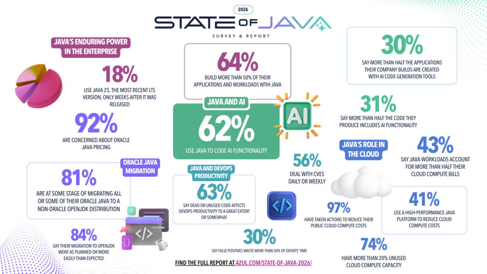
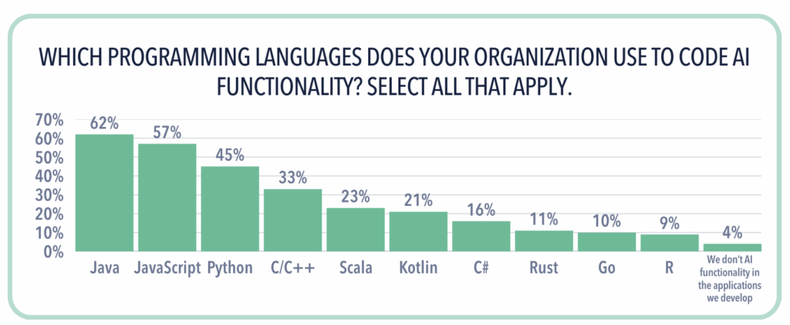
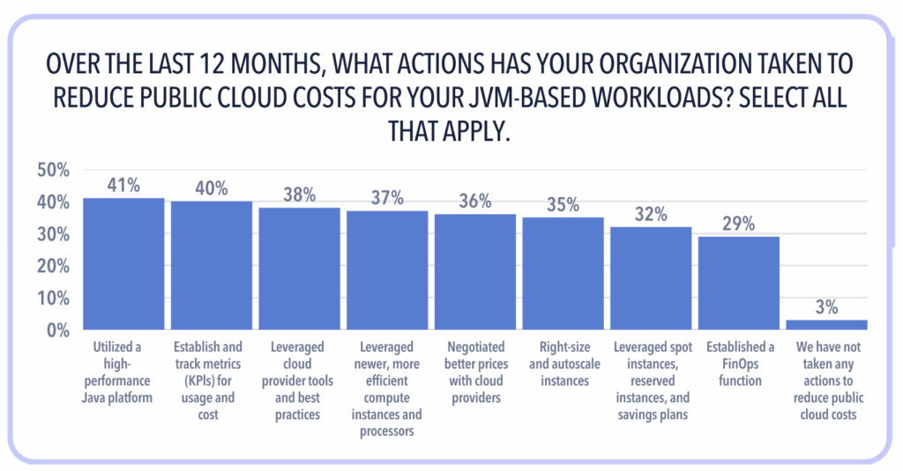
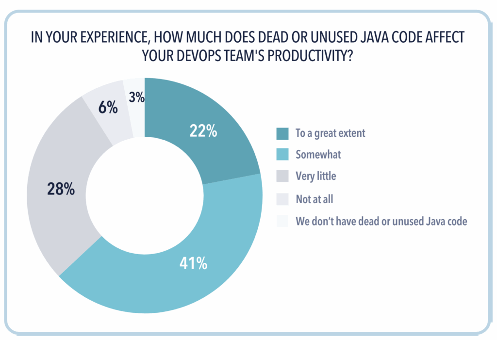
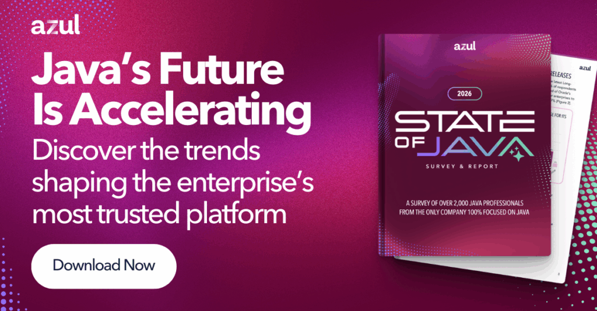

Every year, I look forward to our [State of Java Survey \& Report](https://www.azul.com/state-of-java-2026?utm_medium=blog&utm_campaign=State-of-Java-2026&utm_source=web&utm_content=&utm_term=) because it gives us a view into how organizations are using Java today and where they're heading next. This year, more than 2,000 Java professionals from around the world weighed in, and their message is clear:
> ***Java is evolving faster than ever. AI is accelerating that shift. And the pressure to optimize cloud spending and avoid unpredictable Java licensing costs is now shaping strategic decisions across the enterprise.***

As the only company 100% focused on Java, we get to see these changes up close.

Here are the key takeaways and what they mean for your business.

## Java powers AI in production

One of the most significant trends we've watched over the past few years is AI's shift from an area of research to a core part of enterprise systems. And for the first time, the majority of organizations that participated in this survey are now using Java to build or run AI functionality.

**62% of survey respondents say they're using Java to code AI features**, up sharply from 50% a year ago.

While Python continues to be quite popular for prototyping AI, enterprises are betting on Java to run AI in real‑world production environments where stability, security, determinism, and performance matter.

Even more telling:
> ***31% of developers say that over half of the Java applications they're building now include some form of AI.***

The Java ecosystem is keeping pace. Libraries like JavaML and Deep Java Library (DJL) are maturing quickly, and developers tell us they're looking for:

* Long‑term support for modern Java versions
* Built‑in security
* Better observability
* Scalable data access
* Strong integration with large language models

If your teams are running AI at scale --- or plan to --- you're going to want your Java expertise in the room.

## Enterprises are rapidly moving away from Oracle Java

This year's survey confirms what many of you have been telling us is happening in boardrooms and budget meetings: the era of predictable, reasonable Oracle Java pricing is over.

And enterprises are responding decisively.

* **92% of respondents are concerned about Oracle's Java pricing and licensing changes.**
* **81% have already migrated, are migrating, or plan to migrate all or some of their Oracle Java estate to OpenJDK.**
* **63% plan to migrate** ***all*** **of it.**

The primary driver? **Cost.** But that's not the whole story:

* 31% want the benefits of open source
* 29% are motivated by concerns of frequent licensing changes
* 26% want to reduce the risk of an Oracle audit
* 21% have already been audited

This isn't a small shift. It's a structural change in the Java market. Vendors who offer true open-source alternatives, predictable pricing, and long‑term stability are core to enterprise Java strategies. And that's exactly why so many organizations choose Azul's OpenJDK‑based platforms.

## Cloud costs are still too high, and Java efficiency is a powerful lever

Cost optimization in the cloud is no longer a "nice to have." It's a strategic imperative. And the data shows that Java is one of the most effective---and overlooked---ways to reduce those costs.

* **97% of organizations have taken action to cut public cloud spend** \[Figure 2\]**.**
* **41% use a high‑performance Java platform specifically to reduce cloud compute costs.**

Why Java? Because faster runtimes, better start-up behavior, and lower warm‑up overhead translate directly to fewer cores, smaller instances, shorter execution times, and ultimately save cloud spend.

And yet...most enterprises still leave a lot of money on the table.
> ***74% say more than 20% of their cloud compute is sitting unused.***

Often this "waste" is simply overprovisioning to compensate for slow start-up times, long warm‑up cycles, and inconsistent runtime performance.

If your cloud bills keep you up at night, Java efficiency may be one of the simplest, highest‑ROI levers you have available.

## Unused and Dead code and CVE noise are quietly killing DevOps productivity

When we talk to engineering leaders, one complaint comes up consistently: the hidden tax of legacy code and inaccurate application security tooling.

The survey puts numbers behind that pain:

* **63% of teams say dead or unused code slows their productivity.**
* **56% deal with Java‑related CVEs every week.**
* **30% say more than half their vulnerability triage time is wasted on false positives.**

This is an enormous drain on both productivity and morale.

Developers don't want to waste time updating and maintaining code that their applications never execute. And they certainly don't want to tiptoe around old code that nobody feels safe removing.

These issues are solvable. But they require better visibility into what code actually runs in real world production, which libraries are truly in use, and which vulnerabilities represent real risk.

This is one of the reasons we've invested so heavily in intelligence‑driven Java solutions: developers deserve tools that give them clarity and the ability to act, not more noise.

## Why this all matters right now

Across every conversation I have with CIOs, engineering leaders, and architects, the themes are consistent:

* **AI is changing the shape of application architectures.**
* **Vendor lock‑in is no longer acceptable.**
* **We need to reduce cloud spending without slowing innovation.**
* **Open, stable, high‑performance platforms win.**
* **Developer productivity is a strategic priority.**

Java sits at the intersection of all of these trends. It's beyond "still relevant." As enterprises scale intelligent systems, tighten fiscal discipline, and modernize their applications, Java remains increasingly important.

## Where Azul fits into this future

Our mission at Azul has always been simple:
> ***Help enterprises realize value and success through Java.***

That means giving you:

* The fair and predictable pricing you need to budget accurately
* The freedom of OpenJDK without vendor lock‑in
* The application performance you need to meet your business objectives while reducing cloud spend
* The security and observability to develop and maintain Java applications at enterprise scale
* The partnership of a company solely dedicated to the Java ecosystem

Today, 36% of the Fortune 100 and many of the world's most respected brands rely on Azul to power everything from e‑commerce platforms to financial systems to next‑generation AI.

And we're just getting started.

I invite you to [dive deeper into the full report](https://www.azul.com/state-of-java-2026/){#https://www.azul.com/state-of-java-2026/} and join the conversation about where Java is heading next.

