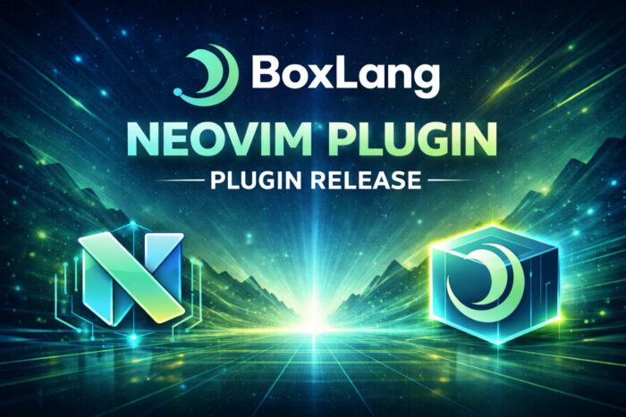
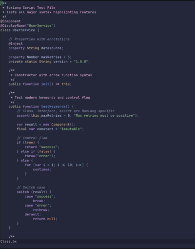

We're excited to announce the release of the BoxLang NeoVim Plugin - a comprehensive syntax highlighting solution designed specifically for BoxLang developers working in Vim and NeoVim environments. This isn't a port or adaptation of existing CFML syntax files; it's a ground-up implementation built for BoxLang's modern feature set. Coming soon as well will be our runners, syntax validators, and integration with our LSP for live previews, insights, and much more.

Why a Dedicated BoxLang Plugin?Why a Dedicated BoxLang Plugin?
--------------------------------------------------------------



BoxLang is a modern dynamic JVM language that combines features from Java, CFML, Python, Ruby, Go, and PHP. While it maintains CFML compatibility through our `bx-compat-cfml` module, BoxLang introduces significant modern language features that require proper tooling support:

* Native class and interface declarations
* Bitwise operators with BoxLang-specific syntax (`b|`, `b&`, `b^`, `b~`, `b<>`, `b>>>`)
* Arrow functions (`=>`) and lambda functions (`->`)
* Strict equality operators (`===`, `!==`)
* Modern keywords: `assert`, `final`, `package`, `castas`
* Safe navigation operator (`?.`)
* Elvis operator (`?:`)
* Java Interop and Types
* Exception Marking
* So much more

Dual-Syntax Architecture
------------------------

BoxLang supports two complementary syntax modes, and our plugin provides complete support for both:

### 1. BoxLang Script (`.bx`, `.bxs`)

Pure script syntax designed for classes, components, and business logic:

```java
/**
 * Modern BoxLang class with enterprise features
 */
@Component
@Transactional
class UserService {

    property String username;
    property Array roles;

    public function init( required String username ) {
        this.username = username;
        this.roles = [];
        return this;
    }

    /**
     * Arrow function for concise returns
     */
    public function getProfile() => {
        return {
            username: this.username,
            roles: this.roles,
            isAdmin: this.hasRole( "admin" )
        };
    }

    /**
     * Lambda function for high-performance filtering
     */
    public function filterActive( required Array users ) {
        return users.filter( ( user ) -> user.active === true );
    }

    /**
     * Bitwise operations for permission flags
     */
    public function hasPermission( numeric userFlags, numeric requiredFlag ) {
        return ( userFlags b& requiredFlag ) === requiredFlag;
    }

    /**
     * Safe navigation with elvis operator
     */
    public function getEmail() {
        return this.user?.email ?: "<a href="/cdn-cgi/l/email-protection" class="__cf_email__" data-cfemail="b3dddc9ed6ded2dadff3d6cbd2dec3dfd69dd0dcde">[email protected]</a>";
    }
}
```


2. BoxLang Templates (`.bxm`)
-----------------------------

Markup-based syntax for views, layouts, and content generation:

```java
<!--- User Dashboard Template --->
<bx:output>
    <!DOCTYPE html>
    <html lang="en">
    <head>
        <title>#variables.pageTitle#</title>
        <meta charset="UTF-8">
    </head>
    <body>
        <h1>Welcome, #user.getName()#!</h1>

        <bx:if condition="user.isAdmin()">
            <div class="admin-panel">
                <h2>Admin Controls</h2>
                <p>You have elevated privileges.</p>
            </div>
        <bx:elseif condition="user.isPremium()">
            <div class="premium-badge">Premium Member</div>
        <bx:else>
            <div class="upgrade-prompt">
                <a href="/upgrade">Upgrade to Premium</a>
            </div>
        </bx:if>

        <bx:for array="#recentActivities#" index="i" item="activity">
            <div class="activity-##i##">
                <span class="timestamp">#activity.date#</span>
                <p>#activity.description#</p>
            </div>
        </bx:for>
    </body>
    </html>
</bx:output>

<bx:script>
    // Embedded script with full syntax highlighting
    function loadActivities() {
        return queryExecute( 
            "SELECT * FROM activities WHERE userId = :userId ORDER BY created DESC",
            { userId: user.getId() }
        );
    }

    // Lambda function for data transformation
    var formatActivities = ( activities ) -> {
        return activities.map( ( a ) -> {
            date: dateFormat( a.created, "medium" ),
            description: a.description
        } );
    };
</bx:script>
```


Feature Highlights
------------------

### Comprehensive Language Support

The plugin recognizes and highlights:

* Control Flow: if, else, elseif, for, while, do, switch, case, try, catch, finally
* Type System: any, array, boolean, numeric, string, struct, query, date, function, closure, lambda, class
* Modifiers: public, private, remote, package, static, final, abstract, required
* Operators: All standard operators plus BoxLang-specific bitwise, safe navigation, and elvis operators
* Built-In Functions: Comprehensive recognition of 200+ BoxLang BIFs organized by category:
  * String manipulation (ArrayAppend, ListAppend, etc.)
  * Math operations (Abs, Round, etc.)
  * Date/time handling (DateFormat, CreateDateTime, etc.)
  * Struct operations (StructNew, StructKeyExists, etc.)
  * Array functions (ArrayMap, ArrayFilter, ArrayReduce, etc.)
  * Query operations (QueryNew, QueryAddRow, etc.)

### HTML Integration in Templates

Unlike generic XML syntax highlighting, our `.bxm` template support includes intelligent HTML awareness:

**- Special tag recognition:** Distinct colors for html, head, body, script, style, link  
**- DOCTYPE declarations:** Proper highlighting for document types  
**- HTML comments:** Full support for alongside BoxLang comments   
**- Attribute handling:** Smart parsing of HTML and bx: tag attributes

### Expression Interpolation

BoxLang uses `#expression#` for string interpolation and dynamic output. The plugin correctly highlights:

```java
var message = "Hello, #user.name#!";
var calculation = "Result: #2 + 2#";
var nested = "Status: #user.isActive() ? 'Active' : 'Inactive'#";
```


In templates:

```java
<div class="user-##userId##" data-role="#user.role#">
    #user.displayName#
</div>
```


### Code Folding Support

Automatic folding for major code structures:

* Classes and interfaces
* Functions and closures
* Control structures (`if`, `for`, `while`, `switch`, `try`)
* Tag regions in templates
* Comment blocks

Folding commands:

* `za` - Toggle fold under cursor
* `zR` - Open all folds
* `zM` - Close all folds
* `zo` - Open fold under cursor
* `zc` - Close fold under cursor

Installation
------------

### Lazy.nvim (Recommended for NeoVim)

Add to your plugin configuration (e.g., `lua/plugins/boxlang.lua`):

```java
return {
  {
    "ortus-boxlang/vim-boxlang",
    ft = { "boxlang", "boxlangTemplate" }, -- Lazy load on filetype
    init = function()
      -- Optional: Custom configuration
    end,
  }
}
```


### vim-plug

Add to your `.vimrc` or `init.vim`:

```java
Plug 'ortus-boxlang/vim-boxlang'
```


Then run `:PlugInstall`

### Vundle

Add to your `.vimrc`:

```java
Plugin 'ortus-boxlang/vim-boxlang'
```


Then run `:PluginInstall`

### Manual Installation

```java
# Clone the repository
git clone https://github.com/ortus-boxlang/vim-boxlang.git

# Copy to your vim runtime directory
# For Vim:
cp -r vim-boxlang/syntax ~/.vim/
cp -r vim-boxlang/ftdetect ~/.vim/

# For NeoVim:
# Linux/macOS:
cp -r vim-boxlang/syntax ~/.config/nvim/
cp -r vim-boxlang/ftdetect ~/.config/nvim/

# Windows:
cp -r vim-boxlang/syntax ~/AppData/Local/nvim/
cp -r vim-boxlang/ftdetect ~/AppData/Local/nvim/
```


File Extension Detection
------------------------

The plugin automatically detects BoxLang files based on extensions:

* `.bx` → BoxLang script class/component files
* `.bxs` → BoxLang executable script files
* `.bxm` → BoxLang template/markup files

If automatic detection fails, manually set the filetype:

```java
" For script files
:setfiletype boxlang

" For template files
:setfiletype boxlangTemplate
```


Or add a modeline to your file:

```java
// vim: set filetype=boxlang:
```


```java
<!--- vim: set filetype=boxlangTemplate: --->
```


Customization
-------------

Personalize syntax colors by adding to your `.vimrc` or `init.vim`:

```java
" BoxLang brand colors (#00FF78, #00DBFF)
hi boxlangKeyword ctermfg=cyan guifg=#00DBFF
hi boxlangOperator ctermfg=green guifg=#00FF78

" String colors
hi boxlangStringSingle ctermfg=green guifg=#00FF78
hi boxlangStringDouble ctermfg=green guifg=#00FF78

" Make bitwise operators stand out
hi boxlangBitwiseOp ctermfg=magenta guifg=#ff00ff gui=bold

" Function names
hi boxlangFunction ctermfg=yellow guifg=#FFF500

" Comments
hi boxlangComment ctermfg=darkgray guifg=#666666
```


Advanced Configuration
----------------------

### Enable Folding

```java
" Add to .vimrc or init.vim
set foldenable
set foldmethod=syntax
set foldlevelstart=10
```


### BoxLang-Specific Keybindings

```java
" Quick function navigation
autocmd FileType boxlang,boxlangTemplate nnoremap <buffer> ]f /function<CR>
autocmd FileType boxlang,boxlangTemplate nnoremap <buffer> [f ?function<CR>

" Toggle between script and template
function! ToggleBoxLangSyntax()
    if &filetype == 'boxlang'
        setfiletype boxlangTemplate
    else
        setfiletype boxlang
    endif
endfunction
nnoremap <leader>bt :call ToggleBoxLangSyntax()<CR>
```


What's Next?
------------

This release establishes the foundation for BoxLang's Vim/NeoVim ecosystem. Future enhancements include:

* **LSP Integration**: Language Server Protocol support for autocomplete, go-to-definition, and refactoring
* **Snippet Library**: Common BoxLang patterns and templates
* **Debugger Integration**: DAP (Debug Adapter Protocol) support
* **Enhanced Folding**: Context-aware folding for complex structures
* **Semantic Highlighting**: Advanced token-based coloring using TreeSitter

Community \& Support
--------------------

The BoxLang NeoVim plugin is professionally maintained by Ortus Solutions with community contributions welcome:

* **GitHub Repository** : <https://github.com/ortus-boxlang/vim-boxlang>
* **Documentation** : <https://boxlang.ortusbooks.com/getting-started/ide-tooling/boxlang-neovim-plugin>
* **Issues \& Feature Requests**: GitHub Issues
* **Community Forums** : <https://community.ortussolutions.com>

Try BoxLang Today
-----------------

If you haven't explored BoxLang yet, now is the perfect time:

* **Download** : <https://boxlang.io/download>
* **Documentation** : <https://boxlang.ortusbooks.com>
* **Quick Start** : <https://boxlang.ortusbooks.com/getting-started/quick-start>
* **Examples** : <https://github.com/ortus-boxlang/boxlang-examples>  
  BoxLang combines the rapid development capabilities of dynamic languages with the performance and reliability of the JVM. Whether you're building web applications, serverless functions, CLI tools, or enterprise systems, BoxLang provides the modern syntax and features you need.

Conclusion
----------

The BoxLang NeoVim plugin delivers professional-grade syntax highlighting specifically designed for BoxLang's modern feature set. With comprehensive language support, dual-syntax architecture, and intelligent HTML integration, it provides the foundation for productive BoxLang development in Vim and NeoVim environments.

Install the plugin today and experience BoxLang development with proper tooling support. Your feedback and contributions help shape the future of BoxLang developer tooling.

Happy coding! 🚀
