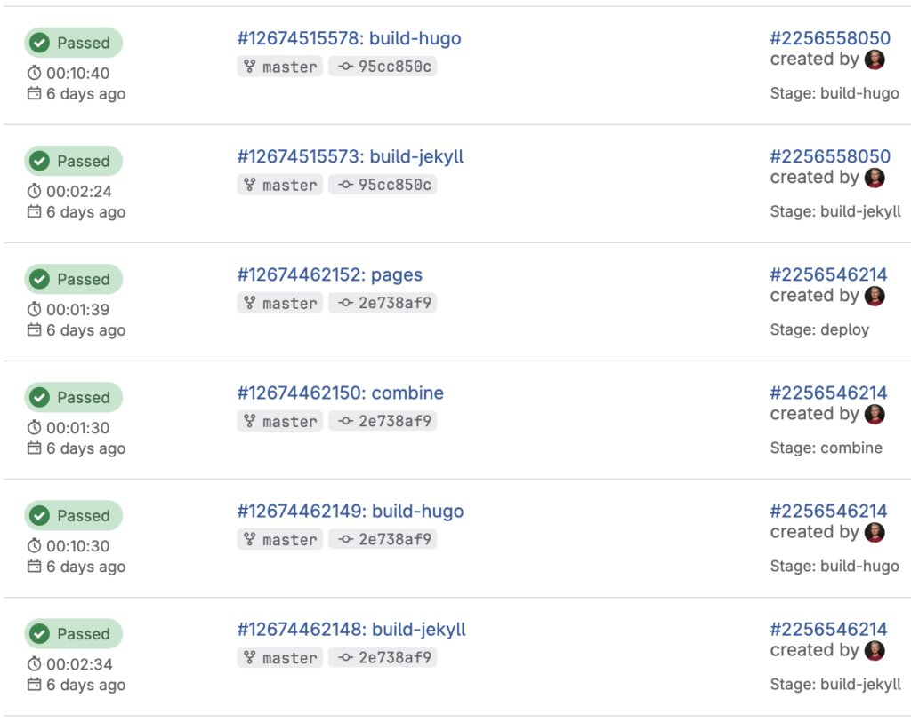

Most of my blog posts are lessons learned. I'm trying to achieve something, and I document the process I used to do it. This one is one of the few where, in the end, I didn't achieve what I wanted. In this post, I aim to explain what I learned from trying to migrate from Jekyll to Hugo, and why, in the end, I didn't take the final step.

## Context

I started this blog on WordPress. After several years, I decided to [migrate to Jekyll](https://blog.frankel.ch/managing-publications-jekyll/). I have been happy with [Jekyll](https://jekyllrb.com/) so far. It's based on Ruby, and though I'm no Ruby developer, I was able to create a few plugins.

I'm hosting the codebase on GitLab, with GitLab CI, and I have configured Renovate to create a PR when a Gem is outdated. This way, I pay technical debt every time, and I don't accrue it over the years. Last week, I got a PR to update the parent Ruby Docker image from `3.4` to `4.0`.

I checked if Jekyll was ready for Ruby 4. It isn't, though there's an [open issue](https://github.com/jekyll/jekyll/issues/9915). However, it's not only Jekyll: the `Gemfile` uses gems whose versions aren't compatible with Ruby 4.

Worse, I checked the general health of the [Jekyll project](https://github.com/jekyll/jekyll). The last commits were some weeks ago from the Continuous Integration bot. I thought perhaps it was time to look for an alternative.

## Hugo

Just like Jekyll, [Hugo](https://gohugo.io/) is a static site generator.
> Hugo is one of the most popular open-source static site generators. With its amazing speed and flexibility, Hugo makes building websites fun again.

Contrary to Jekyll, Hugo builds upon Go. It touts itself as "amazingly fast". Icing on the cake, the [codebase](https://github.com/gohugoio/hugo/commits/master/) sees much more activity than Jekyll. Though I'm not a Go fan, I decided Hugo was a good migration target.

## Jekyll to Hugo

Migrating from Jekyll to Hugo follows the Pareto Law.

### Migrating content

Hugo provides the following main folders:

* `content` for content that needs to processed
* `static` for resources that are copied as is
* `layouts` for templates
* `data` for datasources

Check the [full list](https://gohugo.io/getting-started/directory-structure/) for exhaustivity.

Jekyll distinguishes between *posts* and *pages*. The former have a date, the latter don't. Thus, posts are the foundation of a blog. Pages are stable and structure the site. Hugo doesn't make this distinction.

Jekyll folders structure maps as:

|   Jekyll   |       Hugo       |
|------------|------------------|
| `_posts`   | `content/posts`  |
| `_pages/`  | `content/posts/` |
| `_data`    | `data`           |
| `_layouts` | `layouts`        |
| `assets`   | `static`         |

### When mapping isn't enough

Jekyll offers [plugins](https://jekyllrb.com/docs/plugins/). Plugins come in several categories:
> * Generators - Create additional content on your site
> * Converters - Change a markup language into another format
> * Commands - Extend the jekyll executable with subcommands
> * Tags - Create custom Liquid tags
> * Filters - Create custom Liquid filters
> * Hooks - Fine-grained control to extend the build process

On Jekyll, I use generators, tags, filters, and hooks. Some I use through existing gems, such as the [Twitter plugin](https://github.com/rob-murray/jekyll-twitter-plugin), others are custom-developed for my own needs.

Jekyll tags translate to [shortcodes](https://gohugo.io/content-management/shortcodes/) in Hugo:
> A shortcode is a *template* invoked within markup, accepting any number of *arguments*. They can be used with any content format to insert elements such as videos, images, and social media embeds into your content.
>
> There are three types of shortcodes: embedded, custom, and inline.

Hugo offers quite a collection of shortcodes out-of-the-box, but you can roll out your own.

Unfortunately, generators don't have any equivalent in Hugo. I have developed generators to create newsletters and talk pages. The generator plugin automatically generates a page per year according to my data. In Hugo, I had to manually create one page per year.

### Migrating the GitLab build

The Jekyll build consists of three steps:

1. Detects if any of `Gemfile.lock`, `Dockerfile`, or `.gitlab-ci.yml` has changed, and builds the Docker image if it's the case
2. Uses the Docker image to actually build the site
3. Deploy the site to GitLab Pages

The main change obviously happens in the `Dockerfile`. Here's the new Hugo version for reference:

```dockerfile
FROM docker.io/hugomods/hugo:exts

ENV JAVA_HOME=/usr/lib/jvm/java-21-openjdk
ENV PATH=$JAVA_HOME/bin:$PATH

WORKDIR /builds/nfrankel/nfrankel.gitlab.io

RUN apk add --no-cache openjdk21-jre graphviz \                                      #1
 && gem install --no-document asciidoctor-diagram asciidoctor-diagram-plantuml rouge #2
```

1. Packages for PlantUML
2. Gems for Asciidoctor diagrams and syntax highlighting

At this point, I should have smelled something fishy, but it worked, so I continued.

## The deal breaker

I migrated with the help of Claude Code and Copilot CLI. It took me a few sessions, spread over a week, mostly during the evenings and on the weekend. During migration, I regularly requested one-to-one comparisons to avoid regressions. My idea was to build the Jekyll and Hugo sites side-by-side, deploy them both on GitLab Pages, and compare both deployed versions for final gaps. I updated the build to do that, and I triggered a build: the Jekyll build took a bit more than two minutes, while the Hugo build took more than ten! I couldn't believe it, so I triggered the build again. Results were consistent.

I analyzed the logs to better understand the issue. Besides a couple of warnings, I saw nothing explaining where the slowness came from.

```
                  │  EN  
──────────────────┼──────
 Pages            │ 2838 
 Paginator pages  │  253 
 Non-page files   │    5 
 Static files     │ 2817 
 Processed images │    0 
 Aliases          │  105 
 Cleaned          │    0 
Total in 562962 ms
```

When I asked Claude Code, it pointed out my usage of Asciidoc in my posts. While Hugo perfectly supports Asciidoc (and [other formats](https://gohugo.io/content-management/formats/)), it delegates formats other than Markdown to an external engine. For Asciidoc, it's `asciidoctor`. It turns out that this approach works well for a couple of Asciidoc documents, not so much for more than 800. I searched and quickly found that I wasn't the first one to hit this wall: [this thread](https://discourse.gohugo.io/t/asciidoc-hugo-performance/10637) spans five years.

Telling I was disappointed is an understatement. I left the work on a branch. I'll probably delete it in the future, once I've cooled down.

## Conclusion

Before working on the migration, I did my due diligence and asserted the technical feasibility of the work. I did that by reading the documentation and chatting with an LLM. Yet, I wasted time doing the work before rolling back. I'm moderately angry toward the Hugo documentation for not clearly mentioning the behavior and the performance hit in bold red letters. Still, it's a good lesson to remember to check for such issues before spending that much time, even on personal projects.

**Go further:**

* [Hugo shortcodes](https://gohugo.io/content-management/shortcodes/)
* [Hugo functions](https://gohugo.io/functions/)

*Originally published at [A Java Geek](https://blog.frankel.ch/migrating-jekyll-hugo/) on February 15th, 2026*
