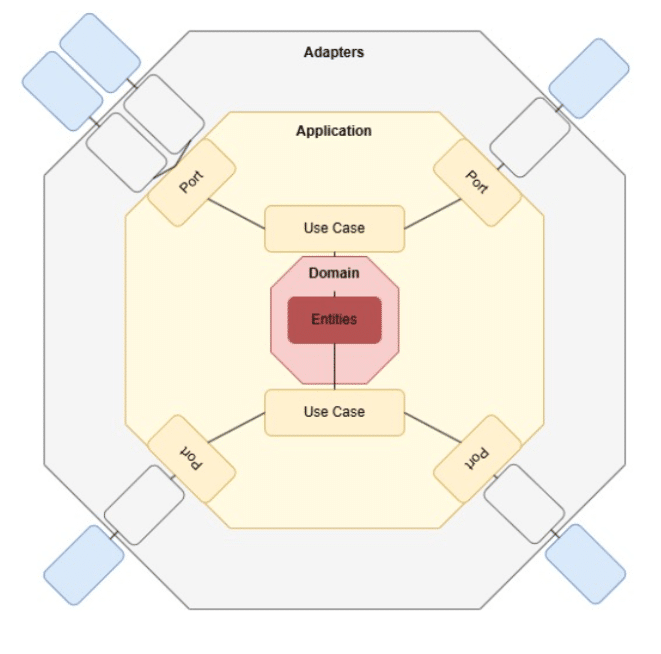

## Introduction

If we want to evolve our Java system over time, architecture is more important than the choice of framework. Very often, teams realize too late that what was supposed to be a simple persistence layer at the beginning ended up influencing and overwhelming the entire application design. MongoDB annotations end up in domain models, repository abstractions mirror collections, and business logic becomes an integral part of the infrastructure.

Hexagonal architecture, also known as Ports and Adapters, offers an architectural model that aims to avoid this problem. It involves the correct attribution of responsibilities to the various application layers. It encourages us to consider external systems (databases, message brokers, HTTP APIs, MCP servers) as details rather than pillars at the center of our design.

In this article, we focus on a concrete, real-world scenario: using a database, specifically MongoDB, without contaminating the main domain. The goal is not theoretical elegance, but long-term maintainability and testability of the solution.

## Why "Clean Core" Still Matters in 2026

It would be great if modern frameworks solved all architectural problems for us. Spring Boot, Quarkus, and Micronaut offer conventions, annotations, and automatic configuration. All things that promise productivity and organization from day one. And, to be honest, they do exactly what they promise.

The real problem is that frameworks are optimized to get started and provide structure, but not to maintain the integrity and cleanliness of the architecture over time. As systems evolve, infrastructure concerns tend to change more frequently than business rules. Databases are replaced or reconfigured, deployment models change, and frameworks are constantly updated. The core domain logic, on the other hand, usually evolves more slowly and retains the greatest business value.

The clean core principle respects and recognizes this asymmetry. It isolates business rules from infrastructure. This allows persistence strategies, testing approaches, and frameworks to evolve without making invasive changes within the domain. Ports and Adapters explicitly apply this separation, imposing it as a structural guarantee.

## Hexagonal Architecture Recap

At its core, hexagonal architecture is very simple:

* The core contains the business logic.
* The outside world interacts with the core through ports.
* Adapters implement those ports for specific technologies.



What makes this architecture powerful is the directional dependency: the core depends on the abstractions, while the infrastructure depends on the core. Not the other way around.

## Ports: Defining What the Core Needs

A port tells the application what to do, not how to do it. It represents a domain functionality, not an abstraction of the persistence layer.

Let's consider a simplified order processing domain. Instead of starting with a CRUD-style design by writing the repository layer, let's start with a hexagonal design. First, the use cases:

```
public interface LoadOrder {
    Optional<Order> byId(OrderId id);
}

public interface SaveOrder {
    void save(Order order);
}
```

These interfaces are in the core module. They do not connect to MongoDB, Spring Data, or other technologies or frameworks related to persistence. This organization has two immediate advantages:

1. The ports are based on use cases, not data.
2. Infrastructure implementations can be changed or optimized without affecting the core.

The domain says what is needed, the adapters decide how to do it.

## The Domain Model Must Stay Ignorant

Check your domain model carefully. If it uses persistence annotations or Spring data types, using MongoDB or any other database is no longer just a technical detail. The boundaries have already been crossed, and technology has begun to shape the inner core.

In a hexagonal architecture, domain objects are simple Java objects whose only task is to express business concepts, invariants, and lifecycle transitions. Things like collection names, indexes, serialization formats, or querying capabilities are completely abolished. These things concern the infrastructure, where changes are expected and manageable.

This is not purity for its own purpose: keeping the domain in the dark is what allows for true isolation. Business logic can be tested without a database, evaluated without any knowledge of specific frameworks, and evolved without coordinating changes between technical layers.

## MongoDB as an Adapter --- Not a Repository

MongoDB fits perfectly into a hexagonal architecture, but only when we consider it an adapter and not a conceptual reference point. This way of looking at things requires us to go against the recommended approach of frameworks, which is centered on the concept of a repository.

By reversing this approach, instead of asking how an aggregate should be maintained, it is more useful and important to ask how MongoDB can satisfy a specific port defined within the core. This change in design redefines MongoDB as a service provider rather than a design engine.

Starting from this assumption, the MongoDB adapter translates domain objects into specific representations for persistence, executes queries optimized for document storage, and manages indexes, projections, and schema evolution. The core remains completely unaware of what BSON is, what a collection is, or the language used for queries. This separation preserves flexibility and extensibility.

## Mapping Between Domain and Persistence Models

Hexagonal architecture is often criticized for its duplication of patterns. In practice, this duplication is both intentional and beneficial.

A MongoDB adapter introduces a specific persistence pattern:

```
@Document("orders")

class OrderDocument {
    @Id
    private String id;
    private String status;
    private BigDecimal totalAmount;
}
```

The corresponding domain model remains detached from annotations and framework dependencies:

```
public class Order {
    private final OrderId id;
    private OrderStatus status;
    private Money totalAmount;
    public void markAsShipped() {
        if (status != OrderStatus.PAID) {
            throw new IllegalStateException("Only paid orders can be shipped");
        }
        this.status = OrderStatus.SHIPPED;
    }
}
```

The mapping between these two representations takes place within the adapter:

```
public class OrderMapper {
   public static Order toDomain(OrderDocument doc) {
       return new Order(
               new OrderId(doc.getId()),
               OrderStatus.valueOf(doc.getStatus()),
               new Money(doc.getTotalAmount())
       );
   }

   public static OrderDocument toDocument(Order order) {
       return new OrderDocument(
               order.id().value(),
               order.status().name(),
               order.totalAmount().amount()
       );
   }
}
```

This type of mapping is an ad hoc demarcation line, as it allows changes to be localized and prevents the core from getting involved in the details of persistence.

## Testing: Where the Architecture Pays Off

The real advantage of this architecture is the testing approach. With a clean core:

* Use cases can be tested with in-memory adapters
* No database is required
* Tests are much faster and repeatable

MongoDB adapters can be tested separately, using TestContainer, with embedded Mongo or with contract tests performed on ports.

The key point is that the testing strategy follows the architectural design.

## Spring Boot Without Letting It Take Over

Following on from what has just been said, Spring only becomes a problem when it is allowed to define the architecture instead of giving us the tools to support it.

Let's try to create a well-organized configuration, where Spring Boot is used as an adapter that coordinates all activities:

```
@Configuration
class OrderAdapterConfiguration {
    @Bean
    LoadOrder loadOrder(MongoOrderRepository repository) {
        return new MongoLoadOrderAdapter(repository);
    }

    @Bean
    SaveOrder saveOrder(MongoOrderRepository repository) {
        return new MongoSaveOrderAdapter(repository);
    }
}
```

The core module has no Spring dependencies. Component scanning stops at the boundary, and dependency injection allows ports to be connected to adapters. That's all.

Spring remains on the edge, exactly where the infrastructure supporting the core module should be located.

## When MongoDB Does Influence Design

MongoDB has distinctive features that naturally influence the design of adapters. MongoDB offers functionality with:

* Document-oriented storage
* Denormalization
* Aggregation pipelines

The key to applying hexagonal architecture lies precisely in where these decisions are made and where these characterizations are applied.

These decisions shift to:

* Query adapters
* Projection models
* Read-optimized documents

And never in domain entities or interfaces with business logic.

## Trade-offs and Real-World Constraints

Designing systems using hexagonal architecture is not easy. Adding ports, adapters, and imposing explicit, well-defined boundaries means adding code, levels of indirection, and above all, a higher cognitive load, especially for those applying this style for the first time.

The real advantage is not immediate, but emerges over time. Systems built around a clean core tend to be easier to test, more secure and simpler to evolve, and more resilient to infrastructure changes. When persistence technologies, frameworks, or deployment models change, the impact always remains localized at the edges instead of propagating within the code.

If we need to design a system to last over time, the overhead introduced is a highly rewarding price to pay.

## Conclusion

Applying the Ports and Adapters architecture is not the same as drawing hexagons, but rather making responsibilities and dependencies explicit and clear.

To maintain the integrity of the core and preserve the expressiveness of the business logic, it is important to treat MongoDB and any persistence technology and framework as just an adapter. This avoids the slow deterioration that leads to new applications becoming monoliths tightly bound to the frameworks and technologies adopted.

A clean core is not an academic exercise, but a practical investment in the maintainability and evolvability of the Java system.

If you are already using MongoDB and Spring Boot, try starting with a small part of the system: take a use case, define its ports, and move the MongoDB dependencies behind an adapter. You will see how the architecture gradually improves, and so does its maintainability.

All code is available at the following [link](https://github.com/matteoroxis/hexagonal-architecture).
