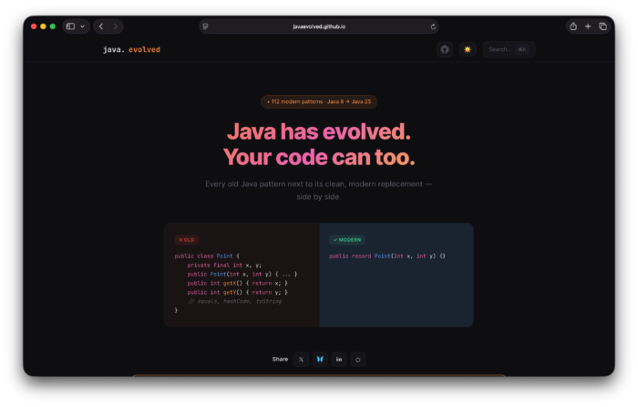

A community project called [**java.evolved**](https://javaevolved.github.io/) was recently launched to document how common Java coding patterns have changed across releases. Instead of explaining features in isolation, the site presents "before and after" examples: traditional idioms next to modern alternatives.

The approach targets a practical problem. Most developers work in mixed-era codebases where Java 6, 8, and 17 styles coexist. Rather than memorizing new language features, the site shows what existing code would look like if written today.


<br />

Less Boilerplate, More Intent
-----------------------------

One example contrasts a classic data class with a record.

**Before**

```java
public class User {
    private final String name;
    private final int age;

    public User(String name, int age) {
        this.name = name;
        this.age = age;
    }

    public String getName() { return name; }
    public int getAge() { return age; }
}
```


**After**

```java
public record User(String name, int age) {}
```


The goal is not a new capability but a clearer expression. Modern Java often removes ceremony around concepts that already existed.


Safer Type Handling and Control Flow
------------------------------------

The site also shows improvements in type checks and switch logic.

**Pattern matching**

```java
if (obj instanceof String s) {
    System.out.println(s.length());
}
```


**Switch expression**

```java
int letters = switch (day) {
    case MONDAY, FRIDAY, SUNDAY -> 6;
    case TUESDAY -> 7;
    default -> 0;
};
```


These changes shift common runtime mistakes into compile-time guarantees.


Why It Matters
--------------

Java's evolution has been gradual, making improvements easy to miss. Seen individually, features look incremental. Seen side by side, they show a significant shift toward readability and correctness.

Community reactions suggest a clear use case: onboarding developers and guiding code reviews in mature systems. Rather than debating style, teams can reference concrete transformations.


Community Perspective
---------------------

In a short exchange about the motivation behind the project, [Bruno Borges](https://www.linkedin.com/in/brunocborges/){#https://www.linkedin.com/in/brunocborges/} explained that the gap is largely about awareness rather than resistance to change:
> > *"As Java developers find themselves being able to use newer versions of the JDK, I believe they do start adopting new language idioms, but new API usage requires deeper thinking and learning. Then, there is also the element of non-Java developers having the misconception that Java today is still the same as Java from more than a decade ago. The website helps bring awareness to both cases!"*

This perspective aligns with the project's goal: not convincing developers to abandon existing code, but giving them a concrete reference point for how the language has evolved.

Conclusion
----------

*java.evolved* acts as a translation layer between past and present Java. By framing language features as recognizable rewrites instead of abstract concepts, it helps developers answer a simple daily question:

**"How would we write this today?"**
