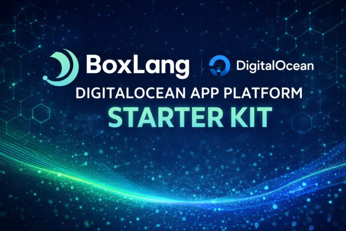
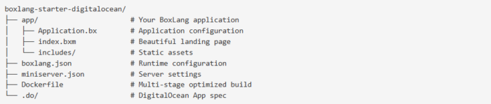

**TL;DR:** We just released a production-ready starter template that deploys a modern BoxLang application to DigitalOcean App Platform in under 5 minutes---starting at just **$5/month.** One-click deployment, auto-scaling, automatic redeployments, and zero downtime included.

## Cloud-Native BoxLang Has Never Been Easier

Today, we're excited to announce the BoxLang DigitalOcean Starter Template---a complete, production-ready solution that takes you from zero to deployed BoxLang application in minutes, not hours.

For many developers evaluating modern JVM languages, the question isn't "Can it run?" but rather "How easily can I get this into production?" With this starter, the answer is now: ridiculously easy.

### 💰 Production-Ready for $5/Month

Let's talk numbers. For the price of a fancy coffee, you get:

* **Fully managed BoxLang runtime** on DigitalOcean's App Platform
* **Automatic scaling** based on traffic (scale up or down as needed)
* **Zero-downtime deployments** with automatic health checks
* **Global CDN** routing for optimal performance worldwide
* **Free SSL certificates** with automatic renewal
* **Built-in monitoring** and real-time logs
* **Automatic redeployments** on every git push  
  No infrastructure to manage. No Kubernetes complexity. No surprise bills. Just push your code and let DigitalOcean handle the rest.

### 🎯 Who Is This For?

**CFML Developers** looking to modernize their deployment workflow without leaving the comfort of tag-based or script-based syntax.

**Java Developers** wanting a more expressive, dynamic language that still gives them 100% Java interop and access to the entire JVM ecosystem.

**DevOps Teams** seeking lightweight, containerized applications that deploy in seconds and scale automatically based on demand.

**Startups \& Side Projects** needing production-grade infrastructure without enterprise-grade costs or complexity.

### ⚡ What You Get Out of the Box

The starter template includes everything you need for a modern web application:

**Powered by BoxLang MiniServer**, our lightweight embedded web server designed specifically for containerized deployments. It auto-compiles BoxLang files, handles URL rewrites, includes built-in health checks, and starts in milliseconds.

### 🚀 Deploy in 3 Clicks

Seriously. Three clicks:

* **Click the deploy button** in our [GitHub repo](http://https://github.com/ortus-boxlang/boxlang-starter-digitalocean "GitHub repo")
* **Select your region** (or let the CDN route globally)
* **Launch your app** (takes \~2-3 minutes to build)  
  That's it. Your BoxLang application is live, secure, and ready to handle traffic.

**Want automatic redeployments?** Fork the repo, connect it to DigitalOcean, and every git push triggers a zero-downtime deployment automatically.

### 🔧 Grow Beyond the Basics

Start at $5/month, but grow as you need:

* **Add PostgreSQL, MySQL, or Redis** databases with one click
* **Scale containers horizontally** as traffic increases
* **Add worker processes** for background jobs
* **Connect to external APIs** securely with environment variables
* **Integrate with existing services** (S3, monitoring, logging, etc.)  
  All managed through DigitalOcean's intuitive control panel---no YAML hell required.

### 🥊 Why BoxLang + DigitalOcean?

**BoxLang** brings a modern dynamic language features to the JVM: powerful string interpolation (`#variable#`), first-class closures and lambdas, 100% Java interop, async/scheduled tasks patterns, extensive modular catalog, professional open-source, and a clean, expressive syntax that developers actually enjoy writing.

**DigitalOcean App Platform** eliminates infrastructure headaches: managed Docker deployments, automatic HTTPS, global CDN, GitHub integration, and transparent pricing with no hidden costs.

### 📖 Get Started Today

**Quick Start:**

* Visit: github.com/ortus-boxlang/boxlang-starter-digitalocean
* Click the "Deploy to DigitalOcean" button
* Watch your app go live ☁️

**Full Documentation:**   

boxlang.ortusbooks.com/getting-started/running-boxlang/digitalocean-app

**Community \& Support:**

* [BoxLang Community Forums](http://https://community.ortussolutions.com/ "BoxLang Community Forums")
* [BoxLang Documentation](http://https://boxlang.ortusbooks.com/ "BoxLang Documentation")
* [Professional Support Plans](http://https://www.boxlang.io/plans#open-source "Professional Support Plans")

### 🎉 Ready to Deploy?

Whether you're building the next great SaaS application, migrating CFML apps to modern infrastructure, or just exploring what BoxLang can do---this starter template removes every barrier between you and production.

**Five dollars. Five minutes. Zero excuses.**

Deploy your first BoxLang application to the cloud today: [Deploy Now →](http://https://cloud.digitalocean.com/login?redirect_url=https%3A%2F%2Fcloud.digitalocean.com%2Fapps%2Fnew%3Frepo%3Dhttps%3A%2F%2Fgithub.com%2Fortus-boxlang%2Fboxlang-starter-digitalocean%2Ftree%2Fmain%26refcode%3D4d60357dfb31 "Deploy Now →")

**Happy Cloud Computing! 🥊☁️**

Questions? Reach out to us on the [BoxLang Community Forums](http://https://community.ortussolutions.com/ "BoxLang Community Forums") or check out our [professional support](http://https://www.boxlang.io/plans#open-source "professional support") options.
