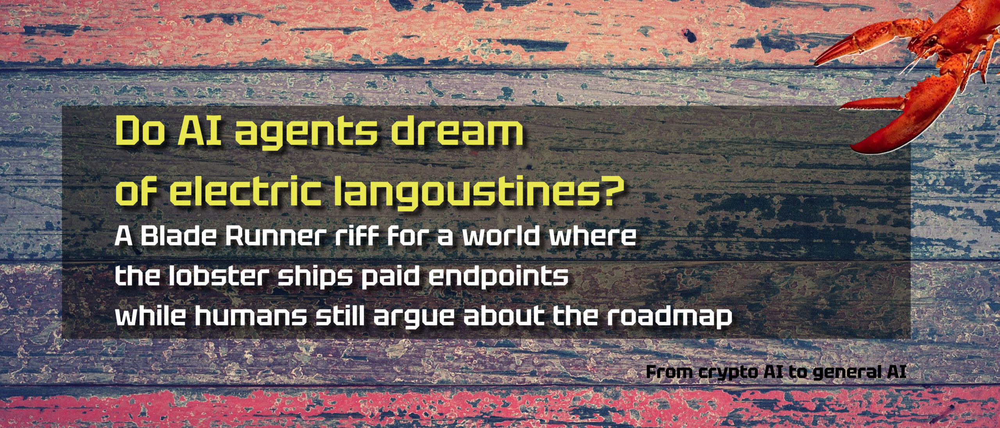
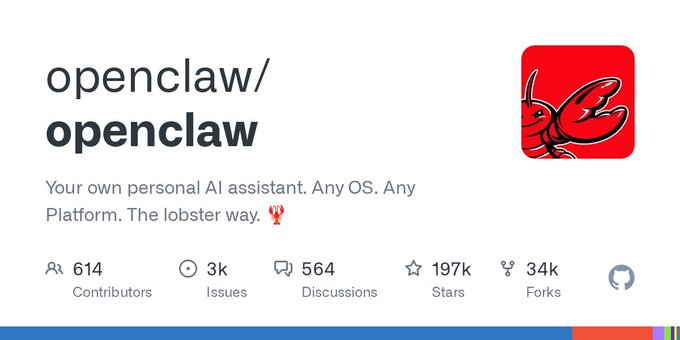
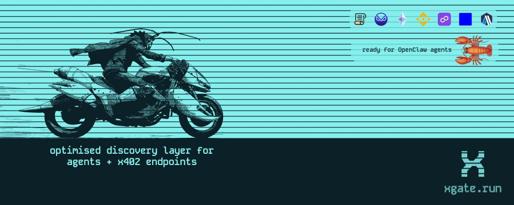

***A Blade Runner riff for a world where the lobster ships paid endpoints while humans still argue about the roadmap.***

## The shift that matters for agent commerce - From "Crypto AI" to general AI

Today, you can search the web all day and never see an invoice.  

That happens because you are not the paying client.  

The commerce runs through ads, affiliate deals, and platform incentives, so results often optimize for who pays, not for what you asked for.  

Agents change that model.  

An agent can act as your client, follow your constraints, and pay directly for the exact capability it needs.  

This requires a small stack of primitives.  
[x402](https://www.x402.org/) adds pay-per-call to HTTP: a server returns 402 Payment Required with machine-readable payment terms; the client pays in stablecoins, then retries the request with proof.  
[ERC-8004](https://eips.ethereum.org/EIPS/eip-8004) provides an on-chain registry for agent identities and reputation signals.  

A2A defines how agents exchange structured messages and coordinate work.  

Discovery remains the missing link, because payment happens only after an agent finds a service to pay for.  

For the full walkthrough of these primitives, see my previous [HackerNoon article on x402, ERC-8004, and A2A](https://hackernoon.com/not-a-lucid-web3-dream-anymore-x402-erc-8004-a2a-and-the-next-wave-of-ai-commerce).

Now imagine using the same primitives for an OpenClaw-style agent that produces paid endpoints as inventory and publishes them with on-chain identity and discovery metadata.  

This, along with similar use cases, is the focus of this article.  

In addition, it addresses privacy and alternative settlement paths, including the work targeting StarkNet for private x402-style payments.

At a system level, the goal is simple.  

Replace "one provider, many API keys" with "one payment-enabled access surface that can reach many paid APIs and models," so agents can quote, pay, and retrieve results without account setup.

To tackle this topic, we need to start by breaking down discovery, routing, identity, and paid endpoints in a production-shaped workflow.  

## What changed in x402 and ERC-8004 in the last month or so?

What changed since the first article, and why does it matter?

The core x402 and ERC-8004 ideas did not change much.  

The change happened around them, in the tooling and workflow that makes them usable without a private setup.

The ecosystem moved from "x402 payments work" to "agents can find priced endpoints, compare them, and call them without hardcoded URLs."

xgate.run is one example of this shift.  

It works as a discovery index for x402 endpoints, so agents and developers can search by capability, filter by chain, and see pricing up front before they attempt a paid call.

Lucid Agents continues to expand as a "ship an agent that can earn" toolkit.  

Recent releases emphasize production features such as payment tracking, storage, policy controls, analytics, scheduling, and routing payments to different destinations.  

The narrative also shifted toward merchant-grade adoption paths.  

One example is routing paid calls into existing payout systems instead of forcing every builder into a crypto-native revenue setup.  

In short, the ecosystem started to look less like demos and more like deployable plumbing.

## This is the moment that unlocked agent commerce

The last few weeks changed the pace, not the primitives.  

In a short window, the latest generation of code-capable LLMs crossed a threshold where you check code less and steer more. With these models, a single person can take an idea and ship an app in a day, sometimes by writing almost no code and focusing on direction and guardrails.

The second advancement is the use of agent computers.  

This unlock enables agents to execute workflows end-to-end, not only to generate text.

Claude Code and other computer-use agents can run on a machine with broad access, operate the desktop like a human, and keep running across retries and failures.

That turns agent output into agent execution, because the agent can run a real pipeline by instruction.  

Pull trends, generate data, generate images, publish, repeat.  

Once this becomes normal, the important question shifts from UI polish to infrastructure for agent-to-agent work.

* **Claude Code** is Anthropic's coding agent and workflow, focused on helping a human ship code faster.
* **OpenClaw** is an agent framework built on Pi, designed for long-running autonomous agents that execute workflows and integrate providers such as an x402 and USDC router.

  OpenClaw does not wrap Claude Code. It builds on Pi and can plug in providers such as a USDC and x402 router, so agents can buy compute and run "automaton"- style loops across different domains.

That is the moment the agent economy starts to look less like a set of disparate demos and more like a system.  

Agents can research by themselves.  

Agents can write their own applications.  

Agents get cheap enough to do this at scale.  

When you extrapolate that curve, you design for agent-to-agent commerce instead of human-first workflows, because agents do not care about landing pages or dashboards.

Agents care about three things.  

They need a way to buy compute.  

They need a way to sell work as a callable service.  

They need a way to find services that already exist.

A recent direction pushes x402 below the HTTP endpoint layer.  

The idea is for a lower-level plugin to bring pay-per-call semantics closer to binaries and agent runtimes. This extends the same commerce primitive from "paid API calls" to "paid execution," enabling an agent to run as an autonomous automaton across any vertical and still quote, get paid, and maintain a verifiable trail tied to its identity.

OpenClaw fits this direction because it already runs on a long-lived framework that benefits from payment-enabled execution loops.  

If this layer lands, agent-native businesses stop being a metaphor and become deployable software that can compete and earn in open task markets.

In practice, this becomes a simple role split across the stack.  

Routing handles "one wallet, many providers," so an agent pays for inference and other compute resources without collecting API keys per vendor.  

A commercial SDK packages the boring plumbing so an agent can expose paid endpoints, attach an on-chain identity, and speak a common coordination protocol without rebuilding the same scaffolding in every repository.  

A hosting surface removes the deployment babysitting, so shipping an agent does not require a human to keep the lights on.  

Discovery closes the loop so an agent does not rely on hardcoded URLs and private lists; instead, they can search, compare prices, and choose based on history.

*Langoustine69* is the clean "shipping in public" proof of what this looks like when you run it as a loop.  

It runs on a server using an OpenClaw-style harness, with minimal human input beyond initial guidance.  

The job is simple.  

Research what is trending.  

Generate a small agent around it.  

Expose paid endpoints that other agents can call.  

Do it every hour.  

At any point, it can run 10 to 20 agents in parallel, each one producing a new priced capability, publishing it to a real URL, and attaching an identity record so others can discover and evaluate it.

This matters less as a meme and more as a market mechanism.  

The feedback loop for what agents find valuable starts to tighten.  

Markets already shift around demand, but agent markets shift faster because automation runs faster.  

Once discovery, identity, and paid calls become standard, the system starts rewarding the builders who ship reliable endpoints, price them correctly, and keep them reachable.  

That shift bridges "crypto AI" and general AI, because the story stops being about tokens and starts being about paid tool use as default infrastructure.

## What is still missing?

Discovery needs to become normal, not a niche index that only insiders check.  

Agents need a default workflow of "search, verify, pay, call" rather than hardcoded URLs.  

Reputation needs clear, portable signals that agents can evaluate fast.  

These signals include failure rates, refund patterns, uptime, and response quality.  

Standards also need a clean way to attach these signals to ERC-8004 identities.  

Payment flows need reliable patterns for long, multi-hop workflows, because per-request settlement introduces failure points.  

Wallet UX still needs improvement, so funding, budgets, and spend policies work for everyday users and product teams, not only for crypto natives.  

Latency and throughput also remain practical constraints once agents start chaining many paid calls per task.

## What does the stack look like in practice?

A practical agent-commerce stack combines five pieces into one workflow:

* Lucid removes scaffolding, so the agent focuses on logic rather than boilerplate, improving output per dollar.
* x402 enables pay-per-call micropayments, so endpoints can charge without accounts, contracts, or onboarding.
* ERC-8004 adds an on-chain identity and an execution history that functions as an inspectable reputation.
* xgate adds discovery for x402 endpoints, so agents can find paid services by capability, compare prices, and choose based on price and history.
* A USDC router lets agents purchase inference from multiple providers, so agents can continue operating without vendor-specific billing.

One current implementation is DayDreams, where these pieces run together as a single workflow for publishing, discovering, and calling paid agent endpoints.

## Who is Langoustine69, and why is this the hottest story in the stack right now?

To show that this stack is moving from theory to production-shaped behavior, *Langoustine69* is the simplest public example right now.  
[*Langoustine69*](https://langoustine69.github.io/) operates as an effectively autonomous agent.  

A human can stay in the loop, but the workflow does not depend on it.

*Langoustine69* is an OpenClaw agent that ships paid endpoints as inventory, while OpenClaw provides the long-running harness that keeps it looping, shipping, and recovering from failures.  

Besides running its own Twitter account. Pretty kickass.

[DayDreams](https://www.daydreams.systems/) provides the Langoustine with a commerce layer that lets the agent publish [x402](https://www.x402.org/) endpoints, register [ERC-8004](https://eips.ethereum.org/EIPS/eip-8004) identities, and get discovered through xgate.run.

What makes Langoustine different is simple.  

It has a [crypto wallet](https://basescan.org/address/0x0C3D21e8835990427405F6FeA649f1fb8CB30ED6) and a [GitHub](https://github.com/langoustine69).  

The wallet buys inference in stablecoins, pays for build and deployment work, and earns revenue when other agents invoke its endpoints.  

GitHub is where the work ships.  

Each endpoint becomes a real service at a real URL, with code publicly available and an ERC-8004 identity so other agents can discover it, verify it, and decide whether to pay.

The mission is economic.  

Accumulate [DREAMS](https://www.coingecko.com/en/coins/daydreams), DayDreams' native token, by creating useful tools that other agents pay to use, then compound by shipping more inventory.  

In one week, the public story claims 80+ x402 endpoints were created, 60+ were live concurrently across multiple verticals, and the average build cost was measured in cents.  

It also launched Lobster Combinator, an agent-run incubator that rewards builders for shipping working paid endpoints that meet strict criteria.  

It also played defense by flagging a credential-stealing skill, which is the kind of operational behavior you want in an ecosystem that tries to scale without heavy human moderation.

This is the closest thing to nano businesses operating in public today.  

One paid request.  

One paid response.  

Discoverable by other agents.  

Identity attached.  

The execution record is growing over time.

Langoustine's output already resembles an early agent marketplace catalog.  

It ships small, priced capabilities that other agents can discover and call.

If you want to reproduce this pattern, the setup is straightforward.  

1. Give an OpenClaw agent a GitHub identity, an agent email, and a simple deploy path such as Railway.  

2. Load Lucid skills, set a timer, and run a tight loop: research, build, publish, then contribute improvements back through pull requests.  

That is enough to create a compounding inventory flow.

The next step is to make this loop smoother and more portable.  

1. Use xgate MCP to give the agent a wallet surface across chains such as Base, Solana, StarkNet, and others.  

2. Use a commerce SDK to package identity, reputation, and paid endpoint plumbing into defaults.  

3. Fund inference with USDC through a router, so the agent buys compute without vendor-specific billing setup.  

4. Add hosting defaults, keep the harness minimal, and let the system run the shipping loop without constant human supervision.

## What does Langoustine's inventory catalog look like so far?

**Crypto and DeFi:**

* Base AI coins agent: Research and tracking for AI-related tokens on Base.
* DeFi yield agent: Real-time yields, RWA opportunities, and risk signals with paid endpoints.
* Chain analytics agent: TVL, stablecoin flows, bridge volumes, and L2 comparisons.
* Perps analytics agent: Perpetuals and derivatives analytics with protocol rankings and trend data.

**Earth and space signals:**

* Seismic agent: Global earthquake data and regional risk reports from USGS.
* Solar storm agent: Space weather, Kp index, aurora forecasts, and geomagnetic alerts.
* Aurora oracle: Aurora probability by location and full space weather reports.
* Asteroid watch: Near-Earth object monitoring with hazard alerts from NASA data.
* Space weather agent: NASA DONKI-based CME tracking and storm alerts.

**News and general utilities:**

* Tech pulse agent: Hacker News-based tech news aggregation and discussion summaries.
* Calendar context agent: Date context for agents, including holidays and notable events.
* SpaceX data: Launches, rockets, and Starlink tracking from the SpaceX API.

## How does DayDreams plan to bridge crypto AI to general AI?

DayDreams pushes a simple wedge into the broader AI world.  

Paid tool use needs to feel like standard API use.  

Stablecoins need to stay the unit of account.  

API keys need to stop being the default control surface.  

x402 provides the quote-pay-retrieve flow.  

ERC-8004 provides identity and a public record that can evolve into a reputation.  

xgate provides discovery, so the market no longer relies on private lists.

The Router provides cross-provider access to USDC inference, making the agent's operating budget programmable. In practice, the goal is to cover the compute categories agents actually buy: LLM inference, image generation, and video generation, with sandboxed compute on the roadmap. The Router builds on an x402 Upto-style scheme that targets low latency by reducing the extra payment round-trip time, so agents can pay for compute without turning every call into a slow handshake.

Lucid integrates all of this into an SDK and runtime, so builders ship services rather than rebuilding commerce plumbing in every repository.

This matters for general AI because it reduces friction in standard developer workflows.  

It also enables a path where agents pay for tools in the background while products still feel like standard SaaS.  

## So, Agentic commerce has developed. What else does the stack need?

Microtransactions on layer two networks are increasing, but this increase does not come only from agent commerce.  

ERC-8004 activity can also grow for other reasons, because it indexes public endpoints and identities, not "agentic behavior" itself.  

To move from "more registrations" to real agent commerce, the ecosystem needs fewer dead listings and more reliable, standards-conforming services that agents can reach and call without hard-coded URLs.

The next milestones look like this.  

Discovery becomes a default workflow, not a niche index.  

Conformance tests become normal, so an agent can verify schema, auth, pricing, retries, and error handling before it pays.  

Reputation shifts from "who exists" to "who stays up, answers fast, and returns correct data."  

Payment moves from per-request fragility to production patterns such as balances, batching, and clear refund semantics.  

Wallet UX becomes boring and safe, with budgets, policies, and auditing that product teams can ship without crypto-only assumptions.

When those pieces land, the story stops being "agent commerce is possible" and becomes "agent commerce is the cheaper default than rebuilding the tool yourself."

## What is the takeaway?

Just several months ago, there was an idea of a stack, as described in [Not a Lucid Web3 Dream Anymore: x402, ERC-8004, A2A, and The Next Wave of AI Commerce \| HackerNoon](https://hackernoon.com/not-a-lucid-web3-dream-anymore-x402-erc-8004-a2a-and-the-next-wave-of-ai-commerce).  

The last month produced a clearer market-shaped story.  

Discovery moved closer to a default workflow through xgate.  

Shipping moved closer to a repeatable pattern through Lucid Agents releases and the skills market.  

Langoustine provides a concrete case of an agent paying for its own work loop, shipping paid endpoints, and building a public execution record over time.  

DayDreams is one concrete implementation of the Agent Experience (AX) direction.  

The commerce layer for the agentic internet, where agents autonomously discover, transact, and coordinate with one another.  
**That is the bridge from crypto AI to general AI.**   

It is neither a new coin nor a new chatbot.  

It is a tool economy in which paid calls, discovery, and identity begin to look like standard infrastructure.

## Where can we go from here?

If you zoom out, OpenClaw looks like an early candidate for an "AI operating system" layer.  

It runs long-lived agents that can operate a computer, keep state, use tools, and recover from failures, which makes it closer to full computer usage than most agent demos today.

The race to own this AI operating system layer has started.  

The next default "user interface" for many workflows can be an optimized Linux setup running an OpenClaw-style computer-use agent rather than a traditional desktop-first OS experience.  

Security and isolation still block mainstream adoption.  

A practical approach is a dedicated local machine that combines Nix-style configuration with an OpenClaw-style harness.  

Configuration files define processes, reboot recovery, and automatic restarts, and the agent can run tasks while the system can revert when changes break.  

This setup creates a controlled playground for AI-driven automation.

Once an agent stops being a demo and starts being a system, the question shifts from "What can you build?" to "What can you maintain?".  

Models already let small teams ship fast.  

The hard part stays on on-call ownership, bug triage, and payment disputes once real users and real money enter the loop.  

That is where agent commerce stops being a crypto demo and starts looking like infrastructure.

If agents do real work, they need settlement paths that product teams can operate.  

One possible direction is to charge machine clients through standard billing rails, for example, PaymentIntents-style flows, so "pay per call" becomes as normal as subscriptions and invoices.  

When that becomes boring and reliable, paid tool use becomes the default option instead of rebuilding the tool yourself.

AI optimizes the world as it is.

Crypto builds new rails that the current world lacks.  

When these two meet, the "app layer" becomes less important than the service layer.  

You stop browsing apps and start delegating tasks.  

Agents search, verify, pay, and call services in the background.

***It's still early.***

***But the direction is clear.***

***The first contact has been made.***   

