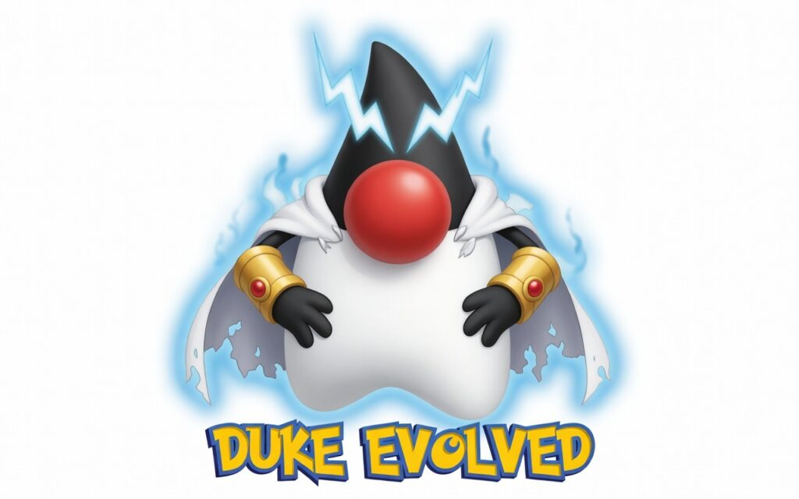
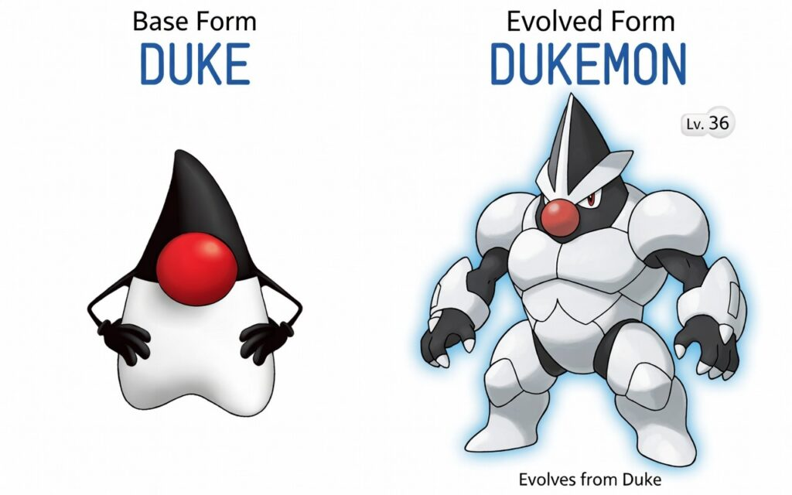

Happy 30th Anniversary to **Pokémon**! 🎉

February 27, 2026 marks exactly 30 years since the original Pokémon Red and Green launched in Japan on February 27, 1996. From catching your first Pokémon in Pallet Town to becoming Champion in the Indigo League, the franchise has spent three decades teaching millions of players about strategy, friendship, exploration, and constant improvement, evolving creatures, teams, and even entire generations of games.

Pokémon is literally all about evolution and that same spirit of evolution perfectly matches what's happening in Java right now.

For a long time, people said Java was "too verbose", too much boilerplate, too many lines just to do simple things. Writing a basic class, a main method, getters/setters, and handling nulls felt like carrying around a heavy backpack full of unnecessary items.

But Java 25 (released September 2025) is like a Pokémon finally hitting level 100 and evolving into its most powerful form. The language has shed tons of boilerplate, gained concise new syntax, and become much friendlier for beginners and quick prototyping, all while keeping its legendary strength for big enterprise systems.

Here's how Java 25 turns the "verbose" criticism into a thing of the past, just like how Pokémon keeps reinventing itself every generation.

### Java 25 – Compact Source Files and Instance Main Methods (JEP 512)

<https://openjdk.org/jeps/512>

The static methods that were initially available in java.io.IO (such as println, etc.) have now been relocated to java.lang.IO. Since java.lang is automatically imported by default, this shift makes them easier to use overall.

These functions now rely on System.out and System.in instead of the Console API. That said, in compact source files, the IO class's static methods aren't brought in automatically anymore, so you'll need to qualify calls with the class name explicitly.

Compact source files gain automatic entry to every public class and interface in the java.base module (essentially performing an import module java.base;).

### Java 25 – Flexible Constructor Bodies (JEP 513)

<https://openjdk.org/jeps/513>

A key element here is constructor chaining: when a class inherits from a superclass, Java makes sure the superclass constructor executes prior to any logic in the subclass constructor. This step-by-step process ensures objects are assembled progressively from the base of the inheritance tree upward.

The enhancement addresses limitations by permitting specific statements to come before super() or this() invocations, which results in more flexible and clearer constructors.

Keep in mind this isn't a complete rundown, I highly recommend checking out the links and experimenting with some samples yourself to fully appreciate the advantages.

### 30 Years of Pokémon. Decades of Java Evolution.

Just like how Pokémon keeps evolving its games to stay fresh and fun for 30 years, Java keeps evolving so that you can have fun coding right away, whether you're building a Pokédex app, a tiny game, or controlling LEDs on a Raspberry Pi.

The old "Java is verbose" days are over.

The new generation is here, and it's ready to catch every idea, build every project, and win every battle.

So the next time someone says: "Java is too verbose.", you can answer: That was first-generation Java. We're in Generation 25 now.

Which Java 25 feature would you use first to build your dream Pokédex or Pokémon battle simulator?

Drop it in the comments — let's evolve our code together!  

Gotta code 'em all!

### LinksLinks

<https://dev.to/igoriot/stop-saying-java-is-verbose-127i>
