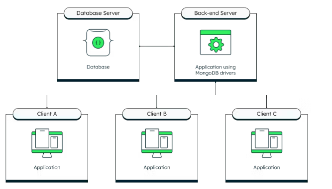

We need to code our way from the search box to our search index. Performing a search and rendering the results in a presentable fashion, itself, is not a tricky endeavor: Send the user's query to the search server, and translate the response data into some user interface technology. However, there are some important issues that need to be addressed, such as security, error handling, performance, and other concerns that deserve isolation and control.

A typical [three-tier system](https://www.mongodb.com/basics/database-architecture?utm_campaign=devrel&utm_source=third-party-content&utm_medium=cta&utm_content=search-service-foojay&utm_term=erik.hatcher) has a presentation layer that sends user requests to a middle layer, or application server, which interfaces with backend data services. These tiers separate concerns so that each can focus on its own responsibilities.  


If you've built an application to manage a database collection, you've no doubt implemented Create-Read-Update-Delete (CRUD) facilities that isolate the business logic in a middle application tier.

Search is a bit of a different type of service in that it is read-only, is accessed very frequently, must respond quickly to be useful, and generally returns more than just documents. Additional metadata returned from search results commonly includes keyword highlighting, document scores, faceting, and the number of results found. Also, searches often match way more documents than are reasonably presentable, and thus pagination and filtered searches are necessary features.

Our search service provides the three-tier benefits outlined above in these ways:

* Security: The database connection string is isolated into the service environment. Parameters are validated and sanitized. The client/user cannot request a large number of results or do deep paging.
* Scalability: The service is stateless and could easily be deployed multiple times and load-balanced.
* Faster deployment: Service end-points could be versioned and kept running while enhanced versions are deployed. Behavior can be modified without necessarily affecting either the presentation tier or the database and search index configurations.

In this article, we are going to detail an HTTP Java search service designed to be called from a presentation tier, and in turn, it translates the request into an aggregation pipeline that queries our Atlas data tier. This is purely a service implementation, with no end-user UI; the user interface is left as an exercise for the reader. In other words, the author has deep experience providing search services to user interfaces but is not a UI developer himself. 🙂

## Prerequisites

The code for this article lives in the [GitHub repository](https://github.com/mongodb-developer/atlas-search-java-server).

This project was built using:

* Gradle 8.5
* Java 21

Standard Java and servlet APIs are used and should work as-is or port easily to later Java versions.

In order to run the examples provided here, the Atlas sample data needs to be loaded and a movies_index, as described below, created on the sample_mflix.movies collection. If you're new to Atlas Search, a good starting point is [Using Atlas Search from Java](https://foojay.io/today/atlas-searching-with-the-java-driver/).

## Search service design

The front-end presentation layer provides a search box, renders search results, and supplies sorting, pagination, and filtering controls. A middle tier, via an HTTP request, validates and translates the search request parameters into an aggregation pipeline specification that is then sent to the data tier.

A search service needs to be fast, scalable, and handle these basic parameters:

* The query itself: This is what the user entered into the search box.
* Number of results to return: Often, only 10 or so results are needed at a time.
* Starting point of the search results: This allows the pagination of search results.

Also, a performant query should only search and return a small number of fields, though not necessarily the same fields searched need to be returned. For example, when searching movies, you might want to search the \`fullplot\` field but not return the potentially large text for presentation. Or, you may want to include the year the movie was released in the results but not search the \`year\` field.

Additionally, a search service must provide a way to constrain search results to, say, a specific category, genre, or cast member, without affecting the relevancy ordering of results. This filtering capability could also be used to enforce access control, and a service layer is an ideal place to add such constraints that the presentation tier can rely on rather than manage.

## Search service interface

Let's now concretely define the service interface based on the design. Our goal is to support a request, such as *find "Music" genre movies for the query "purple rain" against the \`title\` and \`plot\` fields*, returning only five results at a time that only include the field's title, genres, plot, and year. That request from our presentation layer's perspective is this HTTP GET request:

```
http://service_host:8080/search?q=purple%20rain&limit=5&skip=0&project=title,genres,plot,year&search=title,plot&filter=genres:Music
```

These parameters, along with a \`debug\` parameter, are detailed in the following table:

|---------------|-----------------------------------------------------------------------------------------------------------------------------------------------------------------------------------|
| **parameter** | **description**                                                                                                                                                                   |
| **q**         | This is a full-text query, typically the value entered by the user into a search box.                                                                                             |
| **search**    | This is a comma-separated list of fields to search across using the query (\`q\`) parameter.                                                                                      |
| **limit**     | Only return this maximum number of results, constrained to a maximum of 25 results.                                                                                               |
| **skip**      | Return the results starting after this number of results (up to the \`limit\` number of results), with a maximum of 100 results skipped.                                          |
| **project**   | This is a comma-separated list of fields to return for each document. Add \`_id\` if that is needed. \`_score\` is a "pseudo-field" used to include the computed relevancy score. |
| **filter**    | \<field name\>:\<exact value\> syntax; supports zero or more \`filter\` parameters.                                                                                               |
| **debug**     | If \`true\`, include the full aggregation pipeline .explain() output in the response, as well.                                                                                    |

### Returned results

Given the specified request, let's define the response JSON structure to return the requested (\`project\`) fields of the matching documents in a \`docs\` array. In addition, the search service returns a \`request\` section showing both the explicit and implicit parameters used to build the Atlas $search pipeline and a \`meta\` section that will return the total count of matching documents. This structure is entirely our design, not meant to be a direct pass-through of the aggregation pipeline response, allowing us to isolate, manipulate, and map the response as it best fits our presentation tier's needs.

|---------------------------------------------------------------------------------------------------------------------------------------------------------------------------------------------------------------------------------------------------------------------------------------------------------------------------------------------------------------------------------------------------------------------------------------------------------------------------------------------------------------------------------------------------------------------------------------------------------------------------------------------------------------------------------------------------------------------------------------------------------------------------------------------------------|
| { "request": { "q": "purple rain", "skip": 0, "limit": 5, "search": "title,plot", "project": "title,genres,plot,year", "filter": \[ "genres:Music" \] }, "docs": \[ { "plot": "A young musician, tormented by an abusive situation at home, must contend with a rival singer, a burgeoning romance and his own dissatisfied band as his star begins to rise.", "genres": \[ "Drama", "Music", "Musical" \], "title": "Purple Rain", "year": 1984 }, { "plot": "Graffiti Bridge is the unofficial sequel to Purple Rain. In this movie, The Kid and Morris Day are still competitors and each runs a club of his own. They make a bet about who writes the ...", "genres": \[ "Drama", "Music", "Musical" \], "title": "Graffiti Bridge", "year": 1990 } \], "meta": \[ { "count": { "total": 2 } } \] } |

## Search service implementation

Code! That's where it's at. Keeping things as straightforward as possible so that our implementation is useful for every front-end technology, we're implementing an HTTP service that works with standard GET request parameters and returns easily digestible JSON. And Java is our language of choice here, so let's get to it. Coding is an opinionated endeavor, so we acknowledge that there are various ways to do this in Java and other languages — here's one opinionated (and experienced) way to go about it.

To run with the configuration presented here, a good starting point is to get up and running with the examples from the article [Using Atlas Search from Java](https://www.mongodb.com/developer/products/atlas/atlas-search-java/?utm_campaign=devrel&utm_source=third-party-content&utm_medium=cta&utm_content=search-service-foojay&utm_term=erik.hatcher). Once you've got that running, create a new index, called \`movies_index\`, with a custom index configuration as specified in the following JSON:

|-----------------------------------------------------------------------------------------------------------------------------------------------------------------------------------------------------------------------------------------|
| { "analyzer": "lucene.english", "searchAnalyzer": "lucene.english", "mappings": { "dynamic": true, "fields": { "cast": \[ { "type": "token" }, { "type": "string" } \], "genres": \[ { "type": "token" }, { "type": "string" } \] } } } |

Here's the skeleton of the implementation, a standard \`doGet\` servlet entry point, grabbing all the parameters we've specified:

|------------------------------------------------------------------------------------------------------------------------------------------------------------------------------------------------------------------------------------------------------------------------------------------------------------------------------------------------------------------------------------------------------------------------------------------------------------------------------------------------------------------------------------------------------------------------------------------------------------------------------------------------------------------------------|
| public class SearchServlet extends HttpServlet { private MongoCollection\<Document\> collection; private String index_name; private Logger logger; // ... @Override protected void doGet(HttpServletRequest request, HttpServletResponse response) throws IOException { String q = request.getParameter("q"); String search_fields_value = request.getParameter("search"); String limit_value = request.getParameter("limit"); String skip_value = request.getParameter("skip"); String project_fields_value = request.getParameter("project"); String debug_value = request.getParameter("debug"); String\[\] filters = request.getParameterMap().get("filter"); // ... } } |

Notice that a few instance variables have been defined, which get initialized in the standard servlet \`init\` method from values specified in the \`web.xml\` deployment descriptor, as well as the \`ATLAS_URI\` environment variable:

|------------------------------------------------------------------------------------------------------------------------------------------------------------------------------------------------------------------------------------------------------------------------------------------------------------------------------------------------------------------------------------------------------------------------------------------------------------------------------------------------------------------------------------------------------------------------------------------------------------------------------------------------------------------|
| @Override public void init(ServletConfig config) throws ServletException { super.init(config); logger = Logger.getLogger(config.getServletName()); String uri = System.getenv("ATLAS_URI"); if (uri == null) { throw new ServletException("ATLAS_URI must be specified"); } String database_name = config.getInitParameter("database"); String collection_name = config.getInitParameter("collection"); index_name = config.getInitParameter("index"); // ... log the details ... MongoClient mongo_client = MongoClients.create(uri); MongoDatabase database = mongo_client.getDatabase(database_name); collection = database.getCollection(collection_name); } |

For the best protection of our \`ATLAS_URI\` connection string, we define it in the environment so that it's not hard-coded nor visible within the application itself other than at initialization, whereas we specify the database, collection, and index names within the standard \`web.xml\` deployment descriptor which allows us to define end-points for each index that we want to support. Here's a basic web.xml definition:

|-------------------------------------------------------------------------------------------------------------------------------------------------------------------------------------------------------------------------------------------------------------------------------------------------------------------------------------------------------------------------------------------------------------------------------------------------------------------------------------------------------------------------------------------------------------------------------------------------------------------------------------------------------------------------------------------------------------------------------------------------------------------------------------------------------------------------------------------------------------------------------------------------------------------------------------------------------------|
| \<**web-app** \> \<**servlet** \> \<**servlet-name** \>SearchServlet\</**servlet-name** \> \<**servlet-class** \>com.mongodb.atlas.SearchServlet\</**servlet-class** \> \<**load-on-startup** \>1\</**load-on-startup** \> \<!-- The connection string must be defined in the \`ATLAS_URI\` environment variable --\> \<**init-param** \> \<**param-name** \>database\</**param-name** \> \<**param-value** \>sample_mflix\</**param-value** \> \</**init-param** \> \<**init-param** \> \<**param-name** \>collection\</**param-name** \> \<**param-value** \>movies\</**param-value** \> \</**init-param** \> \<**init-param** \> \<**param-name** \>index\</**param-name** \> \<**param-value** \>movies_index\</**param-value** \> \</**init-param** \> \</**servlet** \> \<**servlet-mapping** \> \<**servlet-name** \>SearchServlet\</**servlet-name** \> \<**url-pattern** \>/search\</**url-pattern** \> \</**servlet-mapping** \> \</**web-app**\> |

### GETting the search results

Requesting search results is a stateless operation with no side effects to the database and works nicely as a straightforward HTTP GET request, as the query itself should not be a very long string. Our front-end tier can constrain the length appropriately. Larger requests could be supported by adjusting to POST/getPost, if needed.

### Aggregation pipeline behind the scenes

Ultimately, to support the information we want returned (as shown above in the example response), the request example shown above gets transformed into this aggregation pipeline request:

|------------------------------------------------------------------------------------------------------------------------------------------------------------------------------------------------------------------------------------------------------------------------------------------------------------------------------------------------------------------------------------------------------------------------------------------------------------------------------|
| \[ { "$search": { "compound": { "must": \[ { "text": { "query": "purple rain", "path": \[ "title", "plot" \] } } \], "filter": \[ { "equals": { "path": "genres", "value": "Music" } } \] }, "index": "movies_index", "count": { "type": "total" } } }, { "$facet": { "docs": \[ { "$skip": 0 }, { "$limit": 5 }, { "$project": { "title": 1, "genres": 1, "plot": 1, "year": 1, "_id": 0, } } \], "meta": \[ { "$replaceWith": "$$SEARCH_META" }, { "$limit": 1 } \] } } \] |

There are a few aspects to this generated aggregation pipeline worth explaining further:

* The query (\`q\`) is translated into a [\`text\`](https://www.mongodb.com/docs/atlas/atlas-search/text/?utm_campaign=devrel&utm_source=third-party-content&utm_medium=cta&utm_content=search-service-foojay&utm_term=erik.hatcher) operator over the specified \`search\` fields. Both of those parameters are required in this implementation.
* [\`filter\`](https://www.mongodb.com/docs/atlas/atlas-search/compound/#mongodb-data-filter?utm_campaign=devrel&utm_source=third-party-content&utm_medium=cta&utm_content=search-service-foojay&utm_term=erik.hatcher) parameters are translated into non-scoring \`filter\` clauses using the [\`equals\`](https://www.mongodb.com/docs/atlas/atlas-search/equals/?utm_campaign=devrel&utm_source=third-party-content&utm_medium=cta&utm_content=search-service-foojay&utm_term=erik.hatcher) operator. The \`equals\` operator requires string fields to be indexed as a \`token\` type; this is why you see the \`genres\` and \`cast\` fields set up to be both \`string\` and \`token\` types. Those two fields can be searched full-text-wise (via the \`text\` or other string-type supporting operators) or used as exact match \`equals\` filters.
* The count of matching documents is requested in $search, which is returned within the \`$$SEARCH_META\` aggregation variable. Since this metadata is not specific to a document, it needs special handling to be returned from the aggregation call to our search server. This is why the \`$facet\` stage is leveraged, so that this information is pulled into a \`meta\` section of our service's response.

The use of \`$facet\` is a bit of a tricky trick, which gives our aggregation pipeline response room for future expansion too.

Callout (\> markdown) section: \`$facet\` aggregation stage is confusingly named the same as the Atlas Search \`facet\` collector. Search result facets give a group label and count of that group within the matching search results. For example, faceting on \`genres\` (which requires an index configuration adjustment from the example here) would provide, in addition to the documents matching the search criteria, a list of all \`genres\` within those search results and the count of how many of each. Adding the \`facet\` operator to this search service is on the roadmap mentioned below.

### $search in code

Given a query (\`q\`), a list of search fields (\`search\`), and filters (zero or more \`filter\` parameters), building the \`$search\` stage programmatically is straightforward using the Java driver's convenience methods:

|---------------------------------------------------------------------------------------------------------------------------------------------------------------------------------------------------------------------------------------------------------------------------------------------------------------------------------------------------------------------------------------------------------------------------------------------------------------------------------------------------------------------|
| // $search List\<SearchPath\> search_path = new ArrayList\<\>(); for (String search_field : search_fields) { search_path.add(SearchPath.fieldPath(search_field)); } CompoundSearchOperator operator = SearchOperator.compound() .must(List.of(SearchOperator.text(search_path, List.of(q)))); if (filter_operators.size() \> 0) operator = operator.filter(filter_operators); Bson searchStage = search( operator, searchOptions() .option("scoreDetails", debug) .index(index_name) .count(SearchCount.total()) ); |

We've added the \`scoreDetails\` feature of Atlas Search when \`debug=true\`, allowing us to introspect the gory Lucene scoring details only when desired; requesting score details is a slight performance hit and is generally way too low-level for most of us.

### Field projection

The last interesting bit of our service implementation entails field projection. Returning the \`_id\` field, or not, requires special handling. Our service code looks for the presence of \`_id\` in the \`project\` parameter and explicitly turns it off if not specified. We have also added a facility to include the document's computed relevancy score, if desired, by looking for a special \`_score\` pseudo-field specified in the \`project\` parameter. Programmatically building the projection stage looks like this:

|------------------------------------------------------------------------------------------------------------------------------------------------------------------------------------------------------------------------------------------------------------------------------------------------------------------------------------------------------------------------------------------------------------------------------------------------------------------------------------------------------------------------------------------------------------------------------------------------------------------------------------------------------------------------------------------------------------------------------------------------------------------------------------------------------------|
| List\<String\> project_fields = new ArrayList\<\>(); if (project_fields_value != null) { project_fields.addAll(List.of(project_fields_value.split(","))); } boolean include_id = false; if (project_fields.contains("_id")) { include_id = true; project_fields.remove("_id"); } boolean include_score = false; if (project_fields.contains("_score")) { include_score = true; project_fields.remove("_score"); } // $project List\<Bson\> projections = new ArrayList\<\>(); projections.add(include(project_fields)); if (include_id) { projections.add(include("_id")); } else { projections.add(excludeId()); } if (debug) { projections.add(meta("_scoreDetails", "searchScoreDetails")); } if (include_score) { projections.add(metaSearchScore("_score")); } Bson projection = fields(projections); |

### Aggregating and responding

Pretty straightforward at the end of the parameter wrangling and stage building, we build the full pipeline, make our call to Atlas, build a JSON response, and return it to the calling client. The only unique thing here is adding the \`.explain()\` call when \`debug=true\` so that our client can see the full picture of what happened from the Atlas perspective:

|-------------------------------------------------------------------------------------------------------------------------------------------------------------------------------------------------------------------------------------------------------------------------------------------------------------------------------------------------------------------------------------------------------------------------------------------------------------------------------------------------------------------------------------------------------------------------------------------------------------------------------------------------------------------------------------------------------------------------------------------------------------------------------------------------------------------------------------------------------------------------------------------------------------------|
| AggregateIterable\<Document\> aggregation_results = collection.aggregate(List.of( searchStage, facet_stage )); Document response_doc = new Document(); response_doc.put("request", new Document() .append("q", q) .append("skip", skip) .append("limit", limit) .append("search", search_fields_value) .append("project", project_fields_value) .append("filter", filters==null ? Collections.EMPTY_LIST : List.of(filters))); if (debug) { response_doc.put("debug", aggregation_results.explain().toBsonDocument()); } // When using $facet stage, only one "document" is returned, // containing the keys specified above: "docs" and "meta" Document results = aggregation_results.first(); for (String s : results.keySet()) { response_doc.put(s,results.get(s)); } response.setContentType("text/json"); PrintWriter writer = response.getWriter(); writer.println(response_doc.toJson()); writer.close(); |

## Taking it to production

This is a standard Java servlet extension that is designed to run in Tomcat, Jetty, or other servlet API-compliant containers. The build runs [Gretty](https://gretty-gradle-plugin.github.io/gretty-doc/index.html), which smoothly allows a developer to either \`jettyRun\` or \`tomcatRun\` to start this example Java search service.

In order to build a distribution that can be deployed to a production environment, run:

./gradlew buildProduct

## Future roadmap

Our search service, as is, is robust enough for basic search use cases, but there is room for improvement. Here are some ideas for the future evolution of the service:

* Add negative filters. Currently, we support positive filters with the filter=field:value parameter. A negative filter could have a minus sign in front. For example, to exclude "Drama" movies, support for filter=-genres:Drama could be implemented.
* Support highlighting, to return snippets of field values that match query terms.
* Implement faceting.
* And so on... see the [issues list](https://github.com/mongodb-developer/atlas-search-java-server/issues) for additional ideas and to add your own.

And with the service layer being a middle tier that can be independently deployed without necessarily having to make front-end or data-tier changes, some of these can be added without requiring changes in those layers.

## Conclusion

Implementing a middle-tier search service provides numerous benefits from security, to scalability, to being able to isolate changes and deployments independent of the presentation tier and other search clients. Additionally, a search service allows clients to easily leverage sophisticated search capabilities using standard HTTP and JSON techniques.  

For the fundamentals of using Java with Atlas Search, check out [Using Atlas Search from Java \| MongoDB](https://www.mongodb.com/developer/products/atlas/atlas-search-java/?utm_campaign=devrel&utm_source=third-party-content&utm_medium=cta&utm_content=search-service-foojay&utm_term=erik.hatcher). As you begin leveraging Atlas Search, be sure to check out the [Query Analytics](https://www.mongodb.com/developer/products/atlas/query-analytics-part-1/?utm_campaign=devrel&utm_source=third-party-content&utm_medium=cta&utm_content=search-service-foojay&utm_term=erik.hatcher) feature to assist in improving your search results.
