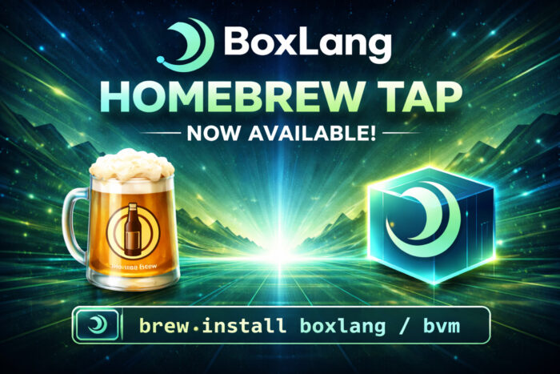

We're excited to announce the official **BoxLang Homebrew tap** --- the easiest way to get BoxLang up and running on macOS (and Linux with Homebrew). One command, and you're in business.

### Getting Started

First, make sure you have [Homebrew installed](https://brew.sh/ "Homebrew installed"), then add our tap:

```java
brew tap ortus-boxlang/boxlang
```

From there, choose your installation path.

## Option 1: BVM --- BoxLang Version Manager

If you want to manage multiple BoxLang versions side by side, **BVM** is your tool.

```java
brew install ortus-boxlang/boxlang/bvm
```

Then install and activate BoxLang:

```java
bvm install latest
bvm use latest
boxlang --version
```

BVM makes it trivial to switch between stable and snapshot releases, list installed versions, and stay on the cutting edge --- or the stable path --- depending on your project needs.

## Option 2: Quick Installer --- Zero Friction Setup

Prefer a single-step setup? The **BoxLang Quick Installer** formula gets you the runtime and MiniServer in one shot.

```java
brew install ortus-boxlang/boxlang/boxlang
install-boxlang
```

Need Java? No problem:

```java
install-boxlang --with-jre
```

Installing for all users on a machine?

```java
sudo install-boxlang --system
```

After installation, add BoxLang to your path:

```java
export PATH="$HOME/.local/bin:$PATH"
```

Then fire it up:

```java
boxlang               # Launch the REPL
boxlang-miniserver    # Start the MiniServer
```

## Always Up to Date

Our tap ships with automated GitHub Actions that update the formulas daily and immediately after every new release. That means `brew upgrade` always pulls the latest installer. And since the formulas install the installer tool --- not a pinned runtime --- you stay in control of which BoxLang version you run.

## Ready to Try It?

Whether you're building web apps, automation scripts, or exploring a modern JVM language, BoxLang is now just a `brew install` away.

👉 [BoxLang Homebrew Tap on GitHub](http://https://github.com/ortus-boxlang/boxlang "BoxLang Homebrew Tap on GitHub") 👉 [Full Documentation](http://https://boxlang.ortusbooks.com/ "Full Documentation")
