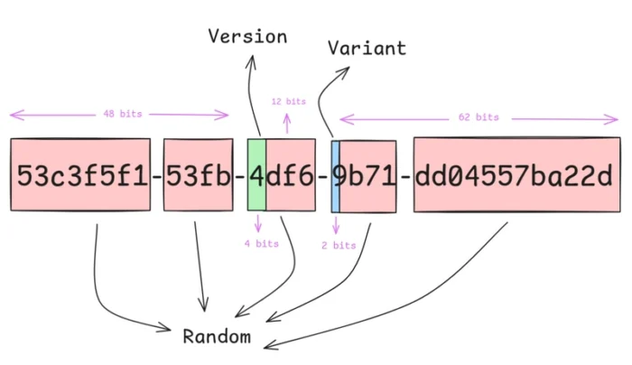

This article was first published in my personal blog: [Java 26: What's new?](https://www.loicmathieu.fr/wordpress/informatique/java-26-whats-new/) and is part of a serie on [what's new on the last versions of Java](https://www.loicmathieu.fr/wordpress/tag/whatsnew/)).

Now that Java 26 is features complete (Rampdown Phase Two at the day of writing), it's time to walk through all the functionalities that bring to us, developers, this new version.

After Java 25 and its 18 JEPs, Java 26 arrives with a small number of JEPs, 10, with very few new features.

JEP 500: Prepare to Make Final Mean Final {#h2-0-jep-500-prepare-to-make-final-mean-final}
------------------------------------------------------------------------------------------

A final field is supposed to never be modified after its initialization.  

Unfortunately, deep reflection makes it possible to access a final field and then modify it using the `Field.setAccessible(true)` method.  

Modifying a final field breaks the integrity of the JVM because it goes against the developer's intention, with all the security risks that this can entail.

In addition, certain JVM optimizations cannot be applied to final fields, such as *constant folding* by the Just In Time compiler (JIT), an optimization that evaluates a constant expression only once rather than each time it is used.

Records already prohibit the modification of final fields.

JEP 500 will issue a warning in the JVM logs the first time a final field is modified via deep reflection.

<pre class="EnlighterJSRAW" data-enlighter-language="generic" data-enlighter-theme="" data-enlighter-highlight="" data-enlighter-linenumbers="" data-enlighter-lineoffset="" data-enlighter-title="" data-enlighter-group="">WARNING: Final field f in p.C has been [mutated/unreflected for mutation] by class com.foo.Bar.caller in module N (file:/path/to/foo.jar)
WARNING: Use --enable-final-field-mutation=N to avoid a warning
WARNING: Mutating final fields will be blocked in a future release unless final field mutation is enabled</pre>

This can be controlled via the JVM option `--illegal-final-field-mutation`, which can take the following values:

* `allow`: allows final fields to be modified.
* `warn`: issues a warning in the JVM logs the first time a final field is modified; this is the default behavior in Java 26.
* `debug`: same as `warn` but also includes the stack trace.
* `deny`: prohibits modification of final fields.

A future release of Java will change the default behavior to `deny`.

It is possible to selectively allow modification of final fields via the JVM option `--enable-final-field-mutation=M1,M2`, which takes as a parameter the list of modules to be allowed.

More information in [JEP 500](https://openjdk.org/jeps/500).

JEP 504: Remove the Applet API {#h2-1-jep-504-remove-the-applet-api}
--------------------------------------------------------------------

Removes the applet API, which had been deprecated for removal in Java 17.

Current browsers have not supported applets for a long time anyway.

More information in [JEP 504](https://openjdk.org/jeps/504).

JEP 516: Ahead-of-Time Object Caching with Any GC {#h2-2-jep-516-ahead-of-time-object-caching-with-any-gc}
----------------------------------------------------------------------------------------------------------

JEP 483: \[Ahead-of-Time Class Loading \& Linking\] (<https://openjdk.org/jeps/483>) introduced in Java 24 the ability to create an AOT (Ahead of Time) cache containing the classes already loaded and linked by an application to improve its startup time.

This was enhanced in Java 25 with method profiling information via [JEP 515: Ahead-of-Time Method Profiling](https://openjdk.org/jeps/515).

In Java 26, this cache has been improved to store objects in a GC-agnostic manner, enabling support for all GCs, and above all, the use of an AOT cache by a JVM using a different GC than the one used when the cache was created.

More information in [JEP 516](https://openjdk.org/jeps/516).

JEP 517: HTTP/3 for the HTTP Client API {#h2-3-jep-517-http-3-for-the-http-client-api}
--------------------------------------------------------------------------------------

JEP 517 adds support for **HTTP/3** in the JDK HTTP client.

The JDK HTTP client still uses HTTP/2 by default.

To use HTTP/3, you must select this version when creating the HTTP client:

<pre class="EnlighterJSRAW" data-enlighter-language="generic" data-enlighter-theme="" data-enlighter-highlight="" data-enlighter-linenumbers="" data-enlighter-lineoffset="" data-enlighter-title="" data-enlighter-group="">var client = HttpClient.newBuilder()
               .version(HttpClient.Version.HTTP_3)
               .build();</pre>

More information in [JEP 517](https://openjdk.org/jeps/517).

JEP 522: G1 GC: Improve Throughput by Reducing Synchronization {#h2-4-jep-522-g1-gc-improve-throughput-by-reducing-synchronization}
-----------------------------------------------------------------------------------------------------------------------------------

**G1** is the default garbage collector (GC), but it sometimes performs less well than **ParallelGC** because, in order to perform part of its work concurrently with the application, it needs to share CPU resources with application threads and coordinate with them.

JEP 522 increases both application throughput and latency by reducing the amount of synchronization required between application threads and GC threads. More specifically, G1's *write barrier* has been modified to no longer synchronize on the *card table* by adding a second *card table* . Without going into too much detail, the *write barrier* is a piece of code called each time an object reference is stored in a field, allowing G1 to track allocations without stopping application threads. Removing this synchronization will reduce the cost of G1 for each write and thus improve application throughput.

More information can be found in [JEP 522](https://openjdk.org/jeps/522).

UUIDv7 support {#h2-5-uuidv7-support}
-------------------------------------

The new `UUID.ofEpochMillis(long)` method allows you to create a **type 7 UUID** (UUIDv7) from a Unix Epoch timestamp.

 

UUIDv7s are created by assigning a Unix timestamp in milliseconds to the most significant 48 bits, assigning the required version (4 bits) and variant (2 bits), and filling the remaining 74 bits with random bits.

The main feature of UUIDv7 is that they are monotonic (each subsequent value is greater than the previous value). This is because the timestamp value is part of the UUID.

The big advantage of UUIDv7 is that they are naturally sortable, making them a good choice for database identifiers and filling one of the gaps in previous versions of UUID. They remain 128 bits long, so they are compatible with previous UUID type fields.

Features coming out of preview {#h2-6-features-coming-out-of-preview}
---------------------------------------------------------------------

The following features comes out of preview (or incubator module) are now standard features:

***None!***

This is rare enough to warrant highlighting. Some of the features that have been in preview for a long time are on hold pending the Valhalla project.

Features that remain in preview {#h2-7-features-that-remain-in-preview}
-----------------------------------------------------------------------

The following features remain in preview (or in the incubator module).

* [JEP 524](https://openjdk.org/jeps/524) - **PEM Encodings of Cryptographic Objects** : second preview, new API that brings support for the Privacy-Enhanced Mail (PEM) format to Java. Some changes in the API, but the `PEMEncoder` and `PEMDecoder` classes still offer the same API.
* [JEP 525](https://openjdk.org/jeps/525) - **Structured Concurrency**: sixth preview, new API that simplifies writing multithreaded code by allowing multiple concurrent tasks to be treated as a single processing unit. A few minor changes.
* [JEP 526](https://openjdk.org/jeps/526) - **Lazy Constants**: second preview, new API for creating constants that are initialized on demand.
* [JEP 529](https://openjdk.org/jeps/529) - **Vector API**: eleventh incubation, API for expressing vector calculations that compile at runtime into vector instructions for supported CPU architectures. No change. It has been agreed in the JEP that the Vector API will remain in incubation until the Valhalla project features are available in preview. This was expected, as the Vector API will then be able to take advantage of the performance and memory representation improvements that the Valhalla project is expected to bring.
* [JEP 530](https://openjdk.org/jeps/530) - **Primitive Types in Patterns, instanceof, and switch** : fourth preview, adds support for primitive types in `instanceof` and `switch`, and enriches pattern matching to support primitive type patterns: in `instanceof`, in `switch` cases, and in record deconstruction. Two changes: improvement of the definition of [unconditional exactness](https://openjdk.org/jeps/530#Safety-of-conversions) and application of stricter [dominance](https://openjdk.org/jeps/530#Dominance) in switches, which may cause the compiler to reject more cases than before.

For details on these, please refer to my previous articles.

Miscellaneous {#h2-8-miscellaneous}
-----------------------------------

Various additions to the JDK:

* `Process.close()`: Closes all read and write streams and waits for the process to finish. In addition, `Process` now implements `AutoCloseable`, which means it can be used in a **try-with-resources** statement.
* `String.compareToFoldCase()` and `String.equalsToFoldCase()`: implementation of `equals` and `compareTo` that use Unicode **case folding**.
* `BigInteger.rootn()` and `BigInteger.rootnAndRemainder()`: Returns the nth integer root.
* `Duration.MAX` and `Duration.MIN`: maximum and minimum supported durations.
* `Instant.plusSaturating()`: Returns a copy of this instant plus the specified duration, with saturated semantics. If the result is before MIN, returns MIN; if the result is after MAX, returns MAX; otherwise, returns `plus()`.
* `ThreadLocalRandom.nextGaussian()`: Returns a pseudo-randomly selected double from a Gaussian distribution.
* `Comparator.min(Object, Object)` and `Comparator.max(Object, Object)`: Returns the smallest or largest object between the two objects passed as parameters.
* `HttpRequest.BodyHandlers.ofFileChannel()`: Returns a `BodyHandler` from a `FileChannel`.

All of the new APIs in JDK 26 can be found in [The Java Version Almanac -- New APIs in Java 26](https://javaalmanac.io/jdk/26/apidiff/25/).

Internal changes, performance, and security {#h2-9-internal-changes-performance-and-security}
---------------------------------------------------------------------------------------------

Like all new versions of Java, OpenJDK 25 contains a number of performance optimizations and security enhancements.

In terms of performance, there are no major changes, but quite a few minor ones. I noticed this one, which improves the performance of `ArrayList.addAll()` by adding a fast path in cases where the collection itself is an `ArrayList` that will copy the underlying array. More information can be found in [PR #28116](https://github.com/openjdk/jdk/pull/28116).

On the security side, I haven't noticed anything yet, but I will update the article if necessary.

JFR Events {#h2-10-jfr-events}
------------------------------

Here are the new Java Flight Recorder (JFR) events for the JVM:

* `StringDeduplication`: no description.
* `FinalFieldMutation`: no description.

You can find all JFR events supported in this version of Java on the [JFR Events](https://sap.github.io/jfrevents/26.html) page.

Conclusion {#h2-11-conclusion}
------------------------------

We are clearly left wanting more, as this release brings very few new features and most of the features already in preview or incubator module remain so.  

However, we can note the support for HTTP/3 and UUIDv7, which are welcome additions for modern application development.

As always, we're eagerly awaiting the Valhalla project...

To see all the changes in Java 26, check out the [release notes](https://jdk.java.net/26/release-notes).
