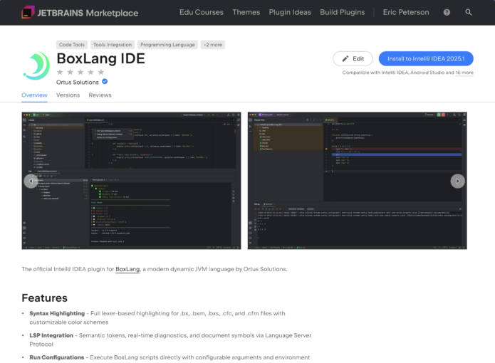
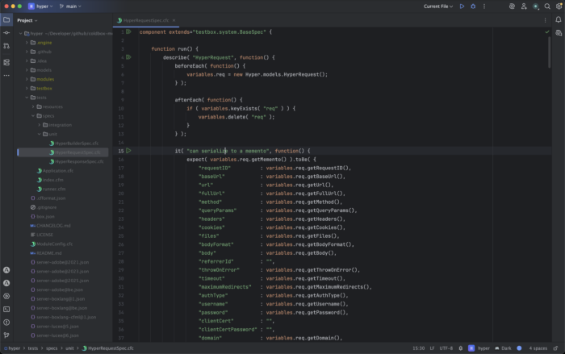
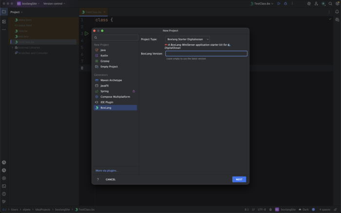
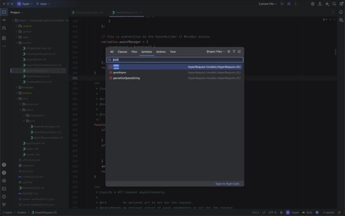
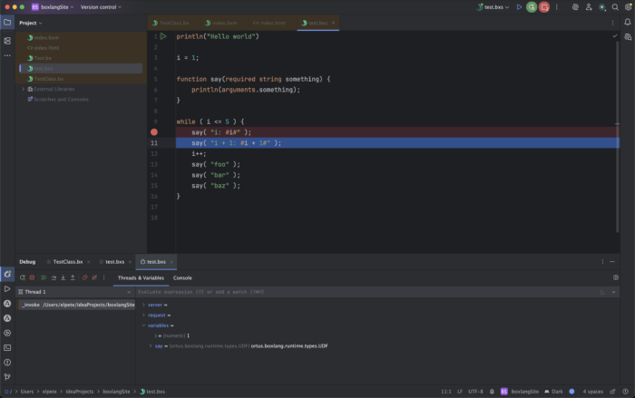
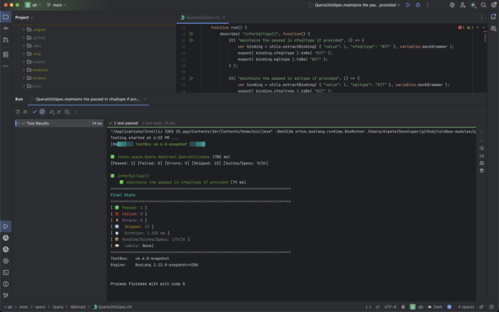

The IntelliJ ecosystem is one of the most powerful development environments for JVM developers. Today, we're excited to introduce [the official BoxLang IDE plugin for IntelliJ](http://https://plugins.jetbrains.com/plugin/30311-boxlang-ide "the official BoxLang IDE plugin for IntelliJ"), bringing modern BoxLang development directly into the JetBrains IDE family.

Whether you're building new BoxLang applications or maintaining existing CFML codebases, this plugin gives you first-class tooling inside IntelliJ.

## Installing the Plugin

Installing the plugin is easy from the JetBrains Marketplace.

* Open Settings → Plugins
* Search for BoxLang IDE
* Click Install
* Restart IntelliJ

Or install directly from the marketplace:

👉 <https://plugins.jetbrains.com/plugin/30311-boxlang-ide>

## Key Features

The IntelliJ plugin brings powerful development features for both **BoxLang and CFML developers.**

### 🎨 BoxLang Syntax Highlighting

Full syntax highlighting for BoxLang source files makes your code easier to read and maintain.

Features include:

* Tokenized syntax highlighting
* Language-aware formatting
* Support for modern BoxLang syntax

### 🧰 BoxLang Project Creation

Quickly bootstrap a new BoxLang project directly from the IntelliJ project wizard.

This allows you to:

* Create a new BoxLang application structure
* Configure runtimes quickly
* Start coding immediately

### 🧠 Language Server (LSP) Support

The plugin integrates with the BoxLang Language Server, enabling advanced development features:

* IntelliSense / code completion
* Hover documentation
* Go to definition
* Find references
* Inline diagnostics and errors

### 🐞 Debugging Support

Debug your BoxLang applications directly inside IntelliJ.

The plugin supports:

* Breakpoints
* Step-through debugging
* Variable inspection
* Call stack navigation

### 🧪 TestBox Integration

Run and debug TestBox tests without leaving your IDE.

Benefits include:

* Running tests from IntelliJ
* Viewing results inline
* Faster test-driven development workflows

### 🔵 CFML Syntax Highlighting

The plugin also includes **syntax highlighting for CFML**, making it easier to work in mixed environments.

This is particularly useful for teams that are:

* Migrating CFML applications to BoxLang
* Maintaining legacy codebases
* Working with hybrid projects

## Designed for the JVM Ecosystem

BoxLang is built for the JVM and integrates naturally with Java-based tooling and workflows.

That means IntelliJ users get:

* Familiar workflows
* Powerful navigation
* Rich plugin ecosystem
* Seamless integration with JVM tooling

## Get Started Today

Ready to try BoxLang in IntelliJ?

👉 Install the plugin:  
<https://plugins.jetbrains.com/plugin/30311-boxlang-ide>

👉 Learn more about BoxLang:  
<https://boxlang.io>

## Feedback Welcome

We're actively improving the plugin and [would love your feedback.](http://https://ortussolutions.atlassian.net/jira/software/c/projects/BLIDE/boards/132?search_id=c5d57cde-72a5-400c-b8ee-32b5fe3c8a6f "would love your feedback.")

* Open issues
* Submit feature requests
* Contribute improvements

Let's make **BoxLang development on IntelliJ world-class.**
