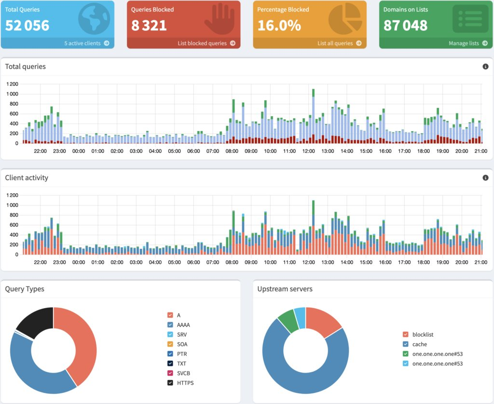
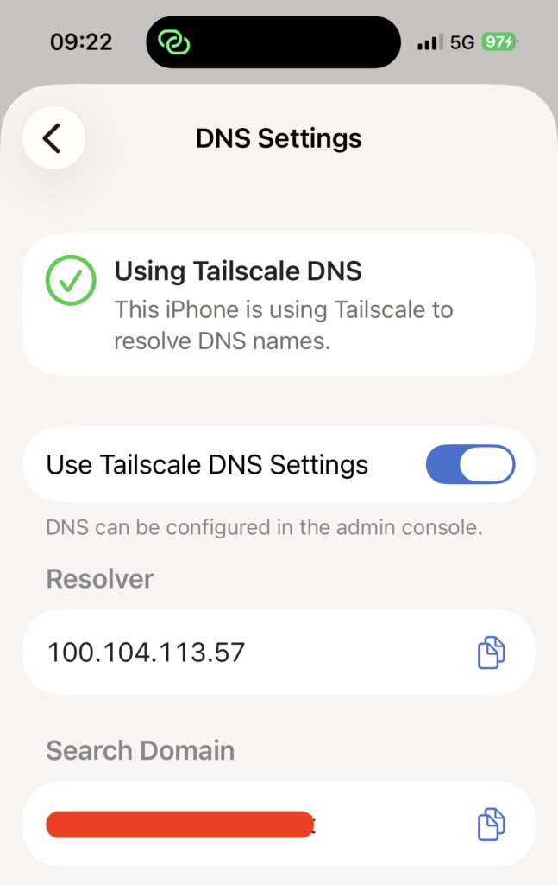
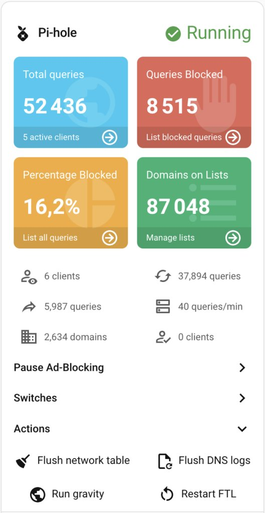

As I age, I become increasingly cautious about my privacy. The slope the world is sliding on is also a big, unfortunate incentive. I have been eying Pi-hole for some time: in this post, I want to explain what it does, how to install it on a [Raspberry Pi](https://www.raspberrypi.com/), and how to integrate it with [Tailscale](https://tailscale.com/).

## My take on privacy

Privacy, or more specifically *digital privacy*, is the ability to protect oneself from the constant data collection by legitimate companies and malicious actors alike when online. Given that going online represents the bulk nowadays, if not the entirety, of one's activity on a digital system, it's a constant battle. Moreover, some places are more or less inclined to protect their people's privacy. I'm quite safe in the European Union, and my Californian friends enjoy a similar level of privacy by law.

Other countries range from the bad to the none. Worse, most companies located in non-regulated countries either don't know, don't care, or don't risk much.

I have been using ad blockers for ages, but they represent only a tiny bit of a larger picture. First, marketers have been using techniques that allow profiling people without cookies, using hardware and software data that browsers leak. Second, in this day and age, not all requests go through your browser. I'm using Claude Code and a couple of other coding assistants a lot. I'm working on [Home Assistant](/focus/home-assistant/) as well.

Let's face some hard truths: it would require near-infinite effort to benefit from 100% privacy. My objective is much more limited. I only want to increase my overall privacy settings, making the task of data hoarders more complicated.

## Introduction to Pi-hole

[Pi-hole](https://pi-hole.net/) is one of the many tools available that can improve your privacy. It operates as a proxy, which points to a "real" DNS. You point your devices to it, and it filters out domains that are considered privacy threats.
> The Pi-hole® is a DNS sinkhole that protects your devices from unwanted content, without installing any client-side software.
>
> * **Easy-to-install**: our versatile installer walks you through the process and takes less than ten minutes
> * **Resolute** : content is blocked in *non-browser locations*, such as ad-laden mobile apps and smart TVs
> * **Responsive**: seamlessly speeds up the feel of everyday browsing by caching DNS queries
> * **Lightweight**: runs smoothly with minimal hardware and software requirements
> * **Robust**: a command-line interface that is quality assured for interoperability
> * **Insightful**: a beautiful responsive Web Interface dashboard to view and control your Pi-hole
> * **Versatile** : can optionally function as a DHCP server, ensuring *all* your devices are protected automatically
> * **Scalable**: capable of handling hundreds of millions of queries when installed on server-grade hardware
> * **Modern**: blocks ads over both IPv4 and IPv6
> * **Free** : open-source software which helps ensure *you* are the sole person in control of your privacy
>
> — [Pi-hole](https://docs.pi-hole.net/)

The [documentation for installing Pi-hole](https://github.com/pi-hole/pi-hole/#one-step-automated-install) is clear, and I won't paraphrase it.

However, we will use Tailscale later: **don't configure your router to have DHCP clients use Pi-hole as their DNS server** as is stated in the post-install section.

After a few days, you'll get something similar to the following dashboard:



## Blocking more domains

Pi-hole comes with a [pre-configured list of blocked domains](https://github.com/StevenBlack/hosts), so you don't need to start from scratch. However, you can add other lists. The GitHub repository provides lists for several categories, *i.e.*, at the time of this writing: fake news, gambling, porn, and social. This way, you can not only preserve your privacy, but also prevent the usage of certain categories. You can either replace the default list with a unified list to encompass all you want to block or add only deltas.

Note that Pi-hole doesn't use the list directly, but in a database named Gravity. I assume that it's an in-memory index used for performance reasons. Every time you change your block/allow lists, you **must** rebuild the database.

```
[✓] DNS resolution is available

[i] Neutrino emissions detected...

[✓] Preparing new gravity database
[✓] Creating new gravity databases
[✓] Pulling blocklist source list into range
[i] Using libz compression

[i] Target: https://raw.githubusercontent.com/StevenBlack/hosts/master/hosts
[✓] Status: Retrieval successful
[✓] Parsed 78995 exact domains and 0 ABP-style domains (blocking, ignored 1 non-domain entries)
    Sample of non-domain entries:
      - fe80::1%lo0

[i] Target: https://raw.githubusercontent.com/StevenBlack/hosts/master/alternates/fakenews-gambling-porn-only/hosts
[✓] Status: Retrieval successful
[✓] Parsed 84574 exact domains and 0 ABP-style domains (blocking, ignored 0 non-domain entries)

[✓] Building tree
[i] Number of gravity domains: 163569 (163557 unique domains)
[i] Number of exact denied domains: 1
[i] Number of regex denied filters: 0
[i] Number of exact allowed domains: 0
[i] Number of regex allowed filters: 0
[✓] Optimizing database
[✓] Swapping databases
[✓] The old database remains available
[✓] Cleaning up stray matter

[✓] Done.
```

## Pi-hole and Tailscale

As for Pi-hole, installing Tailscale on the Pi is [pretty well documented](https://tailscale.com/download/linux/rpi-stretch). Choose your existing distro, and you're good. Your Pi should now be part of your Tailscale mesh.

Remember that after installing Pi-hole, we deliberately skipped configuring the router's DNS to point to it. We will configure Tailscale's DNS instead. Write down the Pi's IP on the Tailscale's mesh; it's the one in front of the `tailscale0` interface.

```bash
ip -br addr show
```

```
lo           UNKNOWN  127.0.0.1/8 ::1/128
eth0         DOWN
wlan0        UP       192.168.1.144/24 fe80::10cf:1eda:287f:e6b5/64
tailscale0   UNKNOWN  100.104.113.57/32 fd7a:115c:a1e0::a633:7139/128 fe80::67be:7ca7:aa03:3f58/64 # 1
docker0      DOWN     172.17.0.1/16
```

1. The Pi's IP in Tailscale is `100.104.113.57`

Now, go to **DNS** and locate the **Nameservers** section. Enable the **Override DNS Servers** and set the Pi-hole's IP.

Do not add other nameservers! Domains are resolved in turn: if the Pi-hole blocks some domain resolution, Tailscale will try with the DNS you added; it defeats the purpose.

The only thing you need to do on client devices is to use Tailscale DNS Settings in the Tailscale application. You need no other tiresome device-per-device configuration. Here's the screenshot of the settings screen on the iPhone:



## Bonus: Pi-hole in Home Assistant

I discovered by chance that an integration with Home Assistant is available via the [Home Assistant Community Store](https://www.hacs.xyz/). is an add-on that allows installing third-party integrations and UI elements in Home Assistant.

* The base integration is [Pi-hole V6 Integration for Home Assistant](https://github.com/bastgau/ha-pi-hole-v6)
* The card is [Pi-hole Card](https://github.com/homeassistant-extras/pi-hole-card/)

With both, you can display a summary of the above dashboard inside your Home Assistant GUI.



## Conclusion

In this post, I showed how to make a step toward greater privacy by using Pi-hole behind Tailscale. It's only a small effort, but it yields me great benefits. Please share your own tricks!

**To go further:**

* [Pi-hole](https://pi-hole.net/)
* [Tailscale](https://tailscale.com/)
* [Headscale, a self-hosted Open Source Tailscale implementation](https://headscale.net/)
* [The Home Assistant Community Store](https://www.hacs.xyz/)
* [Pi-hole V6 Integration for Home Assistant](https://github.com/bastgau/ha-pi-hole-v6)
* [Pi-hole card for Home Assistant](https://github.com/homeassistant-extras/pi-hole-card)

*Originally published at [A Java Geek](https://blog.frankel.ch/pi-hole-tailscale/) on March 8^th^, 2026.*

*[DNS]: Domain Name Server
*[HACS]: Home Assistant Community Store
