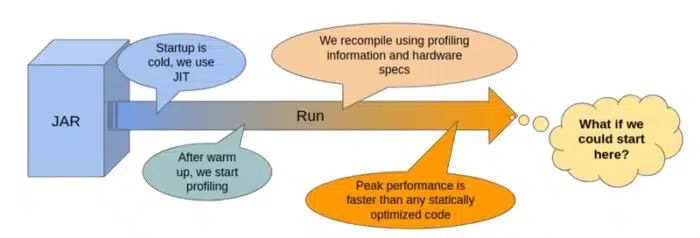
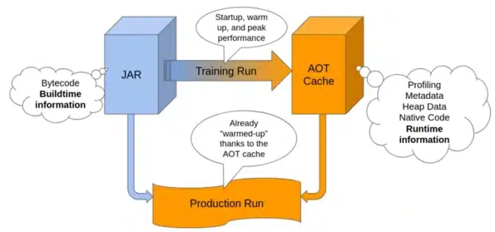

In this series of 3 blog posts we will explain how OpenJDK project Leyden is helping to improve a specific area of performance where Java has notably lagged behind other languages i.e. application 'startup', 'warmup', and 'initial footprint'.

Part 1 explains what those terms mean and why Java faces challenges in matching the behaviour of other languages. It then provides an overview of what Leyden has done to improve startup and warmup in existing JDK releases and what is planned for upcoming releases.

Part 2 describes how to use the new capabilities offered by Leyden and presents test results which show that very significant progress has already been made and is set to continue.

Part 3 provides a more detailed account of how Leyden's proposed solution operates and presents a first look at tooling that allows you to assess the benefits that result and tune your application to make the most of what Leyden offers.

## A Brief History of Java Performance

Java has been one of the most popular programming object-oriented languages for decades. Its success relies heavily on the fact that it offers a *portable, managed runtime* that makes it easy and safe to resolve many common programming challenges. In particular, Java was the first portable language to make it straightforward for programmers to deliver multi-threaded applications which allocate and manage storage at runtime without risk of invalid memory accesses.

The fact that Java remains popular still surprises some programmers, given that it belongs to the family of dynamic languages that, most notably, includes Lisp, Smalltalk and Self. Dynamic languages allow their code base to be incrementally defined as the program executes. That code base is often implemented using a language-specific virtual machine. Dynamic languages were traditionally executed by interpreting either the source code or an intermediate bytecode derived from the source. This often caused lower performance than native-compiled, non-dynamic languages.

However, modern Java runtimes rely on powerful 'just-in-time' (JIT) compilers to translate bytecode to native machine code at runtime. JIT compilation, a technique originally tried in Smalltalk nearly 40 years ago, has improved Java performance by orders of magnitude from the early days of an interpreter-only runtime. The use of runtime execution profiling supports *feedback directed optimization* and *speculative optimization*. This has allowed Java JIT compilers to achieve peak performance that far exceeds what can be achieved with programs that are compiled ahead-of-time (AOT).

### Why Java takes time to reach peak performance

The downside of dynamic class loading and JIT compilation is that a Java runtime takes some time to achieve this impressive peak performance.

When a new Java application is launched, it is normally a 'cold start'. Details of all the classes and methods the application needs to use are only available in a compact bytecode representation, stored on disk either in application supplied class files or embedded in the Java platform's jmod files.The Java Virtual Machine (JVM) has to parse and unwrap this bytecode, constructing its own 'metadata' model of the class and method base, one that the interpreter and compiled code can efficiently operate over. It also has to set the base state of each loaded class, running Java 'static init' code to populate the class's static fields, before it can execute any of the class's methods.

In addition, the JVM has to perform *dynamic linkage* . When compilation or execution of a Java method first encounters a call (invoke bytecode) or a data access (get/putfield bytecode) the JVM has to *link* that call or data access site. That involves replacing references to the target class and method/field, which occur as symbol names in the bytecode, with a direct memory reference. This identifies first the target metadata class, and then the target metadata method or field. If the target class has not yet been encountered during execution, this linking step may trigger further bytecode loading, parsing, and class initialization.

The JVM normally starts off executing Java methods in the interpreter. Of course, it could always execute native code, compiling the Java method bytecode either immediately at load or lazily at first call. However, compilation takes time to complete so it is normally better done in the background while proceeding to interpret. Indeed, JIT compilation frequently pays off more when done selectively. Methods that only get called once or twice can take more cycles to compile than to simply interpret the bytecode.

Furthermore, without runtime execution profile data as input, the compiler is unable to make informed, *feedback-directed* optimizations that significantly improve performance of the compiled code. Most importantly, it cannot simplify the compiled code by *speculating* that previous execution patterns will continue, replacing code that lies on untaken 'cold' branches with traps. Speculative compilation, an optimization first used in the Self compiler over 30 years ago, reduces both the size and the complexity of bytecode that feeds into a specific compilation. That, in turn, enables deep inlining of method calls and offers the possibility to identify many more derived optimizations. The rare case where a trap on a cold branch gets executed is handled by *deoptimizing* i.e. jumping back into the interpreter and recompiling the method with an updated branch profile.

## Housekeeping considered harmful

During early stages of application execution, the JVM housekeeping overheads listed above are at their highest. Class loading and initialization, class linking, and recording of method execution profile data occur frequently as side effects of execution, for both application and JDK runtime methods, impeding direct forward progress of the application. Method compilation proceeds in dedicated, background compiler threads, but this still steals CPU cycles, once again, impeding application progress.

The impedance of JVM housekeeping work gradually decreases, as more and more of the required JDK code and application code is gradually linked into the runtime. At the same time delivery of compiled code improves application execution speed incrementally.

After some time, a steady state is reached where most or all classes are loaded and linked, most or all methods have been profiled, and all 'hot' methods have been compiled with highly efficient code. Very occasionally variation in input data or a phase change in program behaviour drives the application down a cold path, triggering deoptimization and incurring extra JVM overheads. However, by and large, applications mostly warm up and continue to run with steady peak performance.

## Leyden Project 'premain' Experiment

Project Leyden has been experimenting with reducing the impedance of JVM house keeping tasks in [the 'premain' branch of the project repository](https://github.com/openjdk/leyden/tree/premain). The observation that drives the Leyden premain experiment is that, most of the time, the housekeeping operations that occur during an application run involve doing exactly or almost exactly the same work with the same result, certainly in the early stages where the impedance is high. On every run a lot of the same byecode gets loaded and linked, the same classes get initialized, the same methods turn out to be hot, and end up getting compiled with the same or very similar profile information.

This is especially true for the JDK runtime code that runs before entering the application main method, likewise for JDK library code that the application calls out to. The JVM will always load base classes like java.lang.Object, java.lang.Class, or java.util.String. The same String instances, hard coded as literals in JDK methods, are added to the heap on every single run. Container classes like List and HashTable are commonly reused for the same purposes.

JDK classes are fixed for any given release so their class, method and field metadata will always be the same and they will always cross-reference each other (i.e. be linked) in exactly the same way. In fact the Leyden premain branch gets its name from its original focus, which was optimizing this JDK execution that happens before entering application main.

The idea of profiting from this *identity* of JDK metadata across runs is not new. Since JDK13 [Class Data Sharing (CDS)](https://docs.oracle.com/en/java/javase/25/vm/class-data-sharing.html) has been able to optimize away class loading and bytecode parsing for JDK classes by storing the JVM's metadata model of the JDK classes in a CDS archive, allowing it to be reloaded 'oven-ready' on subsequent runs.

That version of CDS provided an effective, albeit limited, limited warm-start capability for the JDK, halving the time taken for the JDK to start up i.e. complete JDK initialization and enter the application main routine. CDS also helped application warmup by lowering initial costs involved in callouts to JDK library code.

With application classes there is no strong guarantee that the same classes will be present in the same format between one run and the next. Or that classes loaded and used on one run will always be loaded and used in the same way on subsequent runs. However, so long as the same jars appear in the classpath and the class bytecode is loaded without runtime-specific agent transformations, then it is possible and, for many classes, quite probable that saved metadata will be reusable.

More recent versions of CDS have supported save and restore metadata for application classes via a dynamic CDS archive, allowing the JVM to bypass loading and bytecode parsing costs for those classes on subsequent runs, improving both application startup and warmup.

Leyden's premain branch builds on this success but it is addressing a bigger prize than just archived metadata. The broader internal JVM state --- not just metadata but static field data, linkage data, method profiles, compiled code --- which is slowly constructed during warmup, may vary depending on precisely what happens on each run. However, most of what is created on one run, if it could be saved in an archive -- as CDS currently does with metadata, ought to be reusable on a subsequent run, short circuiting the housekeeping overheads normally incurred to create it.

Even if some saved state might turn out not to be useful, because, say, a class was not referenced or a method not called in the subsequent run, the ability to reuse some of the state should still pay off. The cost of reloading the required state can be made much lower than the cost of recreating, meaning the application can reach peak performance earlier, with less impedance from the JVM. The more reusable state that can be saved the greater the reduction in impedance.

### Training and Production Runs

So, the basic idea behind is to run your application twice:

1. Training Run: in which we cache the metadata, the profiling statistics, some heap data, compiled code,...
2. Production Run: loads the previously (ahead of time) cached information, so the run starts hot. This is the "real" run in which we make use of our app.

Of course, this only makes sense if the training run accurately represents the production run.

To achieve this, we need to respect the following constraints:

* Same Hardware: Or the compiled code may not be able to run, and the optimizations made may even be against performance in our production run.
* Same Java version and source code: If we change the source code, anything cached related to the source code gets deprecated and becomes useless.
* Same Operative System Family: There are pieces of the JVM that behave differently on Linux, Windows or MacOS. We can't just reuse our cached information if we change it.
* Same JVM options (mostly): We could maybe change some JVM options (like use a different garbage collector). But then, profiling statistics that we cache, and information about how the application behaves, may no longer be valid to our new configuration. Better not to play with these settings.
* \[optional\] No Custom Classloaders: The cache will ignore (for now) the classes loaded with a custom classloader. This means that part of the application will not be hot when run for the second time.

Some of the AOT improvements developed in the Leyden branch have already been made available in the latest JDK LTS version at the moment of writing this article (25). But the plan for subsequent releases is that more features will be migrated, more things will be cached, and the performance gains will get better and better. The performance gains strongly depend on your app usage, the JDK version you are using, and how good is the training you are doing.

In the next post we will explain how to use the new AOT capabilities that are available in both JDK25. We will also present test results which show that very significant progress has already been made and is set to continue on capabilities already present in JDK 26 and on.
