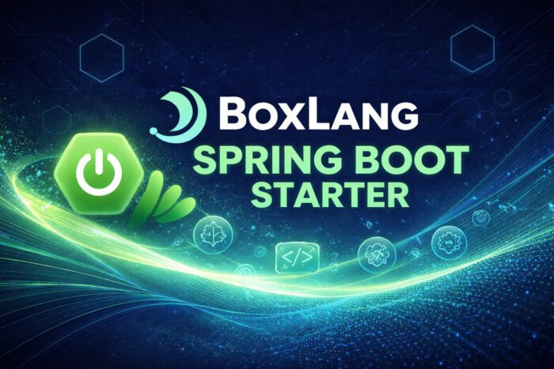

Spring Boot developers know the pain of evaluating view technologies. Thymeleaf is great — until you need more expressiveness. FreeMarker is powerful — until the syntax fights you. What if you could write templates in a dynamic JVM language that gives you the full power of the platform, feels natural, and requires zero setup to integrate?

Meet the **BoxLang Spring Boot Starter.**

**TL;DR:** Drop one dependency into your Spring Boot 3 app and start writing dynamic `.bxm` templates powered by BoxLang — a modern, expressive JVM language. Zero configuration. Full web scopes. 100% Java interoperable. Not only that, you get full access to BoxLang's framework capabilities so you can integrate tons of features into your Spring Boot applications:

* Human \& Fluent Scheduled Tasks
* Enterprise Caching Engine
* Cache Aggregator
* Enhanced Concurrency BoxFutures
* Attempts
* Data Navigators
* And so much more

Not only that, it is completely documented for you:

* <https://boxlang.ortusbooks.com/getting-started/running-boxlang/spring-boot>
* <https://boxlang.ortusbooks.com/boxlang-language/templating-language>

## 🌐 What is BoxLang?

**BoxLang** is a modern dynamic JVM language purpose-built for rapid application development. Think of it as what you'd get if Java's runtime, a scripting language's expressiveness, and a templating engine had a very productive meeting.

Key highlights:

**☕ 100% Java interoperable** — call any Java class, library, or Spring bean directly  
**🔩 Compiles to JVM bytecode** — same performance guarantees you expect  
**🚀 Multi-runtime** — run it on OS, Servlet containers, AWS Lambda, and more  
**🎨 Modern syntax** — expressive, clean, and productive

```java
// Access the BoxLang runtime directly from any Spring-managed bean
BoxRuntime runtime = BoxRuntime.getInstance();
```

## ✨ Zero-Config Spring Boot Integration

The starter follows Spring Boot's auto-configuration philosophy religiously. Add the dependency and you're done. No `@EnableBoxLang`. No manual bean registration. No XML.

### GradleGradle

```java
dependencies {
    implementation 'io.boxlang:boxlang-spring-boot-starter: 1.0.0'
}
```

Maven

```java
<dependency>
    <groupId>io.boxlang</groupId>
    <artifactId>boxlang-spring-boot-starter</artifactId>
    <version>1.0.0</version>
</dependency>
```

Spring Boot's auto-configuration mechanism detects the starter on the classpath and wires `BoxLangViewResolver`, starts the `BoxRuntime` lifecycle, and registers all required beans automatically. Read more in our docs: <https://boxlang.ortusbooks.com/getting-started/running-boxlang/spring-boot>

## 🚀 From Controller to Template in Minutes

Your Spring MVC controllers stay exactly as they are. Return a view name, add model attributes — BoxLang handles the rest.

```java
@Controller
public class HomeController {

    @GetMapping("/")
    public String home(Model model) {
        model.addAttribute("title", "Hello from BoxLang + Spring Boot!");
        model.addAttribute("framework", "Spring Boot 3");
        return "home"; // resolves to classpath:/templates/home.bxm
    }
}
```

Then write your template in `src/main/resources/templates/home.bxm`:

```java
<bx:output>
<!DOCTYPE html>
<html lang="en">
<head>
    <title>#variables.title#</title>
</head>
<body>
    <h1>#title#</h1>
    <p>Framework: #framework#</p>
    <p>Rendered at: #dateTimeFormat( now(), "full" )#</p>
</body>
</html>
</bx:output>
```

Every attribute you add via `model.addAttribute(...)` is automatically injected into the BoxLang `variables` scope. No extra mapping, no boilerplate.

## 🌐 Full Web Scopes — Out of the Box

Unlike most view engines that only expose model data, BoxLang templates have access to the complete set of HTTP scopes natively, and the entire request/response servlet contexts.

|    Scope    |                     Description                      |
|-------------|------------------------------------------------------|
| `variables` | Spring `Model` attributes + template-local variables |
| `url`       | Query string parameters                              |
| `form`      | Form POST data                                       |
| `cgi`       | Server/CGI environment variables                     |
| `cookie`    | HTTP cookies                                         |
| `request`   | Per-request scoped storage                           |

```java
<bx:output>
    <!-- Spring model attribute -->
    <p>#variables.title#</p>

    <!-- URL query param with default -->
    <p>Page: #url.page ?: 1#</p>

    <!-- Cookie with fallback -->
    <p>Theme: #cookie.theme ?: "light"#</p>
</bx:output>
```

## 🔥 Hot-Reload During Development

Switch to a `file`: prefix in a dev Spring profile and template edits take effect on the next request — no restarts required.

`src/main/resources/application-dev.properties `

```java
boxlang.prefix=file:src/main/resources/templates/
boxlang.debug-mode=true
```

Activate it:

```java
./gradlew bootRun --args='--spring.profiles.active=dev'
```

## ⚙️ Configuration That Stays Out of Your Way

All settings live under the `boxlang.*` namespace in `application.properties` or `application.yml`. Sensible defaults mean you only override what you need.

```java
boxlang:
  prefix: classpath:/templates/
  suffix: .bxm
  debug-mode: false
  # runtime-home: /app/.boxlang  # great for containers
```

You can also supply a `boxlang.json` config file at `src/main/resources/boxlang.json` for advanced language-level settings like locale, timezone, and logging.

## 🔀 Coexist With Any Other View Technology

`BoxLangViewResolver` integrates cleanly into Spring MVC's resolver chain. If a `.bxm` template doesn't exist for a given view name, it returns `null` and Spring falls through to the next resolver — meaning Thymeleaf, FreeMarker, and BoxLang can all live in the same application without conflict.

```java
# Lower number = higher priority in the resolver chain
boxlang.view-resolver-order=1
```

## 📋 Requirements

| Dependency  | Version |
|-------------|---------|
| Java        | 21+     |
| Spring Boot | 3.4.x+  |
| BoxLang     | 1.11.0+ |

## 🛠️ How It Works Under the Hood

For the curious Java developer:

* **Auto-configuration** registers via `META-INF/spring/org.springframework.boot.autoconfigure.AutoConfiguration.imports` --- the standard Spring Boot SPI.
* **`BoxRuntime`** starts as a `SmartLifecycle` at phase `Integer.MIN_VALUE + 100`, ensuring it's ready before the first HTTP request hits.
* **`BoxLangViewResolver`** resolves logical view names using `prefix + viewName + suffix`.
* **`BoxLangView`** wraps `HttpServletRequest`/`HttpServletResponse` in a `SpringBoxHTTPExchange`, builds a `WebRequestBoxContext` (exposing all web scopes), injects the Spring `Model` into the `variables` scope, executes the template, and flushes to the response.

Clean separation of concerns. No magic you can't trace.

## 🎯 Get Started

```java
git clone https://github.com/ortus-boxlang/boxlang-spring-boot-starter.git
cd boxlang-spring-boot-starter
./gradlew :test-app: bootRun
```

Open **<http://localhost:8080>** and see BoxLang rendering live in your Spring Boot app.

📚 Full documentation: [boxlang.ortusbooks.com](http://https://boxlang.ortusbooks.com/boxlang-language/templating-language "boxlang.ortusbooks.com")

🔌 VS Code Extension: [BoxLang VSCode Extension](http://https://marketplace.visualstudio.com/items?itemName=ortus-solutions.vscode-boxlang "BoxLang VSCode Extension")

## 💼 Professional Support

BoxLang is free and open source. Ortus Solutions offers commercial support, custom development, migration services, and enterprise modules for teams that need it.

👉 [boxlang.io/plans](http://https://boxlang.io/plans?_gl=1*t7sh11*_gcl_au*MTcyNjEzOTM1NC4xNzczNjU4NTg5*_ga*MTM1NDg0NTUwNS4xNzUwMDg1MDA1*_ga_663JFQ7YGX*czE3NzM5Mjc2NjckbzI2NCRnMCR0MTc3MzkyNzY2NyRqNjAkbDAkaDA. "boxlang.io/plans")
