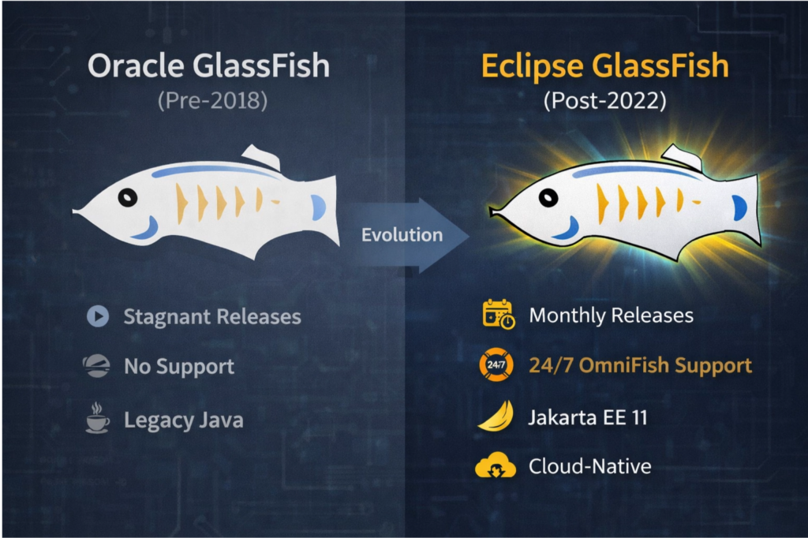
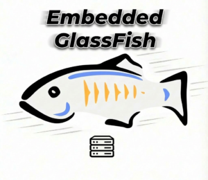

GlassFish is an application server with a long history and has always had a special role in the Java world as the reference implementation of Java EE, being one of the most popular Java EE servers. Since Oracle lost interest in the project several years ago, developers and organizations have held certain beliefs about GlassFish, often based on their experiences with older versions.

If you still think of GlassFish as a slow, unsupported, and purely for-development application server, it's time to take a fresh look. At OmniFish, we've been working hard to change that perception since 2022. The Eclipse GlassFish of today, particularly from version 7.0 onwards, is a completely different platform, and we're proud to show you what we've helped to build with the rest of the Eclipse GlassFish contributors.

This article explores the key differences between the modern Eclipse GlassFish and its predecessor, Oracle GlassFish and older Eclipse GlassFish versions. We'll show you how GlassFish has evolved into a robust, enterprise-grade platform with commercial support from our team at OmniFish, with frequent updates, and a strong commitment to modern Java standards and modern lightweight deployments. In short, this is no longer your father's GlassFish.

## The Myth of the Unsupported, Non-Production Server

One of the most persistent myths about GlassFish is that it's not suitable for production environments and lacks commercial support. This might have been a valid concern in the past, but it is no longer true. Since 2022 and GlassFish 7.0, the landscape has changed dramatically. **Eclipse GlassFish is now a production-ready, enterprise-grade platform** with active community, frequent releases, and**[commercial support with enterprise guarantees](https://omnifish.ee/glassfish-support/)** **from OmniFish**, a company which is actively involved in the project and leads most of the development.

We founded OmniFish because we believe in GlassFish's potential as a modern, enterprise-ready application server. We're committed to providing comprehensive long-term support for Eclipse GlassFish. Moreover, we actively steer the GlassFish project within the Eclipse Foundation, regularly adding new features and improvements

This level of support and active development means that the claim that GlassFish is not production-ready is **outdated** . Organizations can now **confidently deploy GlassFish in production**, knowing that they have a team of experts backing them up and continuously improving the platform.

## Key Differences: Eclipse GlassFish vs. Oracle GlassFish

To help you understand the evolution of GlassFish, let's briefly summarize the history of GlassFish and then compare the modern Eclipse GlassFish with the older Oracle GlassFish across several key areas.

There were multiple periods in the history of GlassFish::

* **Until 2012: Commercially supported Oracle GlassFish**
  * Last release was GlassFish 3.1.2.2, July 2012
* **2012-2022:** Opensource releases of GlassFish with no commercial support
  * First release of Payara, the most successful GlassFish fork: Payara 4.1.144, October 2014
  * **Last release from Oracle**: GlassFish 5.0, September 2017
  * First release from Eclipse Foundation: Eclipse GlassFish 5.1, January 2019
* **Since 2022 until now: Actively maintained GlassFish, commercially supported by OmniFish**
  * First production-ready release: Eclipse GlassFish 7.0, December 2022
  * Latest major release: Eclipse GlassFish 8.0, February 2026

And here's how the Eclipse GlassFish since 2022 (starting with GlassFish 7.0) compares to Oracle GlassFish before 2018 (until GlassFish 5.0):

|     **Feature**     |     **Oracle GlassFish (Pre-2018)**     |                                                                                           **Eclipse GlassFish (Post-2022)**                                                                                           |
|---------------------|-----------------------------------------|-----------------------------------------------------------------------------------------------------------------------------------------------------------------------------------------------------------------------|
| **Support**         | Limited to no active commercial support | **Active long-term support from OmniFish**                                                                                                                                                                            |
| **Release Cadence** | Infrequent, stagnant                    | **Frequent, monthly releases** with new features and fixes                                                                                                                                                            |
| **Java Support**    | Older Java versions                     | **Supports [modern Java versions](https://omnifish.ee/blog/glassfish-7-1-major-new-features-and-improvements/) (11 to 25)**                                                                                           |
| **Jakarta EE**      | Java EE                                 | **Jakarta EE 11 compliant** ([Web Profile](https://omnifish.ee/jakarta-ee-11-web-profile-released-enabled-by-eclipse-glassfish/) and Platform)                                                                        |
| **MicroProfile**    | Not available                           | **Several MicroProfile APIs** , including [Health, Config, Rest Client, and JWT](https://omnifish.ee/blog/glassfish-7-1-major-new-features-and-improvements/)                                                         |
| **Performance**     | Slower startup, less optimized          | **[Faster startup times](https://omnifish.ee/glassfish-startup-times/)**, improved JDBC throughput, and better resource management                                                                                    |
| **Security**        | Outdated security practices             | **Modern security features**, including PKCS12 keystores and fixes for recent CVEs                                                                                                                                    |
| **Cloud-Native**    | Not designed for cloud                  | **Cloud-ready** , with [Docker images](https://github.com/eclipse-ee4j/glassfish.docker/wiki) and a lightweight [microservices distribution](https://omnifish.ee/run-your-apps-with-glassfish-from-the-command-line/) |
| **Community**       | Stagnant                                | **[Growing community](https://github.com/eclipse-ee4j/glassfish/graphs/contributors?from=12%2F20%2F2021&to=3%2F1%2F2026)** with over 50 contributors                                                                  |

As you can see, Eclipse GlassFish has made significant strides in every important aspect of a modern application server. It is no longer the abandoned GlassFish of the past but a forward-looking platform designed for today's enterprise needs.

## What's New in Eclipse GlassFish 7.0 and Beyond

Let's look at some of the highlights that make Eclipse GlassFish a top choice for enterprise Java development.

### Jakarta EE 11 and MicroProfile Support

Eclipse GlassFish was the **first to pass the Jakarta EE 11 Web Profile and Jakarta EE 11 Platform TCKs**. This means you can use the newest features of Jakarta EE with confidence. In addition, GlassFish now supports several popular MicroProfile APIs such as Health, Config, REST Client, and JWT. This makes it an excellent choice for building resilient and configurable microservices.

### A New Era for Embedded GlassFish

Embedded GlassFish has grown from a developer-focused tool into a **production-ready, lightweight runtime** . It's now a viable option for running microservices from the [command line](https://omnifish.ee/run-your-apps-with-glassfish-from-the-command-line/) or in [cloud containers](https://github.com/eclipse-ee4j/glassfish.docker/wiki/Example:-Using-Embedded-GlassFish-with-the-docker-Command). With the inclusion of MicroProfile APIs and JMX monitoring, Embedded GlassFish offers the same power and observability as the full server in a smaller footprint.  

<figure class="aligncenter size-thumbnail">
 
</figure>

### Performance and Security at the Core

The recent Eclipse GlassFish releases have focused heavily on performance and security. You can expect **faster startup times, improved JDBC pool throughput, and better resource management**. GlassFish also supports the latest Java versions, up to Java 25, allowing you to take advantage of the newest language features and JVM optimizations.

On the security front, GlassFish now supports the **PKCS12 keystore format**and uses it by default, and it addresses critical vulnerabilities, ensuring that applications are secure and compliant with industry standards.

### Learn More About Modern GlassFish

* [Eclipse GlassFish: Official website](https://glassfish.org)
* [Eclipse GlassFish: OmniFish website](https://omnifish.ee/glassfish/){#https://omnifish.ee/glassfish/}
* [GlassFish 8 Released: Enterprise-Grade Java, Redefined. What's new?](https://omnifish.ee/blog/glassfish-8-released-enterprise-grade-java-redefined/)
* [Azul Acquires Payara: GlassFish Supported by OmniFish Is A Reliable Choice](https://omnifish.ee/blog/azul-acquires-payara-glassfish-supported-by-omnifish-is-a-reliable-choice/)

<figure class="alignleft size-full is-resized">
 
</figure>

## [OmniFish - Jakarta EE experts](https://omnifish.ee)

* Enterprise Support For Eclipse GlassFish
* Jakarta EE Support: Payara Community, Piranha, Quarkus
* Jakarta EE Consulting, Training \& Development

For more information about OmniFish, ask them via their [contact page](https://omnifish.ee/contact-us/), [X/Twitter](https://twitter.com/OmniFishEE) or [LinkedIn](https://www.linkedin.com/company/omnifish).
