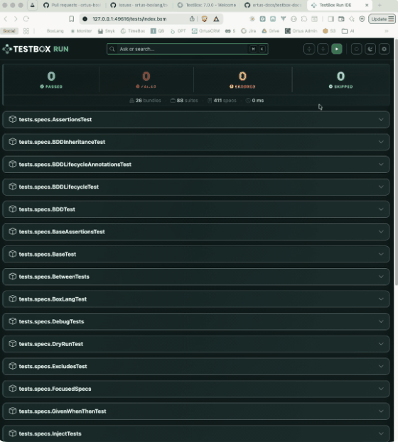
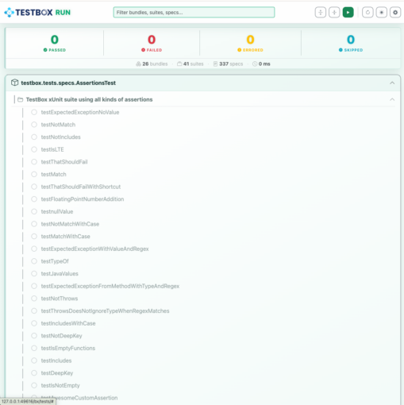
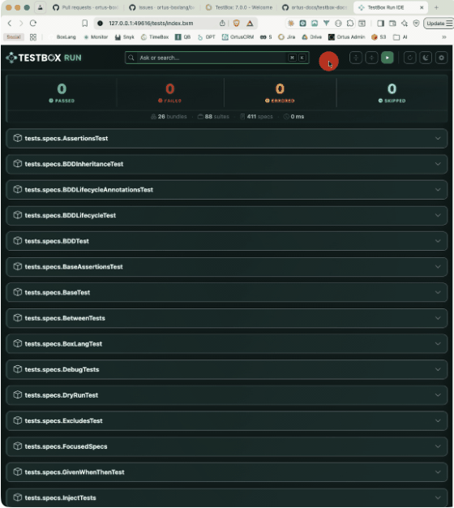
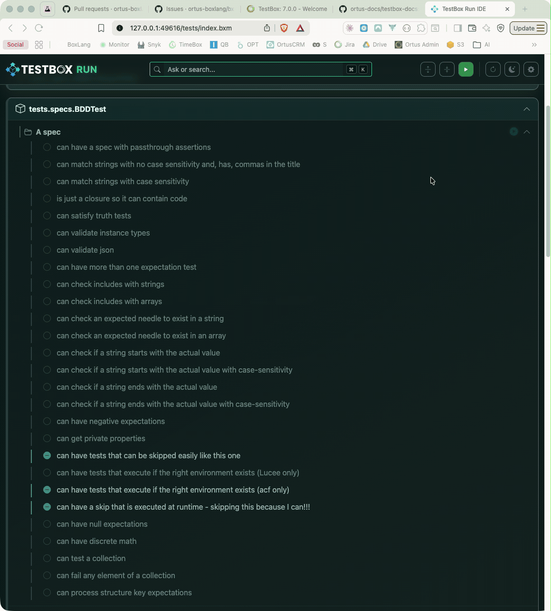
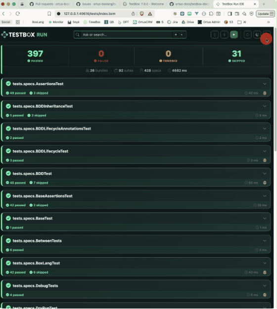
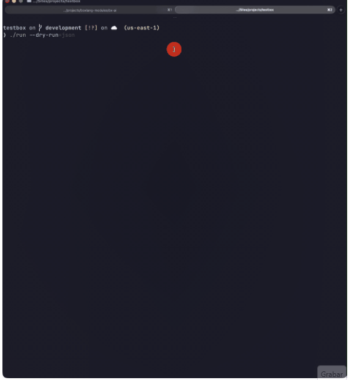
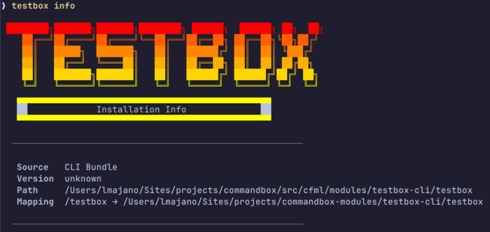

TestBox 7.x focuses on improving testing workflows for BoxLang and CFML applications. This release introduces improvements to the **BoxLang CLI runner** , real-time **streaming test execution via SSE** , **dry run** capabilities, a browser-based **TestBox RUN** interface, and several developer experience enhancements.

Check out the what's new here: <https://testbox.ortusbooks.com/readme/release-history/whats-new-with-7.0.0>

#### TestBox RUN: A Browser IDE for Your Tests


The centerpiece of TestBox 7 is **TestBox RUN** : a self-hosted, single-page web app (`bx/tests/index.bxm`) that you drop into any **BoxLang** project and open in a browser. No build toolchain. No external service. Just BoxLang.


It communicates with your existing `runner.bxm` or `runner.cfm` endpoints and streams spec results in real time via **Server-Sent Events**. Results appear in the test tree as each spec finishes, green for passing, red for failures, with full error messages; long before the full suite completes.

#### What You GetWhat You Get



* **Real-time streaming test tree** --- live updates per spec, not per suite
* **Dark / Light theme** with `localStorage` persistence



<br />

* **Live search + status filters** --- filter by bundle, suite, or spec name; chips for Passed / Failed / Errored / Skipped



* **Per-bundle Run button** --- re-run a single bundle without touching the rest


* **Debug Buffer Panel** --- captured TestBox debug output surfaced per-bundle



* **Floating progress widget** --- current bundle, specs completed vs. total, animated progress bar


* **Configurable settings** --- runner URL, directory, bundle pattern, labels, excludes --- all saved in `localStorage`



Every setting is also overridable via URL query params, making CI integration clean:

```java
/tests/?directory=tests.specs.integration&labels=slow&runnerUrl=/tests/runner.bxm
```


### Keyboard Shortcuts {#h3-0-keyboard-shortcuts}

|    Shortcut    |               Action               |
|----------------|------------------------------------|
| ⌘/Ctrl + K     | Focus search bar                   |
| ⌘/Ctrl + Enter | Run all tests                      |
| ⌘/Ctrl + .     | Reload / rediscover tests          |
| ⌘/Ctrl + ,     | Open Settings                      |
| ⌘/Ctrl + B     | Toggle expand/collapse all bundles |
| ⌘/Ctrl + D     | Toggle dark/light mode             |

#### Getting Started

TestBox RUN ships automatically with every TestBox 7 install under `bx/tests/`. ColdBox apps generated via the ColdBox CLI include it out of the box. For new projects:

```java
testbox generate harness --help
```


> **Note:** TestBox RUN requires a running web server and a `runner.bxm`` endpoint with SSE support via BoxLang. For pure CLI apps, use the BoxLang runner with ``--stream` (see below).

#### Coming Soon: TestBox RUN Desktop App

We're actively building a **native desktop app** version of TestBox RUN on the **BoxLang Desktop Runtime** --- connect to any local or remote runner URL and get the same streaming UI without a browser. Watch [testbox.run](http://https://www.testbox.run/ "testbox.run") for early access.

### Streaming Test Execution via SSE {#h3-1-streaming-test-execution-via-sse}

TestBox 7 ships a brand-new `StreamingRunner` that pushes each spec result to the client the moment it completes, rather than buffering the entire suite.

#### StreamingRunner (Programmatic)StreamingRunner (Programmatic)

```java
component {
    function streamTests( event, rc, prc ) {
        event.setHTTPHeader( name="Content-Type", value="text/event-stream" );
        event.setHTTPHeader( name="Cache-Control", value="no-cache" );

        new testbox.system.runners.StreamingRunner(
            bundles  = "tests.specs",
            options  = {},
            reporter = "text"
        ).run();
    }
}
```


#### BoxLang CLI `--stream` Flag

The BoxLang CLI runner gets native streaming support:

```java
./testbox/run --stream
./testbox/run --directory=tests.specs --stream
```


This is especially useful in CI pipelines where live progress matters more than waiting for a buffered final report.

Dry Run \& Spec Discovery {#h2-2-dry-run-spec-discovery}
--------------------------------------------------------

Two long-requested features land in TestBox 7: **spec discovery** and **dry run** mode. Audit exactly what would run before committing to a full suite execution.

Runner Dry Run  

If you call the `runner.bxm|cfm` with a `?dryRun=true` it will return back to you a JSON representation of what the test executions would look like.

#### Programmatic Dry Run

```java
var tb      = new testbox.system.TestBox( bundles = "tests.specs" );
var results = tb.dryRun();
```


#### CLI Dry Run

```java
./testbox/run --dry-run
```




Lists every suite and spec that would execute, with labels and skip reasons --- perfect for coverage audits and CI test inventory reporting.

#### JSON Output

Need to feed results into another tool?

```java
./testbox/run --dry-run=json
./testbox/run --dry-run=json --bundles=tests.specs.MySpec | jq .
```


Dry run respects all the same filters as a normal run: `--labels`, `--bundles`, `--directory`, `--testSuites`, `--testSpecs`.

### BoxLang CLI Runner --- New Power Options {#h3-3-boxlang-cli-runner-new-power-options}

The BoxLang runner gets a substantial set of new flags for fine-grained control over output, failures, and performance analysis.

#### Focus on Failures

```java
./testbox/run --show-failed-only
```


#### Stack Trace Control

```java
./testbox/run --stacktrace=short   # condensed (default)
./testbox/run --stacktrace=full    # complete Java/BoxLang trace
```


#### Output \& Performance Flags

```java
# Suppress passing or skipped specs
./testbox/run --show-passed=false
./testbox/run --show-skipped=false

# Abort after N failures
./testbox/run --max-failures=10

# Flag slow specs
./testbox/run --slow-threshold-ms=500

# Report the N slowest specs at the end
./testbox/run --top-slowest=5
```


Combine them for a tight CI workflow:

```java
./testbox/run --show-failed-only --stacktrace=short --max-failures=5 --top-slowest=3
```


#### Application Mappings Auto-Load (TESTBOX-440)

The BoxLang runner now automatically loads `Application.bx` mappings from your project root before running tests. Custom path mappings, datasources, and settings are available to your specs with zero extra configuration --- bringing the CLI experience much closer to a full web server environment.

### Other Notable Improvements {#h3-4-other-notable-improvements}

#### `ConsoleReporter` --- Hide Skipped Tests (TESTBOX-433)

Stop noisy skipped-spec output when you have many pending specs:

```java
var testbox = new testbox.system.TestBox(
    bundles  = "tests.specs",
    reporter = {
        type    : "testbox.system.reports.ConsoleReporter",
        options : { hideSkipped : true }
    }
);
```


Or from the CLI: `--show-skipped=false`

#### Suite Filtering Fixes (TESTBOX-435)

Direct suite name matching is now reliable at any nesting depth. If a suite's name exactly matches `testSuites`, it always runs --- no more surprises with nested suites getting skipped.

```java
./testbox/run --testSuites="My Integration Suite"
```


### TestBox CLI Updates (v1.8.0) {#h3-5-testbox-cli-updates-v1-8-0}



The `testbox-cli` CommandBox module hits 1.8.0 with two new commands:

```java
# Show installed version, path, and project config
testbox info

# Force a clean reinstall of the CLI module
testbox reinstall
```


Streaming is also available via the CLI:

```java
testbox run --streaming
testbox run --streaming --verbose   # include passing specs in live output
```


#### Engine Support

|    Engine    |    Status     |
|--------------|---------------|
| BoxLang 1.x+ | ✅ PREFERRED   |
| Lucee 7.x    | ✅ NEW         |
| Lucee 6.x    | ✅             |
| Lucee 5.x    | ⚠️ DEPRECATED |
| Adobe 2025   | ✅             |
| Adobe 2023   | ⚠️ DEPRECATED |
| Adobe 2021   | ❌ Dropped     |

Adobe 2021 is no longer supported. Upgrade to Adobe 2023+ or migrate to BoxLang.

### Upgrade Now {#h3-6-upgrade-now}

TestBox 7 is available today via CommandBox:

```java
box install testbox
```


Or pin to 7.x:

```java
box install testbox@^7.0.0
```


Full release notes and issue links are in the [TestBox documentation](http://https://testbox.ortusbooks.com/ "TestBox documentation"). As always, file bugs and feature requests in [our JIRA](http://https://ortussolutions.atlassian.net/browse/TESTBOX "our JIRA"). You can also check out the what's new guide here: <https://testbox.ortusbooks.com/readme/release-history/whats-new-with-7.0.0>
